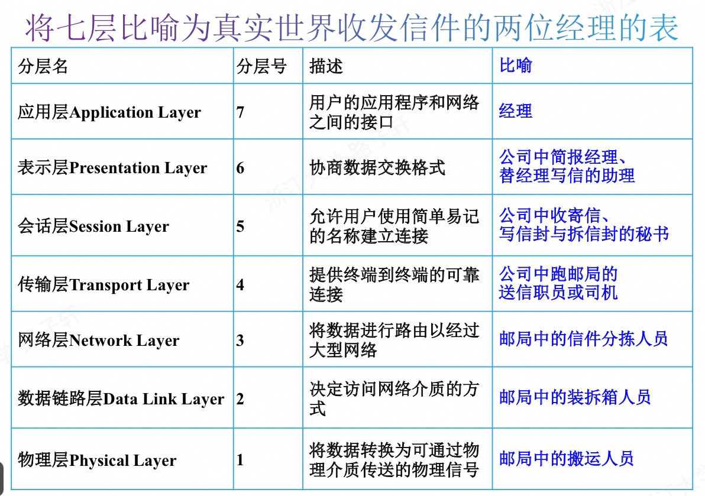
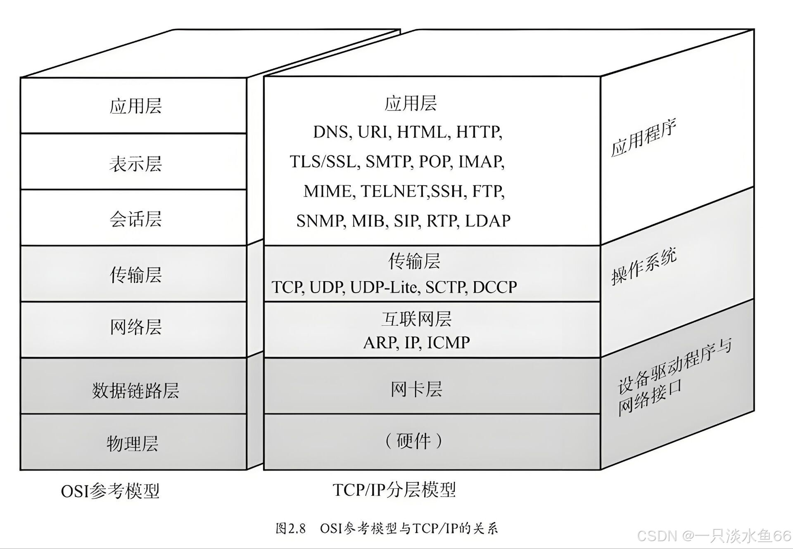

# 协议和模型
## 通信协议
- 定义消息传输和传递的详细方式
- 包含以下五个方面
  - 消息编码
  - 消息格式与封装（特定格式：帧 提供目的地址和源地址）
  - 消息大小（最小和最大长度要求）
  - 消息时序
     - 访问方法（避免信息传输冲突）
     - 流量控制（传输速度控制）
     - 响应超时
  - 消息传输选项或模式
     - 单播：一对一
     - 组播：一对多
     - 广播：一对全体
## 协议簇
- 执行某种通信功能所需的一组内在相关协议称为协议簇/族/栈。
- 协议簇显示为分层结构，上层服务依赖于下层协议的功能：
   - 上层负责处理发送的消息内容
   - 下层负责通过网络传输数据和向上层提供服务
## 标准组织
- 有许多中立于厂商的非营利性组织，为互联网标准组织，如：
    - IETF：开发、更新Internet和TCP/IP技术
    - ICANN：负责全球IP地址分配、全球域名管理、端口号的分配等等
    - IEEE：
      - IEEE 802.3 以太网标准
      - IEEE 802.11 WLAN标准
    - ELA：制定用于安装网络设备的电线、连接器的标准。 EIA/TIA 568A/B标准。
## 网络分层模型
- OSI 参考模型（七层）

- TCP/IP 参考模型（四层）

## 数据封装
- 在通过网络介质传输数据的过程中，随数据沿协议栈向下传递，每层都要添加各种协议信息，此过程被称为封装。
- 一段数据在任意协议层的表示形式统称为：协议数据单元（PHU）
- 在封装过程中，下层都会根据使用的协议封装它从上层接受的PHU
- 解封装：解封装是接收设备用来删除一个或多个协议抱头的过程。
## 数据访问
- 本地有线网络最常用的协议集就是以太网（Internet），由IEEE进行设计维护