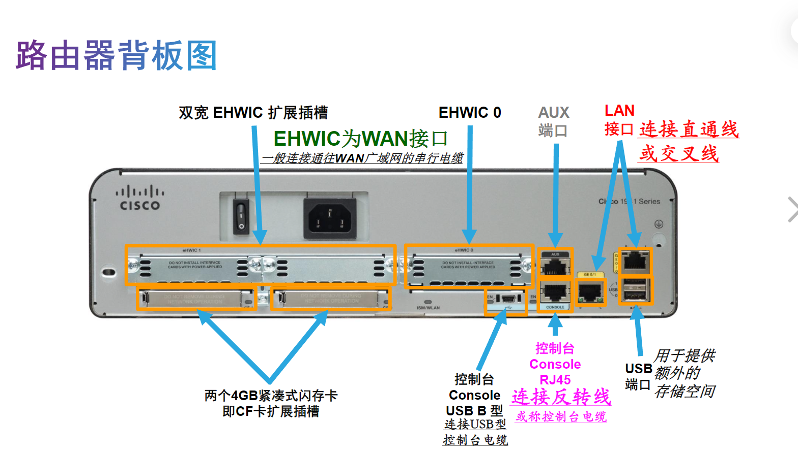
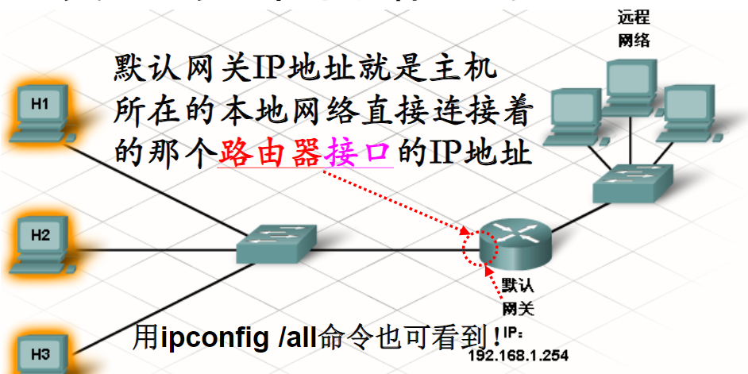

# 网络通信
## 本地有限网络的通信
### 物理地址
- 以太网中的主机都会获得一个物理地址，用于在网络中标识自己。
- 每个以太网络接口（PC机网卡NIC接口）都有一个物理地址，称为介质访问控制（MAC）地址，用于标识网络中的每台源主机和目的主机。
- MAC地址有48位
### 层次设计模型
- 接入层-连接本地以太网络中的主机
- 分布层-将较小的本地网络相互连接起来
- 核心层-分布层设备间的高速及大数据量连接
### 逻辑地址
- 在层次式设计网络中，要使用逻辑寻址方案来标识主机网络位置，即Internet协议(IP)寻址方案。
> 注：MAC地址无层次、无法标识主机网络位置！
- IP地址(v4)包含两部分：32位，4个十进制数字。
  - 网络部分：前面的第一部分标识本地网络：所有连接到同一本地网络的主机，其IP地址的网络部分都一样；
  - 主机部分：后面的第二部分标识特定主机：在同一个本地网络中，IP地址的主机部分是每台主机所独有的。
- IP地址的重要作用之一，简单讲就是用于确定：**网络通信流量应保留在本地？还是应上移到层次式网络的更高层去进行中转？**
   - 若目的IP和源IP的网络部分相同，即二者属于同一网络，则保留在本地不出去。
   - 若目的IP和源IP的网络部分不同，则应上移到更高层进行中转。
- ping命令可测试源和目的设备之间的端到端连通性。
- traceroute命令可追踪源和目的设备之间的路由/路线。数据包在传输过程中每经过一个路由器称为一跳(跃点，Hop)。traceroute显示沿途每一跳，及到每一跳所花的时间。如果发生问题，便可利用所显示的时间以及数据包经过的路由来判断数据包是在何处丢失或延迟的。在Windows中traceroute命令形式为tracert。
#### 逻辑地址与物理地址的区别
- 主机的MAC地址一般不会改变，它是以物理方式分配到主机网卡的地址。
- IP地址是根据主机网络位置以逻辑方式分配的。IP地址由网络管理员根据本地网络情况手工或自动分配给每台主机，通常并非固定不变的。
- 在层次网络中通信的主机同时需要物理(MAC)地址和逻辑(IP)地址，IP地址在数据包的报头中，MAC地址在数据帧的帧头中。
## 创建接入层
### 交换机
- 交换机是接入层的多端口设备，可将多台主机连接到网络。
- 当一主机发送消息到连接在交换机上的另一主机时，交换机将接受并拆包解码数据帧，以读取消息的目的主机物理(MAC)地址部分，然后在MAC地址表(也叫交换表)中查找端口，以作出如何去往目的主机的转发决定。
- MAC地址表：存储所有活动端口以及与这些活动端口相连主机的MAC地址。
- 当消息在主机之间发送时，交换机会在源端口与目的端口之间创建一个临时连接，称为电路。这一新电路为两台主机的通信提供一个专用通道。连接到该交换机的其它主机不会共享此通道的带宽，也不会接收那些并非发送给它们的消息。
- 主机间每次通信都会创建一条新的独立电路，这些电路使交换机上多个通信可以同时进行，而不会发生冲突使数据损坏。
>注：当同一网络中两个或多个设备同时发送消息，组成消息的电子信号在物理介质中相遇时，会相互影响并被损坏，这就是发生了冲突。冲突会造成消息损坏，无法为主机所理解。以太网采用CSMA/CD协议来解决冲突问题（检测冲突后退等待重发解决），WLAN中解决冲突的机制是CSMA/CA（事前避免同时发送）。
### 广播消息
- 在本地网络中，某台主机需要将消息同时发送到所有其它主机可以通过“广播”消息来实现。
- 广播消息的特征是发送到所有主机都能识别的唯一MAC地址⎯⎯广播MAC地址，它是一个全部由1组成的48位地址。由于MAC地址通常用十六进制表示，所以广播MAC地址为FF-FF-FF-FF-FF-FF，其中每个F代表二进制中的四个1（即十进制中的15）。
- 当某台主机发出一条广播消息时，交换机会将该消息转发到同一本地网络连接的每台主机。
> 注：区分接收和接受。接收：能到它这儿而已；接受：收到后会拆包看里面内容。
- 当一台主机接收到发送给广播地址的消息时，它会接受并处理该消息。
- 本地网络也称为广播域：当其内任一主机发送一个广播消息时，能够被其内的所有其它主机都接受下来的网络设备集合（网络区域）。
### ARP协议
- ARP协议（Address Resolution Protocol）：用于在IP地址和MAC地址之间进行转换。
- 在本地网络中，仅当帧所包含的目的MAC地址与某主机MAC地址相同或是广播MAC地址时，该主机才会接受该帧。但网络应用常依靠目的IP地址标识网络位置，故需一种机制来实现：已知IP找到MAC地址。
- 发送主机使用地址解析协议(ARP)来发现同一本地网络中已知IP地址的任何主机的MAC地址
- ARP发现和存储主机MAC地址分为三步：
    - 发送主机创建并发送一个广播帧，该帧以广播MAC地址作为其目的地址。帧中的消息含有想知道的目的主机的IP地址。
    - 网络中每台主机都会收到该广播帧，并将消息中的目的IP地址与自己IP地址进行比较。两者相匹配的主机会将其MAC地址传回给原始发送主机。
    - 发送主机收到回送消息后，将该MAC地址和IP地址信息成对地存储到其ARP表中。
    - 如果发送主机的ARP表中有目的主机的MAC地址，这样目的主机的IP和MAC地址都有了，就可直接向目的主机发送数据帧，而无需再发出ARP请求了。
## 创建分布层
- 分布层连接各个独立的接入层网络，并且控制它们之间的通信量流动。
- 单独的主机通过接入层设备（交换机）连接到网络，接入层设备再通过分布层设备（路由器）相互连接。
### 路由器
- 路由器是一种用于连接不同本地网络的分布层网络设备。
- 所有型号的路由器实质上都是计算机，和计算机、平板电脑和智能设备一样，路由器也需要中央处理器(CPU)、操作系统(OS)、内存等等。
- 路由器的网络接口，比一般计算机丰富，可分为两类：
    - LAN接口-用于连接LAN设备（如计算机和交换机）上的电缆。此接口还可用于路由器之间的相互连接。
    - WAN接口-用于将路由器连接到外部网络

- 路由器就是读取数据包中的目的IP地址的网络部分，并拿它去查找转发消息到目的主机的最佳路由/路线（称为路由表）。
#### 路由表
- 路由器的每个接口都连接到一个本地网络。每个路由器都包含一个路由表，里面有多条路由信息，每条路由包含三个要素：
  - 这条路由能到达的目的网络地址
  - 从本路由器的哪个接口出去可到达目的网络
  - 这条路由/路线/路径的优劣信息（叫路由权值，有时也叫Hop Count跳数，从源到目的的路径上经过的每一个路由器就称为一跳）
#### 路由器与广播的关系
- 路由器分割广播域：路由器有几个接口，即可划分几个广播域。
- 路由器一般不会转发目的地址为广播IP地址的消息即广播消息。
### 默认网关
- 默认网关就是本地网络的出口，要到外部网络去，必须且只能先到默认网关，然后再转出去。
- 默认网关IP地址就是主机所在的本地网络直接连接着的那个路由器接口的IP地址
- 必须在本地网络的每台主机上配置正确的默认网关。如果在主机TCP/IP设置中没有配置默认网关，或指定了错误的默认网关，便无法将消息发送到远程网络上的主机。

## 通信过程地址变化的注意事项
- 数据在从源主机到目的主机的过程中，常需经多个路由器的中转即多跳或多段路才能到达。当到路由器时，先解封装旧帧找出目的IP地址，再取其网络部分对照查找路由表决定怎么走；而离开路由器时，要封装成新帧再发出去。
- 每段路上的数据帧，不变的是源和目的IP地址(最初的源和最终的目的)，而一直在变的是源和目的MAC地址(本段路的源和目的)。