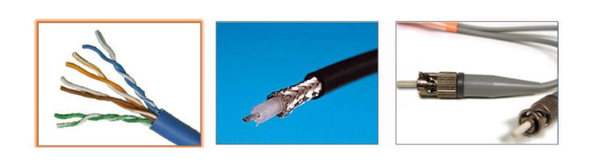
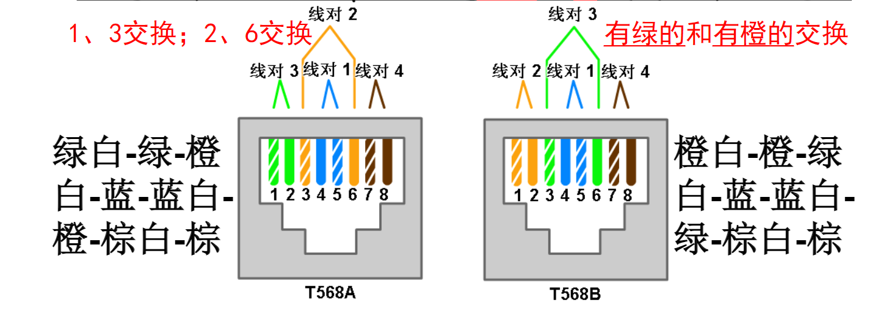
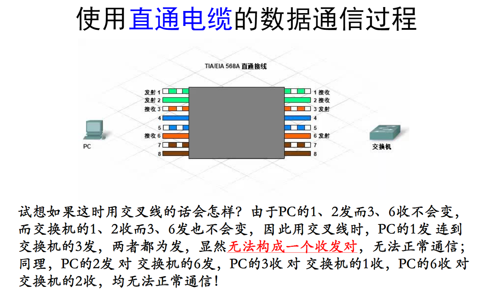
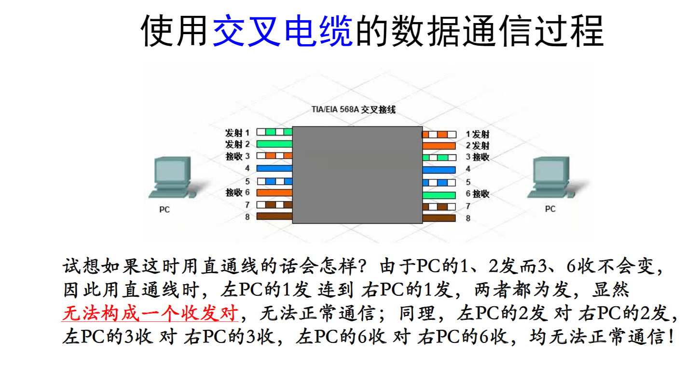

# 通过ISP连接到Internet
## 常见的网络线缆
- 要进行通信，必须存在源、目的及某种类型的通道（或介质）。介质通常是某种类型的物理线缆，也可以是无线的电磁波。
- 物理线缆分为两类：
  - 金属电缆一般为铜或铝，使用电子脉冲传输信息。
  - 光纤由玻璃或塑料制成，使用光脉冲来传输信息。
- 常见物理线缆：
  - 双绞线：现代的以太网技术一般使用称为双绞线(Twisted Pair, TP)的铜质电缆来连接设备。是最常见的网络布线类型。
  - 同轴电缆：同轴电缆通常由铜或铝制成，有线电视公司使用了这种电缆来提供服务。它也可用于连接组成卫星通讯系统的各个组件。
  - 光纤：光纤由玻璃或塑料制成。其带宽很高，因此可承载大量的数据。光纤用于主干网络、大型企业环境以及大型数据中心。电话公司也广泛使用光纤。

### 双绞线电缆
- 双绞线电缆由一对或多对绝缘铜线构成，其中每一对以塑料材质绝缘的铜线相互扭（绞绕）在一起，目的是减少干扰，最外面包裹着一层橡胶的防护套（总外皮）。
- 通常在每个线对中，一条电线是实心颜色，另一条则是白底同色的条纹。
- 针对干扰情况不同的场合，可采用三种类型的双绞线电缆：非屏蔽双绞线UTP、屏蔽双绞线STP和外屏蔽双绞线ScTP。
#### 非屏蔽双绞线UTP
- TIA/EIA组织定义了电缆末端线序的两种不同模式（布线方式），称为T568A和T568B。
- 安装网线时必须在T568A和T568B两种布线模式中选择一种，并严格遵循。

- UTP有三种接法：直通线缆、交叉线缆和反转线缆
##### 直通线和交叉线
- 直通线缆：如果一端是T568A，那么另一端也是T568A；如果一端是T568B，那么另一端也是T568B。
- 两个直接连接、并且使用不同引脚来进行发送和接收的设备称为不相似设备。它们需要使用直通电缆来交换数据。

- 交叉线缆：如果一端是T568A，那么另一端是T568B。
- 两个直接连接、并且使用相同引脚来进行发送和接收的设备称为相似设备。它们需要使用交叉电缆来交换数据。(例如PC和交换机，交换机端口至路由器以太网端口)

- 其它需要交叉电缆的相似设备包括：
  - 交换机端口至交换机端口
  - 路由器以太网端口至路由器以太网端口
  - PC至路由器以太网端口
##### 反转线缆
- 反转线：两头线对顺序完全相反（PC机串口到交换机、路由器等网络设备的控制台端口，配置用）