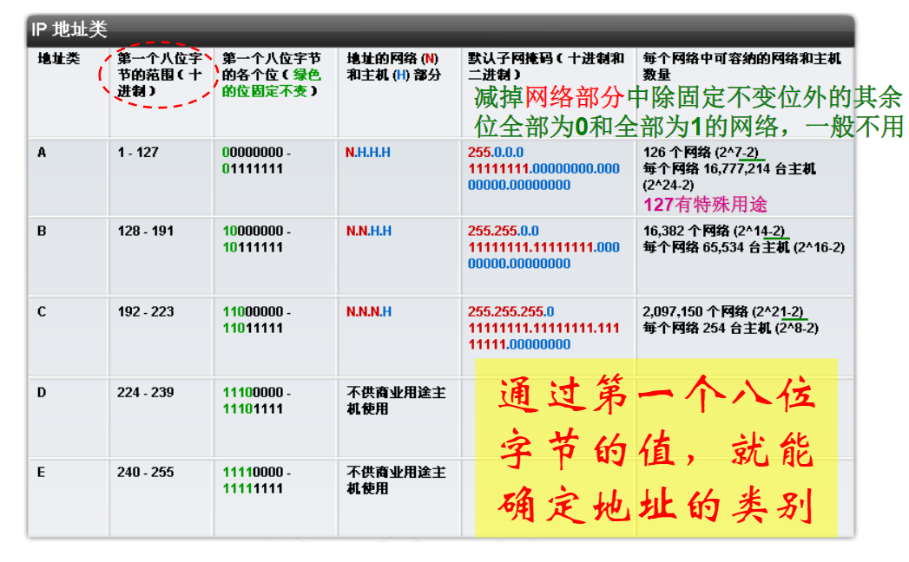
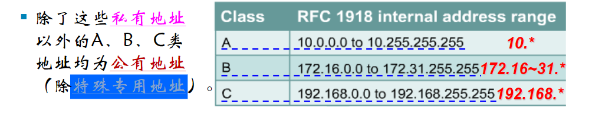
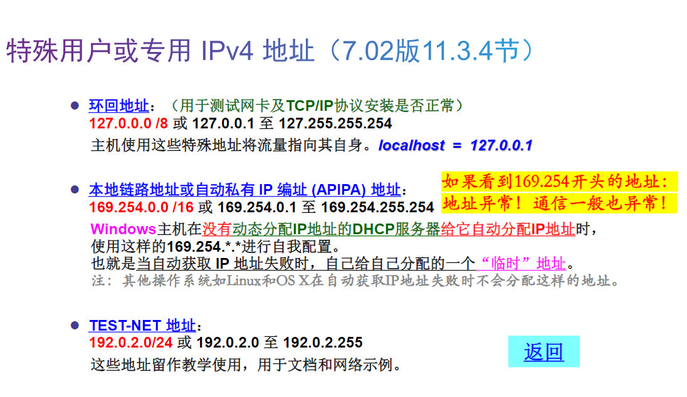
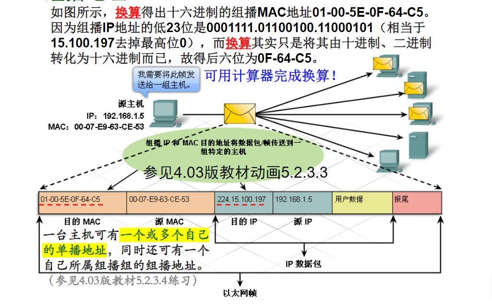
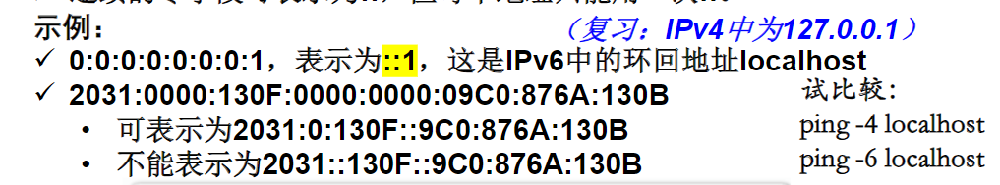

# 网络寻址
## IP地址和子网掩码
### IP地址的用途
- IP地址是用于标识特定主机的逻辑地址。为了与Internet上其它设备通信，它必须唯一、不能冲突。
- IP地址将分配给主机上的网络接口卡(即网卡NIC)，包括具有网络接口的最终用户设备：工作站、服务器、网络打印机、IP电话及智能手机、平板等。
- **有时一块网卡也可以有不止一个IP地址**。例如，一台计算机可能有多个网卡，每个网卡都有不同的IP地址。
### IPv4地址的结构
- IPv4地址由32位二进制数字组成，通常用点分十进制表示法表示。
### IPv4地址的组成
- IP地址具有层次性，一般由两大部分组成：**前面部分标识主机所在的网络，后面部分标识该网络中特定主机。这两部分在IP地址中缺一不可。**
- 以IP地址为192.168.1.100的主机为例，一般情况下，前三个八位字节(192.168.1)标识该地址的网络部分，最后一个八位字节(100)标识该地址的主机部分。
### 子网掩码和IPv4地址
- 在配置主机IP地址时，要随IP地址设置子网掩码。IPv4地址的子网掩码的长度也是32位，也采用点分十进制记法。
- 子网掩码用于表明IP地址中：**哪一部分代表网络？哪一部分代表主机？**
- **子网掩码中的“1”：对应IP地址的前面的网络部分**
- **子网掩码中的“0”：对应IP地址的后面的主机部分**
- 在家庭和小型企业网络中，最常见的子网掩码是：
  - 255.0.0.0（8位1，N.H.H.H）（N=Network，H=Host）
  - 255.255.0.0（16位1，N.N.H.H）
  - 255.255.255.0（24位1，N.N.N.H）
#### 前缀长度——子网掩码的表示方法
- 前缀长度= 子网掩码中1 的位数。即网络部分的位数。
- 使用“斜线记法”表示，即“/”紧跟为1 的位数。
- 例如，子网掩码255.255.255.0可表示为/24.
#### 相关题目
##### 计算某一子网掩码对应的某一网络中可存在的主机数量
- 以2为底、以主机部分的位数为指数求幂（如2^8=256）
- **注意：还必须再从结果数字中减2（如2^8-2=254）**：
  - 主机部分全部为0的IP地址是该网络的网络地址，是代表该网络的标志性地址，不能分配给具体的主机；
  - 主机部分全部为1的IP地址是该网络的广播地址，也是一个特殊地址，也不能分配给具体的主机。
##### 计算网络地址
- 将主机IP地址与子网掩码先转成二进制形式再逐位与(即逻辑与运算)，可得该主机所属网络的网络地址。
## IPv4地址的类型
### IPv4地址类和默认子网掩码
- IPv4地址一般分为五类：A类、B类和C类是商业类地址，可分配给主机。D类保留供组播使用，而E类则保留用于实验用途。
- A类地址：仅以一个八位字节表示网络部分，其余三个表示主机部分。默认子网掩码为255.0.0.0 (/8)。A类地址一般分配给大型组织(2^24-2)。
- B类地址：使用两个八位字节表示网络部分，另两个表示主机部分。默认子网掩码为255.255.0.0 (/16)。B类地址一般用于中型网络(2^16-2)。
- C类地址：使用三个八位字节表示网络部分，一个表示主机部分。默认子网掩码为255.255.255.0 (/24)。C类地址通常分配给小型网络(2^8-2)。

### 公有地址和私有地址
- **私有地址：不能上Internet,其数据包会被ISP的路由器所阻挡。**
- RFC1918标准在A、B、C类中都保留了数个地址范围作为私有地址，包含1个A类网络、16个B类网络和256个C类网络。
- 只要组织中的主机不与Internet直接连接，那么这些主机就可在内部使用私有地址。因此，多个组织可使用相同的私有地址集（如10.*）而不用担心发生IP地址冲突影响通信的问题。
- 另外，私有地址仅在本地网络中可见，外部人员无法直接访问私有地址（无法直接“看见”如Ping通），因此，使用私有地址也可作为一种安全措施。

#### 网络地址转换
- 需要通过某种过程将私有地址转换为公有地址，本地客户端才能在Internet上通信，用于将私有地址转换为可路由的公有Internet地址的过程称为网络地址转换(NAT)。
- 借助NAT，可将传出数据包的私有源IP地址转换为公有源IP地址，也可将传入数据包的公有目的IP地址转换为私有目的IP地址。
- 一方面对外，无线路由器从ISP处接收分配给它的一般是公有地址(用于其WAN口或称Internet口或称外网口)，这使它能够通过Internet发送和接收数据包。
- 另一方面对内，无线路由器又为内网的本地网络客户端提供私有地址，且无线路由器的LAN口也是私有地址。
> 注：在某些情况下（如家用无线路由器），无线路由器的WAN口也可以是私有地址，但它与LAN口的私有地址肯定属于不同网络。
### 单播、广播和组播地址
- IPv4地址还可分为：单播、广播或组播地址。
-  单播地址是IP网络中最常见的类型。含单播目的地址的数据包，其预定的接收方是特定的主机。要发送和接收单播数据，单播目的IP地址必须包含于数据包头中，相应的单播目的MAC地址也必须出现于以太网帧头中。
-  发送广播时，数据包以主机部分全1的IP地址作为广播目的IP地址。广播还需要在以太网帧中包含相应的广播MAC地址。在以太网中，广播MAC地址中的48位二进制数全部为1，即为FF-FF-FF-FF-FF-FF。
-  组播地址是一种特殊的单播地址。属于某一组播组的设备都指派有该组播组IP地址。组播IP地址范围为224.0.0.0到239.255.255.255（D类）。组播MAC地址是一个特殊的十六进制数：一般以01-00-5E开头，然后将组播IP地址的低23位换算成MAC地址中剩余的6个十六进制数值，作为组播MAC地址的结尾。

## IPv6地址
- IPv6地址由128位二进制数字组成，通常用冒号分隔的16进制数字表示。
### IPv6地址表示方法
- x : x : x : x : x : x : x : x
- 其中，x是一个写成十六进制形式的16位二进制数，例如：x=ABCD，写成二进制形式就是1010 1011 1100 1101。
- 字段中的前导零可省略。例如：09C0可写为9C0。
- 连续的零字段可表示为::，但每个地址只能用一次::。

### 前缀长度
- IPv6使用前缀长度表示地址的前缀部分（相当于网络部分）
- 前缀长度表示格式：IPv6地址/前缀长度
- 前缀长度的范围为0 到128，典型的前缀长度是/64。
- 后面剩余部分统称为接口ID（相当于IPv4地址的主机部分）
### 地址类型
- IPv6地址分为三种类型：单播、多播、任播。
- 单播和多播地址与IPv4差不多，任播地址是可分配到多个设备的IPv6 地址。发送到任播地址的数据包会被路由转发到最近的拥有该地址的设备。
- 注意：**IPv6没有广播地址！**
### IPv6和IPv4的共存
- 将网络迁移到IPv6 的迁移技术可以分为三类：双堆栈、隧道和转换。
    - 双堆栈：允许IPv4和IPv6在同一网络中共存。设备可以同时运行IPv4 和IPv6协议栈。
    - 隧道：通过IPv4网络传输IPv6数据包。将IPv6数据包封装到IPv4数据包中。
    - 转换：网络地址转换64 (NAT64) 允许支持IPv6的设备与支持IPv4的设备使用类似于IPv4中NAT的转换技术进行通信。IPv6 数据包转换到IPv4数据包，反之亦然。
## 获取IP地址的方式
### 静态地址分配
- 采用静态方式分配时，网络管理员必须手工配置主机的网络信息。这些信息至少包括主机IP地址、子网掩码和默认网关。
### 动态地址分配
- 自动(动态)分配IP地址在方便性方面，优于静态分配IP地址的做法。要完成自动分配，需使用动态主机配置协议(DHCP)。
- DHCP提供一种自动分配IP地址、子网掩码、默认网关等地址信息和其它配置信息（如租借期等）的机制。