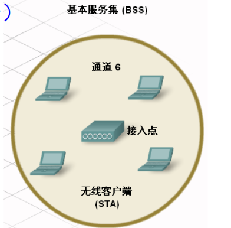
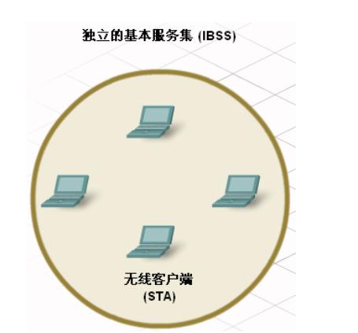

# 无线技术
## 无线技术
### 无线技术和设备
- 无线技术使用电磁波在设备之间传送信息。
- 公共无线通信最常用波段包括红外和无线电射频波段。
- 红外线(IR)的能量非常低，无法穿透墙壁或其它障碍物。但它常用于连接个人数字助理(PDA)和PC等设备并传送数据.
#### 红外线(IR)
- IR只支持一对一类型的连接。
- IR还常用于遥控设备（如电视等的遥控器）、无线鼠标和无线键盘，但通常只适合视线范围内的近距离通信。
#### 无线电射频(RF)
- 无线电射频(RF)波可穿透墙壁及 其它障碍物，适用范围比IR大。
- RF波段的特定区域预留给无需许可证的设备使用，如无线局域网(WLAN)、无绳电话、计算机外围设备等。这些频段包括900MHz、2.4GHz和5GHz等频率范围。这些范围称为工业科学和医疗(ISM)波段，其使用受到较少限制。
- 蓝牙(Bluetooth，IEEE802.15)是一种利用2.4GHz频带的RF技术，它仅限于低速、近距离通信，但优势是：可同时与多设备通信（如两人听一机、一人听两机）。在连接计算机外围设备（如鼠标、键盘和打印机）时，这种一对多通信能力就比IR有较大优势。
- 还有一些利用2.4GHz和5GHz等频带的无线局域网WLAN RF技术，它们符合各种IEEE 802.11标准。这些技术与蓝牙技术的区别在于其发射功率更高，故传输距离也更大。
### 无线网络类型
- WPAN是最小的无线网络，用于连接各种外围设备到计算机，例如鼠标、键盘和PDA。所有这些设备专属于通常使用IR或蓝牙技术的一台主机。
- WLAN通常用于延伸本地有线网络(LAN)覆盖范围。WLAN使用RF技术并遵守IEEE 802.11标准，它们可让许多无线用户通过称为接入点(Access Point, AP)的设备连接到有线网络。AP用于连接无线主机和有线以太网络中的主机。
- WWAN网络覆盖非常广大的区域。移动电话网络就是一种非常典型的WWAN。这些网络使用码分多址(CDMA)或全球移动通信系统(GSM)或3G、4G LTE、5G/5.5G甚至6G等技术，通常受政府机构管制。
## WLAN
### WLAN标准
- IEEE 802.11标准定义了WLAN的技术规范。
- 目前可用的描述无线通信不同特征的附录有802.11a、802.11b、802.11g和802.11n等。
- rtyj这些技术统称无线保真(Wireless Fidelity, WiFi)。
### WLAN组件
- 接入点AP：控制有线与无线网络之间的接入，例如让无线客户端接入有限网络，反之亦然。
- 无线客户端：连接到WLAN的设备，包括PC、手机、平板电脑、打印机、电视等。
- 无线网桥：用于通过无线链路连接两个有限网络。
- 天线：用于接收和发射无线信号。
### WLAN模式
WLAN有两种基本形式：基础架构模式和对等模式。

- 基础架构模式：
    - 由中心的AP设备控制所有通信，确保所有STA（即无线客户端）都能平等访问介质。
    - 不同STA之间无法直接通信。
    - 不同STA之间无法直接通信。
    - 家庭和企业环境中最常用的无线通信模式

- 对等模式：
    - 在点对点网络中，将两台或以上的客户端连接到一起，就可创建最简单的无线网络，即对等网络，其中不含AP。
    - 所有客户端是平等的。
    - 此网络覆盖的区域称为独立的基本服务集(IBSS)。
    - 对等模式适用于小型网络。可在设备间交换文件和信息。
    - 对等模式的一个变体是启用支持移动蜂窝数据访问的智能手机或平板电脑以创建个人热点。

### 服务集标识符(SSID)
- SSID是WLAN的名称，它是无线网络的标识符。
- 它通常由字母、数字和特殊字符组成，长度不超过32个字符。
- **无论是哪种类型的WLAN，同一WLAN中的所有设备都必须使用相同的SSID配置（即配置为属于同一WLAN）才能相互通信。**
### 无线通道
- 对可用的RF频谱进一步划分即形成通道。每个通道都可传送不同的通信，类似于一根有线电视同轴电缆能传输不同电视频道的节目。