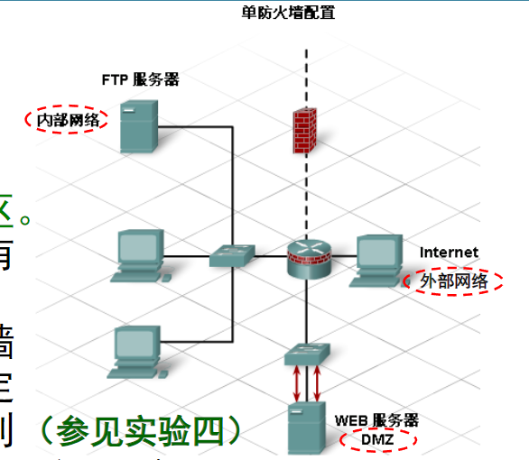
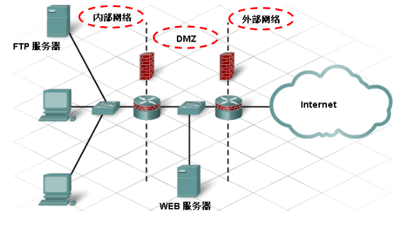

# 基本网络安全
## 攻击方式
### 病毒、蠕虫和特洛伊木马
- 病毒是通过修改并附加到其它程序或文件上来运行和传播的一种程序。病毒无法自行启动，而需受到激活（人为启动其所附着的程序）
- 蠕虫类似于病毒。与病毒不同的是，蠕虫无需将自身附加到其它程序或文件中。蠕虫使用网络将自己的副本发送到任何连接的主机中。蠕虫可独立运行并迅速传播，它无需激活或人类干预即可发作。
- 特洛伊木马是一种没有自身复制能力的程序，以合法程序的面貌出现，实质上却是一种攻击工具。特洛伊木马可为系统创建后门从而使黑客获得访问权。它一般由两部分组成：一是服务器程序，一是控制器程序。“中了木马”就是指被安装了木马的服务器程序。若你的电脑被安装了服务器程序，则拥有控制器程序的黑客就可以通过网络远程控制你的电脑了。
### 拒绝服务攻击
- 拒绝服务(DoS)攻击：DoS=Denial of Service是针对单个或一组计算机执行的一种侵略性攻击，目的是使服务器拒绝为特定用户提供服务。
- 两种常见的DoS攻击为：
    - SYN Flood攻击：向服务器发送大量请求客户端连接的数据包，其中包含无效的源IP地址。服务器会因试图响应这些虚假请求而变得极为忙碌，导致无法响应合法请求。
    - 死亡之Ping攻击：向设备发送超过IP协议所允许的最大大小（65,535字节）的数据包。这可导致接收设备系统崩溃。
- 分布式拒绝服务(DDoS)攻击:DDoS是更为狡猾、更具破坏性、运行规模更大的DoS攻击，通常会有成百上千个攻击点试图同时淹没目标。
### 暴力攻击
- 暴力攻击是指通过暴力破解或枚举的方式获取信息或系统的访问权限。
## 防火墙 
防火墙驻留在两个或多个网络之间，控制其间的通信量并帮助阻止未经授权的访问。
### 使用技术
防火墙产品使用多种技术来区分应禁止和应允许的网络访问，包括：

- 数据包过滤：根据IP地址或MAC地址来阻止或允许访问。
- 应用程序/网站过滤：根据应用程序（即对应不同端口号的不同服务）来阻止或允许访问；网站过滤则通过指定要过滤的网站URL地址或关键字来实现。
- 状态包侦测（SPI，也叫状态防火墙）：传入数据包必须是对内部主机所发出请求的合法响应才会被允许传入，否则未经请求的传入数据包会被阻隔。状态包侦测还可识别和过滤特定类型的攻击（如DoS攻击）。
- 此外，防火墙通常会执行网络地址转换(NAT)。NAT将一个或一组内部私有地址转换为一个外部公有地址，使用该公有地址可访问因特网，可实现对外部用户隐藏内部私有IP地址的目的。
### 非军事区
- 通过在内部网络和Internet之间设置防火墙作为边界设备，所有往来Internet的通信量都会被监视和控制。如此一来便在内部和外部网络间划分了一条清晰的防御界线。一般默认设置下，外部不能“看到”（直接访问或ping通）内部。
- 但有时可能会有一些外部客户需要访问内部资源，即需允许外访问内。为此可配置一个非军事区(DMZ=DeMilitarizedZone)
- 在计算机网络中，非军事区代表：内部和外部用户都可访问的网络区域。其安全性高于外部网络，低于内部网络。
- 它由一个或多个防火墙创建，这些防火墙起到分隔内部网络、非军事区和外部网络的作用。如用于公开访问的Web服务器通常就位于非军事区中。
#### 常见配置
- 双防火墙配置：双防火墙配置中，防火墙分为内部防火墙和外部防火墙，其间则是非军事区。外部防火墙限制较少，允许Internet用户访问非军事区中的服务，而且允许任何内部用户请求的通信量通过。而内部防火墙则限制较多，用于保护内部网络免遭未经授权的访问。

- 单防火墙配置:单防火墙包含三个区域：外部网络、内部网络和非军事区。来自外部网络的所有通信量都被发送到防火墙。然后防火墙会监控通信量，决定哪些通信量应传送到非军事区，哪些应传送到内部网络，以及哪些应拒绝。

