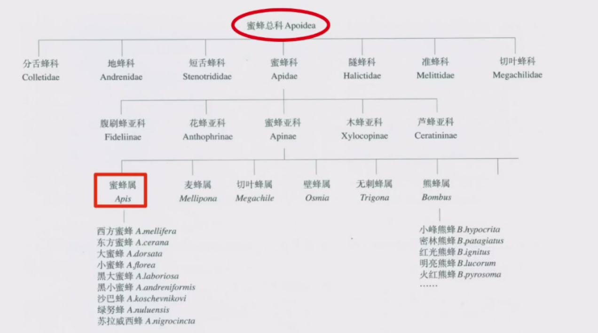
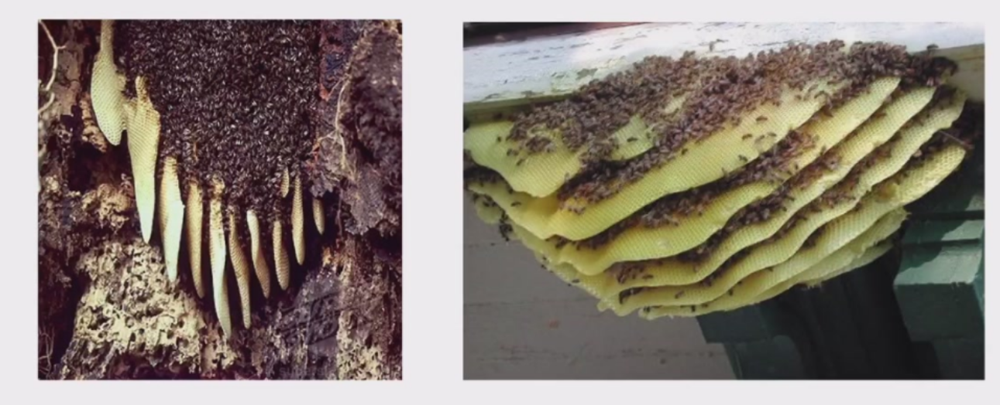
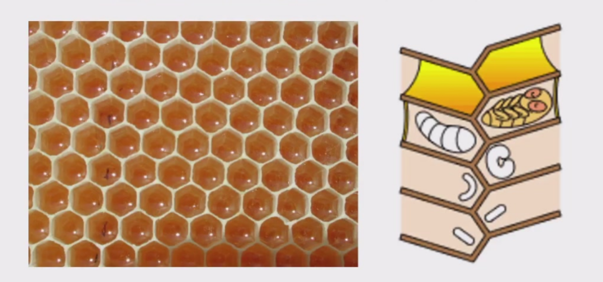
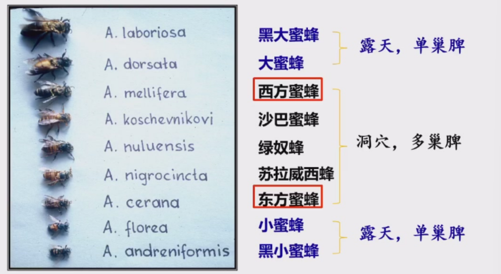
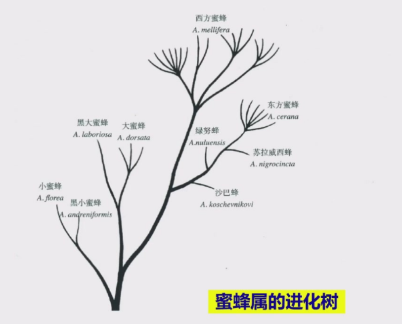
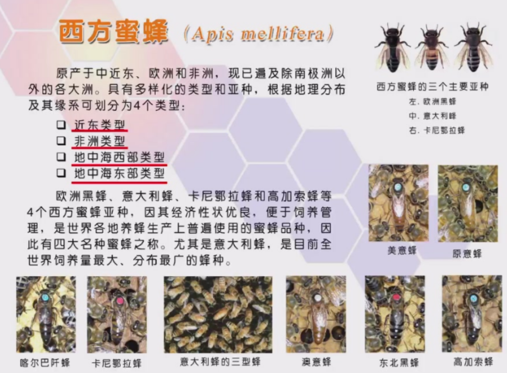
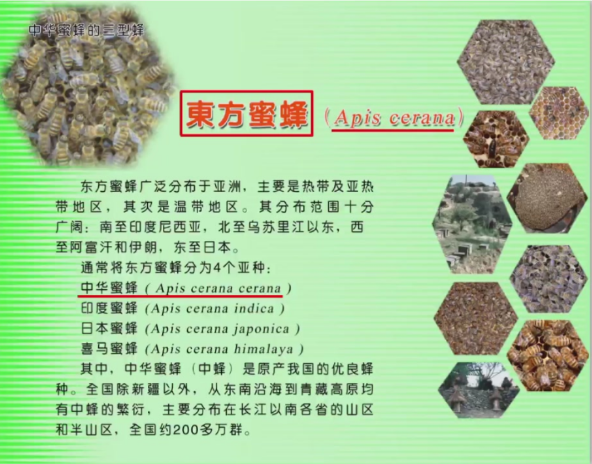

# 蜜蜂的种类与特性
## 在分类学上的蜜蜂
蜜蜂在分类学中属于节肢动物门、昆虫纲、膜翅目、细腰亚目、针尾部，可以细分为蜜蜂总科、蜜蜂科、蜜蜂亚科、蜜蜂属。

蜜蜂广义上指膜翅目蜜蜂总科的所有昆虫，估计全世界有20000多种。狭义上是指蜜蜂属的昆虫。

## 蜜蜂属的特点
蜜蜂属的特点主要有：

- 营社会性生活，是真社会性动物
- 能泌蜡筑巢，巢脾由上而下纵向发展

- 两面均具六棱柱形巢房，且共用边、共用底。

- 采集、酿制、贮藏蜜粉积极

>真社会性（Eusociality）动物    
是指具有高度社会化组织的动物，1966年首先由美国昆虫学家Suzanne Batra提出。  
>它具有以下几种特点：
>
>- 繁殖分工：群体中可分为专行繁殖的阶级，或是较少、甚至不进行繁殖的阶级。
>- 世代重叠：群体中的成熟个体，可分为两个以上的世代。
>- 合作照顾未成熟个体：某一个体会照顾群体中其他个体的后代。
>
>常见的真社会性动物有膜翅目中的蜜蜂、胡蜂以及蚂蚁；等翅目中的白蚁；哺乳类滨鼠科中的裸鼩形鼠与达马拉兰隐鼠。

## 蜜蜂属的分类
蜜蜂属有九个种，分别是黑大蜜蜂、大蜜蜂、西方蜜蜂、沙巴蜜蜂、绿奴蜂、苏拉威西蜂、东方蜜蜂、小蜜蜂、黑小蜜蜂。

