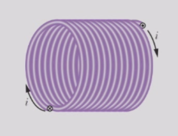
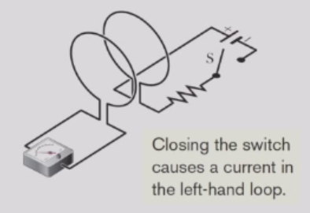
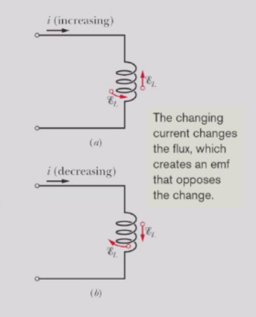
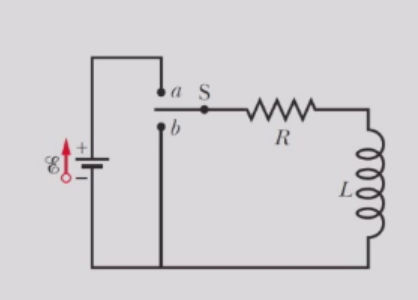
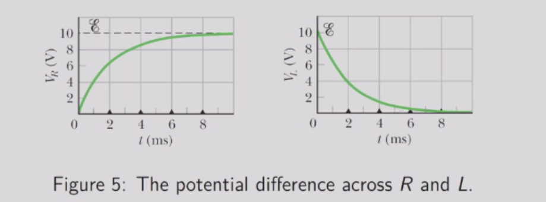
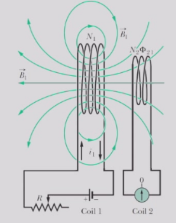
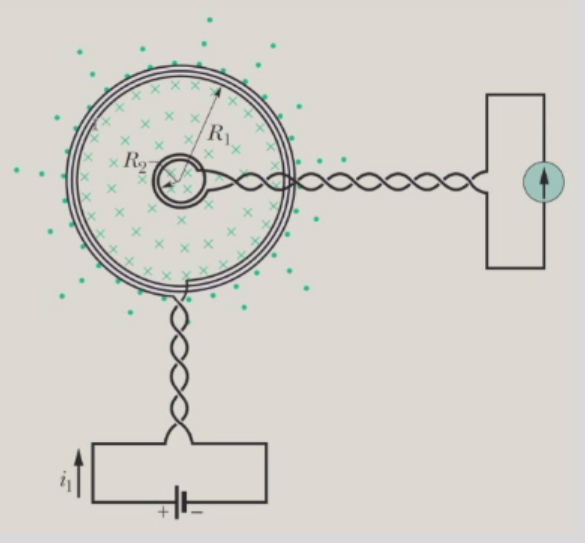

# 电感
电容器可用于产生所需的电场。我们基本的电容器类型是平行板结构。同样，电感器可用于产生所需的磁场。  
我们基本的电感器类型是长螺线管（更具体地说，是长螺线管中部附近的一段短长度，以避免任何边缘效应）。

## 定义
根据安培定律:
$$
Bh =μ₀inh
$$
其中n为螺线管单位长度的匝数。
穿过横截面积A的磁通量为:
$$
\Phi_{B} = B A = \mu_{0} i n A 
$$

螺线管是一种电感器，通过其中心区域的电流$i$产生磁通量$\Phi_{B}$。电感器的电感则定义为
$$
L = \frac{N\Phi_{B}}{i}
$$
其中N为线圈匝数。因此，电感L是电感器每单位电流产生的磁通量（$N\Phi_{B}$）的度量。
电感的国际单位是特斯拉·平方米每安培（$T·m²/A$），我们以美国物理学家约瑟夫·亨利（Joseph Henry）的名字命名这个单位。因此
$$
1 h e n r y = 1 H = 1 T \cdot m^{2} / A
$$
对于螺线管，我们有
$$
L = \frac{N \Phi_{B}}{i} = \frac{(n \ell)(\mu_{0}i n A)}{i} = \mu_{0}n^{2}\ell A
$$ 
因此，长螺线管中心附近单位长度的电感为
$$
\frac{L}{\ell} = \mu_{0}n^{2}A
$$ 
电感与电容类似，仅取决于器件的几何结构。
## 自感
如果两个线圈——我们现在可以称为电感器——彼此靠近，一个线圈中的电流$i$会在另一个线圈中产生磁通量$\Phi_{B}$。闭合开关会在左侧回路中产生电流。
我们已经知道，如果通过改变电流来改变该磁通量，根据法拉第定律，第二个线圈中将出现感应电动势。

实际上，第一个线圈中也会产生感应电动势。
这个过程称为自感，产生的电动势称为自感电动势。它遵循法拉第电磁感应定律，与其他感应电动势相同。根据电感的定义$N\Phi_{B} = Li$。
法拉第定律告诉我们
$$
\mathcal E_{L} = - \frac{d(N \Phi_{B})}{d t} = - L \frac{d i}{d t}
$$
因此，在任何电感器（如线圈、螺线管或环形线圈）中，只要电流随时间变化，就会产生自感电动势。
自感电动势的方向遵循楞次定律。负号表明——自感电动势的方向与其产生的电流变化方向相反。

## RL电路

为了定量分析该情况，我们应用回路定理：
$$
-i R - L \frac{d i}{d t} + \mathcal E = 0
$$ 

或

$$
L \frac{d i}{d t} + R i = \mathcal E
$$
量纲分析得出一个时间尺度$\tau_{L} = L / R$ ，这被称为电感时间常数。
电流随时间变化的解为
$$
i = \frac{\mathcal E}{R}(1 - e^{ - t / \tau_{L}})
$$

$（\mathcal Edq）/ dt = \mathcal Ei$ 表示电动势装置通过在通过电池的电荷上做功，将能量传递给电路其余部分的速率。
$i²R$表示能量以热能形式在电阻器中出现的速率。
传递到电路但未以热能形式耗散的能量，根据能量守恒假设，必须被存储在电感器的磁场中，存储速率：
$$
\frac{d U_{B}}{d t} = L i \frac{d i}{d t} = \frac{d}{d t}\left(\frac{1}{2}L i^{2}\right)
$$

因此，一个电感L流过电流i时储存的总能量为

$$U_{B} = \frac{1}{2}L i^{2}$$

单位体积场中储存的能量为
$$
u_{B} = \frac{U_{B}}{A h} = \frac{L i^{2}}{2 A h} = \frac{L}{h}\frac{i^{2}}{2 A}
$$
将$L/h$替换为螺线管的单位长度电感$L / h = \mu_{0}n^{2}A$ ,其中n为单位长度的匝数，我们得出能量密度为（注意$B = μ₀in$）
$$
u_{B} = \frac{1}{2}\mu_{0}n^{2}i^{2} = \frac{B^{2}}{2 \mu_{0}}
$$
尽管我们通过考虑螺线管的特殊情况推导出了磁能密度表达式，但该公式适用于所有磁场，无论其产生方式如何。

方程$u_{B} = \frac{B^{2}}{2 \mu_{0}}$类似于电场中能量密度的公式，$u_{E} = \frac{1}{2}\epsilon_{0}E^{2}$注意，$u_{B}$和$u_{E}$都与相应场强的平方成正比。
## 互感
考虑两个圆形紧密排列的线圈彼此靠近且共用一个中心轴。线圈1中的电流产生一个磁场$\overrightarrow{B}_{1}$。通过线圈2的磁通量$\Phi_{21}$，与线圈1中的电流相关联，并与线圈2的匝数$N₂$相耦合。
我们定义线圈2相对于线圈1的互感$M₂₁$为

$$M_{2 1} = \frac{N_{2}\Phi_{2 1}}{I_{1}}$$

根据法拉第定律，线圈2中的电动势
$$
\mathcal E_{2 1} = - \frac{d(N_{2}\Phi_{2 1})}{d t} = - M_{2 1}\frac{d i_{1}}{d t}
$$
$M₂₁$是一个纯粹的几何量，与两个线圈的尺寸、形状和相对位置有关。
如果我们交换线圈1和2的角色，我们得到
$$
\mathcal E_{1 2} = - M_{1 2}\frac{d i_{2}}{d t}
$$
可以证明，无论线圈的形状和位置如何，$M₂₁ = M₁₂$。

### 例子：两平行线圈的互感

首先，我们计算较小线圈2中的磁通量，该线圈足够小，我们可以假设由于较大线圈产生的穿过它的磁场近似均匀。

由于线圈1产生的磁通量通过线圈2时近似均匀分布，因此$$
\Phi_{2 1} = A_{2}B_{1}
$$
毕奥-萨伐尔定律告诉我们:
$$
\frac{B_{1}}{N_{1}}=\frac{\mu_{0}}{4\pi}\frac{i_1(2\pi R_{1})}{R_{1}^{2}}=\frac{\mu_{0}i_{1}}{2R_{1}}
$$

对于每个环路，要计算互感$M$，我们需要求出较小线圈中的磁通量：
$$
M = \frac{N_{2}\Phi_{2 1}}{i_{1}} = \frac{\mu_{0}N_{1}N_{2}(\pi R_{2}^{2})}{2 R_{1}}
$$