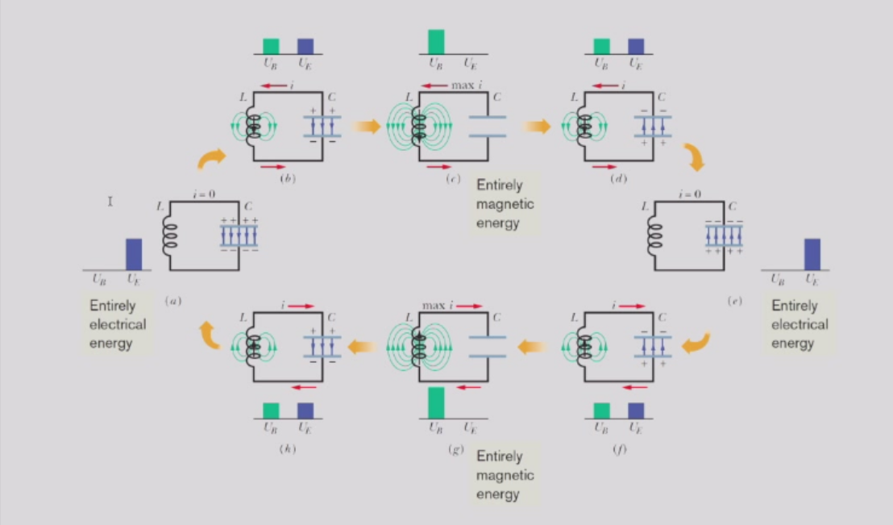
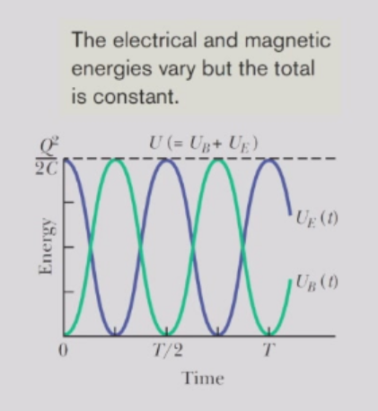
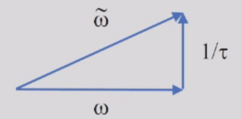
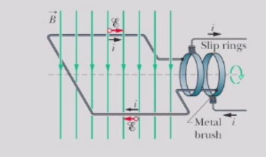
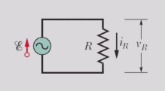
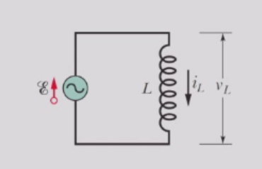
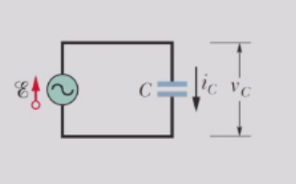
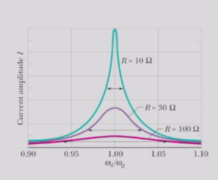

# LC振荡电路
在RL和RC电路中，电荷、电流和电势差呈指数增长或衰减。增长或衰减的时间尺度由时间常数τ决定，该常数可以是电容性或电感性的。
$$
\tau_{C} = R C , \tau_{L} = L / R
$$
不出所料，通过维度分析我们得出$\tau_{L C} = \sqrt{L C}$也是一个时间常数，是LC电路的特征。
因此，在LC电路中，电荷、电流和电势差会周期性（正弦）变化。电容器电场和电感器磁场的相应振荡被称为电磁振荡。这样的电路被称为振荡电路。

在理想LC电路中，由于能量守恒，没有电阻的情况下，振荡会无限持续下去。除了电容器电场与电感器磁场之间的能量转换外，不存在其他能量转移。
## 理想LC振荡电路的定量分析
LC电路中的总能量$U$由下式给出
$$
U = U_{B} + U_{E} = \frac{L i^{2}}{2} + \frac{q^{2}}{2 C}$$
在无电阻的情况下，U随时间保持恒定。
$$\frac{d U}{d t} = \frac{d}{d t}\left(\frac{L i^{2}}{2} + \frac{q^{2}}{2 C}\right) = L i \frac{d i}{d t} + \frac{q}{C}\frac{d q}{d t} = 0$$ 
由于$i = d q / d t$ 和$d i / d t = d^{2}q / d t^{2}$，我们发现：
$$
L \frac{d^{2}q}{d t^{2}} + \frac{1}{C}q = 0
$$
这样我们得到了描述无电阻LC电路振荡的微分方程。
与机械形式形成对比
$$
m \frac{d^{2}x}{d t^{2}} + k x = 0
$$
其通解为
$$
x = A \cos ( \omega_{0} t + \phi )
$$
类比地，我们可以写出LC电路的通解为
$$
q = Q \cos ( \omega_{0} t + \phi )
$$
其中$ω₀ = 1/\sqrt{LC}$是电路的固有属性。$Q$是电荷变化的振幅，$\phi$是相位常数。这两个常数可通过初始条件等方法确定

$$
Q \cos \phi = q \mid_{t = 0} ,- \omega_{0}Q \sin \phi = \frac{d q}{d t}|_{t = 0}\equiv i|_{t = 0}
$$

注意，第二个初始条件可以通过对电荷q关于时间t的导数来理解，这给出了电流：

$$
i = - I \sin(\omega_{0}t + \phi) = I \cos(\omega_{0}t + \phi ')
$$

,其中 $I = ω₀Q$ 且 $\phi '= \phi +π/2$。换句话说，电流相对于电荷（或电容器两端的电压）相位超前 π/2。    
电能和磁能会发生振荡。电场能和磁场能的最大值均为$Q²/2C$。在任意时刻，电场能和磁场能的总和等于$Q²/2C$，即一个常数。当$U_{E}$最大时，$U_{B}$为零，反之亦然。

## 现实LC振荡电路的分析/阻尼振荡
在实际的LC电路中，振荡不会无限持续下去，因为总存在一些电阻，会从电场和磁场中耗散能量，并将其转化为热能（电路可能会变热）。这类似于由摩擦阻尼引起的块-弹簧系统中机械振荡的衰减。
RC电路中，通解（相差一个常数）为：
$$
q = Q e^{ - t / \tau}
$$
在LC电路中，通解为：
$$
q = Q \cos(\omega_{0}t + \phi) = \Re[Q e^{i \omega_{0}t}e^{i \phi}]
$$
我们可以写出更一般的解为
$$
q = \Re[\tilde{Q}e^{i \tilde{\omega}t}] = Q e^{ - t / \tau}\cos(\omega t + \phi)
$$
其中我们定义复振幅 $\tilde{Q} =Qe^{i\phi}$ 和复频率 $\tilde{\omega} = ω+i/τ$。
当存在电阻R时，电路的总电磁能U不再保持恒定；相反，它会随时间减少，因为能量被转化为电阻中的热能：
$$
\frac{d U}{d t} = - i^{2}R
$$ 
由于能量损失，电荷、电流和电势差的振荡幅度持续减小，这种振荡被称为阻尼振荡，与阻尼块-弹簧振荡器的情况类似。  
RLC电路中阻尼振荡的微分方程为
$$
\frac{d U}{d t} = L i \frac{d i}{d t} + \frac{q}{C}\frac{d q}{d t} = - i^{2}R
$$
其中 $i = d q / d t$ 并且 $d i / d t = d^{2}q / d t^{2}$，我们发现：
$$
L \frac{d^{2}q}{d t^{2}} + R \frac{d q}{d t} + \frac{1}{C}q = 0
$$
将$q = Qe^{iωt}$代入后，我们得到
$$
-L \tilde{\omega}^{2} + i \tilde{\omega}R + \frac{1}{C} = 0
$$ 
通过引入复数形式，我们将二阶微分方程转化为复频率的二次方程，进而可利用求根公式求解。

我们还可以进一步假设$ω$为正值，因为我们只关注解的实部
$$
q = Q e^{ - t / \tau} \cos ( \omega t + \phi )
$$
满足方程$\tilde{\omega} = ω+i/τ$的解为：
$$\omega = \sqrt{\omega_{0}^{2} - (1 / \tau)^{2}}
$$
$$ 
1 / \tau = R / (2 L)
$$
其中$\omega_{0} = | \tilde{\omega} | = 1 / \sqrt{L C}$ 

- 当$1/τ < ω₀$时，可以找到一个实数$ω$，此时系统仍会振荡，但其振幅会随着能量转化为热能而逐渐减小。这种电路被称为欠阻尼。随着时间推移，系统最终会稳定在平衡状态。  
- 当$1/τ>ω₀$时，只能找到虚数$w$，这意味着摩擦力过大，系统无法振荡。该电路被称为过阻尼。  
- 当$1/τ=ω₀$时，电路被称为临界阻尼。值得注意的是，临界阻尼能实现系统最快返回平衡位置。在工程设计中，这通常是可取的特性。
## 受迫振荡
在RLC电路中，如果外部电动势装置提供的能量足以补偿电阻$R$中因热能散失的能量，那么振荡将不会衰减。
能量通过交变电动势和电流供给——电流被称为交流电，简称AC。这些交变电动势和电流随时间正弦变化。
交流发电机可以感应出正弦振荡的电动势$E$

$$
\mathcal E = \mathcal E_{m}\cos \omega_{d}t
$$

当旋转线圈是闭合导电路径的一部分时，该电动势会驱动沿路径的正弦电流，其角频率$\omega_{d}$与电动势相同，这个角频率称为驱动角频率。我们可以将电流表示为

$$
i = I\cos(\omega_{d}t + \phi)
$$

在无阻尼的LC电路和欠阻尼的RLC电路（$R$足够小）中，电荷、电势差和电流均以电路的自然角频率$ω₀=1/\sqrt{LC}$进行振荡。这种振荡被称为自由振荡。

当外部交流电动势接入时，电荷、电势差和电流的振荡被称为受迫振荡或驱动振荡。这些振荡始终以驱动角频率发生。
### 阻抗
假设电路元件（电阻器、电容器和电感器）两端的电位差为
$$
v(t) = \Re(\tilde{V}e^{i \omega_{d}t})
$$ 
且元件中的电流为
$$
i(t) = \Re(\tilde I e^{i \omega_{d}t})
$$
我们可以将**复数阻抗**定义为
$$
\tilde Z = Z e^{i \phi} = \frac{\tilde V}{\tilde{I}}
$$

在电阻性负载中，$Z̃ = R$

在感性负载中，$Z̃ = iω_d L$。($di(t)/dt = (iω_d)i (t )$)

同样，在容性负载中，$Z̃ = \frac{1 }{i\omega_d C }$

### RLC电路的阻抗分析
电阻电感电容串联电路将阻抗进行组合与电阻组合有相似之处，但由于相位关系，实际上必须使用复数阻抗法来进行相关运算。串联阻抗的组合很简单：
$$
\tilde Z = \tilde Z_{1} + \tilde Z_{2}
$$
当R、L和C串联时：
$$
\tilde Z = R + i(\omega_{d}L - \frac{1}{\omega_{d}C})
$$
或者，我们如果写成$\tilde Z = Ze^{i \phi}$，我们发现
$$
Z \cos \phi = R
$$ 
$$Z \sin \phi = \omega_{d} L - \frac{1}{\omega_{d} C}
$$
因此，阻抗$Z$和相位常数$tan \phi$为：
$$
Z = \sqrt{R^{2} + [\omega_{d}L - 1 / (\omega_{d}C)]^{2}}
$$ 
$$
\tan \phi = \frac{\omega_{d} L - 1 / ( \omega_{d} C )}{R}
$$
### 谐振状态
- 当$\omega_{d}$等于$\omega_{0}=1/\sqrt{LC}$时，电路处于谐振状态。
    - 电路的电容性和电感性相等（$|Z_C|=|Z_L|$）。
    - 电流幅值$I=\mathcal E_m/R$ 达到最大值。
    - 电流和电动势同相位（$\phi= 0$）
- 谐振曲线的低角频率侧由电容器的阻抗主导，高角频率侧由电感器的阻抗主导。

