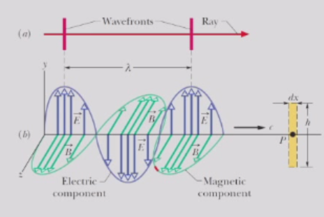
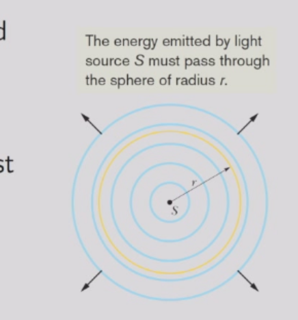

# 麦克斯韦方程组与电磁波
## 麦克斯韦的修正
到目前为止，我们遇到了以下定律，这些定律指定了电场和磁场的散度和旋度：

- 高斯定律（电场）：$\nabla \cdot \overrightarrow E = \frac{\rho}{\epsilon_{0}}$ 
- 法拉第定律$\nabla × \overrightarrow{E} = - \frac{\partial \overrightarrow{B}}{\partial t}$
- 高斯定律（磁场）:$\nabla \cdot \overrightarrow{B} = 0$
- 安培定律：$\nabla × \overrightarrow{B} = \mu_{0}\overrightarrow{J}$

但这些定律是不完备的，我们知道旋度的散度一定为0，但当我们对安培定律应用散度时，会发现
$$
\nabla \cdot(\nabla × \overrightarrow{B}) = \nabla \cdot(\mu_{0}\overrightarrow{J}) = \mu_{0}(\nabla \cdot \overrightarrow{J})
$$ 
这并不一定为零。另一方面，局部电荷守恒导致连续性方程：
$$
\nabla \cdot \overrightarrow{J} = - \frac{\partial \rho}{\partial t}
$$
因此，我们必须有
$$
\nabla \cdot(\nabla × \overrightarrow B) = - \mu_{0}\frac{\partial \rho}{\partial t} = - \mu_{0}\frac{\partial(\epsilon_{0}\nabla \cdot \overrightarrow E)}{\partial t} = - \nabla \cdot(\mu_{0}\epsilon_{0}\frac{\partial \overrightarrow E}{\partial t})
$$
麦克斯韦指出，通过修正安培定律，可以消除额外的散度
$$
\nabla × \overrightarrow{B} = \mu_{0}\overrightarrow{J} + \mu_{0}\overrightarrow{J}_{d} = \mu_{0}\overrightarrow J + \mu_{0}\epsilon_{0}\frac{\partial \overrightarrow{E}}{\partial t}
$$ 
其中额外的项$\overrightarrow{J}_{d} = \epsilon_{0}\frac{\partial \overrightarrow{E}}{\partial t}$被称为位移电流。
正如变化的磁场会感应出电场（法拉第定律），变化的电场也会感应出磁场。安培定律的积分形式为
$$
\oint_{C} \overrightarrow{B} \cdot d \overrightarrow{s} = \mu_{0} i_{e n c} = \mu_{0} \int_{S} \overrightarrow{J} \cdot d \overrightarrow{A}
$$
在麦克斯韦修正后，我们有
$$
\oint_{C} \overrightarrow{B} \cdot d \overrightarrow{s}  = \mu_{0} (i_{enc} + \int_{S} \overrightarrow{J_d} \cdot d \overrightarrow{A} )
$$
## 麦克斯韦方程组
麦克斯韦方程组是电磁学中最重要的方程组之一。它描述了电场、磁场的关系。它有以下形式：
$$
\nabla \cdot \overrightarrow{E} = \frac{\rho}{\epsilon_{0}} \\
\nabla × \overrightarrow{E} = - \frac{\partial \overrightarrow{B}}{\partial t} \\ 
\nabla \cdot \overrightarrow{B} = 0 \\
\nabla × \overrightarrow{B} = \mu_{0}\overrightarrow J + \mu_{0}\epsilon_{0}\frac{\partial \overrightarrow{E}}{\partial t}
$$
与之相关的力定律：
$$
\overrightarrow{F} = q(\overrightarrow{E} + \overrightarrow{v}\times\overrightarrow{B})
$$
## 波动方程的推导
麦克斯韦方程组是关于$\overrightarrow{E}$和$\overrightarrow{B}$的耦合的一阶偏微分方程组。
我们可以证明，通过将电场和磁场的旋度取旋度，可以将它们解耦。
$$
\nabla \times(\nabla × \overrightarrow{E}) = \nabla \times( - \frac{\partial \overrightarrow{B}}{\partial t})I= - \frac{\partial}{\partial t}(\nabla × \overrightarrow B) = - \mu_{0}\epsilon_{0}\frac{\partial^{2}\overrightarrow E}{\partial t^{2}}
$$
$$
\nabla \times(\nabla × \overrightarrow{B}) = \nabla \times(\mu_{0}\epsilon_{0}\frac{\partial \overrightarrow{E}}{\partial t})= \mu_{0}\epsilon_{0}\frac{\partial}{\partial t}(\nabla × \overrightarrow{E}) = - \mu_{0}\epsilon_{0}\frac{\partial^{2}\overrightarrow{B}}{\partial t^{2}}
$$
由于
$$
\overrightarrow{A}\times(\overrightarrow{B}\times \overrightarrow{C}) = \overrightarrow{B}(\overrightarrow{A}\cdot \overrightarrow{C}) - (\overrightarrow{A}\cdot \overrightarrow{B})\overrightarrow{C}$$
设$\overrightarrow{A}=\overrightarrow{B}= \nabla$，我们得到以下恒等式：对于任意向量$\overrightarrow{C}$：
$$
\nabla \times(\nabla × \overrightarrow{C}) = \nabla(\nabla \cdot \overrightarrow{C}) - \nabla^{2}\overrightarrow{C}
$$
由于高斯定律告诉我们，在真空中 $\nabla·\overrightarrow{E}=0 $和 $\nabla·\overrightarrow{B}=0$，我们得出
$$
\nabla^{2}\overrightarrow{E} = \mu_{0}\epsilon_{0}\frac{\partial^{2}\overrightarrow{E}}{\partial t^{2}} , \nabla^{2}\overrightarrow{B} = \mu_{0}\epsilon_{0}\frac{\partial^{2}\overrightarrow{B}}{\partial t^{2}}
$$
因此，在真空中，电场和磁场的每个笛卡尔分量都满足波动方程
$$
\frac{\partial^{2}f}{\partial t^{2}} = c^{2}\nabla^{2}f
$$ 
其中所有电磁波的速度为
$$
c = \frac{1}{\sqrt{\mu_{0}\epsilon_{0}}}\approx 3 . 0 0 × 1 0^{8}m / s
$$
>从麦克斯韦方程组也可推出光速不变性。

在电磁波中振荡的是电场和磁场强度。

## 电磁波的传播
B场感应出垂直的E场（法拉第），E场又感应出垂直的B场（麦克斯韦）。如此循环往复。由此产生的场变化以电磁波的形式传播。
我们关注平面波
$$
f(x , t) = A \cos(k x - \omega t + \phi)
$$
其中$k$是波数，$w$是角频率。它们与波长$λ$和周期$T$的关系为
$$
\lambda = \frac{2 \pi}{k} , T = \frac{2 \pi}{\omega}
$$
那么我们可以将电场和磁场表示为位置x（沿波传播方向的+x方向）和时间t的正弦函数
$$
\overrightarrow{E}(x , t) = \overrightarrow{E}_{m}\cos(k x - \omega t + \phi)
$$ 
$$
\overrightarrow{B}(x , t) = \overrightarrow{B}_{m}\cos(k x - \omega t + \phi)
$$
由于E和B的每个分量都满足波动方程
$$
\frac{\partial^{2}f}{\partial t^{2}} = c^{2}\nabla^{2}f
$$ 
因此必须有$ω² = c²k²$，即$ω= ck$。

麦克斯韦方程组对电场和磁场施加了额外的约束。计算电场的散度和旋度，我们得到
$$
\nabla \cdot \overrightarrow E(x , t) = - k \hat x \cdot \overrightarrow E_{m}\sin(k x - \omega t + \phi) ,\\ 
\nabla × \overrightarrow{E}(x , t) = - k \hat{x} × \overrightarrow{E}_{m}\sin(k x - \omega t + \phi)
$$
同样，时间导数可以表示为
$$
\frac{\partial}{\partial t} \overrightarrow{E} ( x , t ) = \omega \overrightarrow{E}_{m} \sin ( k x - \omega t + \phi )
$$

根据高斯定律，$\nabla·E=0$，且 $\nabla·B=0$，我们得到$(E_m)_x=(B_m)_x=0$。即电磁波是横波。

根据法拉第定律
$$
\nabla × \bar E = - \frac{\partial \overrightarrow B}{\partial t}
$$
我们发现
$$
k \hat{x} × \bar{E}_{m} = - \omega \overrightarrow{B}_{m}
$$
因此，
$$
\overrightarrow{B}_{m} = \frac{1}{c}(\hat{k} × \overrightarrow{E}_{m}) , o r \overrightarrow{B} = \frac{1}{c}(\hat{k} × \overrightarrow{E})
$$
另一种写法是
$$
(E_{m})_{y} = c(B_{m})_{z} , (E_{m})_{z} = - c(B_{m})_{y}
$$

这表明：**$E$始终垂直于$B$。$E×B$给出波传播的方向。**

### 电磁波的能量
因为$\overrightarrow E$和$\overrightarrow B$相互垂直，并且电场和磁场的能量密度$u_E$和$u_B$沿着电磁波的处处相等，即:
$$
\frac{\epsilon_{0} E^{2}}{2} = \frac{B^{2}}{2 \mu_{0}}
$$ 
平面波中单位面积的能量传输速率是总能量密度与电磁波速度的乘积，即
$$S = (u_{E} + u_{B})c $$
由于$\overrightarrow E$和$\overrightarrow B$都是时间的正弦函数:
$$
[E^{2}]_{a v g} = \frac{E_{m}^{2}}{2} , [B^{2}]_{a v g} = \frac{B_{m}^{2}}{2}
$$
同样，S的时间平均值，即波的强度，为 
$$
I=S_{a v g} = \frac{\epsilon_{0}E_{m}^{2}}{2}c = \frac{B_{m}^{2}}{2 \mu_{0}}c
$$ 
维度分析表明，S或I的单位与单位面积功率相同，其国际单位制单位为瓦特每平方米（W/m²）。

#### 补：球面波的强度
- 强度随距离的变化强度I是能量传输的时间平均值。它在空间中仍可能变化。
- 当球面波从各向同性点源 $S$ 以功率 $P_s$ 扩散时，波的能量保持守恒。
- 球体处的强度I必须随r的增加而减小
$$
I = \frac{P_{s}}{4 \pi r^{2}}
$$
