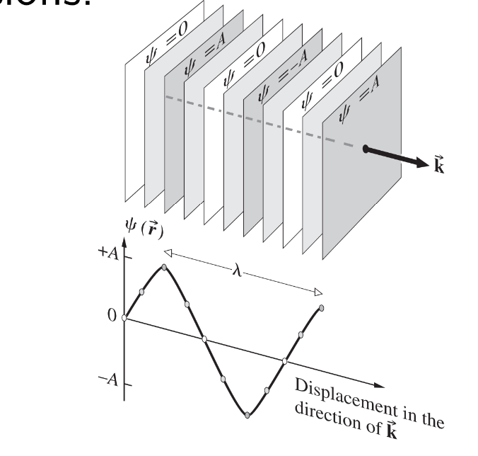
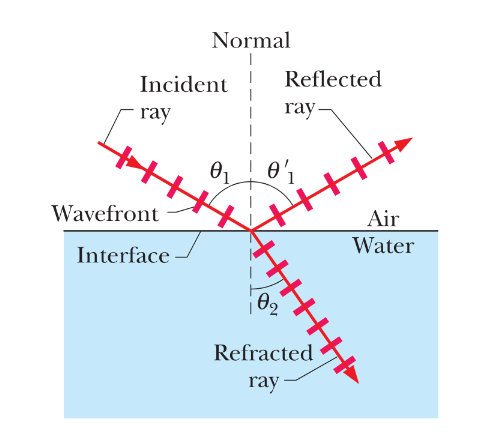

# 光
## 波前
一般来说，我们可以考虑一个平面波沿三维空间中的任意方向传播：
$$
\psi ( \overrightarrow{r} ) = A \cos ( \overrightarrow{k} \cdot \overrightarrow{r} - \omega t + \phi )
$$
在任意时刻，波前是一个相位恒定的表面。对于平面波，这样的表面是
$$
\overrightarrow{k}\cdot \overrightarrow{r} = c o n s t a n t $$

## 折射率
在介电材料中，电场被一个因子$\epsilon_r$改变，这个因子称为相对介电常数（也称为介电常数$\kappa$）。

在磁性材料中（因此，不包括玻璃或塑料），磁场会因相对磁导率$µ_r$而改变。  
因此，穿过任何实质性介质的光波传播速度为$$
v = \frac{1}{\sqrt{\epsilon_{r}\mu_{r}}}\frac{1}{\sqrt{\epsilon_{0}\mu_{0}}} = \frac{c}{n}
$$ 
其中折射率$n =\sqrt{\epsilon_{r}\mu_{r}}$
色散关系变为
$$
ω = vk = ck/n
$$
因此$k = nk₀$，其中$k₀$是真空中的波数。
## 反射与折射
反射定律：反射射线位于入射平面内，其反射角等于入射角（均相对于法线）：$$\theta_{1}=\theta_{1}^{\prime}$$
折射定律：折射光线位于入射平面内，其折射角$θ₂$与入射角$θ₁$的关系为
$$
n_{2}\sin \theta_{2} = n_{1}\sin \theta_{1}
$$

全反射：当光线从较高折射率的介质（$n_1$）进入到较低折射率（$n_2$）的介质时，如果入射角大于某一临界角$θ_c$时，折射光线将会消失，所有的入射光线将被反射而不进入低折射率的介质。
临界入射角满足
$$
sinθ_{c}=\frac{n_{2}}{n_{1}}
$$

## 费马原理
1657年，费马提出了他著名的最短时间原理：光束在两点之间实际走过的路径是所需时间最短的路径。对于均匀介质，该原理简化为光线直线传播定律。
可以通过费马原理推出反射定律和折射定律。