# 几何光学
## 平面镜
平面镜是一种表面，能够将一束光反射到一个方向，而不是将其广泛散射到多个方向或吸收它。  
我们考虑一个点光源$O$（物体），位于平面镜前的垂直距离$p$处。照射到镜面上的光线用从$O$发散的光线表示。该光线的反射用从镜子发出的反射光线表示。

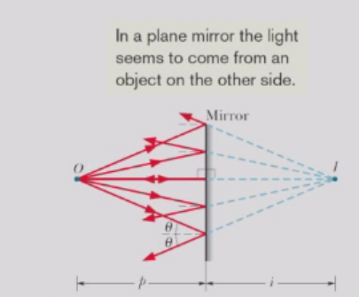

如果我们将反射光线向后延伸（在镜子后面），我们会发现这些延伸线在镜子后方垂直距离为$i$的点处相交，形成$O$的虚像。  
从众多光线中选出的两条光线中，一条垂直到达镜面点$b$，另一条以任意点$a$到达镜面，入射角为$θ$。  
通过延长两条反射光线，我们发现像与物体到镜子的距离相等，即像距$i$等于物距$p$的负值。根据惯例，物体距离$p$被取为正值，而虚像的像距$i$被取为负值。

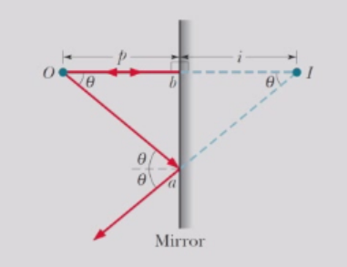

对于一个延伸物体$O$，其在平面镜前方的垂直距离为$p$处，物体上每个面对镜子的微小部分都像一个点光源。  
该物体的虚像由物体所有部分的虚点像组成。这个虚像位于（负）距离$i = -p$处，在镜子的后方，像与物体到镜面的距离相等，像的高度与物体的高度相等。

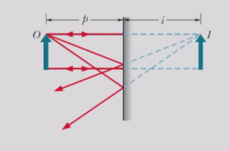

## 凹面镜/凸面镜
### 焦点与焦距
无限远处的物体发散的平行光束被凹面镜反射后通过一个公共点$F$，此点被称为此凹面镜的焦点，其与镜面中心的距离称为镜面的焦距。

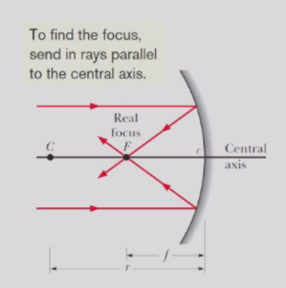

对于凸面镜，平行光线发散。反射光线的延长线通过一个公共点$F$。点$F$是凸面镜的焦点。

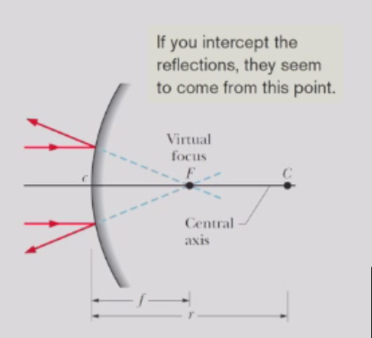

对于两种类型的镜面，焦距$f$与镜面的曲率半径$r$之间的关系为$f = r/2$，其中$r$为凹面镜时取正值，凸面镜时取负值。

### 凹/凸面镜成像
当物体发出的光线与球面镜的中心轴仅形成小角度时，物体距离$p$（正值）、像距$i$和焦距$f$之间存在一个简单的方程：
$$
\frac{1}{p} + \frac{1}{i} = \frac{1}{f}
$$
该公式适用于任何凹面镜（$f > 0$）、凸面镜（$f < 0$）或平面镜（$f = ∞$）。

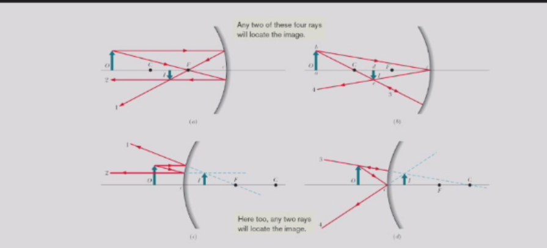

对于凸面镜或平面镜，无论物体位于主轴上哪个位置，只能形成虚像。

设$h$表示物体的高度，$h'$表示像的高度。则$h'$与$h$的比值称为镜面产生的横向放大率$m$。  
根据惯例，当像的方位与物体方位相同时，横向放大率始终带有正号；当像的方位与物体方位相反时，横向放大率始终带有负号。因此，我们写作

$$
m=-i/p
$$

该方程可通过三角形的相似性得以证明。

## 球面折射
我们将仅考虑曲率半径为$r$、曲率中心为$C$的球面。光线将由折射率为$n₁$的介质中的点光源$O$发出，并通过球面折射进入折射率为$n₂$的介质。  
实像形成于折射面与物体相对的侧边，而虚像则形成于与物体同侧的表面。
当物体发出的光线与球面镜的中心轴仅形成小角度时，物体距离$p$（正值）、像距$i$和曲率半径$r$之间存在方程：
$$
\frac{n_1}{p} + \frac{n_2}{i} = \frac{n_2-n_1}{r}
$$
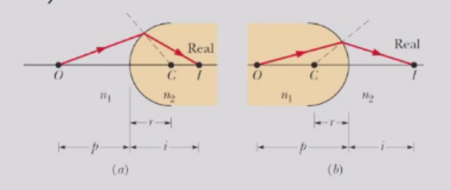

当物体面对凸面折射面时，曲率半径$r$为正值；当面对凹面时，$r$为负值。
## 薄透镜
薄透镜透镜是一种具有两个折射面的透明物体，其光轴重合。

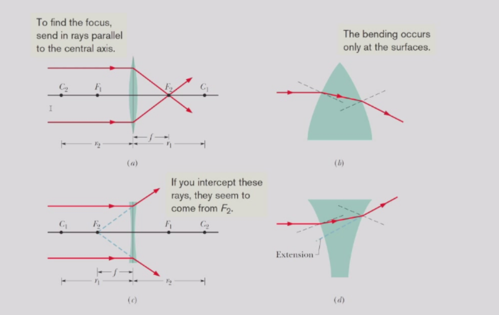

当折射率为$n$的薄透镜被空气包围时，其焦距$f$由透镜方程给出：
$$
\frac{1}{f} = (n - 1)(\frac{1}{r_{1}} - \frac{1}{r_{2}})
$$
其中$r₁$是靠近物体的透镜表面曲率半径，$r₂$是另一表面的曲率半径。这些半径的符号遵循球面折射面的半径符号规则。如果透镜被某种介质（例如玉米油）包围，其折射率为$n_{medium}$，则将$n$替换为$n_{medium}/n$。
### 薄透镜成像
对于一个薄透镜，物体距离$p$（正值）、像距$i$和焦距$f$之间也满足：
$$
\frac{1}{p} + \frac{1}{i} = \frac{1}{f}
$$
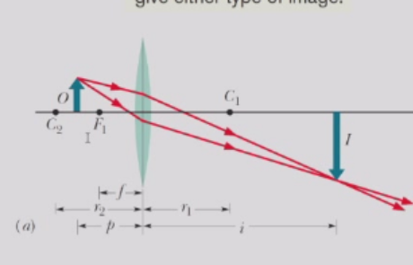
### 像的确定
最初平行于的射线透镜的中心轴将通过焦点$F_{2}$    
一束光线若最初经过焦点$F₁$，将从透镜处平行于主轴射出。    
一束原本朝向透镜中心的光线，由于光线在透镜两侧几乎平行，因此从透镜中射出时其传播方向不会发生改变。    
以上三条光线任意选取两条即可确定成像。  

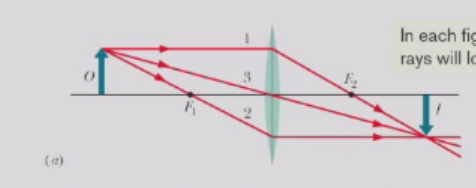

### 显微镜

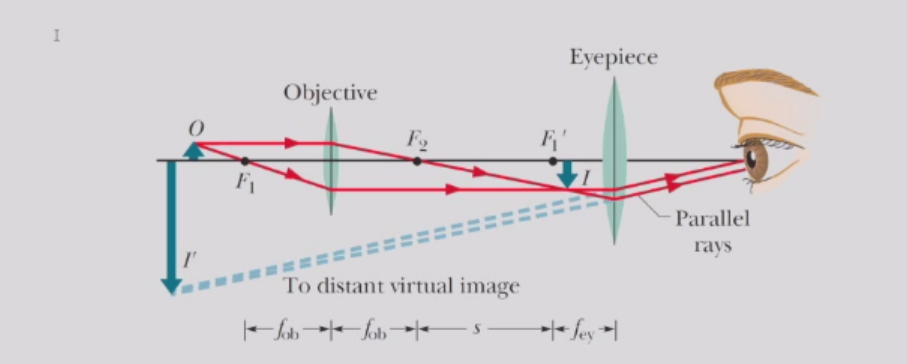

对于透镜系统，总的横向放大率$M$等于透镜系统中所有透镜的横向放大率之积。
