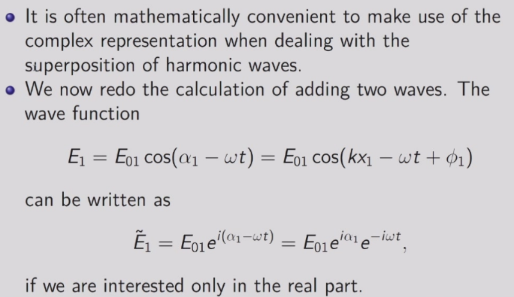
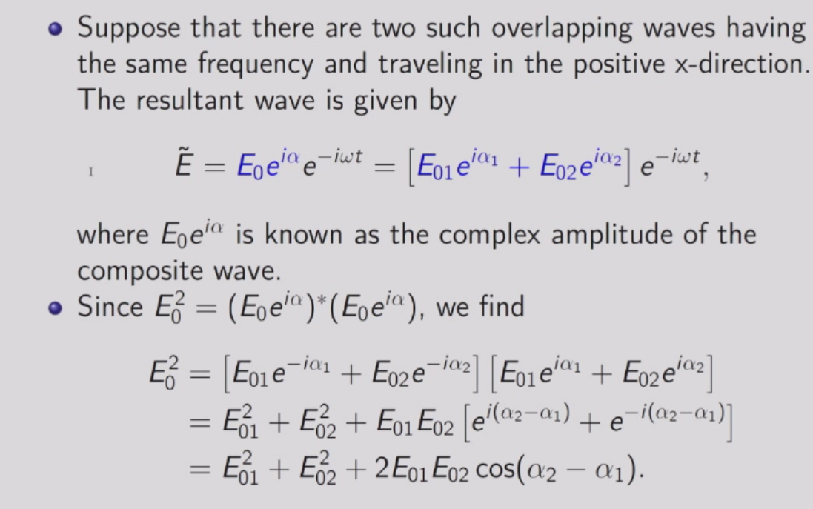
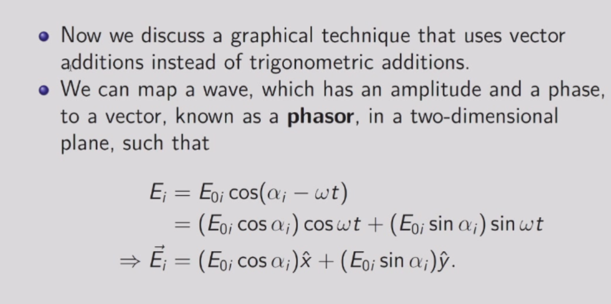
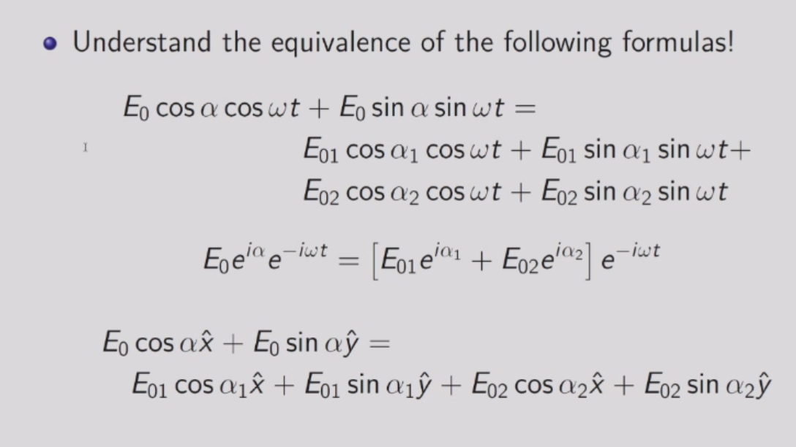
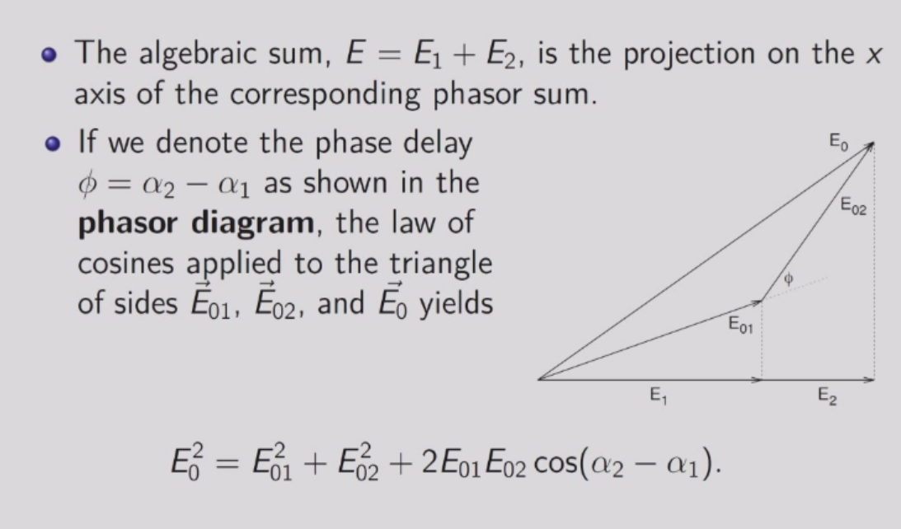
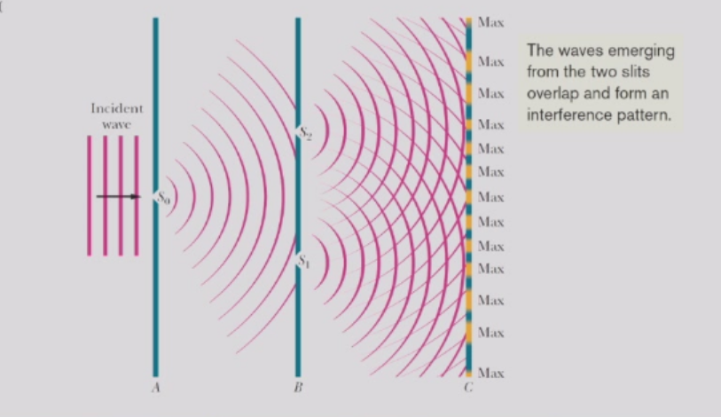
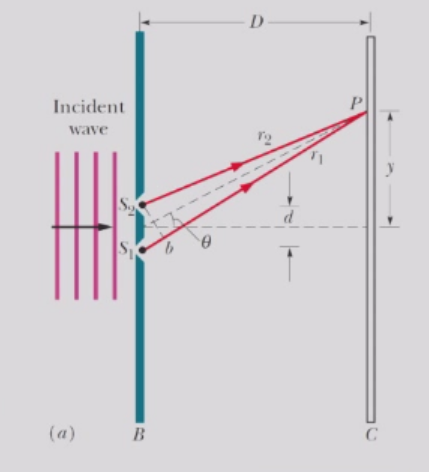
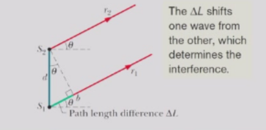
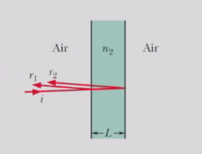
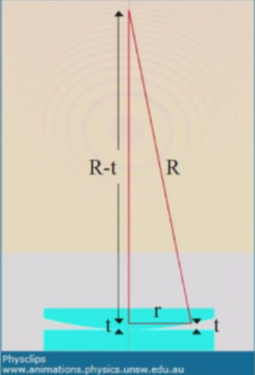

# 光的干涉
## 波的叠加
当两个波具有相同频率、不同相位的情况下，即存在下列波：
$$
E_1(x,t)=E_{01}\cos(\alpha_1-\omega t)
$$
$$
E_2(x,t)=E_{02}\cos(\alpha_2-\omega t)
$$
这里$\alpha_i=kx_i+\phi_i$，$k$为波数，$\phi$为相位，$x_i$表示波源到观测点的位置。
这两个波的线性组合为：
$$
E \equiv E_1+E_2=E_{0}\cos(\alpha-\omega t)
$$
其中$E_0$和$\alpha$的定义为：
$$
E_0\cos \alpha= E_{01}\cos \alpha_1+E_{02}\cos\alpha_2
$$
$$
E_0\sin \alpha= E_{01}\sin \alpha_1+E_{02}\sin \alpha_2
$$
由此可得：
$$
E_{01}\cos \alpha_1+E_{02}\cos\alpha_2=E_{0}\cos(\alpha-\omega t)
$$
$$
E_{01}\sin \alpha_1+E_{02}\sin\alpha_2=E_{0}\sin(\alpha-\omega t)
$$
将上式两边同时除以$E_0$，并令$E_0=1$，可得：

$$
E_0^2=E_{01}^2+E_{02}^2+2E_{01}E_{02}\cos(\alpha_1-\alpha_2)
$$

由此我们可以得到，叠加波的强度并非是各分量强度的简单相加，还与它们的相位差有关。
$$
\delta = \alpha_1-\alpha_2 = \frac{2\pi}{\lambda}(x_2-x_1)+(\phi_2-\phi_1)
$$
其中$\lambda$为波长。

也可以通过复数方法来求解光的叠加问题：

也可以通过向量方法来求解光的叠加问题：

## 杨氏干涉实验

当波通过两个狭缝时，它们处于同一相位，因为此时它们只是同一入射波的不同部分。

当$d$远小于$D$时，路径长度差：
$$
\Delta L = d \sin \theta
$$

我们可以列出两束光的波动方程：
$$
E_1=E_0cos(kr_1-\omega t)=E_0cos(kL+\beta-\omega t)
$$
$$
E_2=E_0cos(kr_2-\omega t)=E_0cos(kL-\beta-\omega t)
$$
其中相位差$L=(r_1+r_2)/2= \sqrt{D^2+y^2}$
$$
\delta=2\beta=k\nabla L=\frac{2\pi d}{\lambda}\sin\theta
$$
总强度由下式给出：
$$
I\propto 2 E_0^2 [1+\cos(2\beta)]
$$
因此，当出现亮纹时：
$$
\Delta L = d \sin \theta = m \lambda
$$
当出现暗纹时：
$$
\Delta L = d \sin \theta = (m+0.5) \lambda
$$
其中m为整数。
## 薄膜干涉
考虑均匀厚度为$L$的薄膜，并且折射率为$n_2$，入射光线波长为$\lambda$，为简单起见，我们假定光线几乎垂直入射。

光线$r_1$、$r_2$的光波具有路径差$2L$，在介质中的波长为$\lambda_2=\frac{v_2}{f}=\frac{c}{n_2}\frac{1}{f}=\frac{c}{f}\frac{1}{n_2}=\frac{\lambda}{n_2}$，再考虑半波损失。
由此我们可以得出结论：  
两条光线同向，当
$$
2L=(m+0.5) \frac{\lambda}{n_2}
$$
它们产生干涉为最大值。  
类似的，若它们正好异向
$$
2L=m \frac{\lambda}{n_2}
$$
它们产生干涉为最小值。

当薄膜厚度$L$远小于$\lambda$时，路径长度差可忽略，此时无论光的波长和强度如何，两条光线都是完全异相的，产生干涉为最小值。（如下图中彩色薄膜的上部为暗纹）

## 牛顿环

对于上图的一个牛顿环，当平行单色光垂直入射于凸透镜的平表面时。在空气气隙的上下两表面所引起的反射光线形成相干光，会形成中心对称明暗相间的环状结构。第$m$条暗纹距透镜中心的距离$r$有如下表达式：
$$
r=\sqrt{m\lambda R}
$$

