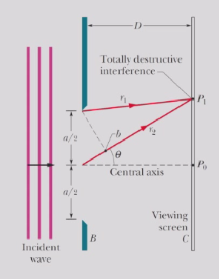
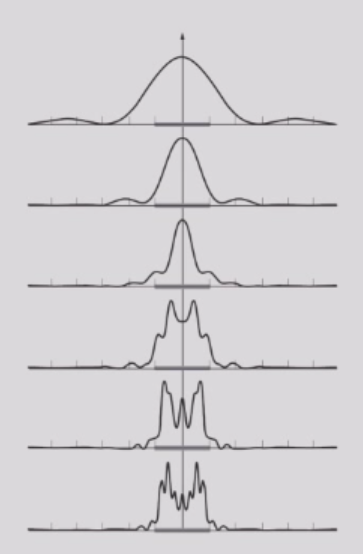
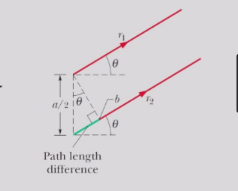
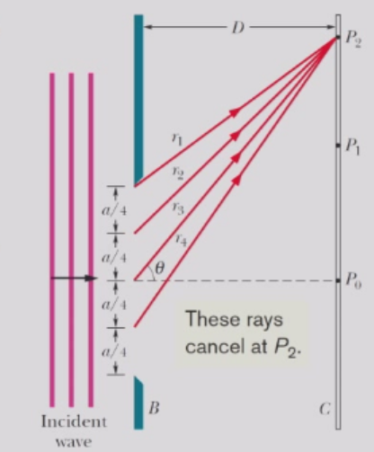
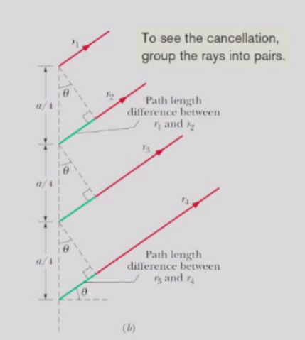
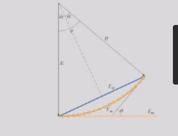
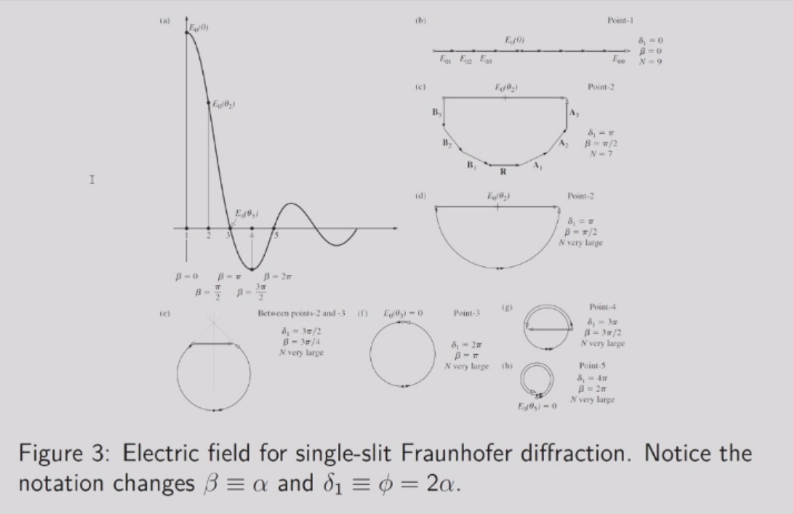
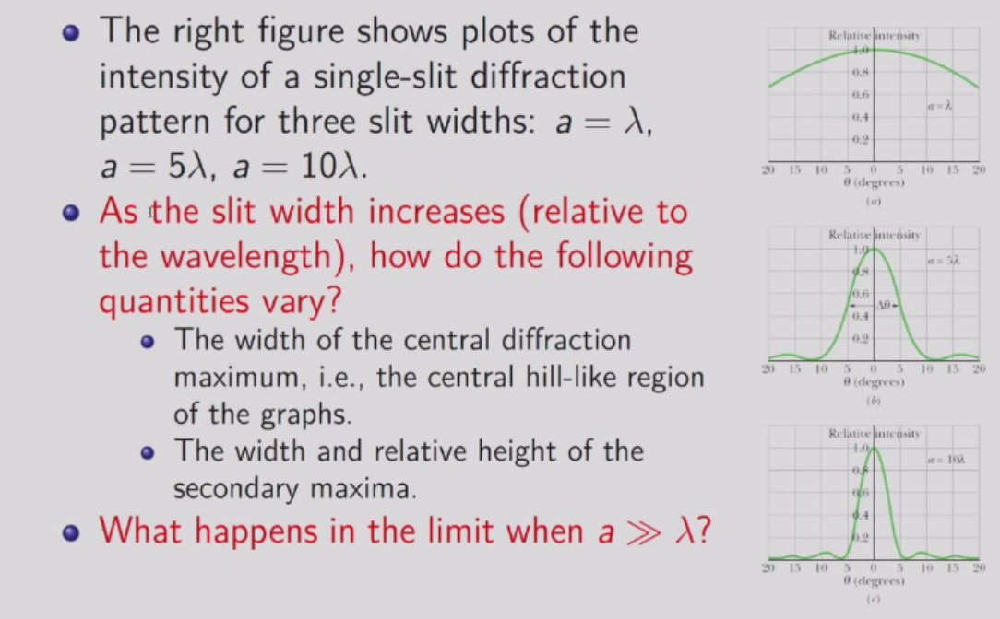
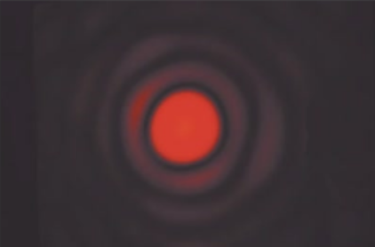
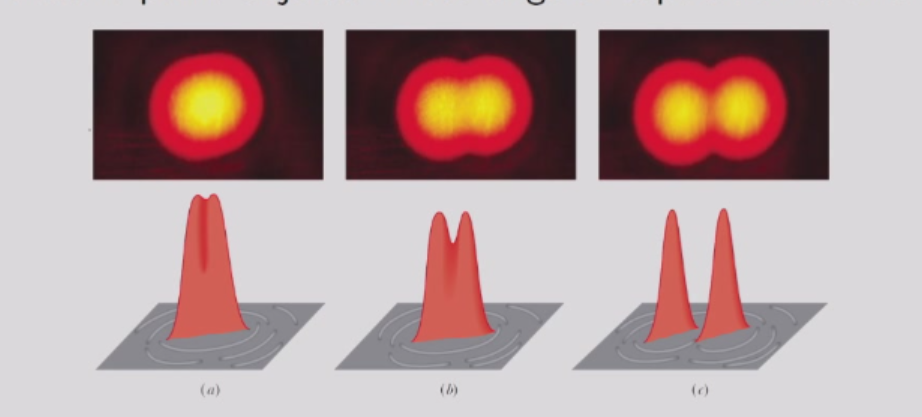

# 衍射
## 单缝衍射实验
我们考虑波长为$\lambda$的平面光波在穿过一个宽度为$a$的长狭缝后，在其余部分不透光的屏$B$上产生的衍射图样。
从狭缝内不同点发出的光波发生干涉，在屏幕$C$上形成明暗相间的衍射图样。

在大屏幕距离（$d>a²/λ$）处，投影图案的形状与$d$无关。这是夫琅禾费或远场衍射。 
然而，在小$d$处，衍射图案的尺寸和形状都随距离而改变。这种现象被称为菲涅耳或近场衍射。在此处我们只考虑远场衍射。

首先，让我们将狭缝分成两个宽度相等的区域$a/2$，我们从顶部区域的顶点向$P_1$延伸一条光线$r_1$，从底部区域的顶点向$P_2$延伸另一条光线$r_2$。
设在$P_1$处两者相互抵消，则根据$D>>a$，来自两个区域的射线任意相似配对在相同点$P_1$处也会相互抵消。

在它们到达$P_1$时，它们的相位差为$\frac{\lambda}{2}$，则当$D>>a$时，
$$
\frac{a}{2}\sin \theta = \frac{\lambda}{2}
$$

于是，第一暗纹相对于中心轴上方或下方的角度$\theta$由以下公式确定:
$$
\sin\theta =\frac{\lambda}{a}
$$
倘若$a<=\lambda$，那么此时暗纹不会在观察屏上出现，亮纹必须覆盖整个观察屏。

为了找到中央轴线上下两侧的第二条暗纹，我们将狭缝划分为四个宽度为$a/4$的等宽区域。

在$P_2$处产生第二条暗纹时，$r_1$与$r_2$之间的光程差，$r_2$与$r_3$之间的光程差，$r_3$与$r_4$之间的光程差都必须等于$\frac{\lambda}{2}$。

从两个相邻区域的对应点发出的任何两条射线的路径长度差为$\frac{a}{4}\sin\theta$，于是，
$$
\frac{a}{4}\sin\theta = \frac{\lambda}{2}
$$

我们可以通过将狭缝分割成更多的等宽区域来继续定位衍射图案中的暗纹。

在中心轴上方或下方的暗纹可由一般方程确定：
$$
\sin\theta = \frac{m\lambda}{a} \quad m=1,2,3,\cdots
$$
换句话说，当顶部光线和底部光线的路径长度差（$a\sin\theta$）等于$\lambda,2\lambda,3\lambda,\cdots$时，会产生暗纹。

为了找到对应于特定小角度$\theta$的视屏上任意点$P$处的强度表达式，我们需要将狭缝划分为$N$个等宽区域，这些区域足够小，以至于我们可以假设每个区域都是一个光源。
然后我们将小波的向量相加，形成一个几何级数：
$$
\tilde{E_{\theta}}=\frac{E_0}{N}e^{-i\omega t}e^{ikr_1} \times [1+e^{ik(r_2-r_1)}+e^{ik(r_3-r_1)}+\cdots+e^{ik(r_N-r_1)}]
$$
令$\delta=\Delta x\sin\theta=r_{i+1}-r_i$，则有：
$$
S=[1+e^{ik\delta}+e^{ik(2\delta)}+\cdots+e^{ik(N\delta)}] \\
= [\frac{e^{iNk\delta}-1}{e^{ik\delta}-1}] \\
= \frac{e^{iNk\delta/2}(e^{iNk\delta/2}-e^{-iNk\delta/2})}{e^{ik\delta/2}(e^{ik\delta/2}-e^{-ik\delta/2})} \\
= e^{i(N-1)k\delta/2}\frac{\sin\frac{Nk\delta}{2}}{\sin\frac{k\delta}{2}}
$$

只有实数部分会影响波的强度大小，因此我们只考虑实数部分，我们已经知道$\delta=\frac{a}{N}\sin \theta，k=\frac{2\pi}{\lambda}$，于是：
$$
\frac{\sin\frac{Nk\delta}{2}}{\sin\frac{k\delta}{2}}=N\frac{\sin\frac{\pi a\sin \theta}{\lambda}}{\frac{\pi a\sin \theta}{\lambda}}=N\frac{\sin(\alpha)}{\alpha}
$$
于是我们有：
$$
\tilde{E_{\theta}}=E_0 \frac{\sin(\alpha)}{\alpha}
$$
其中$\alpha=\frac{\pi}{\lambda}a\sin\theta$。

我们也可以通过向量叠加的方法求解，向量弧表示到达观察屏上任一点P的子波，对应小角度$\theta$，在P处合成波的振幅$E_{\theta}$是这些向量的矢量和。在$n \rightarrow \infty$时，向量的弧趋近于圆弧。

注意到：
$$
\frac{I_{\theta}}{I_{max}}=\frac{E_{\theta}^2}{E_m^2}
=\frac{\sin^2(\alpha)}{\alpha^2}
$$

衍射实际上是光的波动性的一种反应，孔径$a$越大，光的波动性的反应就越弱，当$a>>\lambda$时，衍射图案的强度会趋于零。

### 补：傅里叶变换
从物理的角度来说，给定一个随时间变化的信号，对其作傅里叶变换，得到的即为该信号的频谱；变换前后分别从时间和频率两个方面描述了信号。傅里叶变换后，在某处的取值越高，说明信号含有该处对应频率的信号越多。

从上述推导，我们可以得到：
$$
\tilde{E_{\theta}}=\frac{E_0}{N}e^{-i\omega t}e^{ikr_1} \times [1+e^{ik(r_2-r_1)}+e^{ik(r_3-r_1)}+\cdots+e^{ik(r_N-r_1)}] \\
= \frac{E_0\Delta x}{a}e^{-i\omega t}\sum_{i}e^{ikr_i} \\
\xrightarrow{N\rightarrow \infty}E_0e^{-i\omega t}\frac{1}{a}\int_{0}^{a}e^{ik(r_1+x\sin\theta)}dx \\
\sim \int_{0}^{a}e^{ik_xx}dx \sim \int_{-a/2}^{a/2}e^{ik_xx}dx
$$
其中$r_{i+1}-r_i=\Delta x\sin \theta$，$k_x=k\sin\theta$。

一维函数$f(x)$的傅里叶变换$F(k_x)$可以表示为：
$$
F(k_x)=\int_{-\infty}^{\infty}e^{ik_xx}f(x)dx
$$
其逆变换为：
$$
f(x)=\frac{1}{2\pi}\int_{-\infty}^{\infty}e^{-ik_xx}F(k_x)dk_x
$$

考虑沿$y$方向的长狭缝，由平面波照射。假设在孔径范围内没有相位或振幅变化，一维孔径函数的形式为方波脉冲：
$$
E_{sq}(x)=\left\{
\begin{array}{ll}
E_0&\quad |x|\leq a/2 \\
0&\quad |x|>a/2
\end{array}
\right.
$$

其傅里叶变换为：
$$
\tilde{E_{sq}}(k_x)=\int_{-\infty}^{\infty}e^{ik_xx}E_{sq}(x)dx=E_0\int_{-a/2}^{a/2}e^{ik_xx}dx
$$
该积分可计算为：
$$
\tilde{E_{sq}}(k_x)=E_0a\frac{\sin \alpha}{\alpha}      
$$
其中$\alpha=\frac{a}{2}k_x=k_x\sin\theta(\frac{a}{2})$。
这就可以推导出我们的结果：
$$
I_{sq}(\theta)=I_{max}\left[\frac{\sin \alpha}{\alpha}\right]^2
$$
关键在于：夫琅禾费衍射图样的场分布是孔径上场分布的傅里叶变换。

## 圆孔衍射
考虑直径为$a$的圆孔衍射，光线在孔径处发生干涉，在孔径外形成衍射图样。形成一个圆形光斑，周围环绕着多个逐渐变暗的次级环。

该图像与圆盘的傅里叶变换相关，被称为艾里图案。

对图像的分析表明，直径为$a$的圆孔衍射图样的第一个极小值位于:
$$
\sin\theta=1.22\frac{\lambda}{a}
$$
与狭缝情况下$\sin\theta=\frac{\lambda}{a}$不同。
### 瑞利判据
当需要分辨两个角距离很小的遥远点光源时，经过透镜成像的图像会受到圆孔衍射的影响。（在理想情况下，经过透镜的光汇聚到一点；但由于光的波动性，就会形成艾里图案）

若两个物体的衍射图样（主要是其中央极大值）发生重叠，则无法从单个点物体中区分它们。

瑞利判据指出，当两个点物体的角分离使得一个光源的衍射图样的中央极大值恰好位于另一个光源衍射图样第一极小值处时，这两个点物体刚好可分辨，即：
$$
\theta_R=\sin^{-1}\frac{1.22\lambda}{a}\approx 1.22\frac{\lambda}{a}
$$
故可以增大$a$或减小$\lambda$，来提高分辨率。