# 光栅与光谱
## 双缝干涉的再讨论
在杨氏双缝实验中（双缝间距为d）中，我们假设缝宽$a<\lambda$。对于如此狭窄的缝，每个缝的衍射图样的中央亮斑极大的覆盖了整个观察屏。双缝发出光的干涉产生的亮条纹亮度相近。
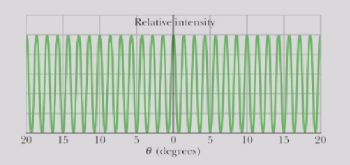

然而对于相对较宽的狭缝，双缝干涉产生的条纹强度往往会受到通过每个狭缝光的衍射的影响。(条纹的位置不会变化，仅强度会受到影响)

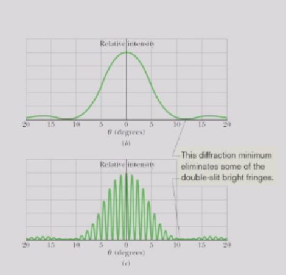

从形式上讲，考虑到衍射效应，双缝干涉的图样强度为:

$$
I(\theta)=I_{max}\left(\frac{\sin\alpha}{\alpha}\right)^2\cos^2\beta
$$

其中$\alpha=\frac{\pi}{\lambda}a\sin\theta$，$\beta=\frac{\pi}{\lambda}d\sin\theta$。

双缝干涉的第一个最小值出现于两缝之间的相位差（N=2）为：
$$
\delta_2=(2\pi/\lambda)d\sin\theta=\pi
$$
单缝衍射（包络线）的第一个最小值出现在单缝边缘与中心的相位差为:
$$
\alpha=(2\pi/\lambda)(a/2)\sin\theta=\pi
$$
因此，可以通过计数条纹来确定$(d/a)$。  
对两种衍射来说，$d$或$a$越大，$\theta$就会越小。
### 双缝干涉的傅里叶变换
考虑一个双缝，其长边沿y方向，由平面波照射，假设沿$x$方向的一维孔径函数有如下形式:
$$
E_{ds}(x)=\begin {cases}
0, & |x|<(d-a)/2 \cr
E_0, & (d-a)/2\leq |x| \leq (d+a)/2 \cr
0, & |x|> (d+a)/2
\end {cases}
$$

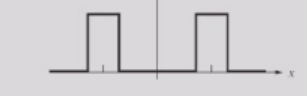

$E_{ds}(x)$的傅里叶变换为：

$$
\tilde{E}_{ds}(k_x)=\int_{-\infty}^{\infty} E_{ds}(x)e^{i k_x x}dx
$$

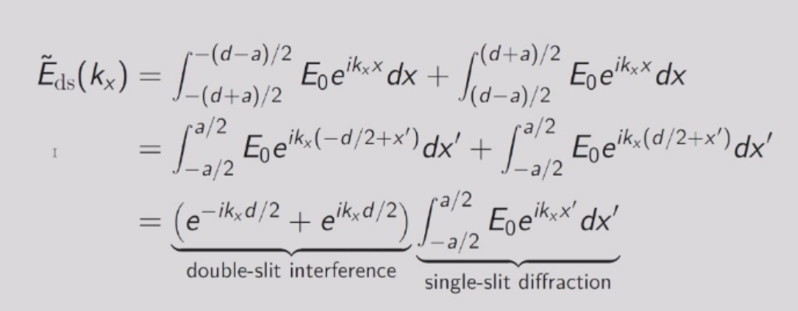

干涉图样可通过傅里叶变换的卷积定理来理解：两个函数的卷积的傅里叶变换等于它们各自傅里叶变换的乘积。

两个函数$f(x)$和$g(x)$的卷积$f*g$定义为：
$$
(f*g)(x)=\int_{-\infty}^{\infty} f(t)g(x-t)dt
$$

单缝衍射和理想双缝干涉的傅里叶变换分析如下:

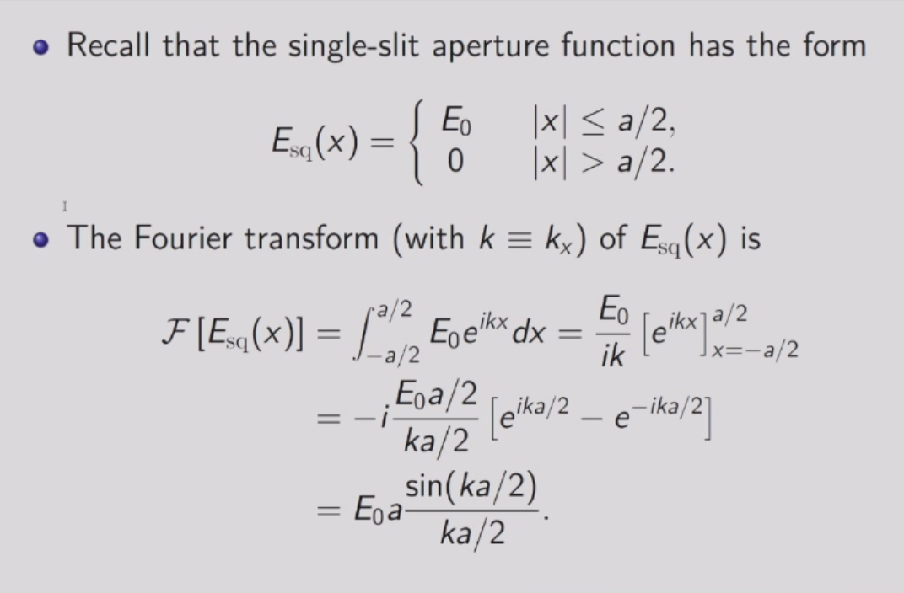
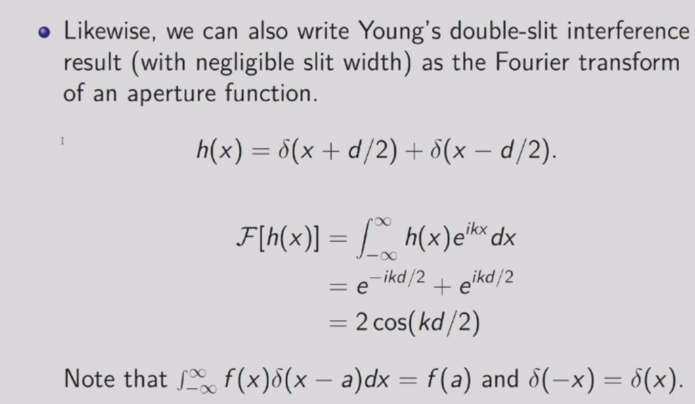

则双缝干涉函数可以表示为两者的卷积：

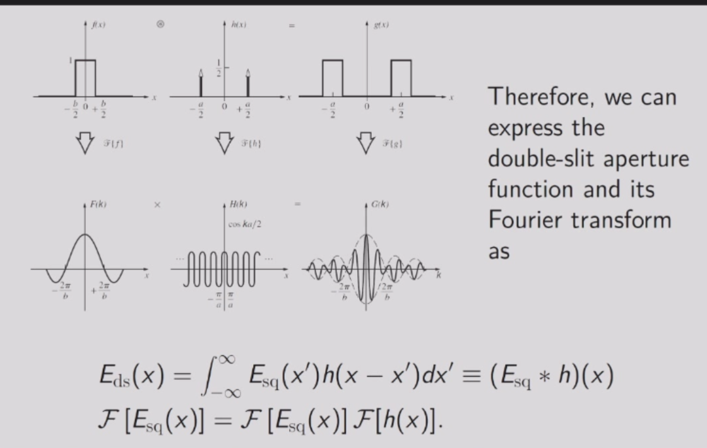

### 真实的双缝干涉图案
现实的双缝图样以一种紧密的方式结合了干涉和衍射。

如果我们令 $a→0$那么$α→0$ 且 $(sinα)/α→1$，于是我们的结果便简化（正如预期的那样）为描述一对缝间距为 $d$ 的无限窄狭缝的干涉图样的方程。    
类似地，令 $d→0$ 在物理上等价于使两个狭缝合并成一个宽度为 $a$ 的单缝。那么我们有 $β→0$ 且 $cos^2β→1$。于是我们的结果便简化（正如预期的那样）为描述一个宽度为 $a$ 的单缝的衍射图样的方程。
## 光栅
在研究光时，衍射光栅是一个有用的工具，它具有许多条狭缝，通常称为刻线，每毫米可达数千条。  
当N越大时，归一化强度（辐照度）越大，且峰值越尖锐（亮纹越窄）。

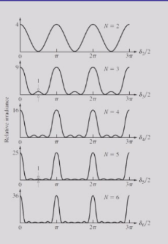

对N=4的光栅来具体分析：

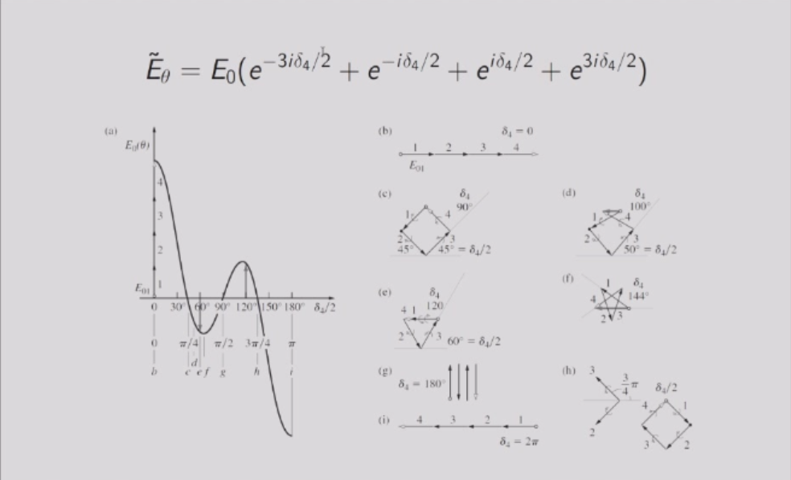

当单色光照射到光栅（具有大量的N）上时，在观察屏上可以看到非常狭窄的亮纹。

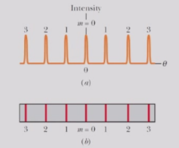

这些亮斑对应
$$
\delta_2=\frac{2\pi}{\lambda}d\sin\theta=2\pi m,\quad or \quad d\sin \theta=m\lambda
$$
它们之间被相对较宽的暗区域隔开。

光栅分辨（分离）不同波长谱线的能力取决于谱线宽度。  
中央谱线的**半宽** $(\Delta \theta_{\text{hw}})$ 由强度第一个最小值决定，此时从光栅 $N$ 个狭缝发出的 $N$ 条光线相互抵消。

第一个最小值出现在相邻狭缝之间的相位差满足以下关系时（由顶部和底部光线的光程差引起）：

$$
\delta_N = \frac{2\pi}{\lambda} d \sin \Delta \theta_{\text{hw}} = \frac{2\pi}{N},
$$

或者近似表示为：

$$
\Delta \theta_{\text{hw}} \approx \sin \Delta \theta_{\text{hw}} = \frac{\lambda}{N d}.
$$

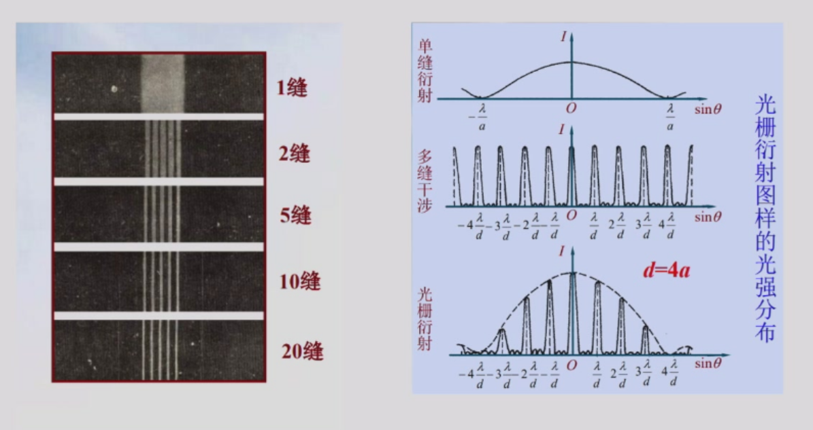

对于不同波长$\lambda$的光，由于它们的光谱线宽度随$N$的增加而减小，则就会减小区域重叠，就可以区分多个不同波长的光。

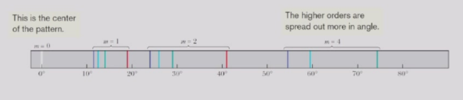

## 原子光栅
晶体固体由原子规则排列而成，类似于原子尺度（约 $10^{-10} \, \text{m}$）上具有间距 $d$ 的衍射光栅。  
在晶体中，波可以被衍射，如同被一组平行平面所反射，其角度（布拉格角）是相对于晶面测量的（而非光学中常用的相对于法线）。

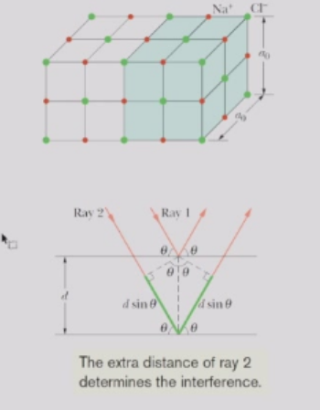

假设我们想用可见光  
$$
(\lambda \simeq 5.5 \times 10^{-7} \, \text{m})
$$
来研究衍射。一级最大值  
$$
(m = 1)
$$
将出现在

$$
\sin \theta = \frac{m\lambda}{2d} = 2750 \gg 1.
$$

这意味着我们将观察不到一级最大值。

因此，我们需要波长更短的波  
$$(\lambda \approx d) $$
即 X 射线。
### X 射线
X 射线是一种电磁辐射，其波长约为$10^{-10}$米。

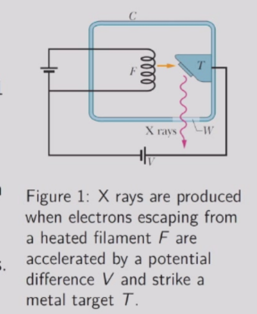

当X射线束进入NaCl等晶体时，X射线会因晶体结构向各个方向散射。  
在某些方向上，散射波会发生相消干涉，导致强度最小值；在其他方向上，干涉为相长干涉，导致强度最大值。

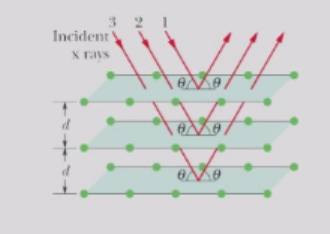

最大值出现的方位，就如同 X 射线被一族贯穿晶体内部原子并包含规则原子排列的晶面所反射一样。

布拉格定律指出，X 射线衍射的强度最大值满足
$$
2d \sin \theta = m\lambda,
$$
其中  $m = 1, 2, 3, \ldots$  是强度最大值的级数。

利用单色 X 射线束可以确定晶体的几何结构。

如下图：单晶和粉末的X射线衍射图样是不同的。

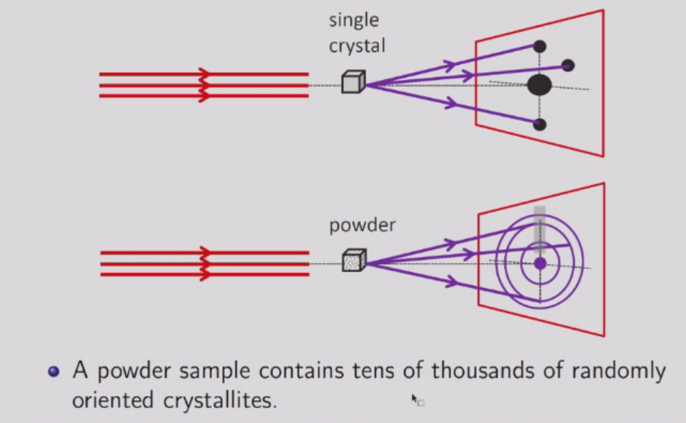

X射线的衍射图样不仅能揭示晶体的几何结构，纤维状DNA的X射线衍射揭示了沃森和克里克所提出的双螺旋结构。