# 光的偏振
## 偏振
光是一种电磁波，属于横波。目前为止，我们仅考虑了电场方向恒定（尽管其大小和正负随时间变化）的光。

一般情况下，我们可以考虑两个频率相同、通过同一空间区域、沿相同方向 $\hat{z}$传播的此类简谐光波：

$$
E_x(z, t) = \hat{i} E_{0x} \cos(kz - \omega t)
$$
$$
E_y(z, t) = \hat{j} E_{0y} \cos(kz - \omega t + \epsilon)
$$

偏振（极化）描述的是电场$E$振动的取向。
## 偏振的分类
- **线偏振**：如果相位差  $\epsilon$  为零或为 $\pm 2\pi$ 的整数倍，则合成波为  
$$
\vec{E} = \vec{E}_x + \vec{E}_y = (iE_{0x} + jE_{0y}) \cos(kz - \omega t)
$$

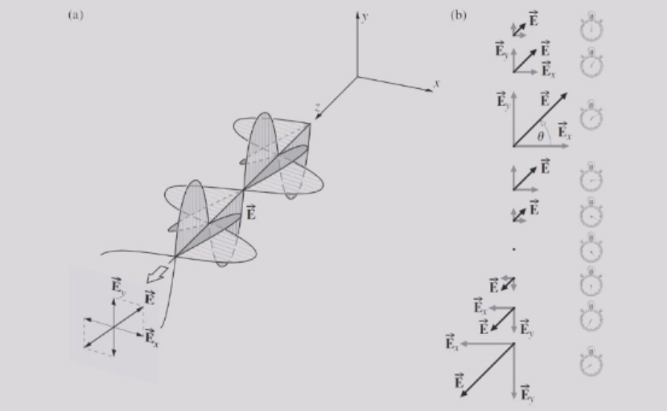

- **圆偏振**：当两个组成波的振幅相等（ $E_{0x} = E_{0y} = E_0$ ），且它们的相对相位差 $\epsilon = -\pi/2 + 2m\pi$ （其中  $m$ 为整数）时，合成波为
$$
E = iE_0 \cos(kz - \omega t) + jE_0 \cos(kz - \omega t - \pi/2) \\
= E_0[i\cos(kz - \omega t) + j\sin(kz - \omega t)]
$$

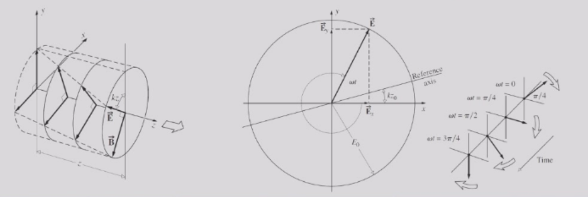

- 在固定的$z$处，由向着光传播方向观察的观察者看来，合成电场$\vec{E}$以角频率$\omega$顺时针旋转。这被称为右旋圆偏振光（根据固定时刻$\vec{E}$的螺旋结构及传播方向，由右手定则确定）。
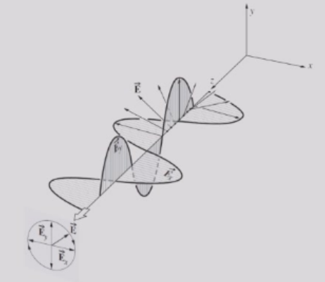
- 当波前进一个波长时，$\vec{E}$矢量恰好完成一次完整的旋转。

- 当它们的相对相位差$\epsilon = \pi/2 + 2m\pi$（其中$m$为整数）时，合成波为：

$$ 
\vec{E} = iE_0 \cos(kz - \omega t) + jE_0 \cos(kz - \omega t + \pi/2)\\
= E_0 [i \cos(kz - \omega t) - j \sin(kz - \omega t)]
$$

- 振幅保持不变，但在固定的$z$处，$\vec{E}$以逆时针方向旋转，该波为左旋圆偏振光。
- 线偏振光可以由两个振幅相等、旋向相反的圆偏振光合成。
## 偏振的数学描述

- 写成列向量和复数形式的琼斯矢量为：
    $$
    E = \begin{bmatrix}
    E_x(t) \\
    E_y(t)
    \end{bmatrix} =
    \begin{bmatrix}
    E_{0x} e^{i(kz-\omega t+\phi_x)} \\
    E_{0y} e^{i(kz-\omega t+\phi_y)}
    \end{bmatrix}
    $$
- 在许多应用中，无需确切知道振幅和相位。我们可以将琼斯矢量重写为：
  
  $$
  \vec{E} = 
  \begin{bmatrix}
  E_{0x} e^{i\phi_x} \\
  E_{0y} e^{i\phi_y}
  \end{bmatrix}.
  $$

- 因此，水平与垂直线偏振可表示为：
  
  $$
  |H\rangle = 
  \begin{pmatrix}
  1 \\
  0
  \end{pmatrix},
  \quad |V\rangle = 
  \begin{pmatrix}
  0 \\
  1
  \end{pmatrix}.
  $$
- 与 x 轴成 $+45^\circ$（对角）和 $-45^\circ$（反对角）的线偏振光分别表示为：
  
  
  $$
  |D\rangle = \frac{1}{\sqrt{2}}(|H\rangle + |V\rangle) = \frac{1}{\sqrt{2}}\begin{pmatrix} 1 \\ 1 \end{pmatrix},
  $$
  
  
  $$
  |A\rangle = \frac{1}{\sqrt{2}}(|H\rangle - |V\rangle) = \frac{1}{\sqrt{2}}\begin{pmatrix} 1 \\ -1 \end{pmatrix}.
  $$

- 右旋圆偏振光表示为：
  $$
  |R\rangle = \frac{1}{\sqrt{2}}(|H\rangle - i|V\rangle) = \frac{1}{\sqrt{2}}\begin{pmatrix} 1 \\ -i \end{pmatrix}
  $$

  也就是说，

  $$
  \vec{E} = iE_0 \cos(kz - \omega t) + jE_0 \cos(kz - \omega t - \pi/2)。  
  $$

- 左旋圆偏振光表示为：
  $$
  |L\rangle = \frac{1}{\sqrt{2}}(|H\rangle + i|V\rangle) = \frac{1}{\sqrt{2}}\begin{pmatrix} 1 \\ i \end{pmatrix}
  $$

- 请注意，在干涉中，我们讨论了二维实空间 $\mathbb{R}^2$中的叠加。
- 该空间也等价于一维复空间 $\mathbb{C}^1$，或一个二维实向量空间。
- 对于偏振，我们将一维复空间 $\mathbb{C}^1$ 推广到了二维复空间 $\mathbb{C}^2 = \mathbb{C}^1 \otimes \mathbb{C}^1$，或一个二维复向量空间（以琼斯矢量表示）。  
  这个额外的 $\mathbb{C}^1$空间由两个正交的线偏振态 $|H\rangle$和 $|V\rangle$张成。

- 当两个实向量 $\vec{A}$与$\vec{B}$ 满足 $\vec{A} \cdot \vec{B} = 0$ 时，称它们正交；类似地，两个复向量 $\vec{A}$ 与$\vec{B}$当满足 $\langle A|B\rangle \equiv \vec{A}^* \cdot \vec{B} = 0 $时，称为正交。

- 任何偏振态都存在一个对应的正交态：
  $$
  \langle H|V\rangle = \langle D|A\rangle = \langle L|R\rangle = 0
  $$
- 正如我们已经看到的，任何偏振态都可以用某一组正交基矢量的线性组合来描述。
## 光脉冲和单色光
实际上，非激光光源发出的（即便是最好的情况下）是准单色光脉冲，其频率可用一个钟形高斯函数表示。

也就是说，其辐照度（因而其平方根，即振幅）随频率的变化呈高斯分布，分布宽度为 $\Delta \omega = 2\pi \Delta \nu$。

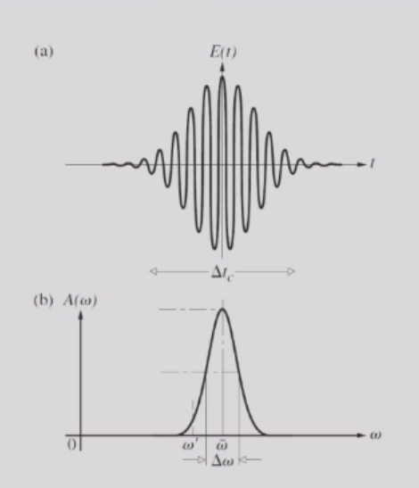

准单色光类似于一系列随机相位的有限波列。这种扰动近似正弦，尽管其频率会围绕某个平均值缓慢变化。此外，振幅也会发生波动，但这同样是一种相对缓慢的变化。

平均组成的波列大致存在的时间为相干时间：
  $$
  \Delta t_c = 1/\Delta \nu
  $$
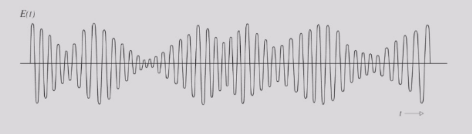
    
理想化的单色平面波必须描述为无限长的波列。如果将该扰动分解为垂直于传播方向的两个正交分量，那么这两个分量必须具有相同的频率、无限延伸，因此是相互相干的（即相位差 $\epsilon$ 为常数）。
 
  $$
  E_x(z, t) = i E_{0x} \cos(kz - \omega t)
  $$
  $$
  E_y(z, t) = j E_{0y} \cos(kz - \omega t + \epsilon)
  $$

理想的单色平面波总是偏振的。
## 自然光与相干性
自然光由不同偏振态的快速更替序列（约10⁻⁸秒）组成，也被称为非偏振光或随机偏振光。

我们可以在数学上用两个任意的、不相干的、正交的、振幅相等的线偏振波来表示自然光（即这两个波的相对相位差快速且随机变化）。
### 相干性
- 相干性是指对波在不同（时间和空间）点处相位之间关联程度的度量。
- **时间相干性**是衡量光波沿传播方向在不同点处相位关联性的指标——它反映了光源的单色性程度。（可联想准单色光的描述。）
- **空间相干性**是衡量光波在垂直于传播方向的不同点处相位关联性的指标——它反映了波前相位的均匀程度。（可联想杨氏干涉实验。）
- 下图展示了如何从非相干的自然光中制备出同时具有时间相干性和空间相干性的单色波。

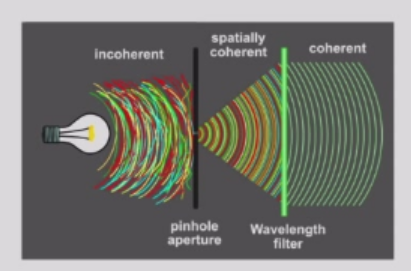

- 实际上，光通常既不是完全偏振的，也不是完全非偏振的。更多情况下，电场矢量的变化方式既非完全规则，也非完全随机，这种光学扰动是部分偏振。描述这种行为的一种有用方法是，将其视为特定分量的自然光和偏振光叠加的结果。
## 偏振光的产生
### 偏振片
- 非偏振的可见光可以通过偏振片转变为偏振光。当光穿过偏振片时，平行于偏振方向的电场分量得以通过（透射）；垂直于该方向的分量则被吸收。

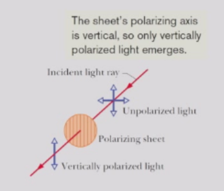

- 非偏振光的电场振荡可以分解为两个强度相等的分量。因此，从偏振片出射的偏振光强度 $I$ 是原始光强度 $I_0$ 的一半，  
  $$
  I = I_0/2
  $$
- 对于偏振光，只有平行于偏振片透光方向的分量  
  $$
  (E_y = E \cos \theta) 
  $$
  能够透过。因此，出射波的强度为  
  $$
  I = I_0 \cos^2 \theta
  $$

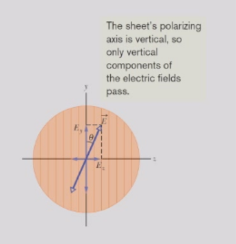

### 反射
偏振光最常见的来源之一是介质表面的反射过程。

入射光的电场可以被分解为两个振幅相等的分量：一个垂直于入射面，另一个平行于入射面。通常情况下，反射光是部分偏振的。

当光以特定入射角（称为**布鲁斯特角** $\theta_B$）入射时，反射光将完全偏振。

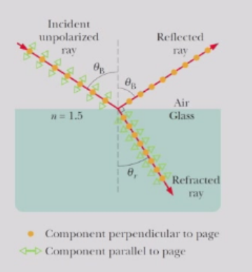
实验发现，在入射角为$\theta_B$ 时，反射光线与折射光线**互相垂直**：

$$
\theta_B + \theta_r = 90^\circ
$$
例如，当入射光束在空气中（$n_i = 1$）而透射介质为玻璃（$n_r = 1.5$）时，布鲁斯特角约为 $56^\circ$。

根据斯涅尔定律

$$
 n_i \sin \theta_B = n_r \sin \theta_r
 $$

可得
$$ 
n_i \sin \theta_B = n_r \sin \theta_r = n_r \sin (90^\circ - \theta_B) = n_r \cos \theta_B
$$
即
$$
\theta_B = \tan^{-1} \frac{n_r}{n_i}
$$ 

如果入射光和反射光均在空气中传播，可近似取  $n_i = 1$ ，因此
$$ 
n_r = \tan \theta_B
$$

以上两种方法都只能产生线偏振光，那么如何产生圆偏振光呢？

## 光的双折射现象
一束光线进入方解石晶体后，分裂成两束光线，它们沿不同方向折射，这种现象称为双折射。

光线进入晶体后，分成两束，其中一束遵守折射定律，称为寻常光线（o光），另一束不遵守折射定律，称为异常光线（e光）。

晶体内存在一个方向，光沿该方向传播时，不发生双折射现象，该方向为晶体光轴。

以方解石晶体为例，方解石有两个顶点$A,D$，其棱边的夹角都是$102^\circ$，从$A$或$D$引出一条直线与晶体各棱边等角，此直线便是光轴，与光轴平行的直线也是光轴。

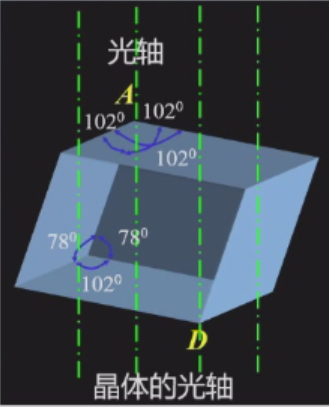

主平面：光线与光轴组成的平面。o光偏振垂直于主平面，e光偏振在主平面内；当光轴在入射面内时，o光和e光的主平面重合。

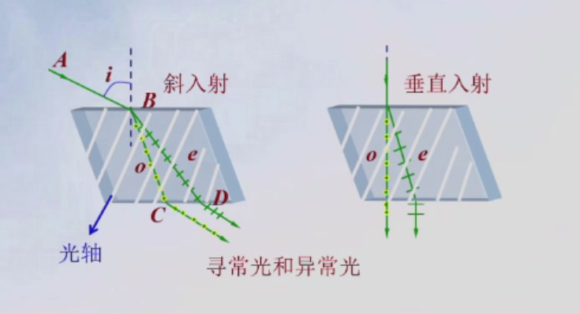

寻常光线在晶体中传播速度各项相同，故而波阵面为球面；而异常光线在晶体中传播速度不同，垂直于光轴的速率最大或最小，波阵面为椭球面；两光束沿光轴传播速度相同。垂直于光轴的$v_e<v_o$为正晶体（石英）；$v_e>v_o$为负晶体（方解石）。

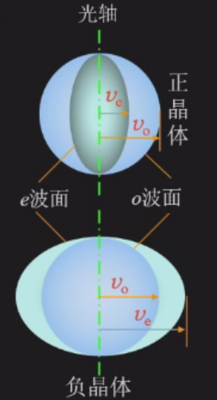

应用惠更斯原理，对单轴晶体的几种情况，可确定o光和e光的传播方向。

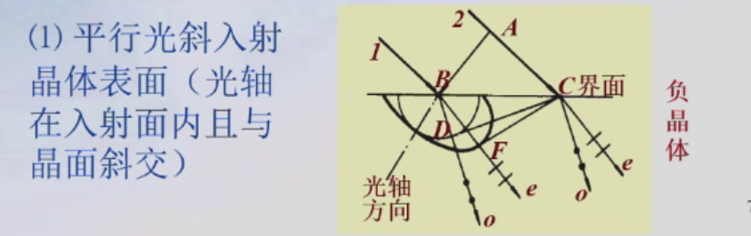

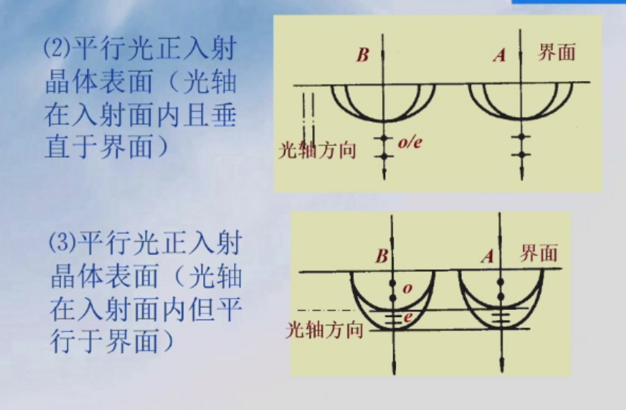

其中第三种情况可以把线偏振光转化成圆偏振光（椭圆偏振光）。
### 波晶片
波晶片是双折射晶体制成的厚度均匀的平板，光轴与平板平行。 $o$ 光 $e$ 光在平板内传播时，由于折射率不同（光速不同），将产生光程差：

晶片厚度为 $d$，则光程差：
$$
\delta = |n_o - n_e|d
$$
相应的位相差为：
$$
\Delta \varphi = \frac{2\pi}{\lambda} \delta = \frac{2\pi}{\lambda} |n_o - n_e|d
$$
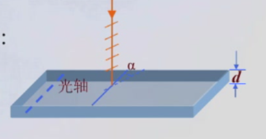

波晶片有两种类型:
- 四分之一波晶片：$o/e$光程差为$\lambda/4$：
  $$
  d_{1/4}=\frac{\lambda}{4|n_o-n_e|} \quad |\Delta \varphi|=\pi/2
  $$
- 半波晶片：$o/e$光程差为$\lambda/2$：
  $$
  d_{1/2}=\frac{\lambda}{2|n_o-n_e|} \quad |\Delta \varphi|=\pi
  $$
### 椭圆偏振光
一线偏振光垂直入射波晶片后将分为偏振方向互相垂直的o光和e光，彼此有恒定位相差。两光的合振动矢量，其端点轨迹一般为椭圆，叫椭圆偏振光。
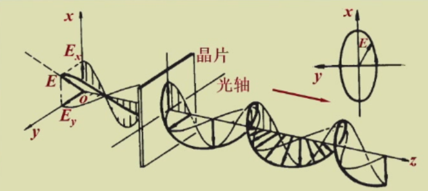

椭圆偏振光产生装置：
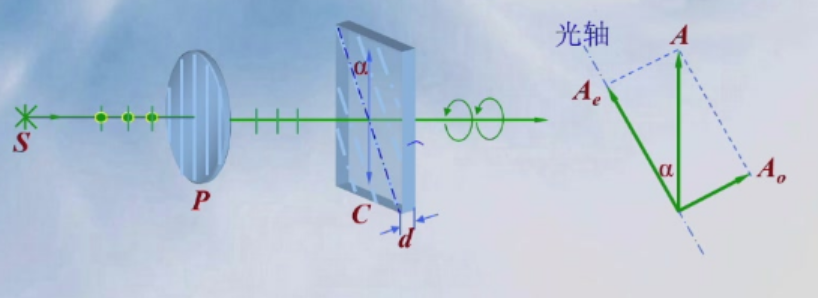

线偏振光经波晶片后产生偏振正交的oe两光。振幅分别为$A_o=A\sin\alpha$和$A_e=A\cos\alpha$，两光的相位差为$\Delta\varphi=\frac{2\pi}{\lambda}(n_o-n_e)d$。

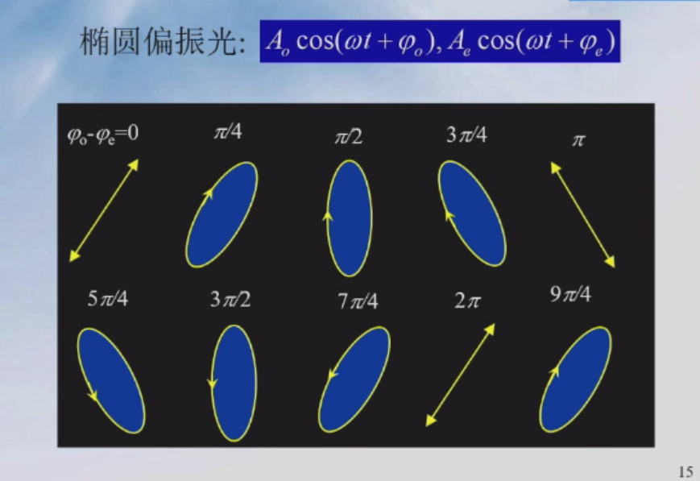

### 人为双折射*
一些非晶体物质（如塑料）在机械应力的作用下会变为各向异性物质，出现双折射现象，称为光弹性效应。

非晶体的受力方向相当于光轴方向，在一定的应力范围内，有：

$$
n_e-n_o = kp \quad p=F/S
$$

## 旋光效应*
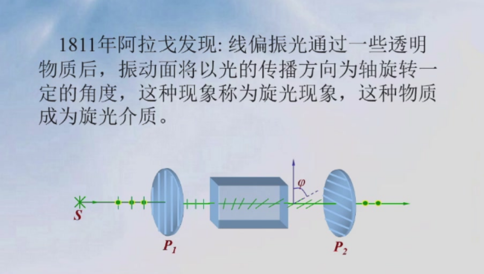
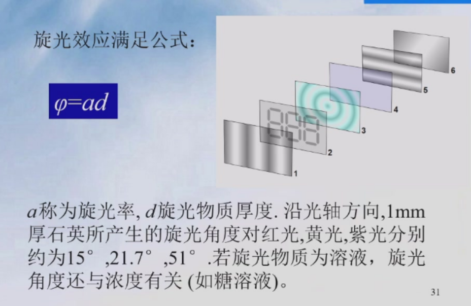
