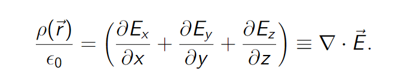
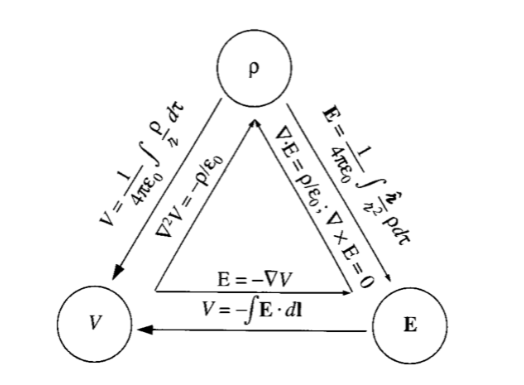
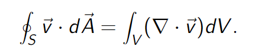
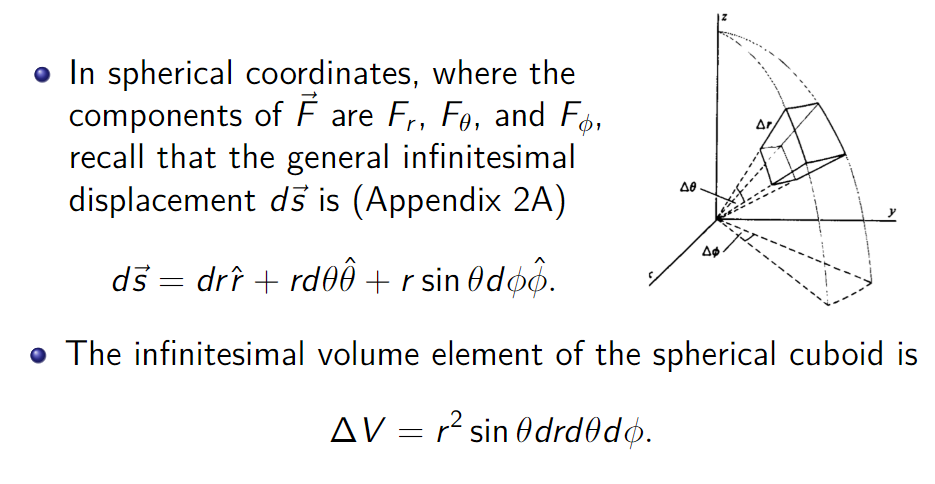
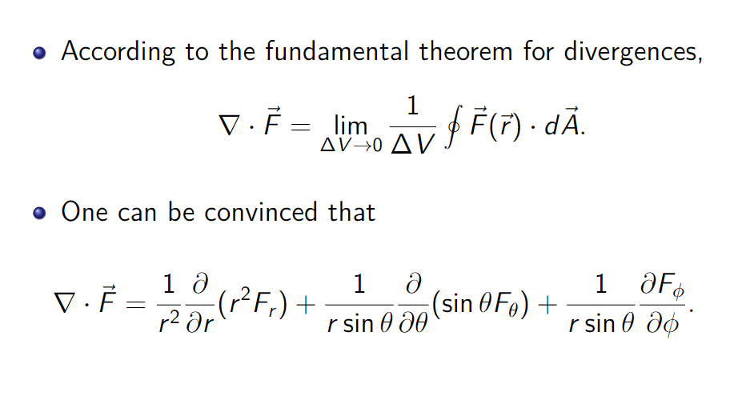

# 电势
## 电势能
- 静电场是保守力场，因此存在相应的电势能。
> 保守场：当一个场的旋度为0时，这个场为保守场。对于静电场：$\nabla \times E=0$。
- 将测试电荷从无限远处移至点P，电场力对测试电荷做的功为W，则其在P处的电势能定义为：$U = -W$
- 电场对电荷做的总功为：$W =q\cdot \int_i^f \vec{E} \cdot d\vec{s}$
- 电势能的变化为: $\Delta U = U_f - U_i = - W$
- 如果带电粒子在电场中运动（仅受电场力作用），则有能量守恒方程：$U_i+K_i = U_f+K_f$
## 电势
- 电势通过电场力做的功和由此产生的势能来定义：$v = \frac{-W}{q} =\frac{U}{q}$
- 由前面对电势能的讨论：$V_f - V_i = -\frac{W}{q}=-\int_i^f \vec{E} \cdot d\vec{s}$
- 我们令$V_i=0$，则有：$V = -\int_0^f \vec{E} \cdot d\vec{s}$
- 对于点电荷，电势$V = \frac{q}{4\pi\epsilon_0} \cdot \frac{1}{r}$，其中r为电荷到测试点的距离。
- **电势与电场强度的关系：**$\vec{E} = -\nabla V$
### 等势面
- 具有相同电势的相邻点构成等势面。
- 当带点粒子在等势面的两点间移动时，电场对粒子所做净功为0
- 等势面始终于电场线垂直，也与电场强度E垂直。
## 高斯定理的微分形式
- 由散度的基本定理，我们可以得到高斯定理的微分形式：

## 泊松方程
- 由高斯定理的微分形式和电势与电场强度的关系，我们可以得到泊松方程：

$$
\nabla^2 V = -\frac{\rho}{\epsilon_0}$$
## 电场/电势/电荷密度的转化

## 数学补充
- 梯度： $\nabla \equiv \hat{x}\frac{\partial }{\partial x}+\hat{y}\frac{\partial }{\partial y}+\hat{z}\frac{\partial }{\partial z}$,几何上，梯度指向函数值的最大增大方向。
- 旋度: $\nabla \times \vec{v} = \hat{x}(\frac{\partial v_y}{\partial z}-\frac{\partial v_z}{\partial y})+\hat{y}(\frac{\partial v_z}{\partial x}-\frac{\partial v_x}{\partial z})+\hat{z}(\frac{\partial v_x}{\partial y}-\frac{\partial v_y}{\partial x})$
- 对于一个梯度场，其旋度为0，即$\nabla \times \nabla \phi=0$。
- 散度：$\nabla \cdot \vec{v} = \frac{\partial v_x}{\partial x}+\frac{\partial v_y}{\partial y}+\frac{\partial v_z}{\partial z}$
- 散度基本定理：

- 根据散度的基本定理，我们可以求球坐标系中的散度表达：

