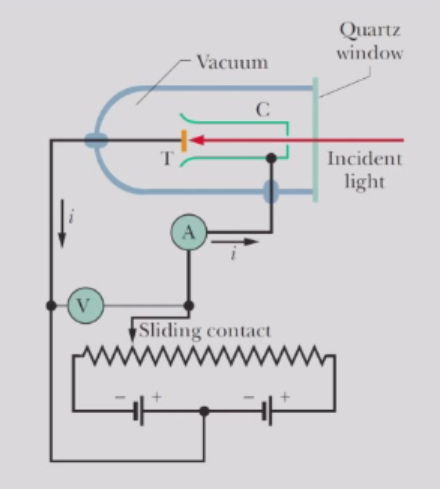
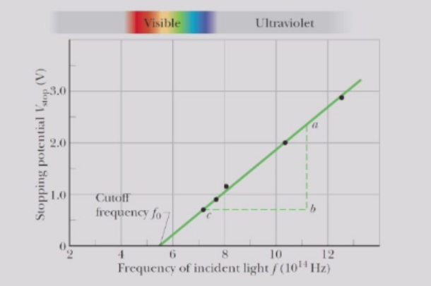
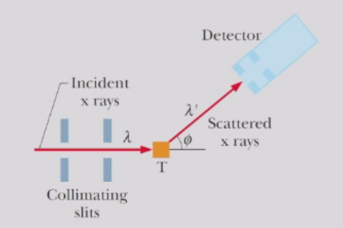
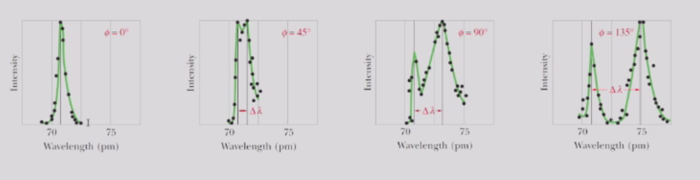
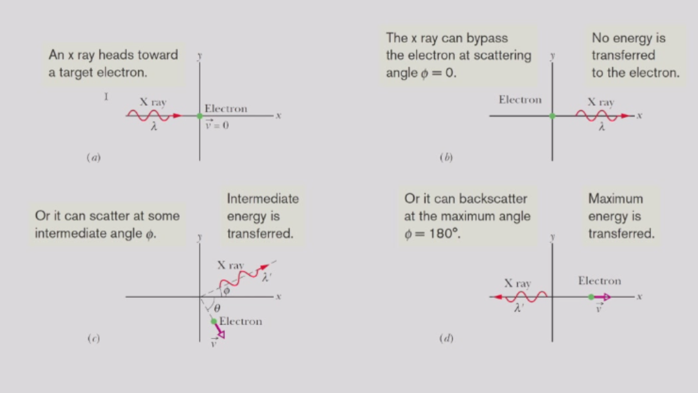
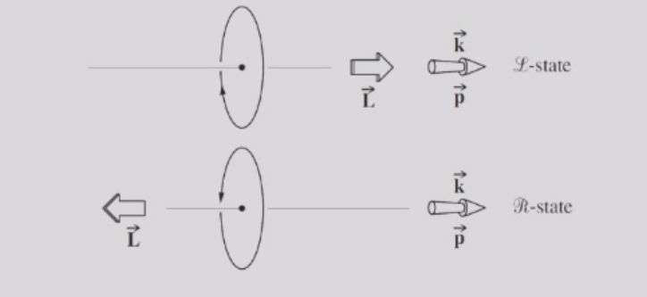

# 光的量子性
## 光电效应
- 频率为 $f$ 的光照射到靶 $T$ 上，并从靶中激发出电子。
- 在靶 $T$ 和收集杯 $C$ 之间维持一个电位差 $V$，用以收集这些被称为光电子的电子。
- 该收集过程产生光电流 $i$，由仪表 $A$ 测量。

- 测量表明，对给定频率的光，$K_{max}$不依赖光源的强度。
- 截止频率：实验表明，当入射光的频率低于某个值$f_c$时，无论入射光强度多大，光电效应都不会发生。

- 以上这两种现象都是传统物理学无法解释的。

## 量子化的光
爱因斯坦提出，电磁辐射（或简称为光）是量子化的，以基本单位（量子）存在，我们现在称之为光子。  
根据他的理论，一个频率为 f 的光波的量子具有能量
$$
E = hf = \hbar \omega,
$$

其中  $h = 2\pi\hbar = 6.63 \times 10^{-34} J\cdot s$ 是普朗克常数，而  $\omega$ 是角频率。

频率为 $f$ 的光波的总能量必须是 $hf$ 的整数倍，其最小能量为$hf$，即单个光子的能量。

## 光电效应的量子化解释
- 靶材内的电子受到电力的束缚。电子要从靶材中逸出，必须获得一个最小能量 $W$ ，其中 $W$是靶材的一种特性，称为其功函数。
- 入射光能够传递给靶材中电子的能量是一个单个光子的能量 $hf$。
- 根据能量守恒，电子获得的动能 $K$ 满足  
$$
hf = K + W
$$
- 在最有利的情况下，电子可以穿过表面逸出，且在此过程中不损失任何动能，即 $K_{\text{max}} = hf - W$。
- 增加光强会增加光中的光子数量，而不是单个光子的能量，因此传递给电子动能的那部分能量仍然不变。
- 如果光子传递给电子的能量 $hf$ 超过材料的功函数（即 $h f > W$），电子就能从靶材中逸出。如果传递的能量不超过功函数（即$h f < W$），电子就无法逸出。
- 以上两种解释完美阐释了光电效应的一些现象。

## 量子化的光的性质
### 光子的动量
由于相对论理论$E^2 - c^2 p^2 = m_0^2c^4 =0$，光子的动量可以用以下方式表示：
$$
p = \frac{hf}{c}=\frac{h}{\lambda}= \hbar k
$$
#### 康普顿散射
- 当光子和物质相互作用时，能量和动量发生转移，就好像光子和物质之间发生了经典意义上的碰撞。
- 康普顿为了验证这一现象测量了从碳靶散射到不同方向的X射线束的波长和强度。

- 康普顿发现，尽管入射X射线束中只有单一波长（$\lambda = 71.1 pm$），但散射后的X射线却包含一系列波长，并出现两个明显的强度峰。
    - 一个峰集中在入射波长 $\lambda$ 附近。
    - 另一个峰集中在波长 $\lambda'$ 附近，该波长比 $\lambda $长出一个量 $\Delta\lambda$，即康普顿位移。
    - 康普顿位移的值随探测到的散射X射线的角度而变化，角度越大，位移越大。

- 在经典物理学中，碳靶中的电子在正弦振荡的电磁波中发生受迫振荡。因此，电子应以相同的频率发出散射波。
- 运用量子物理与相对论，能量和动量守恒可表示为：

  能量守恒：
  $$
  \frac{hc}{\lambda} + mc^2 = \frac{hc}{\lambda'} + \gamma mc^2
  $$

  $x$ 方向动量守恒：
  $$
  \frac{h}{\lambda} = \frac{h}{\lambda'} \cos \phi + \gamma mv \cos \theta
  $$

  $y$ 方向动量守恒：
  $$
  0 = \frac{h}{\lambda'} \sin \phi - \gamma mv \sin \theta
  $$

- 为了求解 $\Delta \lambda \equiv \lambda' - \lambda$，我们将方程重排为：
$$
\frac{h}{\lambda} - \frac{h}{\lambda'} + mc = \gamma mc,
$$
$$
\frac{h}{\lambda} - \frac{h}{\lambda'} \cos \phi = \gamma mv \cos \theta,
$$
$$
\frac{h}{\lambda'} \sin \phi = \gamma mv \sin \theta.
$$

- 将第一个方程平方，然后减去后两个方程的平方，经过一些代数运算后，我们得到：

$$
\Delta \lambda = \frac{h}{mc}(1 - \cos \phi).
$$
- 量 \( h/mc \) 是一个常数，称为康普顿波长。其值取决于$X$ 射线所散射的粒子的质量 $m$ 。
  - 一个粒子的康普顿波长对应于一个光子的波长，该光子的能量等于该粒子的静止质量能量。

- 严格来说，粒子可以是束缚较松的电子，也可以是碳原子（其电子被紧紧束缚）。
  - 对于电子，康普顿波长为：
    $$
    \frac{h}{mc} = \frac{hc}{mc^2} = \frac{12400 \, \text{eV} \cdot \text{Å}}{511,000 \, \text{eV}} = 2.426 \, \text{pm}
    $$

- 对于碳原子，其康普顿波长大约比电子小：
    $$
    12 \times m_u/m_e \approx 12 \times 1836 \approx 22,000 \, \text{倍}
    $$
- 因此可以忽略不计。所以，在任何角度下，散射谱中都会在入射波长处出现一个峰
### 光子的角动量
- 根据量子力学的描述，光子也具有一个内在的自旋角动量，其值为$-\hbar$或$+\hbar$，其中符号分别表示右旋或左旋。
- 每当一个带电粒子发射或吸收电磁辐射时，除了能量和线性动量的变化外，其角动量也会发生 $\pm\hbar$ 的变化。
- 单色电磁波传递给靶的能量，可以被看作是以一束相同光子的形式进行传输的。
- 纯左旋（右旋）圆偏振平面波会将角动量传递给靶，就好像光束中所有组成光子的自旋都沿着（或逆着）传播方向排列一样。

- 光向右传播，圆箭头表示在$E$的固定位置处的旋转方向（而非在固定时间t处的旋转方向）。L态：左旋圆偏振，右旋光子（与圆箭头表示旋转方向相反），角动量方向沿传播方向。R态：右旋圆偏振，左旋光子，角动量方向沿传播反方向。
- 线偏振光与物质相互作用时，可被视为在任一瞬时由等量的右旋光子与左旋光子组成。
- 但这里有一个微妙之处。严格来说，我们并不能说该光束实际上是由数量完全相等的、定义明确的右旋和左旋光子组成的；所有的光子都是全同的。
- 更准确地说，每个单独的光子都以相等的概率处于两种自旋态中的任一种。

$$
|H\rangle = \frac{|R\rangle + |L\rangle}{\sqrt{2}} = \frac{1}{\sqrt{2}} \left[ \frac{1}{\sqrt{2}} \begin{pmatrix} 1 \\ -i \end{pmatrix} + \frac{1}{\sqrt{2}} \begin{pmatrix} 1 \\ i \end{pmatrix} \right]
$$
- 这种概率性解释同样适用于对角偏振光：
$$
|D\rangle = \frac{1}{\sqrt{2}} \begin{pmatrix} 1 \\ 1 \end{pmatrix} = \frac{|H\rangle + |V\rangle}{\sqrt{2}}
$$
$$
|A\rangle = \frac{1}{\sqrt{2}} \begin{pmatrix} 1 \\ -1 \end{pmatrix} = \frac{|H\rangle - |V\rangle}{\sqrt{2}}
$$

- 或者反过来表示：

$$
|H\rangle = \frac{|D\rangle + |A\rangle}{\sqrt{2}}, \quad |V\rangle = \frac{|D\rangle - |A\rangle}{\sqrt{2}}.
$$

