# 电磁辐射的量子性
## 热辐射
### 热辐射的基本概念
热辐射：物体内带电粒子由于热运动，在任何温度下都会辐射电磁波，辐射的强度、波长与温度有关。这种与温度有关的辐射称为热辐射。
平衡热辐射：物体向外辐射能量等于从外界吸收的能量，则物体达到热平衡，用温度$T$描述。
### 单色辐射出射度
单位时间内，物体从单位表面积上发射的波长在$\lambda$到$\lambda+\Delta\lambda$范围内的辐射能$dW_{\lambda}$，
$$
M_{\lambda}(T)=\frac{dW_{\lambda}}{d \lambda}
$$
$M_{\lambda}(T)$称为单色辐射出射度，与温度$T$，波长$\lambda$有关。
### 吸收系数，反射系数
单色吸收系数$a(\lambda,T)$：在温度$T$，物体吸收波长在$\lambda$到$\lambda+d\lambda$范围的辐射能与相应波长的投射于物体的总辐射能的比值。

单色反射系数$r(\lambda,T)$：把物反射波长在$\lambda$到$\lambda+d\lambda$范围的辐射能与相应波长的投射于物体的总辐射能的比值。

对不透明物体:
$$
a(\lambda,T)+r(\lambda,T)=1
$$
一般物体$a<1$，若$a=1$称为绝对黑体，绝对黑体是理想化的，它能在任何温度下，将任何波长的辐射能全部吸收。
## 基尔霍夫定律
物体辐射本领和吸收本领的比值，和物体的性质无关，对于任何物体，这个比值是波长和温度的普适函数。
$$
\frac{M_{1\lambda}(T)}{a_1(\lambda,T)}=\frac{M_{2\lambda}(T)}{a_2(\lambda,T)}=\frac{M_{3\lambda}(T)}{a_3(\lambda,T)}=\cdots=\frac{M_{n\lambda}(T)}{a_n(\lambda,T)}
$$
对绝对黑体辐射:$a_B(\lambda,T)=1$
所以:
$$
\frac{M_\lambda(T)}{a(\lambda,T)}=M_{B\lambda}(T)
$$
## 绝对黑体的热辐射定律
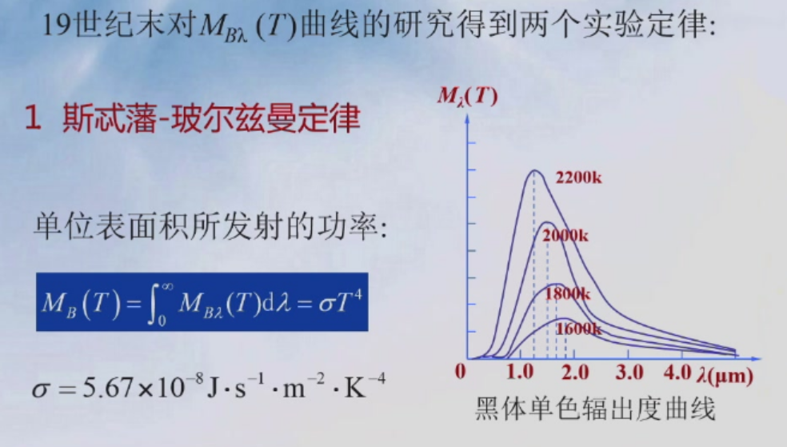
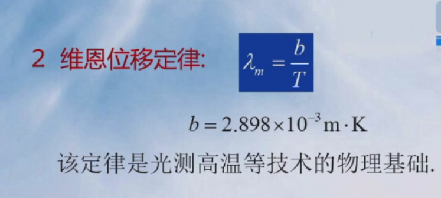
## 普朗克能量子假设
### 能量子假设的提出
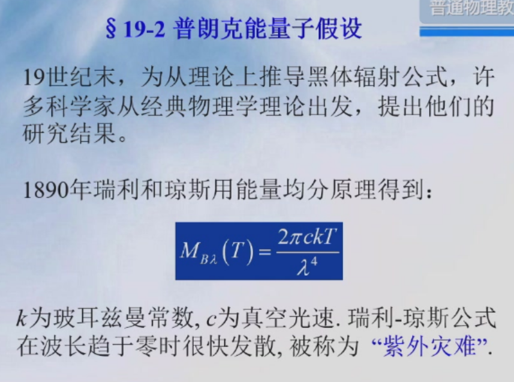
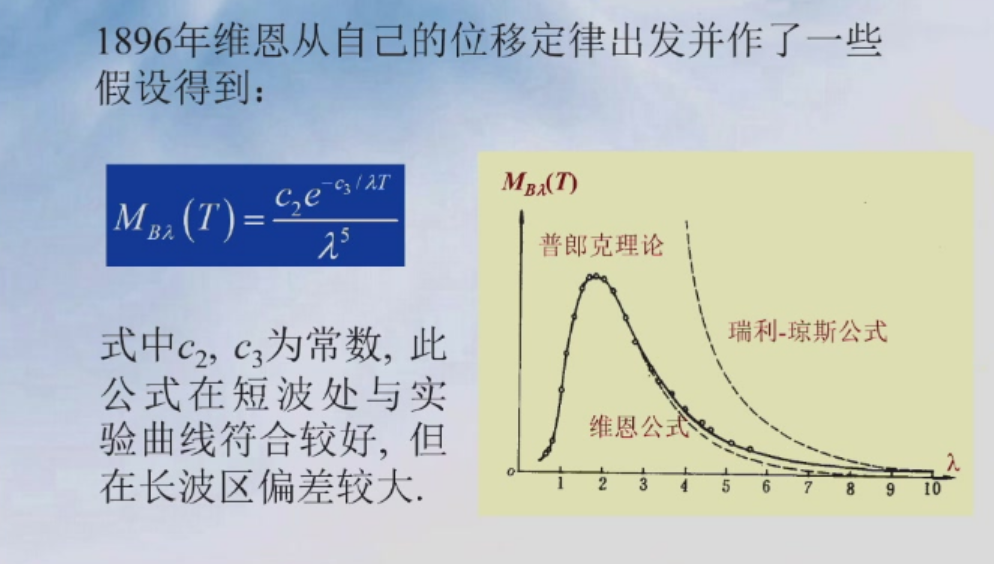
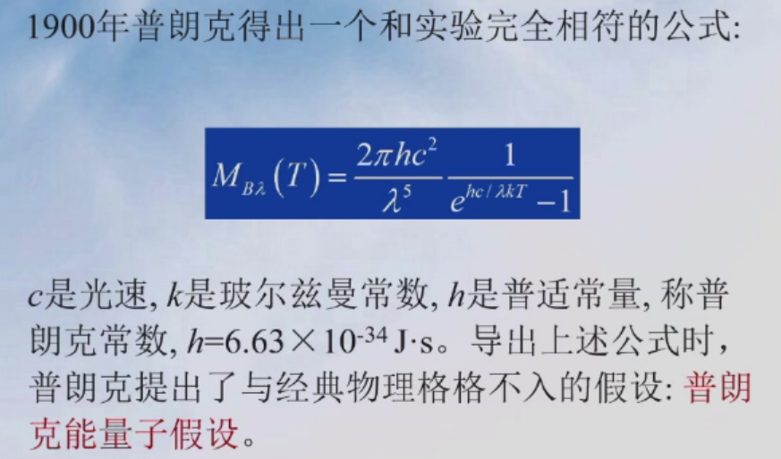
### 能量子假设
- 辐射体由带电谐振子组成，它们振动时向外辐射电磁波并与周围电磁场交换能量
- 谐振子的能量只能处于某些特殊状态，即它们的能量是某一最小能量的整数倍：$0, \varepsilon, 2\varepsilon, 3\varepsilon,⋯,n\varepsilon$
- $\varepsilon$称能量子，与振子频率$v$成正比$\varepsilon=hv$

### 普朗克公式的推导
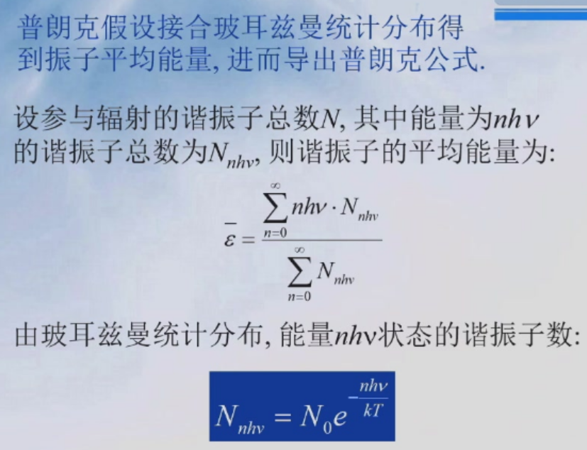
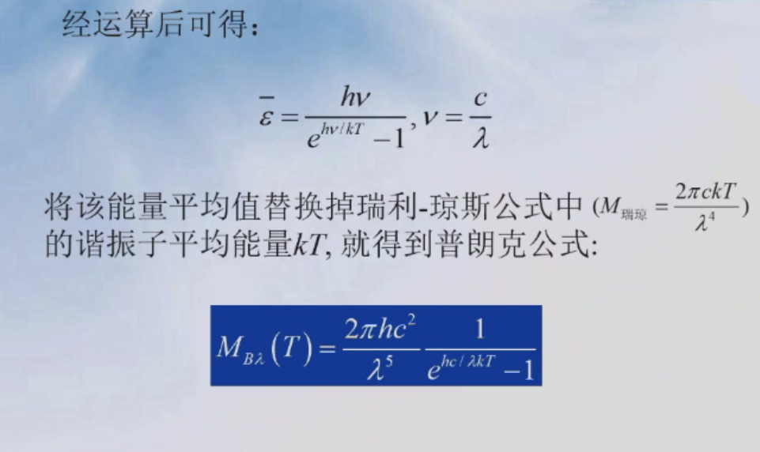
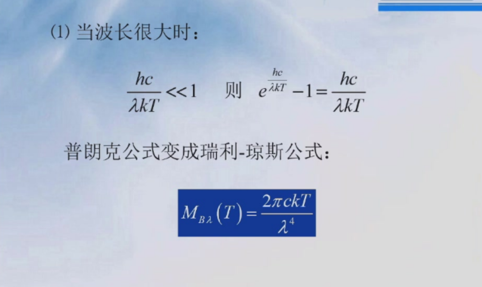
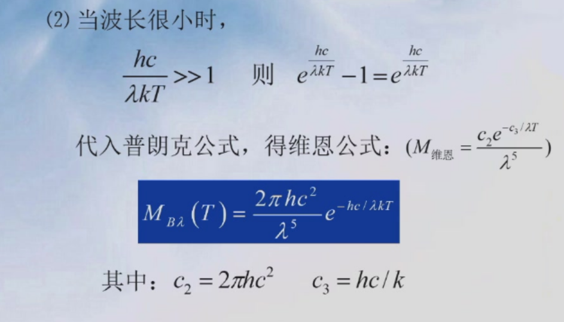
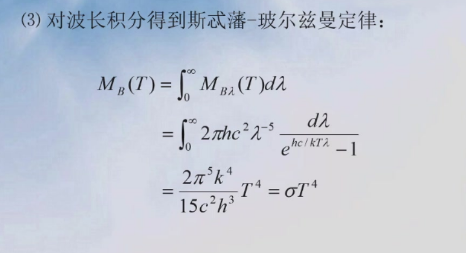
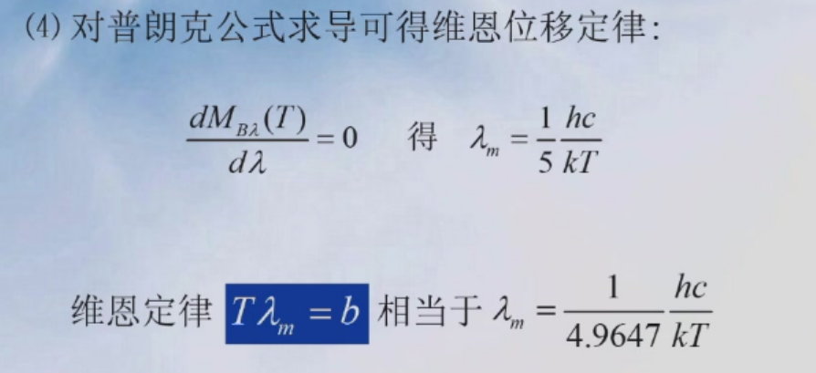
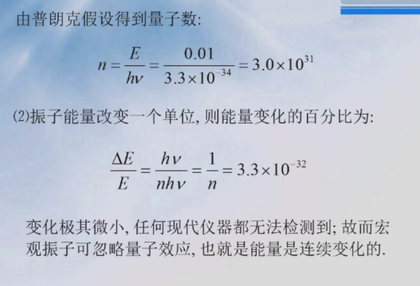
