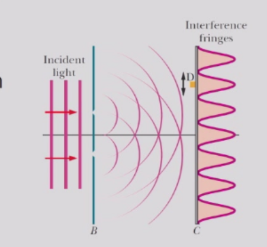
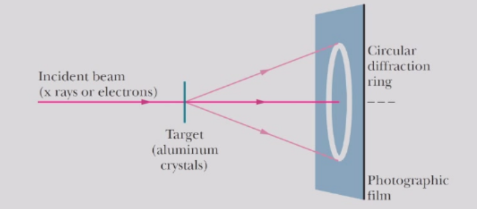
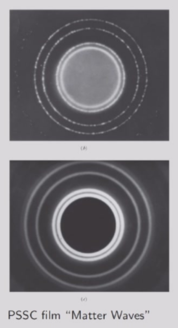
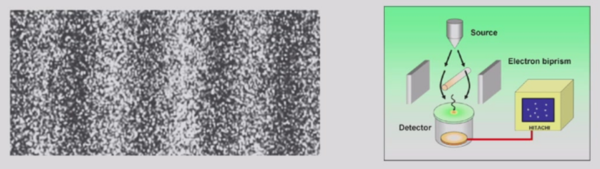
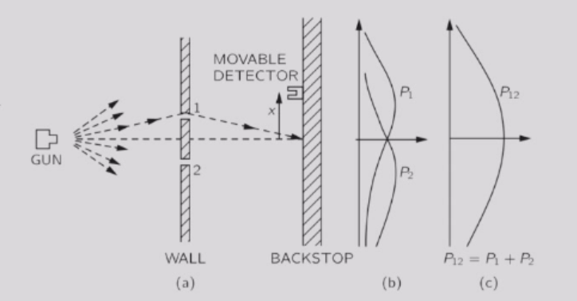
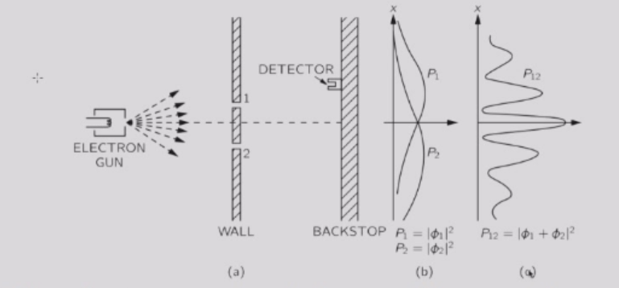
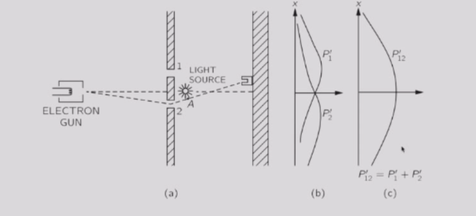
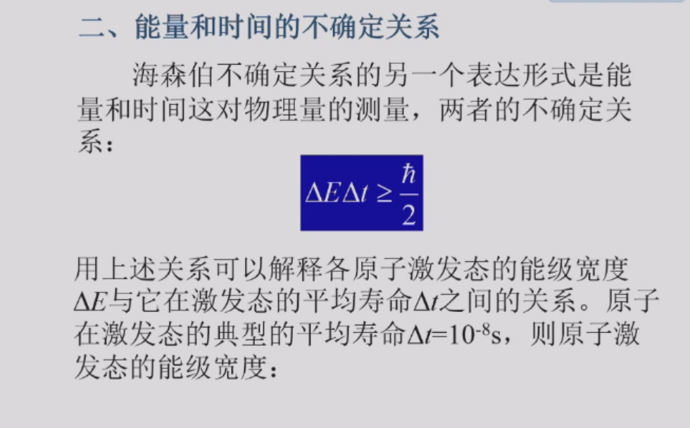
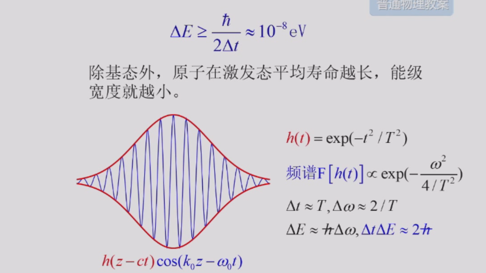

# 物质波

## 光的波粒二象性
- 双缝实验告诉我们：
    - 光在光源处以光子的形式产生，
    - 在探测器处以光子的形式被吸收，
    - 而在光源与探测器之间则以概率波的形式传播。
- 在空间中某点 $P$ 处探测到光子的概率密度取决于该点的辐照度 $I \propto E_0^2$。因此，$P$ 点的净 $E_0$可解释为概率幅（概率幅是一个其平方给出概率密度的量）。

## 德布罗意假说
德布罗意假说认为：一个动量大小为$p$的粒子有波长$\lambda$。与光子的波长类似，我们定义:
$$
\lambda = \frac{h}{p}
$$
这被称为运动粒子的德布罗意波长。

## 电子衍射
电子衍射可以研究固体表面的原子特征。

一束X射线（上图）或电子束（下图）被投射到由微小铝晶体制成的靶材上。X射线具有特定波长 $\lambda$。若电子被赋予足够的能量，使其德布罗意波长与X射线的波长 $\lambda$ 相同，则两者产生的环形干涉图案完全一致——这表明X射线和电子都具有波动性。

## 电子干涉
在最近的实验中，当电子一个个通过双缝装置发射，撞击观察屏。观察屏上形成了干涉图样。

在牛顿物理学中，粒子仅能感知它通过的狭缝。因此，当两个狭缝都开启时，$P_{12}=P_1+P_2$

在实际实验中，电子以“团块”的形式到达狭缝，这些“团块”到达的概率分布却类似于波的强度分布。

正是在这个意义上，电子有时表现得像粒子，有时表现得像波。

我们的解决思路来自光学，其中光或光子也会发生干涉。在光学中，我们需要叠加的是振幅 $A$ ，而非强度 $|A|^2$。

类似地，这里的实验观测迫使我们引入**概率幅** $\psi$，它是一个复数（扩展为复波函数，以同时描述粒子性和波动性）。于是，在理想实验中，一个事件发生的概率由 $|\psi|^2 = \psi^*\psi$给出。

当一个事件可以通过多种不同方式发生时，该事件的概率幅等于每种方式各自考虑时的概率幅之和：
$$
\psi = \psi_1 + \psi_2 + \cdots
$$
此时，该事件发生的概率为：
$$
P = |\psi|^2 = |\psi_1|^2 + |\psi_2|^2 + 2\Re(\psi_1^*\psi_2) + \cdots
$$

其中，干涉项$2\Re(\psi_1^*\psi_2)$  导致了实验中观测到的概率 $P$ 的快速振荡。

神奇的是，如果我们放置一个探测器监测电子到底经过哪个狭缝，那么电子干涉实验的结果就像牛顿物理学中的粒子干涉实验结果一样。

如果我们观测到电子通过某条狭缝，它就会表现得像穿过了一条特定的缝；而当我们不去观测时，它则表现得好像没有确定的路径（即不通过特定的狭缝）。为什么观测会导致这种差异？

要观测电子并达到与狭缝间距$d$ 相当的分辨率（从而确定它通过了哪条狭缝），就需要使用波长 $\lambda < d$ 光——这仅仅是基本的波动理论。但是，光由光子组成，每个光子的动量 $p > h/d$。  

因此，测量电子的位置这一行为会扰动它的动量。在观测过程中传递给电子的动量大小是不确定的。 

这正是**海森堡不确定性原理**的表现，该原理指出，你无法同时任意精确地测量一个粒子的动量和坐标。

尽管我们在此处通过一个具体的测量方案来解释海森堡不确定性原理的表现，但海森堡不确定性原理并非由测量引起的效应，而是物质**内在波动性**的必然结果。也就是说，即使不进行任何测量，量子客体也遵循海森堡不确定性原理的制约。

## 海森堡不确定性原理

量子物理的概率特性对测量粒子的位置和动量提出了重要的限制。也就是说，不可能同时无限精确地测量一个粒子的位置$\vec{r}$和动量$\vec{p}$。这些量的分量的不确定度满足以下关系：
$$
\Delta x \cdot \Delta p_x \geq \hbar
$$
$$
\Delta y \cdot \Delta p_y \geq \hbar
$$
$$
\Delta z \cdot \Delta p_z \geq \hbar
$$

这是由于电子和其他粒子是物质波，并且对其位置和动量的重复测量涉及概率性，而非确定性。

在此类测量的统计中，我们可以将$\Delta x$和$\Delta p_x$等视为测量值的散布（实际上是标准偏差）。

我们难道不能先非常精确地测量 $p_x$，然后紧接着在电子恰好出现的任何地方非常精确地测量 $x$吗？这难道不就意味着我们同时非常精确地测量了$p_x$和$x$ 吗？

事实证明这是错的，问题在于：尽管第一次测量可以给出$p_x$的精确值，但第二次测量必然会改变这个值。
  
考虑一个具有特定 $k$ 值的电子，根据德布罗意关系，这意味着其动量是确定的：$p_x = \hbar k$。因此，$\Delta p_x = 0$。根据海森堡不确定性原理，这意味着$\Delta x \to \infty$

此时电子的波函数是什么形式？直观的猜测可能是$\sin kx$或$\cos kx$，但它们的空间变化特征与我们的直觉并不一致。

要用波来描述电子，我们需要一个函数，称为波函数，其波长为  
  $$
  \lambda = 2\pi/k
  $$
但其平方不应在$x$方向上显示任何变化，即  
  $$
  \psi(x,t) = e^{i(kx-\omega t)}
  $$

如果我们现在测量 $p_x$ ，会得到  
  $$
  p_x = \hbar k
  $$
 没有不确定性，但粒子以相同概率存在于任何位置，因此$\Delta x = \infty$。海森堡不确定性原理并未被违反。

如果我们此时测量$x$，我们将在某个位置 $x_0$ 找到电子。一旦我们找到它，它就不可能在其他地方。因此波函数会突然坍缩为  
$$
   \psi(x) = \delta(x - x_0)
$$
那么，动量仍然是 $p_x = \hbar k$ 吗？

对$δ$函数进行傅里叶变换告诉我们  
$$
\overline{\psi}(p) = \mathcal{F}(\psi(x)) = \text{常数}
$$

在这种情况下，$\Delta x = 0$ 但 $\Delta p = \infty$。海森堡不确定性原理也未被违反。
### 能量与时间的不确定性

