# 薛定谔方程和量子隧穿
## 方程推导
我们尝试对质量为$m$ 的自由粒子（用一个波表示）  
    $$
    \psi(x, t) = e^{i(kx - \omega t)}
    $$
写出描述其量子行为的方程。

对于一个自由的一维经典粒子，其能量为  
  $$
  E = \frac{p^2}{2m}
  $$

根据德布罗意的假设，我们得到

$$
p = \frac{h}{\lambda} = \hbar k = -i\hbar \frac{1}{\psi(x,t)} \frac{\partial \psi(x,t)}{\partial x}
$$
$$
p^2 = \hbar^2 k^2 = -\hbar^2 \frac{1}{\psi(x,t)} \frac{\partial^2 \psi(x,t)}{\partial x^2}
$$

类似地，我们得到
$$
E = h\nu = \hbar \omega = i\hbar \frac{1}{\psi(x,t)} \frac{\partial \psi(x,t)}{\partial t}
$$

因此，利用波函数，能量-动量关系可写为

$$
E = \frac{p^2}{2m} \Rightarrow i\hbar \frac{1}{\psi(x,t)} \frac{\partial \psi(x,t)}{\partial t} = -\frac{\hbar^2}{2m} \frac{1}{\psi(x,t)} \frac{\partial^2 \psi(x,t)}{\partial x^2}
$$

当存在势场时，例如谐振子势 $U(x) = ax^2/2$，经典关系修正为

$$
E = \frac{p^2}{2m} + U(x)
$$

则上述方程也可改写，就得到了薛定谔方程。

## 薛定谔方程

薛定谔提出，在空间中运动的单个粒子的波函数 $\psi(x, t)$满足以下方程：

$$
i\hbar \frac{\partial \psi(x, t)}{\partial t} = -\frac{\hbar^2}{2m} \frac{\partial^2 \psi(x, t)}{\partial x^2} + U(x, t)\psi(x, t)
$$

其中 $U(x, t)$是粒子的势能，$m$是粒子的质量。我们可以很容易地将其推广到更高维度。

>注意，薛定谔方程是量子力学的一个假设，并非由经典物理推导而来。

在我们讨论的大多数情况下，势能 $U = U(x)$ 与时间无关。我们可以通过以下试探解来求薛定谔方程的定态解：
$$
\psi(x, t) = \phi(x) e^{-iEt/\hbar}
$$

将上述关于 $\psi(x, t)$ 的试探解代入，我们得到关于 $\phi(x)$ 的方程：

$$
\left[ -\frac{\hbar^2}{2m}\frac{\partial^2}{\partial x^2} + U(x) \right] \phi(x) = E\phi(x)
$$

这个方程被称为**定态薛定谔方程**。通过求解此方程，我们可以在与时间无关的外部势场 $U(x)$下得到定态解$\phi(x)$。

波函数 $\phi(x)$ 满足  
      $$
      \frac{\partial^2 \phi(x)}{\partial x^2} + \frac{2m}{\hbar^2} [E - U(x)] \phi(x) = 0
      $$

在自由空间中，$U(x) = 0$。其通解为  
    $$
    \phi(x) = A e^{ikx} + B e^{-ikx}
    $$  
  其中$A$和 $B$为常数，且 $k = \sqrt{2mE}/\hbar$。

完整的含时波函数为  
$$
\psi(x, t) = Ae^{i(kx - \omega t)} + Be^{-i(kx + \omega t)}
$$
其中 $\omega = E/\hbar$。这两项分别对应于右行波和左行波。

考虑右行波 $\psi(x, t) = Ae^{i(kx - \omega t)}$，其概率密度是均匀的：  
$$
|\psi(x, t)|^2 = \psi^*(x, t)\psi(x, t) = |A|^2
$$

这意味着如果我们进行测量以定位粒子，其位置可能出现在任意 $x$ 值处。

## 薛定谔方程引出的问题
自由量子力学粒子的通解为  
$$
\psi(x) = Ae^{ikx} + Be^{-ikx}, \quad k = \sqrt{2mE}/\hbar
$$

或者，加上标准的时间依赖关系 $e^{-iEt/\hbar}$，  

$$
\psi(x,t) = Ae^{i\left(kx-\frac{\hbar k^2}{2m}t\right)} + Be^{-i\left(kx+\frac{\hbar k^2}{2m}t\right)}
$$

该公式表示一个右行波和一个左行波，其（波前，即相）速度为
$$
v_{\text{ph}} = \frac{\hbar k}{2m} = \sqrt{\frac{E}{2m}}
$$
另一方面，自由粒子的经典速度由下式给出：
$$
v_{cl}=\sqrt{\frac{2E}{m}}=2v_{ph}
$$

则引出问题：**量子力学波函数传递速度仅为它所代表粒子速度的一半**

若要对自由粒子的波函数进行归一化，例如，由 $Ae^{ikx}$所表示的波函数：

$$
\int_{-\infty}^{\infty}|\psi(x)|^2dx = |A|^2 \int_{-\infty}^{\infty}1dx = |A|^2\infty
$$

引出问题 ：**该波函数无法归一化！**

事实上，这个定态（可分离变量）解 $\psi(x) = Ae^{ikx}$并不对应于经典理论中的自由粒子状态。该解描述的是表现为波动性的量子自由粒子，其行为与经典粒子完全不同。

那么，对应于经典自由粒子的、薛定谔方程的**现实解**是什么？

## 波包

在量子力学中，一个局域化的粒子通过这些定态的自由粒子（或平面波）状态的线性叠加来建模。
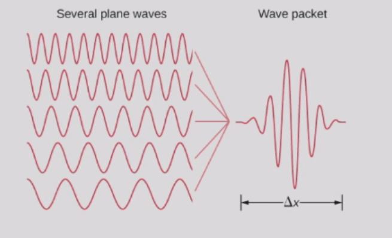

一般来说，我们可以构造一个线性组合（对连续的 $k$ 进行积分）

$$
\Psi(x, t) = \frac{1}{\sqrt{2\pi}} \int_{-\infty}^{\infty} \phi(k) e^{i\left( kx - \frac{\hbar k^2}{2m}t \right)} dk
$$

对于适当的 $\phi(k)$（通常为高斯型），该波函数可以归一化。我们称之为**波包**，它包含一定范围的 $k$值，因此也对应一定范围的能量和速度。
如果以适当的方式叠加更多不同波长或动量的平面波状态（即增加 $\Delta p$），可以使粒子的位置更加局域化（减小 $\Delta x$）。

根据海森堡原理，这些不确定性满足 $\Delta x\Delta p\geq \hbar/2$。

结果表明，波包的群速度，而非定态的相速度，与经典粒子的速度相匹配。
$$
v_{group}=\frac{dw}{dk}=\frac{d}{dk}(\frac{\hbar k^2}{2m})=\frac{\hbar k}{m}=2v_{ph}=v_{cl}
$$
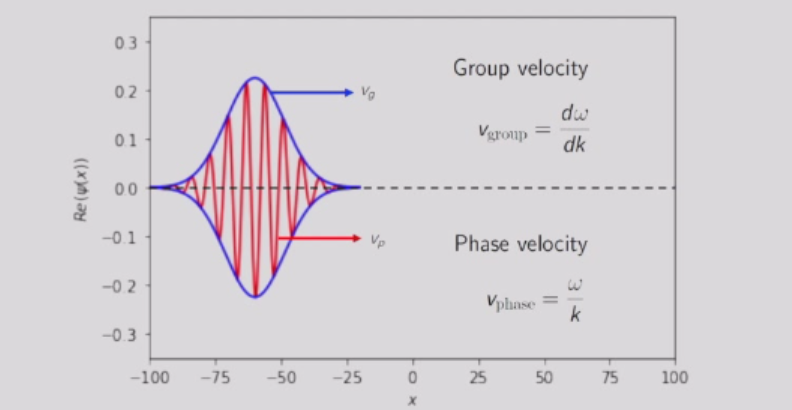

以下是波包的图像表示：
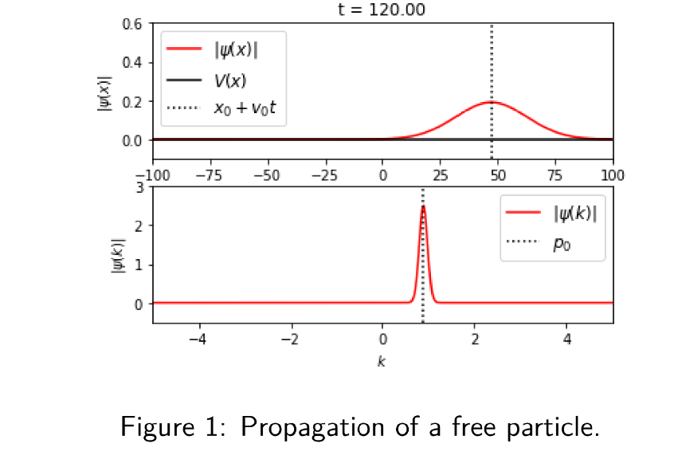

## 负电势阶跃
考虑一束非相对论电子，每个电子具有总能量 $E$ ，沿 $x$ 轴通过一个窄管。它们在 $x = 0$ 处遇到一个高度为 $V_b < 0$ 的负电势阶跃（注意电子的电荷 $q$ 满足 $q < 0$，因此 $qV_b > 0$）。

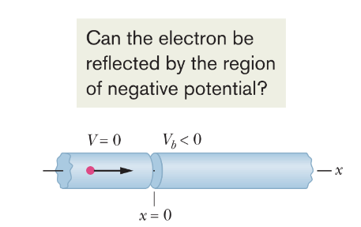

我们考虑  $E > qV_b$  的情形。在经典理论中，电子应全部穿过边界。量子力学会发生什么？

我们分别对两个区域应用薛定谔方程。波函数在 $x = 0$ 处必须彼此一致，包括函数值及其斜率（边界条件）。

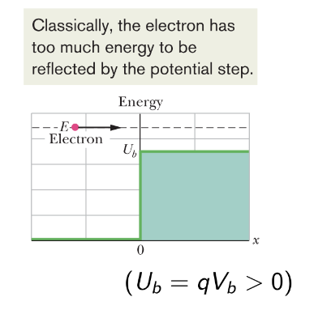

区域 1（ $x < 0$ ）：  
$$
k = \sqrt{2mE}/\hbar
$$
$$
\psi_1 = Ae^{ikx} + Be^{-ikx}
$$

区域 2（$x > 0$）：  
$$
k_b = \sqrt{2m(E - qV_b)}/\hbar
$$
$$
\psi_2 = Ce^{ik_bx} + De^{-ik_bx}
$$

首先我们可以设 $D = 0$，因为在右侧不存在电子源，并且在区域 2 中不会有电子向左运动。
现在考虑 $x = 0$ 处的边界条件：

$$
A + B = C \, (\text{数值匹配})
$$

$$
Ak - Bk = Ck_b \, (\text{斜率匹配})
$$

我们应当能解出 $B/A$ 和$C/A$，但无法确定 $A, B, C$ 的具体值。注意，具体值对我们当前的目的并不重要。  
事实上，为了求出电子从阶跃处反射的概率，我们需要将反射波（ $Be^{-ikx}$ ）的概率密度与入射波（$Ae^{ikx}$）的概率密度联系起来。因此，我们定义一个反射系数 $R$ ：
$$
R = \frac{|B|^2}{|A|^2} = \left| \frac{k - k_b}{k + k_b} \right|^2
$$

从量子力学角度看，电子会从边界反射，但仅以一定的概率发生。

类似地，透射系数（透射概率）为

$$
T = 1 - R = \frac{4k\,\Re(k_b)}{|k + k_b|^2}
$$

我们也可以考虑另一个量

$$
\frac{|C|^2}{|A|^2} = \frac{4k^2}{|k + k_b|^2} = T \frac{k}{\Re(k_b)} = T \frac{k}{k_b} \quad (\text{当 } E > qV_b \text{ 时})
$$

为什么这两个量会相差一个比值$\frac{k}{k_b}$呢？

回想电流密度 $J = nqv$。我们可以得到
$$
T = \frac{|C|^2 k_b}{|A|^2 k} = \frac{|C|^2 q(\hbar k_b/m)}{|A|^2 q(\hbar k/m)} = \frac{J_{\text{透射}}}{J_{\text{入射}}}。
$$
同样可以写出
$$
R = \frac{J_{\text{反射}}}{J_{\text{入射}}}
$$

因此，$T = 1 - R$正是电流守恒的体现  
$$
J_{\text{透射}} = J_{\text{入射}} - J_{\text{反射}}
$$

> 由于在反射过程中，电子的介质不变，电子的速度也保持不变，所以反射系数$R$恰好可以表示为两个波辐的平方的比值。

以下是负电势阶跃的图像表示：

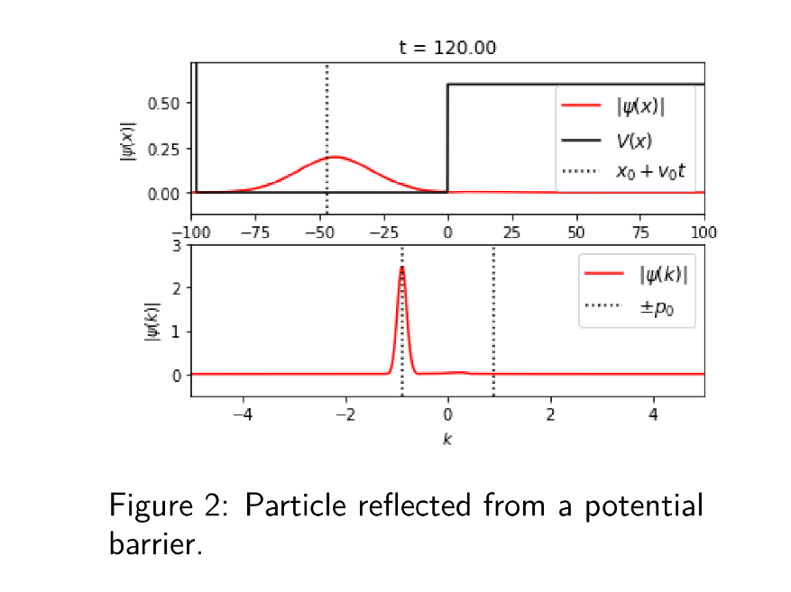

## 量子隧穿

现在考虑一个势垒，这是一个厚度为 $L$ 的区域，其中电势为 $V_b (< 0)$，势垒高度为 $U_b (= qV_b)$。

我们考虑 $E < qV_b$ 的情况。在经典理论中，电子被禁止进入势垒区域，因此会全部被反射。然而，物质波具有一定的概率渗透（或更准确地说，隧穿）通过势垒，并在另一侧出现。我们称这种效应为量子隧穿。

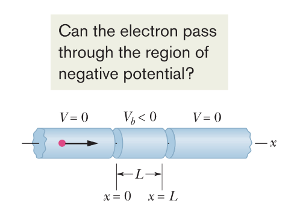

我们关注电子出现在势垒另一侧的概率。因此，我们需要计算透射系数 $T$。一般步骤如下。

1. 将空间分为三个区域，并在每个区域中求解薛定谔方程（3*2-1=5个未知数）
2. 在两个边界处应用边界条件(2*2 = 4个方程)
3. 计算隧穿系数。

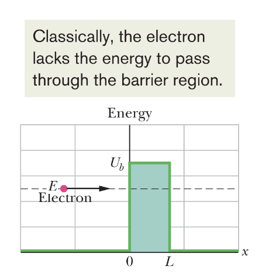

具体求解过程不再赘述。我们考虑一般性的解。

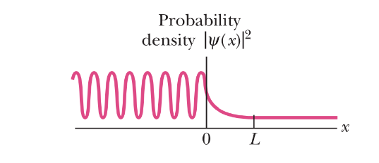

势垒左侧（对应于 $x < 0$）的振荡曲线是入射物质波与反射物质波（其振幅小于入射波）的叠加。产生振荡是因为这两列相向传播的波相互干涉，形成了驻波图样。

在势垒内部（对应于 $0 < x < L$），概率密度随 $x$ 指数衰减。然而，如果 $L$ 很小，在 $x = L$处概率密度并不会完全降为零。

在势垒右侧（对应于 $x > L$），概率密度图描述了一个通过势垒的透射波，其振幅虽低但保持恒定。

我们可以为入射物质波和势垒定义一个透射系数 $T$。透射系数 $T$ 近似为  
$$
T \approx e^{-2kL}
$$
其中  
$$
k = \frac{\sqrt{2m(qV_b - E)}}{\hbar} 
$$
$T$ 的值对 $L$、$m$ 以及 $U_b - E$ 的变化非常敏感。

对于任意的 $U_b (= qV_b)$ 和 $L$，都可以得到精确的结果。

通常，当 $E < U_b$ 时，我们称之为隧穿。在此范围内，如图所示，$T(E)$ 随能量近似呈指数增长。

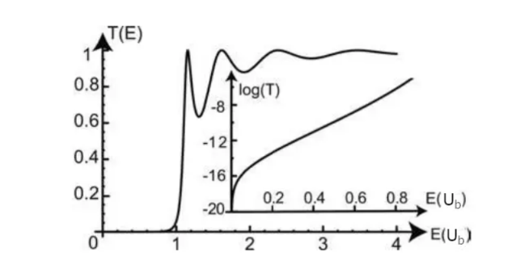

当 $E \gg U_b$ 时，如经典预期一样，$T(E) = 1$ 。

以下是量子隧穿的图像表示：

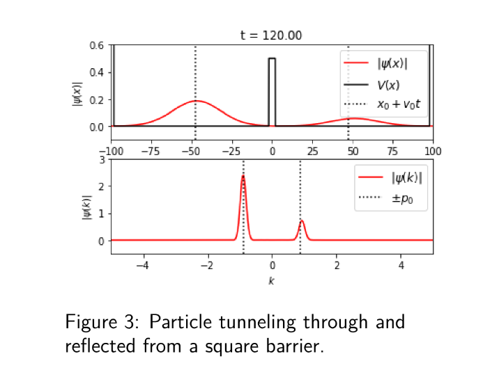

### 量子隧穿的现实应用——扫描隧道显微镜（STM）

光学显微镜所能观察到的细节尺寸受限于其使用的光波长（紫外光约为300 nm）。我们可以利用电子物质波（通过隧穿势垒）来获得原子尺度的图像。

一个安装在石英棒上的细金属探针被放置在待测表面附近。表面与探针之间的空间构成一个势垒。

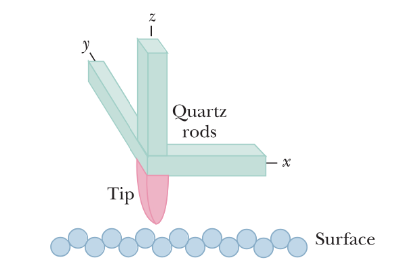

石英具有压电效应。通过在石英上施加电场可以控制探针的位置。探针的水平位置由 $x$ 和 $y$ 方向的电场控制；表面与探针之间的垂直距离由 $z$ 方向的电场控制。

透射系数 $T \approx e^{-2kL}$ 对势垒宽度非常敏感。

隧穿电流对表面与探针之间的距离非常敏感。

在探针扫描表面时，通过调整探针的垂直位置以保持隧穿电流恒定。从而实现原子尺度的成像。
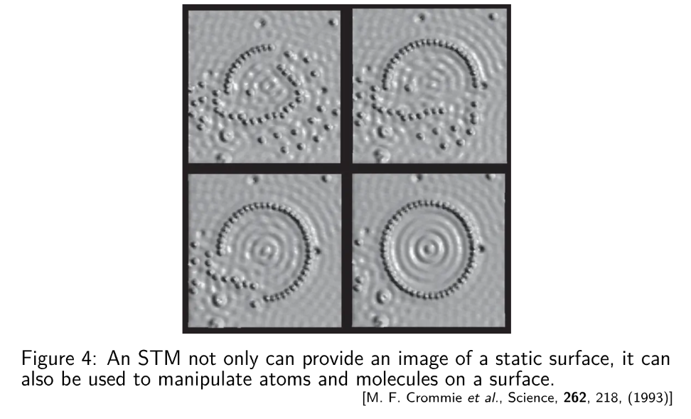
