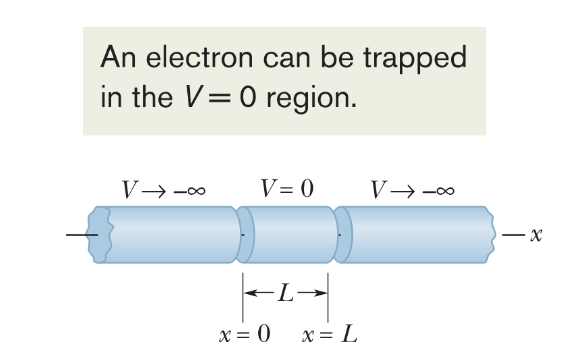
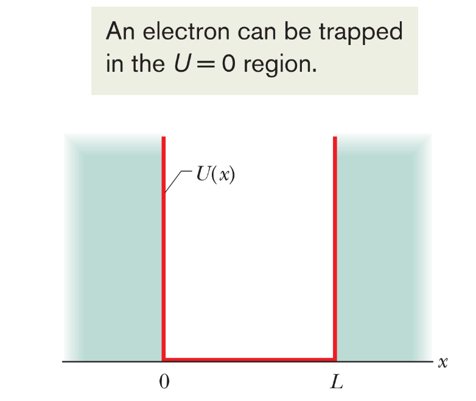
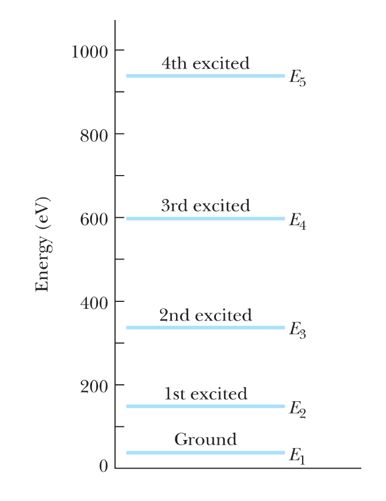
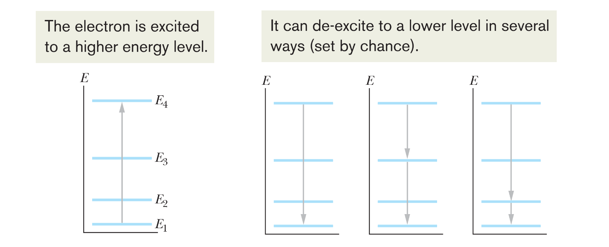
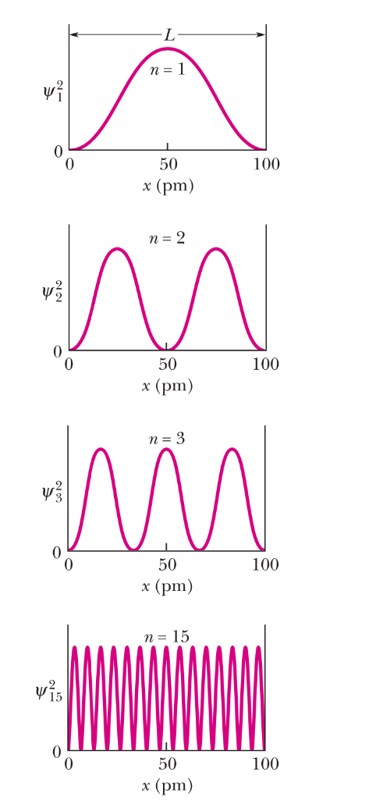
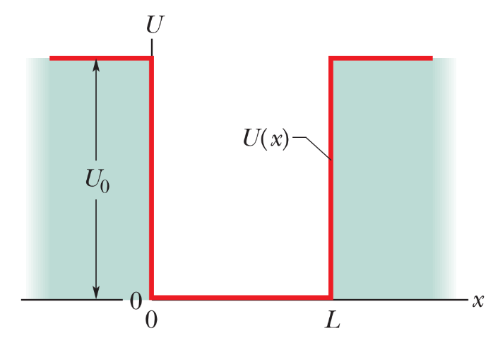
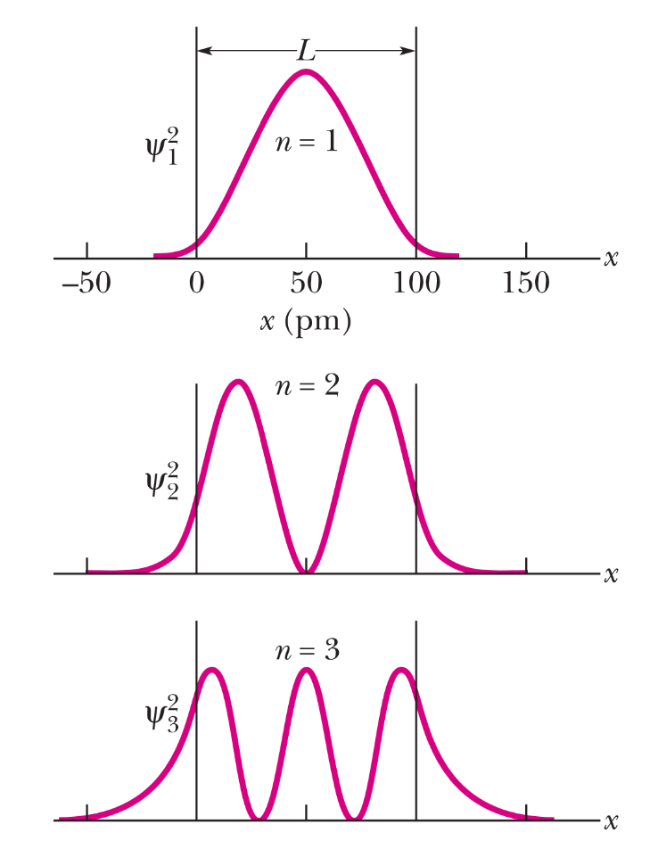
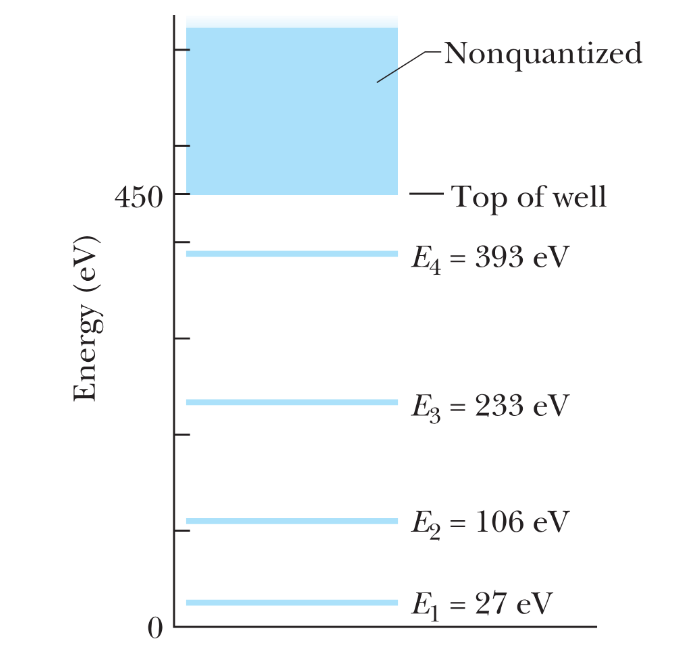
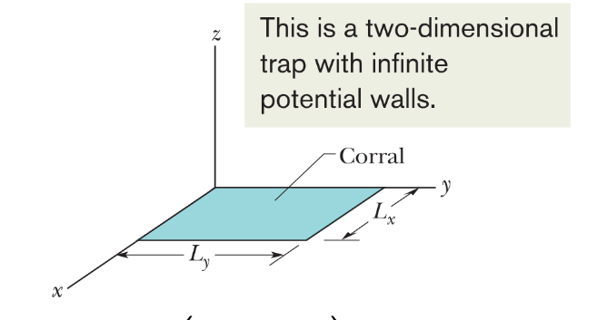
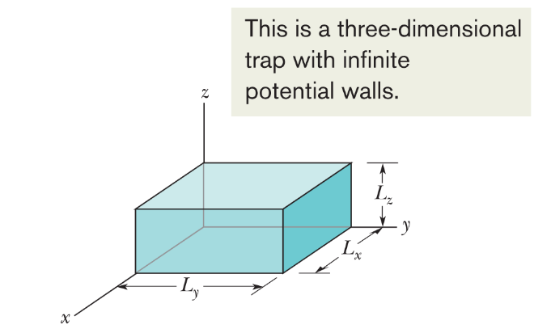

# 量子阱（Quantum Wells）
## 一维无限势阱

我们考虑以下结构：由两个半无限长的圆柱体组成，每个圆柱体的电势趋近于 $-\infty$，即  
   $$
   U = -|q|V \to +\infty
   $$  
两者之间是一个长度为 $L$ 的空心圆柱体，其电势为零。我们将一个电子放入这个中心圆柱体中以将其束缚在其中。

当电子位于中央圆柱体内时，其势能 \( U = -eV \) 为零。且由于其在区域外的势能为正无穷大，电子无法离开该区域。我们称这是一个势“阱”，因为置于中央圆柱体中的电子无法从中逃逸。

### 一维无限势阱中电子的能量

我们通过与沿 $x$ 轴方向拉伸并固定在刚性支撑之间、有限长度的弦上的驻波进行类比来分析。  
由于支撑是刚性的，弦的两端形成节点，即弦始终静止的点。  
弦能够振荡的状态或离散驻波图案，是那些弦的长度 $L$ 等于半波长的整数倍的情况；也就是说，弦只能处于满足以下条件的态：

$$
L = \frac{n\lambda}{2}, \quad \text{其中} \ n = 1, 2, 3, \ldots
$$

整数 $n$ 的每个值对应弦的一个振荡状态。

对于给定的 $n$，弦上任意位置 $x$ （$0 \leq x \leq L$ ）处的横向位移由下式给出：

$$
y_n(x) = A \sin \left( \frac{n\pi}{L} x \right),
$$

其中 $A$ 是驻波的振幅。

对于陷阱中的电子，我们将横向位移推广为波函数 $\psi_n(x)$ 。

在经典理论中，我们预期在无限深势阱的任何位置检测到电子的概率密度是恒定的。  
但在量子力学中，对于给定的$n$ ，我们得到概率密度为

$$
p_n(x) = |\psi_n(x)|^2 = |A|^2 \sin^2 \left( \frac{n\pi}{L} x \right)
$$

常数 $A$（允许一个相位因子）可通过归一化条件确定：
$$
\int_{-\infty}^{\infty} |\psi_n(x)|^2 dx = \int_0^L |\psi_n(x)|^2 dx = 1,
$$

因此$A = \sqrt{2/L}$

电子的德布罗意波长 $\lambda$定义为  
   $$
   \lambda = \frac{h}{p} = \frac{h}{\sqrt{2mK}}
   $$
  其中  $K = p^2/(2m)$  是非相对论性电子的动能。

对于在中央圆柱体（ $U = 0$ ）内运动的电子，其总（机械）能量  $E$  等于动能 $K$ 。

因此，在中央圆柱体内运动的电子的总能量为  
$$
E_n = \left( \frac{h^2}{8mL^2} \right)n^2 \propto n^2
$$
其中 $n = 1, 2, 3, \ldots$，这里的正整数 $n$ 是电子在势阱中量子态的**量子数**。  
阱越窄（$L$ 越小）$⇒ E_n$ 越大。

具有最低可能能级  $E_1$、量子数 $n = 1$ 的量子态称为电子的**基态**。
>选择 $n = 0$ 确实会得到更低的零能量。然而，相应的概率密度为 $|\psi|^2 = 0$ ，这只能解释为阱中没有电子；因此$n = 0$不是一个可能的量子数。

量子物理学的一个重要结论是：受约束的系统必须总是具有一个非零的最小能量，称为**零点能**。

电子可以通过吸收或发射能量为  
$$
\hbar \omega = \frac{\hbar c}{\lambda} = \Delta E = E_{\text{高}} - E_{\text{低}}
$$  
的光子而被激发或退激。

---
为什么陷阱中的电子的横向位移的波函数能类比为弦上的驻波呢。如果我们如前一讲所述，求解一个被束缚在宽度为 $L$ 的一维无限深势阱中的电子的定态薛定谔方程，其解可写为  
$$
\psi_n(x) = \exp\left(i\frac{n\pi}{L}x\right) \quad \text{或} \quad \psi_n(x) = \exp\left(-i\frac{n\pi}{L}x\right).
$$

然而，上述行波解不满足边界条件  
$$
\psi_n(0) = \psi_n(L) = 0.
$$

所以合适的解只能是行波函数的某种线性组合，具体形式为  
$$
\psi_n(x) = A \sin \left( \frac{n\pi}{L} x \right),
$$ 
其中 $0 \leq x \leq L$。常数 $A$ 待定。

注意，波函数 $\psi_n(x)$ 的形式与固定在刚性支撑之间的弦上驻波的位移函数 $y_n(x)$ 相同。

---

当量子数 $n$ 足够大时，在粗粒化尺度上，电子在阱内被检测到的概率分布会变得越来越均匀。这一结果是**对应原理**的一个例子：当量子数足够大时，量子物理学的预测会平滑过渡到经典物理学的预测。

## 一维有限势阱
我们可以将束缚在无限高势垒之间的一维势阱中的电子想象为一列**驻波物质波**。解必须在无限高势垒处为零。

然而，对于**有限势垒**，弦上的波与物质波之间的类比不再成立。物质波的波节不再位于 $x = 0$ 和 $x = L$ 处；波函数可以穿透势垒（类比量子隧穿）。

要找到描述电子在有限深势阱中量子态的波函数，我们必须使用**不含时薛定谔方程**：

$$
\hbar^2 \frac{\partial^2 \psi(x)}{\partial x^2} + U(x) \psi(x) = E \psi(x).
$$

我们不具体求解，下面只进行定性讨论。

与隧穿问题类似，物质波会“渗入”有限势能阱的阱壁；量子数 $n$ 越大，渗入越显著。

因此，对于任意给定的量子态，当电子被束缚在有限深势阱中时，其波长 $\lambda$要比被束缚在相同长度$L$的无限深势阱中时更大。

因此，对于任意给定状态中的电子，其在有限深势阱中的相应能量$ E \approx (h/\lambda)^2/(2m)$ 要小于在无限深势阱中的能量。

能量大于阱深（$E > U_0$）的电子，其能量过高而无法被束缚在有限深势阱中。

因此，在阱顶之上存在一个**能量连续区**；高能电子不受束缚，其能量**不量子化**。

## 高维的薛定谔方程及其求解

假设势能 $U = 0$。我们可以将薛定谔方程推广到二维（类似地也可推广到三维）：

$$
E\Psi(x, y) = -\frac{\hbar^2}{2m} \left[ \frac{\partial^2}{\partial x^2} + \frac{\partial^2}{\partial y^2} \right] \Psi(x, y).
$$

我们关注如下形式的波函数族  
$$
\Psi(x, y) = X(x)Y(y)
$$  

其对应的薛定谔方程等价于
$$
E = -\frac{\hbar^2}{2m} \frac{1}{X(x)} \frac{\partial^2 X(x)}{\partial x^2} - \frac{\hbar^2}{2m} \frac{1}{Y(y)} \frac{\partial^2 Y(y)}{\partial y^2}.
$$

这具有 $E = F(x) + G(y)$  的形式，只有在 $F(x) = E_1$  且 $G(y) = E - E_1$ 时才能满足，即每个函数必须分别是常数。

因此，我们可以将多元偏微分方程分解为一组独立的常微分方程。（**变量分离法**）我们可以分别求解 $X(x)$和$Y(y)$的常微分方程。原方程的波函数就是它们的乘积 $X(x)Y(y)$。  
>何种情况下 $\Psi(x,y)$ 可以写成$X(x)Y(y)$的形式？何时不能？  
可以分离变量的情况：当势能函数$U(x, y)$ 可以写成 $U_x(x) + U_y(y)$ 的形式（即可加性势能），并且边界条件在 $x$ 和 $y$ 方向各自独立时，薛定谔方程通常可以通过分离变量法求解，得到 $\Psi(x,y) = X(x)Y(y)$ 形式的解。  
不能分离变量的情况：如果势能函数包含不可分离的交叉项（例如  U$(x,y) = kxy$  或更复杂的耦合形式），或者边界条件在 $x$ 和 $y$ 方向上相互耦合，则通常无法通过简单的乘积形式分离变量，此时需要采用更一般的方法（如数值解或微扰理论）求解耦合的偏微分方程。

## 二维和三维的无限深势阱

考虑一个宽度为 $L_x$ 和 $L_y$ 的二维无限深势阱。

归一化波函数为：
$$
\psi_n(x, y) = \frac{2}{\sqrt{L_x L_y}} \sin\left(\frac{n_x \pi}{L_x} x\right) \sin\left(\frac{n_y \pi}{L_y} y\right),
$$
其中包含两个量子数 $n_x$和 $n_y$ ，对应的能量为：
$$
E_{n_x, n_y} = \frac{\hbar^2}{8m} \left( \frac{n_x^2}{L_x^2} + \frac{n_y^2}{L_y^2} \right).
$$

电子也可以被束缚在一个体积为 $V = L_x L_y L_z$ 的三维无限深势阱中。此时，被束缚的电子具有三个量子数 $n_x, \, n_y,$ 和 $n_z$。

其归一化波函数及对应的能量为：
$$
\psi_n(x, y, z) = \sqrt{\frac{8}{V}} \sin\left(\frac{n_x \pi}{L_x} x\right) \sin\left(\frac{n_y \pi}{L_y} y\right) \sin\left(\frac{n_z \pi}{L_z} z\right),
$$

$$
E_{n_x, n_y, n_z} = \frac{\hbar^2}{8m} \left( \frac{n_x^2}{L_x^2} + \frac{n_y^2}{L_y^2} + \frac{n_z^2}{L_z^2} \right).
$$
