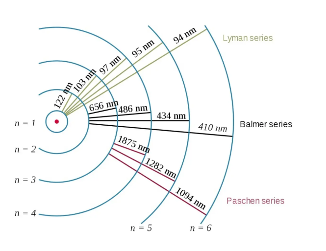
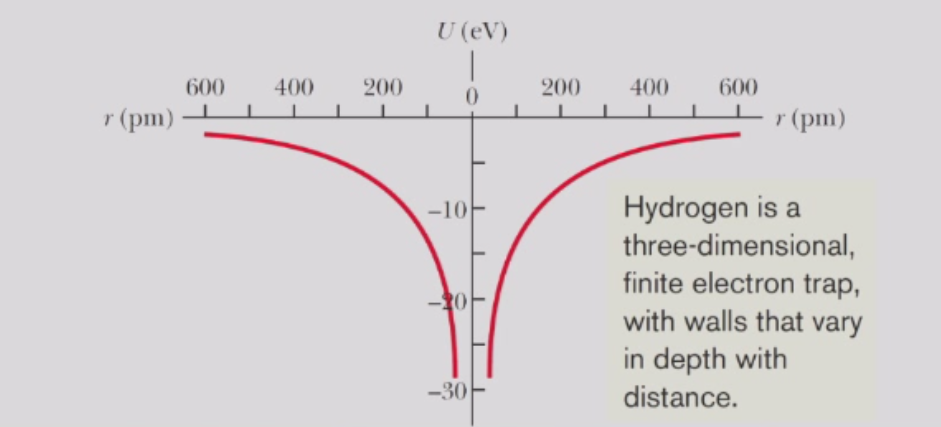
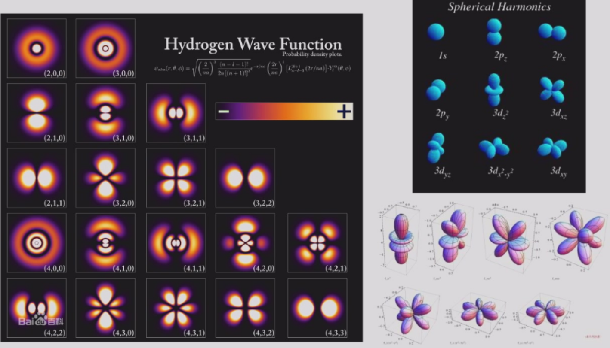
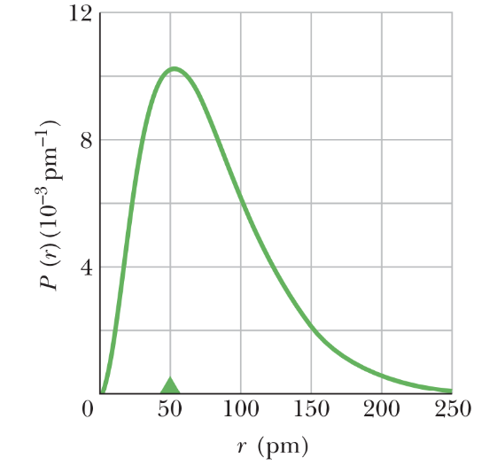

# 氢原子模型
## 经典力学中的氢原子模型
由于质子的质量远大于电子质量，我们假设质子是固定不动的。因此，原子可以看作是一个固定的势阱，电子在其中运动。

氢原子中含有一个电子，该电子受到来自质子（即原子核）的库仑力束缚。

根据牛顿定律，电子会围绕质子运动，就像行星围绕太阳一样，即：

$$
\frac{1}{4\pi\epsilon_0}\frac{e^2}{r^2} = m\frac{v^2}{r}
$$

两侧乘以$-r$，我们得到：
$$
E_C = -\frac{e^2}{4\pi\epsilon_0 r} = -mv^2 = -2E_K
$$

或者，电子的总能量为：
$$
E = E_K + E_C = E_C/2 = -E_K
$$

然而，任何沿弯曲路径运动的带电粒子都会发射电磁辐射，从而持续损失能量。那么，电子与正电荷之间的电吸引力为什么不会直接导致两者坍缩在一起呢？

## 波尔氢原子模型
### 波尔假设
玻尔对原子模型提出了两个大胆（且完全未被证实）的假设：

- 氢原子中的电子像地球绕太阳公转一样，绕原子核作圆周运动。
- 电子在其轨道上的角动量 $\vec{L}$ 的大小被限制（量子化）为以下数值：
    $$
    L = n\hbar, \quad n = 1,2,3,\ldots
    $$

推导如下：

- 一个具有动量 $p$的自由粒子的德布罗意波长 $\lambda$ 为 $\lambda = h/p = h/mv$。

- 对于一个处于氢原子中、轨道半径为 $r$ 的电子，上述公式可推导出：
    $$
    \lambda/r = h/mv = h/L
    $$

因此，我们得到：
  $$
  2\pi r/\lambda = L/\hbar
  $$

$L = n\hbar$ 意味着轨道的周长是波长 $\lambda$ 的整数倍。也就是说，电子波函数的相位在沿轨道运行一周后，会回到初始值。

### 波尔半径
我们遵循玻尔的方法对电子轨道进行量化：  
$$
L = rmv = n\hbar
$$
  由此可得  $v = n\hbar/(mr)$
  
结合牛顿力学的结果，我们得到  
$$
r_n = n^2a_B
$$
其中特征长度

$$
a_B = \frac{\hbar^2}{me^2/(4\pi\epsilon_0)} = 0.529 \, \text{埃}
$$

在氢原子的玻尔模型中，电子的轨道半径$r$是量子化的，最小可能的轨道半径（对应 $n = 1$）为 $a_B$，这被称为玻尔半径。

在玻尔模型中，为了防止电子与原子核之间的吸引力使它们直接坍缩在一起，电子不应比轨道半径 $a_B$（取 $n = 0$ 时）更靠近原子核。

### 氢原子的能量

根据玻尔模型，氢原子的能量为：
$$
E_n = \frac{1}{2} mv^2 - \frac{1}{4\pi\epsilon_0} \frac{e^2}{r} = -\frac{E_R}{n^2}
$$
其中特征能量（称为**里德伯能量**）为：

$$
E_R = \frac{\hbar^2}{2ma_B^2} = \frac{me^4/(4\pi\epsilon_0)^2}{2\hbar^2} = 13.6eV
$$

注意，对于每个轨道，我们仍然有：
$$
E = E_K + E_C = E_C/2 = -E_K
$$

当氢原子发射或吸收光时，其能量（或等价地说，其电子的能量）发生变化。发射和吸收过程涉及一个光量子，满足关系式：
$$
\hbar \omega_{nm} = E_R \left( \frac{1}{n^2} - \frac{1}{m^2} \right)
$$
其中 $m > n$为整数。

### 氢原子光谱

发射或吸收光的波长由下式给出：
$$
\frac{1}{\lambda} = \frac{E_R}{h c} \left( \frac{1}{n^2} - \frac{1}{m^2} \right)
$$

这些谱线（或波长）的集合，例如在可见光范围内的那些，被称为氢原子光谱。

为方便起见，我们通常引用组合常数 $hc = 12400 eV \cdot \text{埃}$。

因此，我们有：

$$
\frac{hc}{E_R} = 912\text{埃}
$$

### 基态能量与不确定性原理
基态能量是海森堡不确定性原理所允许的最低能量。

对于氢原子，波函数的尺度 $\Delta r$ 就是位置的不确定度。

根据不确定性原理，动量的不确定度大致为 $\Delta p \sim \hbar / \Delta r$。

电子的能量可估算为：
$$
E \sim \frac{(\Delta p)^2}{2m} - \frac{e^2}{4\pi\epsilon_0\Delta r} = \frac{\hbar^2}{2m(\Delta r)^2} - \frac{e^2}{4\pi\epsilon_0\Delta r}
$$

为了找到最小能量，我们对 $\Delta r$ 求解：

$$
\frac{dE}{d(\Delta r)} = 0
$$

经过一些代数运算，我们得到：

$$
\Delta r = \frac{\hbar^2}{me^2/(4\pi\epsilon_0)} \equiv a_B
$$

以及：

$$
E = -\frac{me^4/(4\pi\epsilon_0)^2}{2\hbar^2} \equiv -E_R
$$

这表明基态能量就是氢原子的特征能量的负值，即 $-E_R$。

基态（或任何定态）的能量是唯一确定的。这是基于能量-时间不确定性原理：
$$
\Delta t \cdot \Delta E \geq \hbar/2
$$
在定态这一极端情况下，$\Delta t = \infty$，因此有 $\Delta E = 0$。

但需注意，由于位置和动量的不确定性，动能和势能各自仍存在不确定性。

## 现代量子力学中的氢原子模型

尽管波尔的理论在解释原子为何不会简单坍缩以及氢原子在光谱中的发射和吸收的选择性方面很成功，但在原子的几乎所有其他方面都被证明是相当错误的。

在氢原子的薛定谔模型中，电子（电荷为 $-e$）因其与位于原子中心的质子（电荷为 $+e$）之间的电吸引力，而处于一个势能阱中。

氢原子是一个三维的、有限的电子势阱，其阱壁的深度随距离而变化。

在中心势场中，我们可以采用分离变量法，并假设  
$$
\Psi(r,\theta,\phi) = R(r ) \Theta(\theta)\Phi(\phi)
$$ 
从而将方程分解为三个分别关于 $R(r)$、$\Theta(\theta)$ 和 $\Phi(\phi)$ 的独立微分方程。

- $\Phi$ 函数被发现有量子数 $m_\ell$，其中  
  $$
  \Phi_{m_\ell}(\phi) \sim e^{im_\ell\phi}, \, m_\ell = 0, \pm 1, \pm 2, \ldots
  $$

- $\Theta$函数被称为勒让德多项式，它具有量子数 $m_\ell$ 和 $\ell$。当 $\Theta$ 和 $\Phi$ 相乘时，其乘积称为球谐函数：  
  $$
  Y_\ell^{m_\ell}(\theta, \phi) = \Theta_\ell^{m_\ell}(\theta)\Phi_{m_\ell}(\phi)
  $$

- 径向波函数 $R_{n\ell}(r)$则具有量子数 $n$ 和 $\ell$。

氢原子特定量子态的相应波函数可以用一组量子数 $(n, \ell, m_\ell)$来标记。

- 相应的能量仅依赖于主量子数 $n = 1, 2, 3, \ldots$。
- 角量子数（或称轨道量子数）$\ell = 0, 1, 2, \ldots, n - 1$，是衡量该量子态角动量大小的一个量。$\ell = 0, 1, 2, 3$ 的态分别称为 $s, p, d, f$态。
- 轨道磁量子数 $m_\ell = -\ell, -\ell + 1, \ldots, \ell - 1, \ell$，与此角动量矢量的空间取向有关。

- 通过求解三维薛定谔方程并对结果进行归一化，得到的氢原子基态波函数为：

$$
\psi_{100}(\vec{r}) = R_{10}(r) = \frac{1}{\sqrt{\pi} a_B^{3/2}} e^{-r/a_B}
$$

请注意，处于基态的氢原子具有零角动量（$l = 0$），这是玻尔模型所未预测到的。

在距离原子中心半径为  $r$  处的任何给定（无穷小）体积元 $dV$ 内探测到电子的概率为 $|\psi_{100}(\vec{r})|^2 dV$ 。

利用球对称性，我们有  
$$
dV = 4\pi r^2 dr
$$

我们定义径向概率密度 $P(r)$ ，使得  
$$
P(r)dr = |\psi_{100}(\vec{r})|^2 dV
$$

$P(r)$  在  $r = a_B$ 处取最大值。

