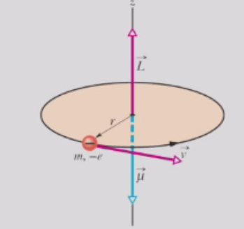
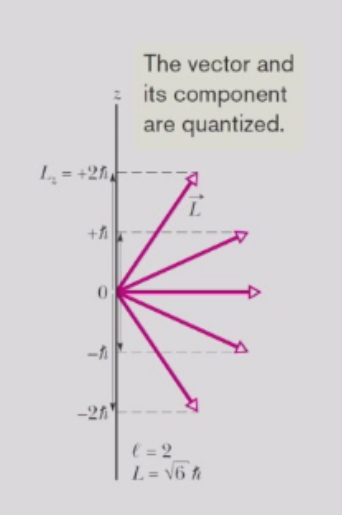
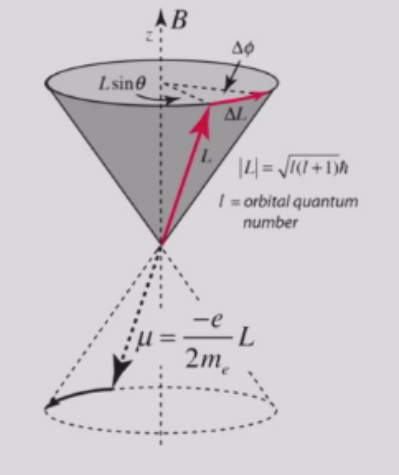
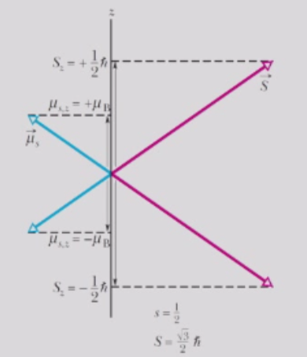
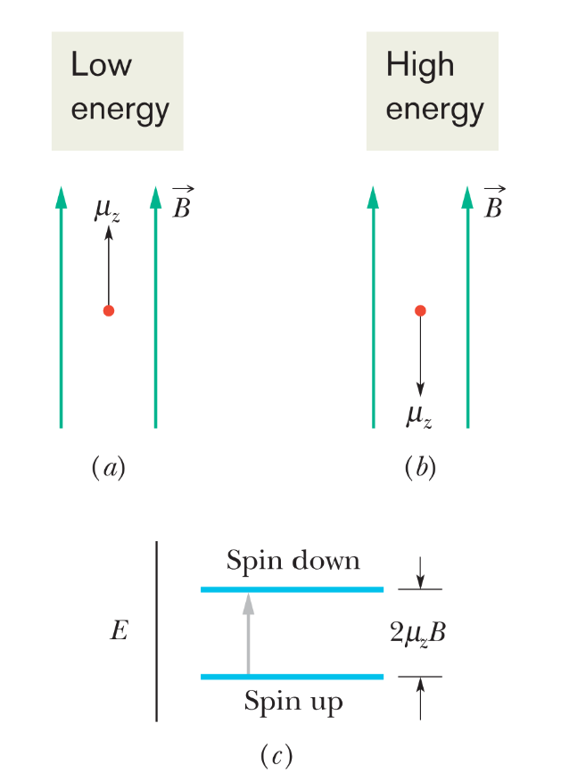
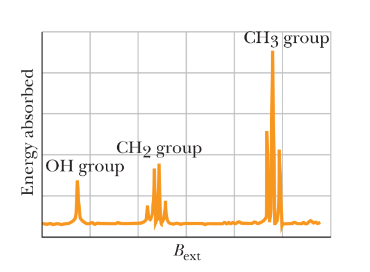

# 电子的角动量和自旋
## 电子的磁偶极矩

考虑一个电子以恒定速率 $v$  沿半径为 $r$ 的圆形路径运动。电子的轨道角动量为  
$$
L_{\text{orb}} = mrv
$$

电子所带的负电荷的运动等效于一个电流 $i$：  
$$ 
i = \frac{\text{电荷}}{\text{时间}} = \frac{e}{2\pi r / v}
$$
该电流环的轨道磁偶极矩的大小为  

$$
\mu_{\text{orb}} = i(\pi r^2) = \frac{evr}{2}
$$

以矢量形式表示为  

$$
\vec{\mu}_{\text{orb}} = -\frac{e}{2m}\vec{L}_{\text{orb}} \equiv \gamma\vec{L}_{\text{orb}} 
$$

负号表示 $\vec{\mu}$ 与 $\vec{L}$ 方向相反。这是由于电子带负电荷所致。

## 量子力学中电子的角动量

角动量的矢量表示为

$$
L = \vec{r} \times \vec{p} = 
\begin{vmatrix}
\hat{i} & \hat{j} & \hat{k} \\
x & y & z \\
p_x & p_y & p_z
\end{vmatrix}
$$

直观来看，$\Delta L_x \Delta L_y$涉及 $\Delta z \Delta p_z$，因此根据不确定原理，其值不能为零。换言之，无法同时测量 $L$ 的任意两个分量。然而，可以同时测量 $L^2$和 $L_z$。

在量子力学中，

$$
L = r \times p = 
\begin{vmatrix}
\hat{i} & \hat{j} & \hat{k} \\
x & y & z \\
-i\hbar\frac{\partial}{\partial x} & -i\hbar\frac{\partial}{\partial y} & -i\hbar\frac{\partial}{\partial z}
\end{vmatrix}
$$

具体来说，

$$
L_z = -i\hbar\left(x\frac{\partial}{\partial y} - y\frac{\partial}{\partial x}\right) = -i\hbar\frac{\partial}{\partial \phi}.
$$

## 轨道角动量和磁偶极矩

原子中电子的每一个量子态都有对应的轨道角动量和轨道磁偶极矩。

如在氢原子中，电子具有：

- 轨道量子数 $\ell = 0, 1, 2, \ldots, n - 1$，用于衡量量子态角动量的大小。$\ell = 0, 1, 2, 3$ 的状态分别称为 $s, p, d, f$ 态。
- 轨道磁量子数 $m_\ell = -\ell, -\ell + 1, \ldots, \ell - 1, \ell$，与角动量矢量的空间取向有关。

例如，$s$轨道（$\ell = m_\ell = 0$）的波函数仅为径向函数。
$$
\psi_{n00}(r, \theta, \phi) = f( r)
$$

可以证明
$$
L^2 \psi_{n00}(r, \theta, \phi) = (L_x^2 + L_y^2 + L_z^2) \psi_{n00}(r, \theta, \phi) = 0,
$$

$$
L_z \psi_{n00}(r, \theta, \phi) =0
$$

第二个例子，$p$ 轨道（$\ell = 1$）的波函数为  

$$
p_x + ip_y \, (m_\ell = 1) : \quad g(r)(x + iy) = \tilde{g}(r) \sin \theta e^{i\phi}
$$

$$
p_z \, (m_\ell = 0) : \quad g(r)z = \tilde{g}(r) \cos \theta
$$

$$
p_x - ip_y \, (m_\ell = -1) : \quad g(r)(x - iy) = \tilde{g}(r) \sin \theta e^{-i\phi}
$$

可以证明  

$$
L^2\{p_x + ip_y, p_z, p_x - ip_y\} = 2\hbar^2\{p_x + ip_y, p_z, p_x - ip_y\},
$$

$$
L_z\{p_x + ip_y, p_z, p_x - ip_y\} = \hbar\{p_x + ip_y, 0, -(p_x - ip_y)\}.
$$

因此，与经典粒子不同，电子的轨道角动量 $\vec{L}$ 是量子化的。其允许的大小由下式给出：

$$
L = \sqrt{\ell(\ell + 1)} \hbar,
$$
其中 $\ell = 0, 1, 2, \ldots$

但由于其量子特性，它并不具有确定的方向。

我们可以沿着选定的测量轴（通常取为 $z$ 轴）测得分量 $L_z$ 的确定值，其表达式为  
$$ 
L_z = m_l \hbar, \quad m_l = 0, \pm 1, \pm 2, \ldots, \pm l
$$

一般而言，如果电子具有确定的 $L_z$ 值，则它可能没有确定的 $L_x$ 和 $L_y$ 值。这是海森堡不确定性原理的一种表现。

因此，轨道磁偶极矩也是量子化的：

$$
\mu_{\text{orb}} = |\gamma|L = \frac{e}{2m} \sqrt{\ell(\ell+1)} \hbar,
$$

$$
\mu_{\text{orb},z} = \gamma L_z = -m_\ell \frac{e \hbar}{2m} = -m_\ell \mu_B,
$$

其中我们定义玻尔磁子为

$$
\mu_B = \frac{e h}{4 \pi m} = \frac{e \hbar}{2m} = 9.274 \times 10^{-24} \, \text{J/T}.
$$

对于具有轨道角动量 $\vec{L}$ 的电子，受到一个总力矩的作用  
$$
\vec{\tau} = \frac{d\vec{L}}{dt} = \gamma \vec{L} \times \vec{B}
$$

由于 $\vec{L} \times \vec{B}$ 总是垂直于 $\vec{L}$ 和 $\vec{B}$，因此 $\vec{L}$ 的尖端会围绕 \(\vec{B}\) 做圆周运动，或以（拉莫尔频率）  
$$
\vec{\omega} = -\gamma \vec{B}
$$
进动，使得  
$$
\frac{d\vec{L}}{dt} = \vec{\omega} \times \vec{L}.
$$

这称为拉莫尔进动。

## 自旋
每个电子，无论是束缚在原子中还是自由的，都具有自旋角动量和自旋磁偶极矩，如同其质量与电荷一样，是固有的基本属性。

对每个电子而言，自旋 $s = 1/2$，因此电子被称为自旋1/2粒子（质子和中子也是自旋1/2粒子）。

与运动相关的角动量类似，自旋角动量可以有确定的大小，但没有确定的方向。

我们最多只能测量它沿 $z$ 轴（或任意轴）的分量，而该分量只能取以下确定值：

$$
S_z = m_s \hbar, \quad \text{其中} \quad m_s = \pm s = \pm 1/2.
$$

这里的 $m_s$ 是自旋磁量子数，它只能取两个值：$m_s = +s = +1/2$（此时电子称为自旋向上）和 $m_s = -s = -1/2$（此时电子称为自旋向下）。

与轨道角动量类似，自旋角动量也伴随着一个磁偶极矩。我们将其写为  
$$
\vec{\mu}_s = g \gamma \, \vec{S},
$$ 
其中 $\gamma = -e/(2m)$，常数 $g$称为 $g$ 因子。

结果表明，自旋角动量所产生的磁矩是轨道角动量所产生磁矩的两倍，即$g = 2$。

因此，自旋磁偶极矩也是量子化的：
$$
\mu_s = g |\gamma| S = \frac{e}{m} \sqrt{s(s+1)} \hbar,
$$

$$
\mu_{s,z} = -g m_s \mu_B,
$$

其中取 $g = 2$ 。

实际上，量子电动力学中有一个小的修正，对应$g = 2.00232$。但在大多数情况下，使用 $g = 2$ 已足够。

### 核自旋和核共振

氢离子（质子）具有一个自旋磁偶极矩 $\vec{\mu}$，该磁矩与质子的内禀自旋角动量 $\vec{S}$ 相关联。

在磁场 $\vec{B} = B\hat{z}$ 中，$\vec{\mu}$沿该轴有两个可能的量子化分量，且具有不同的能量（塞曼效应）。

质子可以通过吸收一个能量为  
$$
\hbar\omega = \Delta E = 2\mu_z B
$$ 
的光子，实现自旋从向上到向下的翻转。

这种吸收现象称为磁共振，或最初所称的核磁共振（NMR）。

核磁共振的检测通常是这样实现的：在射频源的频率 $\omega$保持为预定值的同时，扫描外磁场强度 $B_{\text{ext}}$ 在一定范围内变化，并监测射频源的能量损耗。

>质子核磁共振通过研究质子自旋在磁场中的进动，是一种实用的医学成像技术。  
>强磁场使人体内的质子（氢核）产生部分极化。  
>同时施加一个强射频场，以激发部分核自旋进入其较高能态。  
>当这个强射频信号关闭时，自旋倾向于回到其较低能态，并产生与该磁场对应的拉莫尔频率的少量辐射。  
>这会在探测线圈中感应出射频（RF）信号，该信号经过放大后即可显示核磁共振信号。  

### 自旋轨道耦合

迄今为止，自旋所扮演的角色一直较为简单。它与电子的轨道运动是解耦的。然而在现实中，情况并非如此。

不过，自旋轨道相互作用很难从经典理论推导出来。粗略地说，对于电子而言，原子核看起来像是在围绕它旋转，而运动的核电荷（或电流）会产生一个正比于轨道角动量$L$的磁场 $B^*$（$B^* ∝L$）。
自旋轨道相互作用的哈密顿量由下式给出：

$$
H_{SO} = \xi_{n l}L \cdot \vec{S}
$$

其中**自旋轨道耦合常数** $\xi_{n l}$ 为正数，本质上代表了库仑相互作用的平均梯度。

为求解包含此类相互作用的哈密顿量，需要引入总角动量 $J = L + \vec{S}$，并利用如下表达式来改写自旋轨道相互作用的哈密顿量：
$$
  J \cdot J = (L + \vec{S}) \cdot (L + \vec{S}) = \vec{S} \cdot \vec{S} + 2L \cdot \vec{S} + L \cdot L.
$$

$$
  H_{SO} = \frac{1}{2} \xi_{n l} (J \cdot J - L \cdot L- \vec{S} \cdot \vec{S})
$$

现实应用：钠光谱在黄色波段呈现一组明亮的自旋轨道分裂双线，即所谓的钠 D 线。