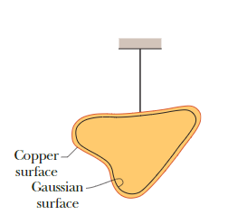
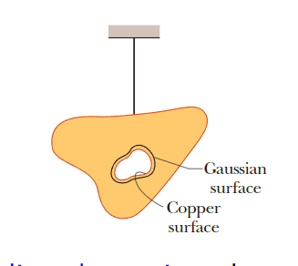
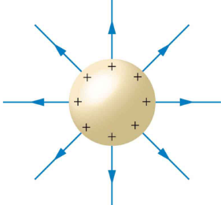
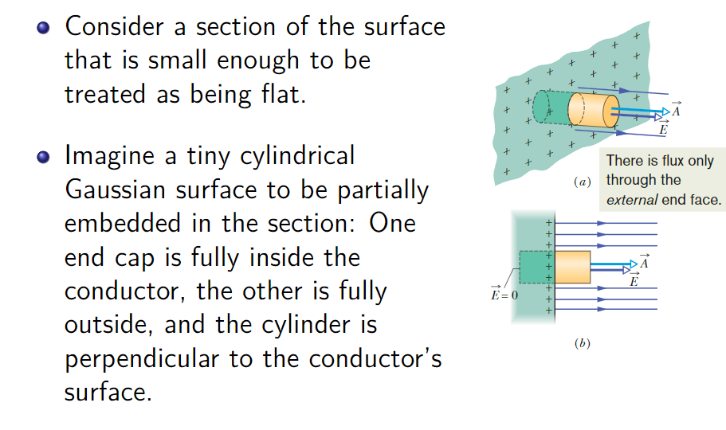
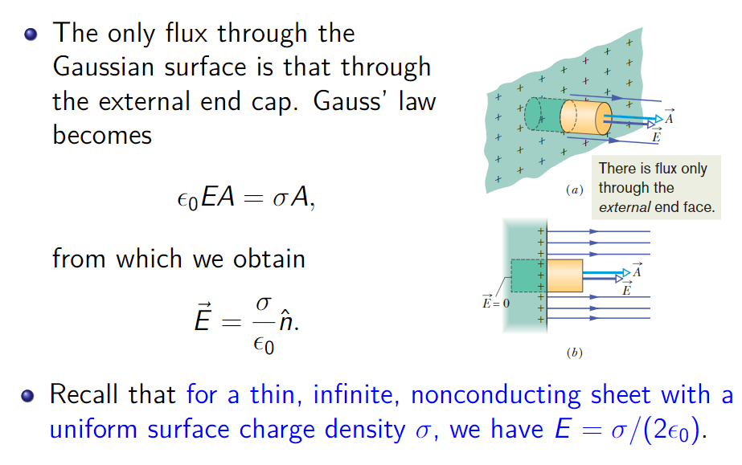
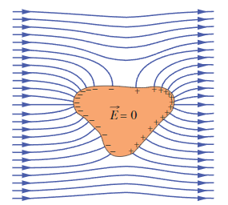
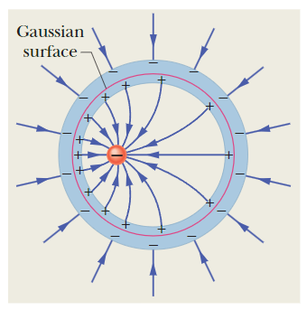
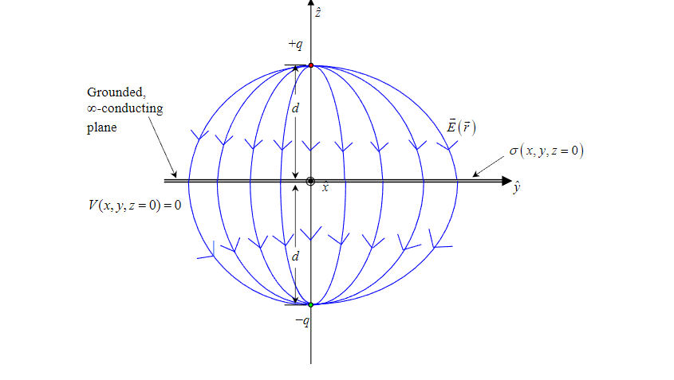

# 导体
## 孤立导体电荷的分布
- 考虑一个带电孤立导体。在静电平衡状态下，孤立导体的内部电场E=0，由高斯定律，高斯面内的电荷必须为0，电荷位于导体的外表面。

- 对于一个内部有空腔的导体，我们绘制一个包围空腔的高斯面，靠近其表面但位于导体内部，由于导体内部E=0，由高斯定理，空腔壁上无净电荷，所以电荷还是位于导体的外表面。

- 由上述讨论，在孤立导体上电荷只分布在导体外表面。
### 球壳定理
- 如果导体是球形的，该系统有球对称性，电荷会均匀分布。
- 导体外的电场等效于导体的所有电荷集中在球心处所产生的电场。

### 不均匀导体的电荷分布
- 电场在不均匀导体表面总是垂直于导体表面。
- 通过高斯定理，可建立电荷密度与电场强度之间的关系:$\vec{E}=\frac{\sigma}{\epsilon_0}\hat{n}$

## 静电屏蔽
- 即放置在电场中的导体，由于导体内部的电荷分布，导致外部电场被抵消，使导体内部电场为0，导体内部的电势处处相等。这种现象称为静电屏蔽。

- 当带电体位于导体空腔内部时，由于导体内部电场为0，由高斯定理，空腔壁上会有电荷的不均匀分布，以抵消带电体的电场，而由电荷守恒，导体外表面也会有相反电荷，但导体外表面的电荷不会由于空腔内部带电体的位置变化而发生变化，如一个导体球壳内部包裹一个点电荷，无论点电荷在球壳内部的什么位置，球壳外部的电荷都是均匀分布的，这也是一种静电屏蔽。

## *镜像法解决导体电荷分布问题
- 镜像法的理论依据主要基于静电场的唯一性定理以及导体的静电边界条件：
    - 静电场的唯一性定理:
    在给定的边界条件下（如导体表面的电势、电荷分布，或无穷远的边界条件等，静电场的解是唯一的。也就是说，只要能找到一组电荷（包括原电荷和“镜像电荷”），使得它们产生的电场满足所有的边界条件，那么这组电荷产生的电场就是实际问题中唯一的解。
    - 导体的静电边界条件：对于导体（尤其是接地导体电势为0或孤立导体，表面为等势面），其表面的边界条件可总结为：
        - 电势条件：导体表面为等势面（接地时电势为 0 ）。
        - 电场条件：导体表面的电场垂直于表面（因为导体内部电场为 0 ，电荷仅分布在表面，电场线垂直于表面）。

镜像法的核心思想是：用“镜像电荷”替代导体表面的感应电荷，使得原电荷与镜像电荷共同产生的电场，恰好满足导体表面的边界条件。此时，根据唯一性定理，这个由原电荷和镜像电荷产生的电场，就是实际问题中导体存在时的真实电场。

举例说明：
当一个点电荷 Q 位于接地导体平面附近时：

- 导体平面的边界条件是“电势为 0 ”。
- 我们引入一个与 Q 异号的镜像电荷 -Q ，位于导体平面的另一侧，与 Q 关于导体平面对称。
- 此时，原电荷 Q 和镜像电荷 -Q 产生的电场，在导体平面处的电势恰好为 0 （满足边界条件）。根据唯一性定理，这组电荷产生的电场就是实际存在导体时的电场，而无需再考虑复杂的感应电荷分布。

当一个点电荷Q位于接地球壳外部（半径为R），距离球壳中心为d时：

- 我们在球壳内部引入一个镜像电荷q，使其与Q的叠加电势在球壳面上为0，即满足导体的静电边界条件。
- 通过方程求解可得：$q=\frac{R}{d}Q,a=\frac{R^2}{d}$ 其中a是镜像电荷q到球心的距离。