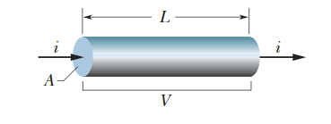
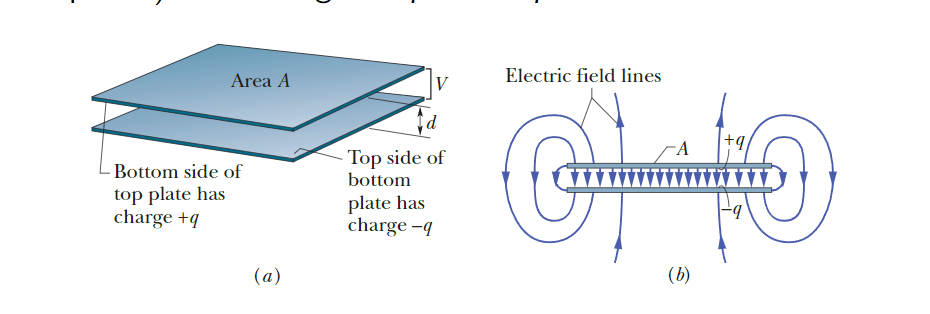
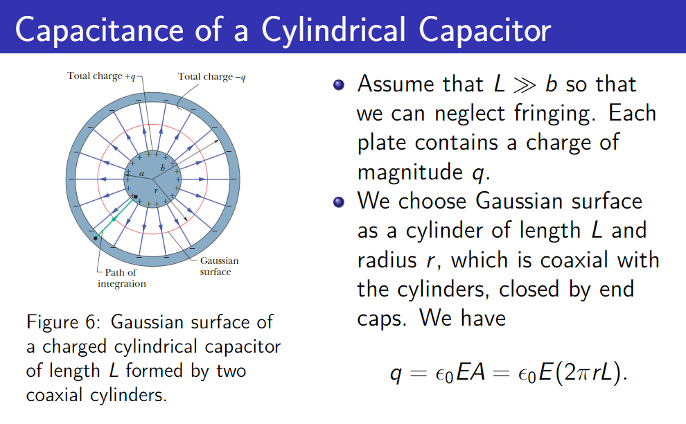
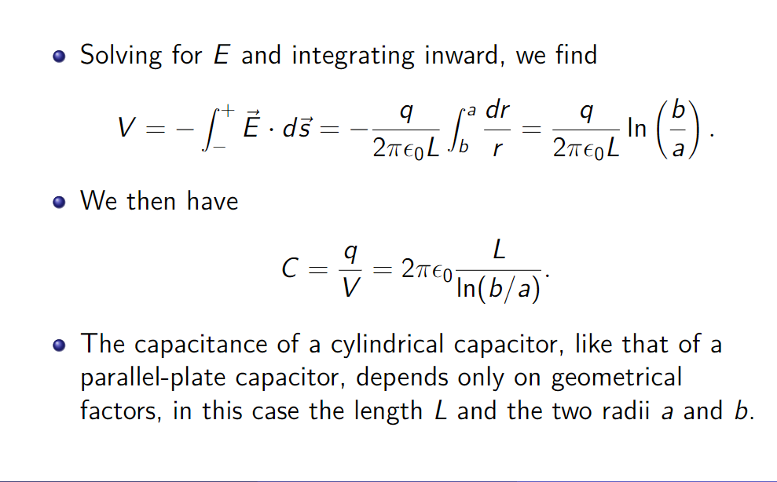

# 电阻和电容
## 电流
- 如果电荷dq在时间dt内通过一个假设的平面，那么通过该平面的电流i定义为$i=\frac{dq}{dt}$。
- 在稳态条件下，所有完全穿过导体的平面的电流相同。
- 电流箭头的方向是正电荷载体移动的方向。
### 微观电流的定义
- 导线（横截面积为A）中每个电荷e的载流子的总电荷量为：$q=(nAL)e$

- 总电荷在$\Delta t = \frac{L}{v_d}$时间内通过任何横截面。电流i是电荷通过横截面的时间转移率，因此我们有：
$i=\frac{q}{dt}=nAev_d$，也可以得出：$\vec{J}=ne\vec{v_d}$。
- 电荷守恒的微分形式: $\frac{\partial q}{\partial t}=-\nabla\cdot\vec{J}$，J是电流密度。
## 电阻
- 电阻的定义：$R=\rho \frac{L}{S}$
- 欧姆定律：$R = \frac{V}{I}$，其中V是导体两端的电势差，I是电流。
- 材料的电阻率$\rho$和电导率$\sigma$之间的关系为:$\rho = \frac{1}{\sigma}=\frac{E}{J}$,其中E是电场强度，J是电流密度。
## 电容
- 电容器由两个相互隔离的导体（电容器极板）组成，带有等量相反的电荷。

- 电容器的电荷量和电势差成正比：$q=CV$，比例常数C被称为电容器的电容。
- 我们忽略电场在板边缘的边缘效应，假设板间区域的电场强度E处处恒定，由高斯定律:$q=\epsilon_0EA$，$C=\frac{q}{V}=\frac{q}{Ed}=\frac{\epsilon_0A}{d}$。
- 对于一个圆柱形电容器，也可以计算其电容。

