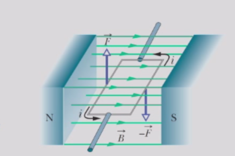
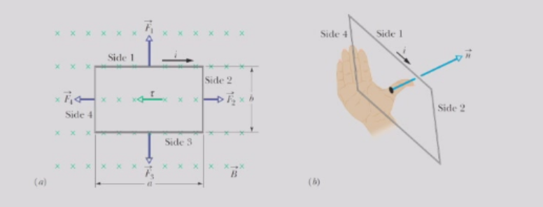
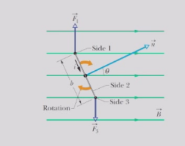

# 磁场
## 磁场力
- 带电粒子所受的磁场力带电粒子所受的磁场力（通常称为洛伦兹力）等于电荷量$q$乘以速度$\overrightarrow{v}$与磁场B的叉积（所有量均在同一参考系中测量）：$\overrightarrow{F}_{B} = q \overrightarrow{v} × \overrightarrow{B}$。
- 作用在以速度$\overrightarrow{v}$运动的带电粒子上的力$F_B$始终垂直于$\overrightarrow{v}$和$\overrightarrow{B}$。
- $\overrightarrow{B}$的国际单位制单位是特斯拉(T)，或牛顿每库仑·米每秒。$1 tesla = 1 T = 1 \frac{N}{C \cdot(m / s)} = 1 \frac{N}{A \cdot m}$。
## 磁场的性质
- 我们可以用磁感线来表示磁场。
- 磁感线在任意一点的切线方向给出了该点的$\overrightarrow{B}$方向。
- 线间距表示磁场的大小，磁场线越密集，磁场越强，反之亦然（即，磁场线密度与$|\overrightarrow{B}|$成正比）。
- 由于磁铁具有两个磁极，因此被称为磁偶极子。磁铁的磁场线向外发散的一端称为磁铁的北极；另一端，磁场线进入磁铁的一端称为磁铁的南极。没有磁单极子。
- 相对的磁极相互吸引，同性磁极相互排斥。
## 环流电荷
- 环流电荷速度为v的电子在方向垂直于纸面的均匀磁场B中运动。由于磁场B持续偏转电子，导致电子沿圆周路径运动。
$$
F = | q | v B = m \frac{v^{2}}{r}
$$
- 因此，半径为
$$
r = \frac{m v}{|q|B} = \frac{v}{\omega}
$$
## 霍尔效应
- 在宽度为d的铜片中，电子以速度$v_d$漂移，与电流$i = JA = - nev_dA$方向相反相反，其中A是铜片的横截面积，n是载流子密度，J是通量。
- 外部磁场 $\overrightarrow{B} =B_{z}$ 将漂移电子偏转到带状区域的一侧，从而形成横向电压 $V = Ed$。
- 在平衡状态下，电场力和磁场力达到平衡：$e E = e v_{d}B_{z}$
- 因此，我们有$V = E d = - \frac{i}{n e A}B d = - \frac{B}{n e}J d$.
- 霍尔电阻率和系数定义为$$
ρ_xy = E_y / J_x = - B / (n e)$$

$$
R_H = E_y / (B_z J_x) = - 1 / (n e)
$$

- 如果电流i中的载流子带正电，V的符号将改变，这能反映出载流子的电荷类型。
- 霍尔效应使我们能够测量导体中载流子的数密度和电荷类型。
## 安培力
- 长度为L的导线，其电荷量$|q|=i(L/ vd)$，则$\overrightarrow{F} = i \overrightarrow{L} × \overrightarrow{B}$ 其中 $\overrightarrow{L}$的大小为 $L$，方向沿导线段电流方向。
- 如果导线不直或磁场不均匀，我们可以将其想象成由许多小直线段组成，并在微分极限下，可以写出$d \overrightarrow{F} = i d \overrightarrow{L} × \overrightarrow{B}$，并且我们可以通过对该电流分布进行积分来求解任意给定电流分布的合力。
### 电流环的扭矩
- 电流环的扭矩世界上大部分工作是由电动机完成的。推动这项工作的力是磁场对载流导线施加的磁力。
- 对于一个电流环，磁力会产生一个扭矩，使其绕其轴线旋转。实际上，需要导线将电流引入和引出环（未示出）。

- 环上的净力为零，因为$\vec{F_1} + \vec{F_3} = 0$且$\vec{F_2} + \vec{F_4} = 0$
- 为了定义线圈在磁场中的取向，我们定义一个法向量n，该法向量垂直于线圈所在的平面。

- 环上的净力矩

$$
\overrightarrow{\tau} = - \frac{1}{2}\overrightarrow{L}_{2}×\overrightarrow{F}_{1} + \frac{1}{2}\overrightarrow{L}_{2}×\overrightarrow{F}_{3}= \overrightarrow{L}_{2} × \overrightarrow{F}_{3}
$$

- 其中$\overrightarrow{F}_{3} = i \overrightarrow{L}_{3} × \overrightarrow{B}$。因此，

$$
\overrightarrow{\tau} = i \overrightarrow{L}_{2}\times(\overrightarrow{L}_{3} × \overrightarrow{B})
$$

- 力矩$τ$作用于使法向量n与磁场方向对齐。L₂和L₃分别是边2和边3的长度矢量，方向与电流方向一致。
- 注意$\overrightarrow{L}_{2}\cdot \overrightarrow{L}_{3} = 0$并且$\overrightarrow{L}_{3}\cdot \overrightarrow{B} = 0$ ,我们得到

$$
\overrightarrow{\tau} = i \overrightarrow{L}_{2}\times(\overrightarrow{L}_{3} × \overrightarrow{B})I= i(\overrightarrow{L}_{2} × \overrightarrow{L}_{3}) × \overrightarrow{B} = i \overrightarrow{A} × \overrightarrow{B}
$$

- 在此，我们定义了环的面积矢量

$$\overrightarrow{A} = \overrightarrow{L}_{2} × \overrightarrow{L}_{3} = a b \hat{n}$$

- 表达式 $\overrightarrow{\tau} = i\overrightarrow{A}×\overrightarrow{B}$ 对所有平面线圈均成立，无论其形状如何，只要磁场 B 是均匀的。
- 因此，载流扁平线圈置于B场中时，会倾向于旋转，使n方向与B方向相同，就像条形磁铁（磁偶极子）置于磁场中一样。
- 为了增加扭矩，我们可以将单匝电流线圈替换为W匝线圈。此时线圈的总扭矩为$\overrightarrow{\tau} = N i \overrightarrow{A} × \overrightarrow{B} = \overrightarrow{\mu} × \overrightarrow{B}$，**其中$\overrightarrow{\mu}=N i \overrightarrow{A}$称为线圈的磁偶极矩**。