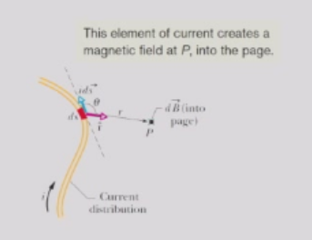
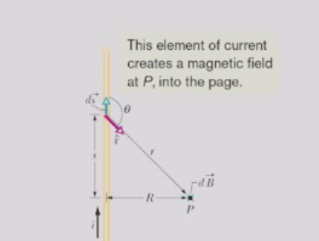
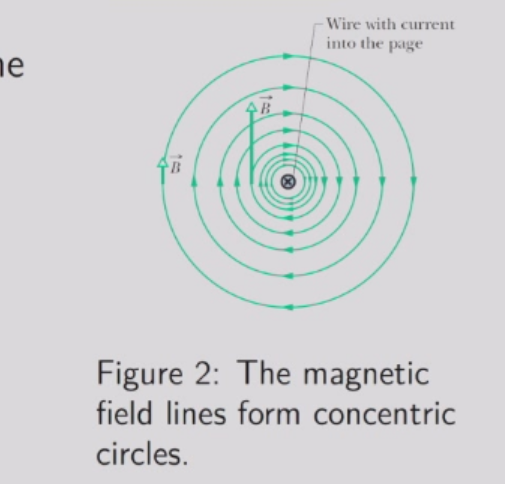
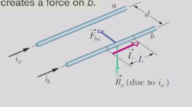
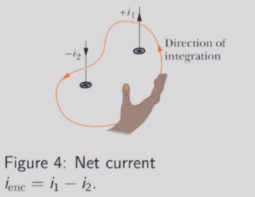
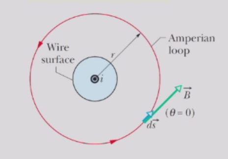
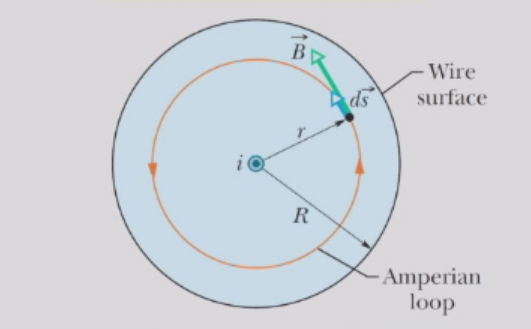
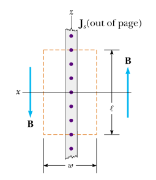
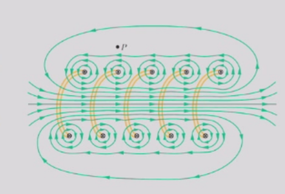
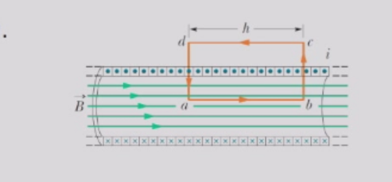

# 电流的磁场
## 毕奥-萨伐尔定律
- 实验发现，由电流长度元素 $idr$ 在距离 $r$ 处的点 $P$ 产生的磁场 $dB$ 符合平方反比定律$$d \overrightarrow{B} = \frac{\mu_{0}}{4 \pi}\frac{i d \overrightarrow{s} × \overrightarrow{r}}{r^{3}} $$其中常数 $\mu_{0} = 4 \pi × 1 0^{ - 7}T \cdot m / A$被称为磁导率常数。

### 长直导线产生的磁场
根据毕奥-萨伐尔定律，该电流元在P点产生的磁场方向指向纸内。

$$d \overrightarrow{B} = \frac{\mu_{0}}{4 \pi}\frac{i d \overrightarrow{s} × \overrightarrow{r}}{r^{3}}= \frac{\mu_{0}}{4 \pi}\frac{i d \overrightarrow{s} × \overrightarrow{R}}{r^{3}}$$

将$dB$从$s = - ∞$积分到$∞$，我们得到

$$B = \frac{\mu_{0}}{4 \pi}\int_{ - \infty}^\infty \frac{i R d s}{r^{3}} = \frac{\mu_{0}i}{4 \pi R}[\int_{ - \infty}^\infty \frac{R^{2}d s}{r^{3}}] 
$$

其中括号中的积分是无量纲的。

注意$sinθ= R/r$ 和 $cosθ=-s/r$。我们还知道 $dr/ds = s/r$，因此

$$\cos \theta d \theta = d ( \sin \theta ) = - \frac{R}{r^{2}} \frac{d r}{d s} d s = - \frac{R}{r^{2}} \frac{s}{r} d s = \cos \theta \frac{R d s}{r^{2}}
$$ 

因此，

$$
\int_{ - \infty}^{\infty}\frac{R^{2}d s}{r^{3}} = \int_{0}^{\pi}\sin \theta d \theta = 2
$$ 

最后我们有

$$
B = \frac{\mu_{0}i}{2 \pi R}
$$

其方向遵循右手定则。

#### 两平行导线之间的力
导线a中的电流产生一个磁场$B_{a} = \frac{\mu_{0}i_{a}}{2 \pi d}$在导线b上，指向下方。
导线b上长度为L的导线所受的力是

$$
F_{b a} = |i_{b}\overrightarrow{L} × \overrightarrow{B}_{a}| = \frac{\mu_{0}L i_{a}i_{b}}{2 \pi d}
$$ 

其中L是导线的长度向量。

## 安培定律
### 磁场环流
磁场环流围绕长直导线的磁场强度随着我们远离导线而减弱（精确地遵循1/r的规律）。  
对于闭合路径，或安培环路，我们可以将磁场的环流定义为$环流=∮B·dS$。  
对于长直导线，环流与绕导线的路径无关。当我们远离导线时，路径变长但磁场减弱。
### 安培定律
- 安培定律在一般情况下将稳恒电流与其产生的环形磁场联系起来：

$$
\oint \overrightarrow{B} \cdot d \overrightarrow{s} = \mu_{0} i_{e n c}
$$ 

其中$i_{enc}$是闭合回路所包围的净电流。 

- 电流是有方向的，将右手弯曲成安培环路，手指指向积分方向。通过环路的电流若与伸出的拇指方向一致则标记为正，反之则标记为负。  

### 安培定律的应用
#### 在长直导线外部
长直导线具有圆柱对称性；磁场B也具有这种对称性。安培定律告诉我们导线表面安培环路$$\oint \overrightarrow{B} \cdot d \overrightarrow{s} = B ( 2 \pi r ) = \mu_{0} i $$
$$
B = \frac{\mu_{0}i}{2 \pi r}
$$

#### 在长直导线内部
假设电流均匀分布在导线的横截面上，电流产生的磁场必须具有圆柱对称性。对于穿过导线内部的同心安培环路，仅使用环路所包围的电流来应用安培定律。
$$
i_{e n c} = i \frac{\pi r^{2}}{\pi R^{2}}
$$
由安培定律 
$$
B = \frac{\mu_{0}i_{e n c}}{2 \pi r} = \frac{\mu_{0}i}{2 \pi R^{2}}r
$$

#### 移动电荷的平面
考虑一个无限大平面，其电流密度为Js，方向为 y 方向。对称性表明磁场方向如图所示。安培定律可应用于矩形路径：
$$
\oint \overrightarrow{B} \cdot d \overrightarrow{s} = 2 B \ell = \mu_{0} ( J_{s} \ell)
$$
$$B = \frac{\mu_{0}J_{s}}{2}
$$

#### 螺线管
螺线管的磁场螺线管是一种长而紧密缠绕的螺旋线圈。我们假设螺线管的长度远大于其直径。

在理想螺线管的极限情况下，该螺线管无限长且由紧密排列的方线圈构成，其内部磁场均匀且与螺线管轴线平行。螺线管外部的磁场为零。  
取安培环路abcda。将安培定律应用于理想螺线管，我们发现$$\oint \overrightarrow{B} \cdot d \overrightarrow{s} = \mu_{0} i_{e n c} $$  
环路积分可以分解为四个部分，且唯一非零贡献是$$
\int_{a}^{b}\overrightarrow{B}\cdot d \overrightarrow{s} = B h
$$  
在其他部分，$\overrightarrow{B}$要么垂直于$d \overrightarrow{s}$，要么为零。

设n为螺线管单位长度的匝数；则线圈包围了nh匝$$
i_{e n c} = i(n h)
$$  
安培定律由此给出$$
B h = \mu_{0}i n h 或B = \mu_{0}i n
$$ 
## 磁场的旋度
根据斯托克斯定理或旋度的基本定理，$$
\int_{S}(\nabla × \overrightarrow{v})\cdot d \overrightarrow{A} = \oint_{P}\overrightarrow{v}\cdot d \overrightarrow{s}
$$
将定理应用于安培定律，我们得到，对于任意表面S，$$
\int_{S}(\nabla × \overrightarrow{B})\cdot d \overrightarrow{A} = \oint \overrightarrow{B}\cdot d \overrightarrow{s} = \mu_{0}i_{e n c} = \mu_{0}\int_{S}\overrightarrow{J}\cdot d \overrightarrow{A}
$$ 
其中 $\overrightarrow{J}$ 是电流密度。因此，
$$
\nabla × \overrightarrow{B}(\overrightarrow{r}) = \mu_{0}\overrightarrow{J}(\overrightarrow{r})
$$
所以磁场的旋度一般不等于0，磁场是一个有旋场。
### 磁场的散度
对于体积电流，毕奥-萨伐尔定律变为$$
\overrightarrow{B}(x , y , z) = \frac{\mu_{0}}{4 \pi}\int \frac{\overline{J}(x ' , y ' , z ') × \overline{r}}{r^{3}}d x ' d y ' d z '
$$ 
其中长度元$id\overrightarrow{s}$由体积元替换。$\overrightarrow{r} = (x - x ')\hat{x} + (y - y ')\hat{y} + (z - z ')\hat{z}$.应用散度，我们得到$$
\nabla \cdot \bar{B} = \frac{\mu_{0}}{4 \pi}\int \nabla \cdot \left(\frac{\overrightarrow{J} × \overrightarrow{r}}{r^{3}}\right)d V^{\prime}
$$
由于散度不适用于J，而J不依赖于$(x,y,z)$，我们可以重写
$$
\nabla \cdot \overrightarrow{B} = - \frac{\mu_{0}}{4 \pi}\int J \cdot(\nabla × \frac{\overrightarrow{r}}{r^{3}})d V '
$$
注意$F/r³ = - ▽(1/r)$的表达式，这是点电荷（q = 4πϵ₀）的电场；它不会绕行，只会向外扩散。其旋度为零（电动力学中已知）。因此，我们得出结论$\triangledown \cdot \bar{B} = 0$  

麦克斯韦的磁通量定律通过构造闭合的高斯面，可以得到 $\triangledown \cdot \bar{B} = 0$的积分形式：
$$
\oint \bar{B} d \overline{A} = \int ( \nabla \cdot \overrightarrow{B} ) d V = 0
$$ 
在第一个等式中，我们应用了散度定理。该定律指出，通过任何闭合高斯面的净磁通量为零。这表明磁单极子不存在。存在的最简单磁结构是磁偶极子。
这表明磁场的散度为0。则**磁场是一个无源有旋场**，相对的，**静电场是一个有源无旋场**。