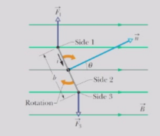
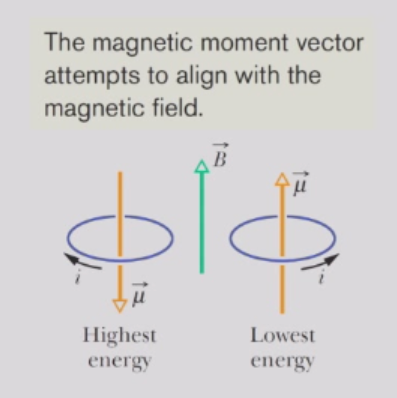
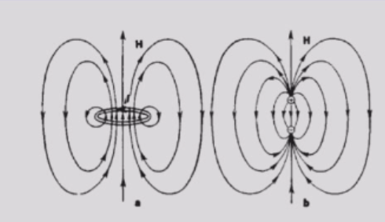
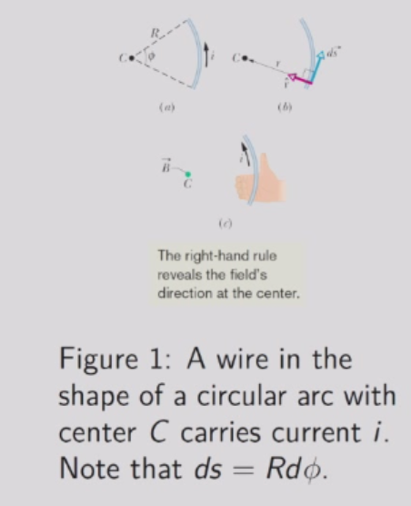
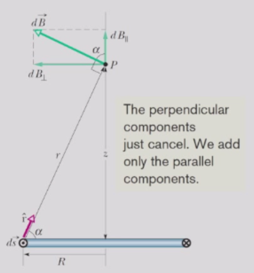
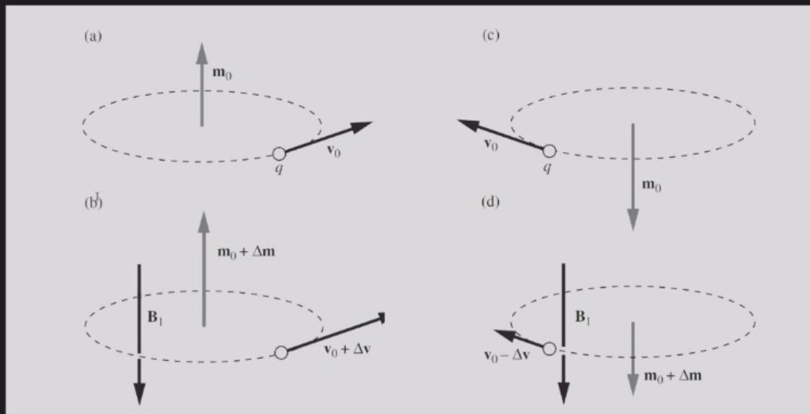

# 磁性材料
## 磁偶极子
- 磁偶极子可以有不同的起源。它可以是载流线圈，永久磁铁，带电球体的旋转（例如地球）等等。
- 对磁性的完整描述需要量子力学。但为了当前目的，我们可以用电流环来模拟磁偶极子，并解释一些磁现象。
- 首先，我们可以为磁偶极子分配一个磁偶极矩$\overrightarrow{\mu}$。例如，载流线圈的偶极矩为
$$
\overrightarrow{\mu} = N i \overrightarrow{A}
$$
- 其中 N 是线圈的匝数，i 是每匝线圈的电流，$\overrightarrow{A}$ 是线圈的面积矢量。外部B将使线圈以总扭矩$τ=μ×B$旋转。引入θ，我们有:
$$
\tau = - \mu B \sin \theta = - \frac{\partial}{\partial \theta}( - \mu B \cos \theta)
$$

- 因此，我们可以定义磁偶极子的能量，该能量取决于其在场中的取向。
$$
U_{B} = - \overrightarrow{\mu}\cdot \overrightarrow{B} = - \mu B \cos \theta
$$ 
它倾向于与磁场对齐。

### 与电偶极子的比较
- 磁偶极子：$\overrightarrow{\mu} = N i \overrightarrow{A}$，$\tau_{B} = \overrightarrow{\mu} × \overrightarrow{B}$，$U_{B} = - \overrightarrow{\mu}\cdot \overrightarrow{B}$
- 电偶极子：$\overrightarrow{p} = q \overrightarrow{d}$，$\tau_{E} = \overrightarrow{p} × \overrightarrow{E}$，$U_{E} = - \overrightarrow{p}\cdot \overrightarrow{E}$
电场线与磁场线之间的一个显著区别是，电场线始于正电荷并终止于负电荷，而磁场线总是形成闭合回路。

### 导线圆弧的磁场

根据毕奥-萨伐尔定律
$$
d \overrightarrow{B} = \frac{\mu_{0}}{4 \pi}\frac{i d \overrightarrow{s} × \overrightarrow{r}}{r^{3}}
=\frac{\mu_{0}}{4 \pi}\frac{i d \overrightarrow{s} × \hat{r}}{R^{2}}= \frac{\mu_{0}i \hat B}{4 \pi R}d \phi
$$

积分$d\phi$，我们得到
$$
B = \frac{\mu_{0}i \phi}{4 \pi R}
$$

请注意，该公式仅适用于电流圆弧的曲率中心处的磁场

在单匝线圈中心或完整圆形电流环中，
$$
B = \frac{\mu_{0}i}{2 R}
$$
线圈的磁偶极矩为$μ = iA = iπR²$。因此我们得到在圆环中心处：
$$
B = \frac{\mu_{0}}{2 \pi}\frac{\mu}{R^{3}}
$$

考虑一个位于环形线圈中心轴上的点P，该点距离环形线圈平面的距离为z。从对称性可知，所有环形线圈微元ds产生的所有垂直分量$\overrightarrow{B}$的矢量和为零。这仅剩下轴向（平行）的磁场：
$$
d B_{\|} = \frac{\mu_{0}}{4 \pi}\frac{i d s}{r^{2}}\cos \alpha
$$ 

由于$r^{2} = R^{2} + z^{2}$，我们有
$$
\cos \alpha = \frac{R}{r} = \frac{R}{\sqrt{R^{2} + z^{2}}}
$$
因此
$$
B = \int d B_{\|} = \frac{\mu_{0}i R}{4 \pi(R^{2} + z^{2})^{3 / 2}}\int d s
$$

因为∫ds就是环的周长2πR，我们得到了所需的公式，其中$\mu = i \pi R^{2}$ 
$$
B(z) = \frac{\mu_{0}}{2 \pi}\frac{\mu}{(R^{2} + z^{2})^{3 / 2}}
$$
## 磁性材料
- 磁性材料磁性材料可以被视为由磁偶极矩（原子起源）组成的集合，每个偶极矩都有一个北极和一个南极。它们对外部磁场作出反应，产生磁场，因此它们相互作用。
- 根据原子的磁偶极矩以及原子间的相互作用，材料的磁性可分为顺磁性、抗磁性、铁磁性等。
### 顺磁性材料
- 顺磁性顺磁性发生在原子具有永久磁偶极矩的材料中。
- 在没有外部磁场的情况下，这些原子偶极矩是随机取向的，材料的净磁偶极矩为零。
- 在外部磁场中，磁偶极矩倾向于与磁场方向对齐，从而使样品产生净磁偶极矩。
- 我们可以定义矢量量磁化强度M为单位体积内的净磁偶极矩。
- 1895年，皮埃尔·居里通过实验发现$M = C \frac{B_{e x t}}{T}$ ,其中T是开尔文温度。这被称为居里定律，C被称为居里常数。
    - 增加外部磁场$B_{e x t}$会使得样品中的原子偶极矩趋于对齐，从而增加磁化强度M。
    - 增加T会导致通过热扰动破坏对齐，从而降低M。
### 抗磁性材料
- 顺磁性物质总是被磁铁吸引，而抗磁性物质会被强磁铁排斥。
- 反磁性存在于所有材料中，但微弱的效应只有在原子偶极矩为零的材料中才可观测到。
- 这种材料可以通过等量的电子顺时针或逆时针绕行来建模。外部磁场会加速或减速这些电子，从而产生净磁偶极矩。

- 无论是顺时针还是逆时针，磁矩矢量的变化方向与外部磁场B₁方向总是相反。
### 铁磁性材料
- 铁磁性铁磁体具有强而持久的磁性。铁磁体与顺磁体的区别在于相邻原子之间存在强相互作用。
- 相互作用使原子的偶极矩在磁场移除后仍保持对齐。