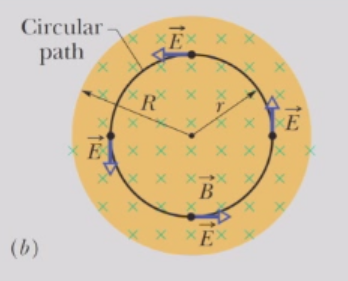

# 法拉第电磁感应定律
## 法拉第电磁感应定律
首先，我们定义穿过环路的磁通量为
$$
\Phi_{B} = \int \overrightarrow{B}\cdot d \overrightarrow{A}
$$ 
其中积分是在环路所包围的面积$A$上进行的。定量上，法拉第感应定律指出，导体回路中感应的电动势E的大小等于通过该回路的磁通量$\Phi_{B}$随时间变化的速率，即
$$
\mathcal E = - \frac{d \Phi_{B}}{d t}
$$
对于一个$N$匝的线圈，总感应电动势为
$$
\mathcal E = - N \frac{d \Phi_{B}}{d t}
$$
## 变化磁场与电场的关系
考虑一个电荷为q₀的粒子在变化的磁场中沿圆形路径运动。由感应电场在一周内对其所做的功为$W = q₀\mathcal E$。
从功的本质来看：
$$
W = \oint \overrightarrow{F} \cdot d \overrightarrow{s} = q_{0} \oint \overrightarrow{E} \cdot d \overrightarrow{s}
$$ 
因此，我们发现
$$
\mathcal E = \frac{W}{q_{0}} = \oint \overrightarrow{E} \cdot d \overrightarrow{s}
$$

感应电动势可以被重新定义：感应电动势是沿闭合路径对$\overrightarrow{E}\cdot d\overrightarrow{s}$进行积分的总和，其中$\overrightarrow{E}$是由于变化的磁通量而产生的电场，$d\overrightarrow{s}$是路径上的微分长度向量。现在，我们可以将法拉第定律重写为
$$
\oint \overrightarrow{E} \cdot d \overrightarrow{s} = - \frac{d \Phi_{B}}{d t} = - \frac{d}{d t} \int \overrightarrow{B} \cdot d \overrightarrow{A}
$$
注意，环路的选择是任意的。

我们可以通过应用斯托克斯定理（或旋度的基本定理）将其转换为微分形式
$$
\int_{S}(\nabla × \overrightarrow{v})\cdot d \overrightarrow{A} = \oint_{P}\overrightarrow{v}\cdot d \overrightarrow{s}
$$
因此，法拉第定律的微分形式为：
$$
\nabla × \overrightarrow{E} = - \frac{\partial \overrightarrow{B}}{\partial t}
$$ 

即，精确地说，变化的磁场会产生电场。此处我们使用B的偏导数，该导数可能在空间中变化。

## 电势的无意义性
在静电学中，电场强度是一个特殊的矢量，其旋度始终为零，
$$
\nabla × \overrightarrow E = - \nabla \times(\nabla V) = 0
$$ 
在电动力学中，这一情况已不再成立。事实上，感应产生的电场中，电势没有意义，因为通常情况下，
$$
\oint \overrightarrow{E} \cdot d \overrightarrow{s} = - \frac{d \Phi_{B}}{d t} ≠ 0
$$ 
因此下列定义是没有意义的
$$
V_{f} - V_{i} = - \int_{i}^{f}\overrightarrow{E}\cdot d \overrightarrow{s}
$$