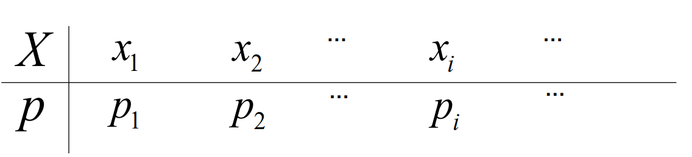

# 随机变量及其概率分布
## 随机变量
设随机变量的样本空间为$S$，若$X=X(e)$为定义在样本空间$S$上的实值单值函数，则称$X$为随机变量。

随机事件可以表示为$A=\{e\in S:X(e)\in I\}={X \in I}$，其中$I$为事件的定义域。
## 离散型随机变量
### 概率分布律/列
- 设$X$为离散型随机变量，若其可能的取值为$x_1,x_2,\cdots,x_n,\cdots$，即$S=\bigcup_{i=1}^{+\infty}\{X= x_i\}$，  
则称$P(X=x_i)=p_i , i=1,2,\cdots$为$X$的概率分布律，它也可以用下表表示：

- 概率分布律需包含：离散型的所有可能取值以及每个可能取值取到的概率。
- 概率分布率必须满足两条性质：
    - 非负性：$0\leq p_i\leq 1,i=1,2,\cdots$
    - 归一性：$\sum_{i=1}^{+\infty}p_i=1$
### 几个重要的离散型随机变量
#### $0-1(p)$分布
若随机变量$X$的概率分布律为：
$$
P(X=0)=1-p,P(X=1)=p, p\in (0,1)
$$
则称$X$为服从参数为$p$的$0-1(p)$分布，也称为两点分布，记作$X\sim B(1,p)$。
##### 伯努利试验
对于一个随机试验，设$A$是一个随机事件，且$P(A)=p, p\in (0,1)$。若仅考虑事件$A$发生与否，则可定义一个服从参数为$p$的$0-1$分布的随机变量$X$:  

$$
X=\begin{cases}1,&A\text{发生}\\0,&A\text{不发生}\end{cases}
$$ 

来描述这个随机试验的结果。
只有两个可能结果的试验，称为伯努利试验。故两点分布也称为伯努利分布。
#### 二项分布
##### n重伯努利试验
将一个伯努利试验独立的重复进行n次，则这一串重复的独立试验称为n重伯努利试验。
##### 定义
若随机变量$X$的概率分布律为：  

$$
P(X=k)=\binom{n}{k}p^k(1-p)^{n-k}, k=0,1,2,\cdots,n
$$  

其中$n>=1$，$p\in (0,1)$，则称$X$为服从参数为$n$和$p$的二项分布，记作$X\sim B(n,p)$。
#### 泊松分布
若随机变量$X$的概率分布律为：  

$$
P(X=k)=\frac{\lambda^k e^{-\lambda}}{k!}, k=0,1,2,\cdots
$$
其中$\lambda>0$，则称$X$为服从参数为$\lambda$的泊松分布，记作$X\sim P(\lambda)$。
## 连续型随机变量
### 分布函数
设$X$为随机变量，对任意实数$x\in \mathbb{R}$，定义$F(x)$为$X$的概率分布函数： 

$$F_X(x)=P(X\leq x)=P(X \in [-\infty,x]),-\infty<x<\infty$$  

简称为分布函数，有时也写为$F_X(x)=P(X<=x)$。  
任何随机变量都有相应的分布函数。
#### 性质
- 单调不减：$x<y\Longrightarrow F_X(x)\leq F_X(y)$
- $F(-\infty)=lim_{x\to -\infty}F_X(x)=0$
- $F(\infty)=lim_{x\to \infty}F_X(x)=1$
- $F_X(x)$是右连续函数，即$\forall x F(x+0)=F(x)$
#### 用途
分布函数可用来表示出随机变量落入实数轴上任意一个范围的概率。

$P(a<X\leq b)=F_X(b)-F_X(a)$  
$P(a\leq X\leq b)=F_X(b)-F_X(a-0)$  
$P(a<X<b)=F_X(b-0)-F_X(a)$  
$P(a\leq X<b)=F_X(b-0)-F_X(a-0)$  
一般的，离散型随机变量的分布函数为阶梯函数。  
若离散型随机变量$X$的概率分布律为$P(X=x_i)=p_i$，则分布函数为：$F_X(x)=\sum_{x_i\leq x}^{}p_i$。  
该分布函数$F(x)$在$x=x_i$处有跳跃，其跳跃度为$p_i$。
### 定义
- 对于随机变量X的分布函数$F(x)$，若存在非负的函数$f(x)$，对于任意实数x，均有
$$
F(x) = \int_{ - \infty}^{x}f(t)d t , \forall x \in \mathbb R 
$$
则称X为连续型随机变量，其中f(x)称为X的概率密度函数。
### 性质
- $f(x)\ge 0$ 
- $\int_{ - \infty}^{\infty}f(x)d x = 1$
- 对于连续型的随机变量 X，概率密度函数为$f(x)$，则对于任意的实数：$x_{1} , x_{2}$，$x_{1}<x_{2}$，$P(x_{1}< X \le x_{2}) = \int_{x_{1}}^{x_{2}}f(x)d x$ 。
    - $P(X = a) = 0 , \forall a \in \mathbb R$ 
    - $P(X ∈ I) = ∫_{I}f(x)dx , I ⊂ ℝ$
- 对于$f(x)$的连续点x,有$F'(x)=f(x)$，即此时有$f(x) = F '(x) = \lim_{\Delta x \rightarrow 0}\frac{F(x + \Delta x) - F(x)}{\Delta x} = \lim_{\Delta x \rightarrow 0}\frac{P(x < X \le x + \Delta x)}{\Delta x}$。  
>说明：$f(x)$ 值的含义当充分小时，$P(x < X \le x + \Delta x)\approx f(x)\cdot \triangle x$；  
$f(x)$ 的值有可能大于1。  
连续型随机变量：概率密度函数⇌ 分布函数  $$f(x)\Rightarrow F(x) by \int_{ - \infty}^{x}f(t)d t ;
$$
$$
f(x)\Leftarrow F(x)b y \frac{d}{d x}F(x)
$$
### 几个重要的连续型随机变量
#### 均匀分布
- 若随机变量$X$的概率密度函数为：
$f ( x ) = \begin{cases} \frac{1}{b - a} , & x \in ( a , b ) , \cr 0 , & 其 他 , \end{cases}$

- 其中 $a < b$，则称 X 服从区间 (a,b)上的均匀分布（uniform distribution），记作 $X \sim U(a,b)$。  
设$a ≤ c < c + s ≤ b$,则
$$
P(c < X < c + s) = \int_{c}^{c + s}\frac{1}{b - a}d t = \frac{s}{b - a}
$$
- 与c无关，仅与区间长度 s有关。(等可能性)
- 根据概率密度函数的定义，可得均匀分布 $X\sim U(a，b)$的分布函数为$F ( x ) = \begin{cases} 0 , & x < a , \cr \frac{x - a}{b - a} , & a \le x < b , \cr 1 , & x \ge b . \end{cases}$
#### 指数分布
- 设随机变量 X 具有概率密度函数
$$
f ( x ) = \begin{cases} \lambda e^{ - \lambda x} , & x > 0 , \cr 0 , & x \le 0 , \end{cases}
$$
其中$\lambda > 0$，则称 X 服从参数为 $\lambda$ 的指数分布，记作$X \sim Exp(λ)$ 或 $X\sim  E(λ)$。
- 根据概率密度函数的定义，可得指数分布 $X \sim E(λ)$的分布函数为$F(x) = \begin{cases}1 - e^{ - \lambda x} , & x > 0 , \cr 0 , & x \le 0 . \end{cases}$
- 指数分布还具有一个重要的性质———“无记忆性”：即对任意的$t > 0 , t_{0}> 0$，有$P(X > t_{0} + t|X > t_{0}) = \frac{P(X > t_{0} + t)}{P(X > t_{0})} = \frac{1 - F(t_{0} + t)}{1 - F(t_{0})} = {e}^{ - \lambda t} = P(X > t)$  
- 这也意味着，对于任意的$t > 0 , t_{0}> 0$，在$\{X > t_{0} \}$的条件下，$X - t_{0}$服从指数分布(即其条件分布为指数分布)。
#### 正态分布
设随机变量 $X$ 具有概率密度函数
$$
f(x) = \frac{1}{\sqrt{2 \pi}\sigma}\textrm e^{ - \frac{(x - \mu)^{2}}{2 \sigma^{2}}} , - \infty < x < + \infty
$$
其中$σ > 0 , - ∞ < μ < + ∞$ ，则称 $X$ 服从参数为$μ,σ$ 的正态分布，或简称 $X$ 为正态变量，也常称为 Gauss 分布，记作$X \sim N(μ , σ²)$。
##### 性质
正态变量$X\sim N(\mu , \sigma^{2})$的概率密度函数$f(x) = \frac{1}{\sqrt{2 \pi}\sigma}\textrm e^{ - \frac{(x - \mu)^{2}}{2 \sigma^{2}}} , - \infty < x < + \infty$具有如下性质：

  - $f(x)$ 关于 $x=μ$对称
  - 当$x > μ$时，$f(x)$关于$x$严格单调下降
  - $f_{\max} = f(\mu) = \frac{1}{\sqrt{2 \pi}\sigma}$
  - $\lim_{\mid x - \mu \mid \rightarrow + \infty} f ( x ) = 0$
  - 在$x = μ ± σ$处曲线有拐点

##### 参数的含义
不同的$μ$和$σ²$对概率密度函数图像的影响(两参数的含义)：

- 当固定$σ$，改变$μ$的大小时，$f(x)$的图像形状不变，只是沿着x轴作平移变换。
- 当固定$μ$,改变$σ$的大小时,$f(x)$ 的图像对称轴不变，而形状在改变，$σ$越小，图形越高越瘦，$σ$越大，图形越矮越胖。
- 通常称$μ$为位置参数（决定曲线对称轴位置），$σ$为尺度参数（决定曲线分散程度）。
##### 标准正态分布
若 $Z\sim N(0,1)$，则称 $Z$ 服从标准正态分布。
###### 性质
- 概率密度函数为$\varphi(z) = \frac{1}{\sqrt{2 \pi}}{e}^{ - \frac{z^{2}}{2}}$
- 分布函数为$Φ(z) = ∫_{-∞}^z φ(t) dt$
- 注意到$\varphi(z) = \frac{1}{\sqrt{2 \pi}}{e}^{ - \frac{z^{2}}{2}}$是偶函数，因此标准正态分布的分布函数具有下面这个重要性质：$\Phi( - z_{0}) = 1 - \Phi(z_{0}) , \forall z_{0}\in \mathbb R$
- 当$X -N(\mu , \sigma^{2})$，则有$\frac{X - \mu}{\sigma}-N(0 , 1)$。由此可知，当$X -N(\mu , \sigma^{2})$时，对于任意实数a，有$F_{X}(a) = P(X \le a) = P \left(\frac{X - \mu}{\sigma}\le \frac{a - \mu}{\sigma}\right) = \Phi \left(\frac{a - \mu}{\sigma}\right)$。
### 连续性随机变量密度函数的关系
设随机变量X的概率密度函数为$f_X(x)$，已知$Y=g(X)$，其中$g'(x)>0$（或$g'(x)<0$），则$Y$的概率密度函数为:
$$
f_Y(y) = \begin{cases} f_X(h(y))\cdot |h'(y)| , & \alpha < y < \beta , \cr 0 , & 其他 , \end{cases}
$$
其中$\alpha = g( - \infty) , \beta = g(\infty)(当g'(x)<0时，\alpha = g(\infty) , \beta = g( - \infty))$    
$h(y) = x \iff y = g(x)$

设随机变量 $X$ 的概率密度函数为$f_{X}(x)$，$Y = g(X)$ ,$X$的支撑为$\{x : f(x)> 0\} = (a , b)$。若当$a<x<b$时，有$g'(x)>0$(或$g'(x)<0$),则 Y 的概率密度函数为
$$
f_Y(y) = \begin{cases} f_X(h(y))\cdot |h'(y)| , & \alpha < y < \beta , \cr 0 , & 其他 , \end{cases}
$$
其中$\alpha = \min(g(a) , g(b))$，$\beta = \max(g(a) , g(b))$   
$h(y) = x \iff y = g(x)$

### 一般解法（对于非单调函数）
- 先求分布函数之间的关系
- 再通过求导求概率密度函数

设 $X$ 服从参数为$λ$的指数分布，$F(x)$为$X$的分布函数.设 $Y=F(X)$，试证：$Y\sim U(0,1)$(即均匀分布):
解:  
由指数分布的定义知，
$$
F(x) = \begin{cases}1 - e^{ - \lambda x} , & x > 0 , \cr 0 , & x \le 0 . \end{cases}
$$
现在
$$
Y = F(X) = \begin{cases}1 - e^{ - \lambda X} , & X > 0 , \cr 0 , & X \le 0 . \end{cases}
$$
因此$P(0 \le Y \le 1) = 1$  

当$y<0$时，$F_{Y}(y) = P(Y \le y) = 0$；当$y \ge 1$时，$F_{Y}(y) = P(Y \le y) = 1$；当$0 \le y < 1$时，
$$
F_{Y}(y) =P(1-e^{-\lambda X} \le y)=P(X \le -\frac{1}{\lambda}\ln(1-y))=1-e^{-\lambda[-\frac{1}{\lambda}\ln(1-y)]}=y
$$
所以
$$
F_{Y} ( y ) = \begin{cases} 0 , & y < 0 , \cr y , & 0 \le y < 1 , \cr 1 , & y \ge 1 . \end{cases}$$ 
即 $Y\sim U(0,1)$

注：也可利用定理(推论)来做，此时
$$
g^{ - 1}(y) = - \frac{1}{\lambda}\ln(1 - y) , \frac{d}{d y}g^{ - 1}(y) = \frac{1}{\lambda}\cdot \frac{1}{1 - y}
$$