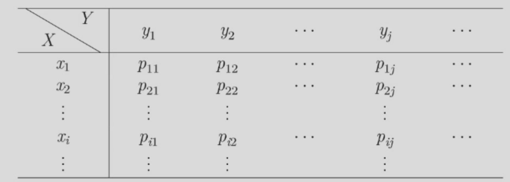

# 多维随机变量
## 二维随机变量
### 定义
设一随机试验$E$的样本空间为$S$，定义$S$上的随机变量 $X=X(e),Y=Y(e)$，称它们构成的向量$(X,Y)$为二维(元)随机向量或二维(元)随机变量
### 二维离散型随机变量
若二维随机变量$(X，Y)$的全部可能取值为有限对或可列无限对（即至多可列对），则称$(X，Y)$是二维（元）离散型随机变量。
#### 离散型随机变量的联合
设二维离散型随机变量$(X，Y)$的可能取值为$(x_{i} , y_{j}) , i , j = 1 , 2 , \dotsc$，与一维离散型随机变量相似，称
$$
P(X = x_{i} , Y = y_{j}) = p_{i j} , i , j = 1 , 2 , \dotsc
$$
为$(X,Y)$的联合概率分布律 (joint probability mass function), 简称联合分布律。

联合概率分布律也可以用列表方式表示：

联合概率分布律具有以下性质：(1)$p_{i j}≥0,i,j=1,2,...$，(2) $\sum_{i = 1}^{\infty} \sum_{j = 1}^{\infty} p_{i j} = 1$
#### 边际分布律
设二维离散型随机变量$(X，Y)$的联合分布律为$P(X = x_{i} , Y = y_{j}) = p_{i j} , i , j = 1 , 2 , \dotsc$，则：
$$
P(X = x_{i}) =P(\bigcup_{j=1}^{\infty} {X = x_{i} , Y = y_{j}}) = \sum_{j = 1}^{\infty} p_{i j}=p_{i.} , i = 1 , 2 , \dotsc
$$
$$
P(Y = y_{i}) =P(\bigcup_{i=1}^{\infty} {X = x_{i} , Y = y_{j}}) = \sum_{i = 1}^{\infty} p_{i j}=p_{.j} , j = 1 , 2 , \dotsc
$$
易知上述式子满足概率分布律的性质，称$P(X = x_{i})$和$P(Y = y_{i})$分别为$X$和$Y$的边际分布律。
#### 条件分布
设二维离散型随机变量$(X，Y)$的联合分布律为
$$
P(X = x_{i} , Y = y_{j}) = p_{i j} , i , j = 1 , 2 , \dotsc
$$
对于某固定的$y_{j}$（$P(Y = y_{j}) = p_{.j} ≠ 0$），则称
$$
P(X = x_{i}|Y = y_{j}) = \frac{P(X = x_{i} , Y = y_{j})}{P(Y = y_{j})} = \frac{p_{i j}}{p_{. j}}，i = 1 , 2 , \dotsc
$$
为给定$\{Y=y_{j}\}$条件下$X$的条件分布律。  
同理，对于某固定的$x_{i}$（$P(X = x_{i}) = p_{i.} ≠ 0$），则称
$$
P(Y = y_{j}|X = x_{i}) = \frac{P(X = x_{i} , Y = y_{j})}{P(X = x_{i})} = \frac{p_{i j}}{p_{i.}}，j = 1 , 2 , \dotsc
$$
为给定$\{X=x_{i}\}$条件下$Y$的条件分布律。
>注：条件分布律也是分布律，也包含两部分内容，一是可能取值，二是每个可能取值取到的概率(此处为条件概率)；即也需满足概率分布律的两条本质性质。

#### 二维随机变量的联合分布函数
设$(X，Y)$是二维随机变量，对于任意实数$x，y$，称二元函数
$$
F(x , y) = P\{(X\le x) \cap (Y\le y)\}=P\{(X\le x , Y\le y)\},\forall x\in\mathbb{R},\forall y\in\mathbb{R}
$$
为二维随机变量$(X，Y)$的联合 (joint)分布函数，即
$$
F(x , y) = P\{(X , Y)\in(\infty , x]\times(\infty , y]\}
$$
##### 性质
易见$0\le F(x , y) \le 1$，此外还具有：

- $F(x,y)$ 关于 $x,y$均单调不减, 即
$$
x_{1}< x_{2}\Rightarrow F(x_{1} , y)\le F(x_{2} , y);\quad  y_{1}< y_{2}\Rightarrow F(x , y_{1})\le F(x , y_{2})
$$

- $F(+\infty , +\infty)=1$，且对任意 $x,y$
$$
F( - \infty , y) = F(x , - \infty) = F( - \infty , - \infty) = 0
$$

- $F(x,y)$ 关于 $x,y$ 右连续, 即
$$
\lim_{\varepsilon \rightarrow 0^{ + }}F(x + \varepsilon , y) = F(x , y); \quad\lim_{\varepsilon \rightarrow 0^{ + }}F(x , y + \varepsilon) = F(x , y)
$$

- 若$x₁ < x₂ , y₁ < y₂$ ,则
$$
P(x_{1}< X \le x_{2} , y_{1}< Y \le y_{2}) = F(x_{2} , y_{2}) - F(x_{2} , y_{1}) - F(x_{1} , y_{2}) + F(x_{1} , y_{1})\ge 0
$$
##### 与二维分布律的相互推导
二维离散型随机变量$(X，Y)$的联合分布律为$$
P(X = x_{i} , Y = y_{j}) = p_{i j} , i , j = 1 , 2 , \dotsc
$$ 
则 (X，Y)的联合分布函数为
$$
F(x , y) = \sum_{x_{i}\le x , y_{j}\le y}p_{i j}
$$
### 二维随机变量的边际分布函数
对于二维随机变量而言，各个单个随机变量的分布函数称为边际概率分布函数或边缘概率分布函数，简称边际分布函数(marginal distribution function) 或边缘分布函数。记二维随机变量$(X,Y)$的联合分布函数为 $F(x,y)$，X,Y 的边际分布函数为 $Fx(x)，Fy(y)$，则
$$
F_{X}(x) = P(X \le x) = P(X \le x , Y < + \infty) = F(x , + \infty)
$$ 
$$
F_{Y}(y) = P(Y \le y) = P(X < + \infty , Y \le y) = F( + \infty , y)
$$ 
即二维随机变量中某一个分量的边际分布函数是其联合分布函数当另一个变量趋向于$+∞$时的极限函数。
### 二维随机变量的条件分布函数
若$P(Y=y)>0$，则在$\{Y=y\}$条件下，$X$的条件分布函数为
$$
F_{X|Y}(x|y) = P(X \le x|Y=y) = \frac{P(X \le x , Y=y)}{P(Y=y)}
$$ 
注意：若$P(Y=y)=0$，但对任意给定的$\varepsilon > 0 ,P(y < Y \le y + \varepsilon)> 0$，则在$\{Y = y\}$条件下，$X$的条件分布函数定义为

$$
\begin{aligned}
&F_{X|Y}(x|y) = \lim_{\varepsilon \rightarrow 0^{ + }}P(X \le x|y < Y \le y + \varepsilon)= \lim_{\varepsilon \rightarrow 0^{ + }}\frac{P(X \le x , y < Y \le y + \varepsilon)}{P(y < Y \le y + \varepsilon)} \\
&\equiv P(X \le x|Y=y),\forall x\in\mathbb{R}
\end{aligned}
$$

### 二维连续型随机变量
#### 二维联合概率密度函数
对于二维随机变量$(X，Y)$的分布函数为 $F(x，y)$，如果存在非负函数$f(x，y)$，使对于任意实数$x，y$，有
$$
F(x , y) = \int_{ - \infty}^{x}\int_{ - \infty}^{y}f(u , v)d u d v
$$ 
则称$(X，Y)$为二维连续型随机变量，称$f(x，y)$为二维随机变量$(X，Y)$的联合(joint) 概率密度函数.
##### 性质
- $f(x , y)\ge 0$
- $\int_{ - \infty}^{ + \infty} \int_{ - \infty}^{ + \infty} f ( x , y ) d x d y = 1$
- 若G是 xoy平面上的某个区域，则点 (X，Y)落在G中的概率为
  $$
  P((X , Y)\in G) = \int_{G}f(x , y)d x d y , \forall G \subset \mathbb{R}^{2}
  $$
- 在f(x,y) 的连续点(x,y),有
  $$
  \frac{\partial^{2}F(x , y)}{\partial x \partial y} = f(x , y)
  $$
#### 边际(边缘) 概率密度函数
对于二维连续型随机变量$(X，Y)$，联合概率密度为$f(x，y)$，称单个随机变量X（或Y）的密度函数为X（或Y）的边际（边缘）概率密度函数（marginal probability density function），分别用$f_X(x)$和$f_Y(y)$表示，即
$$
f_{X}(x) = \int_{ - \infty}^{ + \infty}f(x , y)d y
$$ 
$$
f_{Y}(y) = \int_{ - \infty}^{ + \infty}f(x , y)d x
$$
事实上：
$$
F_{X}(x) = \int_{ - \infty}^{x}f_{X}(u)d u
$$ 
$$
F_{Y}(y) = \int_{ - \infty}^{y}f_{Y}(u)d u
$$
#### 条件概率密度函数
设二维随机变量$(X，Y)$的概率密度函数为 $f(x，y)$，$(X，Y)$关于 X，Y的边际概率密度函数分别为 $f_{X}(x)$和$f_{Y}(y)$。若对于固定的$y$，$f_{Y}(y)> 0$ ,在$\{Y = y\}$的条件下，X的条件概率密度函数为
$$
f_{X|Y}(x|y) = \frac{f(x , y)}{f_{Y}(y)} , x \in \mathbb R
$$
同理，若对于固定的$x$，$f_{X}(x)> 0$，在$\{X = x \}$的条件下，Y的条件概率密度函数为
$$
f_{Y \mid X}(y \mid x) = \frac{f(x , y)}{f_{X}(x)} , y \in \mathbb R
$$ 
##### 性质
- $f_{X \mid Y}(x|y)\ge 0 , \forall x \in \mathbb R$
- $\int_{ - \infty}^{ + \infty} f_{X | Y} ( x | y ) d x = 1$
- $P(a < X < b|Y = y) = \int_{a}^{b}f_{X|Y}(x|y)d x$
- 在$f_{X|Y}(x|y)$的连续点x，有
$$
\frac{d F_{X \mid Y}(x|y)}{d x} = f_{X|Y}(x|y)
$$
- $f(x, y) = f_{X|Y}(x|y) f_Y(y) = f_X(x) f_{Y|X}(y|x)$（当所写的条件概率密度函数有意义时）
#### 常见分布
##### 二维均匀分布
设二维随机变量$(X，Y)$在二维有界区域 D 上取值，且具有联合概率密度函数
$$
f(x,y)=\begin{cases}
\frac{1}{S}, & (x,y)\in D \cr
0, & \text{otherwise}
\end{cases}
$$
其中，S为区域D的面积。则称$(X，Y)$服从D上的均匀分布。
##### 二维正态分布
设二维随机变量$(X，Y)$具有联合概率密度函数

$$
f(x,y)=\frac{1}{2\pi \sigma_1 \sigma_2 \sqrt{1-\rho^2}}e^{\left(-\frac{1}{2(1-\rho^2)}\left(\frac{(x-\mu_1)^2}{\sigma_1^2}+\frac{(y-\mu_2)^2}{\sigma_2^2}-\frac{2\rho(x-\mu_1)(y-\mu_2)}{\sigma_1\sigma_2}\right)\right)} x,y\in\mathbb{R}
$$

其中$μ₁,μ₂,σ₁,σ₂,ρ$都是常数,称$(X,Y)$ 服从参数为$(μ₁,μ₂,σ₁,σ₂,ρ)$的二维(元)正态分布，记为$(X,Y)\sim N(\mu_1,\mu_2,\sigma_1,\sigma_2,\rho)$。

### 随机变量的相互独立
设$F(x,y)$及$Fx(x),Fy(y)$分别是二维随机变量$(X,Y)$的联合分布函数及边际分布函数，若对所有的$x, y ∈ ℝ$，有
$$
P(X \le x , Y \le y) = P(X \le x)P(Y \le y)
$$ 
即
$$
F(x , y) = F_{X}(x)F_{Y}(y), \forall x , y \in \mathbb R
$$
则称随机变量$X，Y$相互独立.

若$(X，Y)$是离散型随机变量，则$X，Y$相互独立等价于
$$
P(X = x_{i} , Y = y_{j}) = P(X = x_{i})P(Y = y_{j})
$$
即$p_{i j} = p_{i.}p_{.j}$对一切$i，j$都成立。
若$(X,Y)$是连续型随机变量，$f(x,y), fx(x), fY(y)$分别是(X,Y)的联合概率密度函数和边际概率密度函数，则X，Y相互独立等价于
$$
f(x , y) = f_{X}(x)f_{Y}(y) ,几乎处处成立
$$
即在平面上除去“面积”为零的集合以外，处处成立（可以在不连续点上不相等）。

### 相互独立与联合概率密度函数的关系 
定理：若 $(X, Y)$ 为二维连续型随机变量，$f(x, y)$ 是 $(X, Y)$ 的联合概率密度函数，则连续型随机变量 $X, Y$ 相互独立的充分必要条件是  
$$
f(x, y) = m(x) · n(y)，∀x , y ∈ ℝ
$$

## n维随机变量
设 $E$ 是一个随机试验，它的样本空间是$S = \{e\}$.设$X_{1} = X_{1}(e) , X_{2} = X_{2}(e) ,\cdots X_{n} = X_{n} ( e )$是定义在 $S$ 上的随机变量，由它们构成的一个n维向量$( X_{1} , X_{2} , \cdots , X_{n} )$称为 n 维随机变量(向量)
### 联合分布函数
联合分布函数对于任意 n个实数$x_{1} , x_{2} , \cdots , x_{n}$ ，n 元函数
$$
F(x_{1} , x_{2} , \dotsc , x_{n}) = P(X_{1}\le x_{1} , X_{2}\le x_{2} , \dotsc , X_{n}\le x_{n})
$$
称为 n维随机变量$( X_{1} , X_{2} , \cdots , X_{n} )$的联合分布函数.
### 离散型随机变量的联合分布律
设$( X_{1} , X_{2} , \cdots , X_{n} )$的所有可能取值为$(x_{1 i_{1}} , x_{2 i_{2}} , \dotsc , x_{n i_{n}}) , i_{j} = 1 , 2 , \dotsc ;j = 1 , 2 , \dotsc , n$ ，则
$$
P(X_{1} = x_{1 i_{1}} , X_{2} = x_{2 i_{2}} , \dotsc , X_{n} = x_{n i_{n}}) , i_{j} = 1 , 2 , \dotsc ; j = 1 , 2 , \dotsc , n
$$
称为 n维离散型随机变量$( X_{1} , X_{2} , \cdots , X_{n} )$的联合分布律
### 连续型随机变量的联合概率密度函数
若存在非负函数$f(x_{1} , x_{2} , \dotsc , x_{n})$ ，使得对于任意实数：$x_{1} , x_{2} , \cdots , x_{n}$，有
$$
F(x_{1} , x_{2} , \dotsc , x_{n}) = \int_{ - \infty}^{x_{1}}\int_{ - \infty}^{x_{2}}\cdot \cdot \cdot \int_{ - \infty}^{x_{n}}f(t_{1} , t_{2} , \dotsc , t_{n})d t_{1}d t_{2}\cdot \cdot \cdot d t_{n}
$$ 
则称$f(x_{1} , x_{2} , \cdot \cdot \cdot \cdot , x_{n})$为 n 维连续型随机变量$( X_{1} , X_{2} , \cdots , X_{n} )$的联合概率密度函数。
### 随机变量的相互独立
若对于所有的$x_{1} , x_{2} , \cdots , x_{n}\in \mathbb R$ ,有
$$
F(x_{1} , x_{2} , \dotsc , x_{n}) = F_{X_{1}}(x_{1})F_{X_{2}}(x_{2})\cdots \cdot \cdot F_{X_{n}}(x_{n})
$$ 
则称$X_{1} , X_{2} , \cdots , X_{n}$是相互独立的。
#### 定理1
设$(X_{1} , X_{2} , \dotsc , X_{m})$的分布函数为$F_1(x_{1} , x_{2} , \dotsc , x_{m})$，$(Y_{1} , Y_{2} , \dotsc , Y_{n})$的分布函数为$F_2(y_{1} , y_{2} , \dotsc , y_{n})$，则$(X_{1} , X_{2} , \dotsc , X_{m} , Y_{1} , Y_{2} , \dotsc , Y_{n})$的分布函数为$F(x_{1} , x_{2} , \dotsc , x_{m} , y_{1} , y_{2} , \dotsc , y_{n})$，若
$$
F(x_{1} , x_{2} , \dotsc , x_{m} , y_{1} , y_{2} , \dotsc , y_{n}) = F_{1}(x_{1} , x_{2} , \dotsc , x_{m})F_{2}(y_{1} , y_{2} , \dotsc , y_{n})
$$
则称$( X_{1} , X_{2} , \dotsc , X_{m} )与(Y_{1} , Y_{2} , \dotsc , Y_{n})$相互独立
#### 定理2
设$(X_{1} , X_{2} , \dotsc , X_{m})$与$(Y_{1} , Y_{2} , \dotsc , Y_{n})$相互独立，则$X_i(i=1,2,...,m)$与$Y_j(j=1,2,...,n)$相互独立。
#### 定理3
设$(X_{1} , X_{2} , \dotsc , X_{m})$与$(Y_{1} , Y_{2} , \dotsc , Y_{n})$相互独立，若$h(x_1,x_2,\dotsc,x_m)$和$g(y_1,y_2,\dotsc,y_n)$为连续函数，则$h(X_1,X_2,\dotsc,X_m)$与$g(Y_1,Y_2,\dotsc,Y_n)$相互独立。
#### 独立性的几点说明
- $X，Y$相互独立，则$f(X)$与$g(Y)$也相互独立，其中$f,g$均为一元连续函数。
- 任意常数$C$与任意随机变量$X$均独立。
- $X，Y$相互独立，则$\{X\in A\},\{Y\in B\}$两个事件也相互独立。
## $Z = X + Y$
### 二维离散型随机变量
若$(X，Y)$为二维离散型随机变量，联合分布律为
$$
P(X = x_{i} , Y = y_{j}) = p_{i j} , i , j = 1 , 2 , \dotsc
$$ 
设 $Z$ 的可能取值为$z_{1} , z_{2} , \cdots , z_{k} , \cdots$ ,则$Z=X+Y$的分布律为
$$ 
P(Z = z_{k}) =  P(X + Y = z_{k}) = \sum_{i = 1}^{ + \infty}\mathsf P(X = x_{i} , Y = z_{k} - x_{i}) , k = 1 , 2 , \dotsc
$$
或
$$
P(Z = z_{k}) = P(X + Y = z_{k}) = \sum_{j = 1}^{ + \infty}\mathsf P(X = z_{k} - y_{j} , Y = y_{j}) , k = 1 , 2 , . . . 
$$

特别地，当$X$ 与 $Y$ 相互独立时，
$$
P(Z = z_{k}) = \sum_{i = 1}^{ + \infty} P(X = x_{i})P(Y = z_{k} - x_{i}) , k = 1 , 2 , \dotsc
$$ 
或
$$
P(Z = z_{k}) = \sum_{j = 1}^{ + \infty}P(X = z_{k} - y_{j})P(Y = y_{j}) , k = 1 , 2 , \dotsc
$$ 

### 二维连续型随机变量
若$(X，Y)$为二维连续型随机变量，其联合概率密度函数为$f(x，y)$，则 $Z=X+Y$ 的分布函数为

$$
\begin{aligned}
&F_{z}(z) = P(X + Y \le z) = \iint \limits_{x + y \le z}f(x , y)d x d y = \int_{ - \infty}^{ + \infty}[\int_{ - \infty}^{z - x}f(x , y)d y]d x \\ &\overset{u = x+y}{=} \int_{ - \infty}^{ + \infty} \Biggl [ \int_{ - \infty}^{z} f ( x , u - x ) d u \Biggr ] d x = \int_{ - \infty}^{z} \Biggl[ \int_{ - \infty}^{ + \infty} f ( x , u - x ) d x \Biggr ] d u \\ &= \int_{ - \infty}^{z}f_{Z}(u)d u
\end{aligned}
$$ 

所以Z 的概率密度函数为
$$
f_{Z}(z) = ∫_{ - ∞}^{ + ∞}f(x , z - x)d x
$$

(由于 $X$ 与 $Y$ 的对称性，也可写为$∫_{ - ∞}^{ + ∞} f ( z - y , y ) d y$)

当 $X$ 和 $Y$相互独立时， $Z=X+Y$ 的概率密度函数公式称为卷积公式，即
$$
f_{X} * f_{Y} = \int_{ - \infty}^{ + \infty}f_{X}(x)f_{Y}(z - x)d x = \int_{ - \infty}^{ + \infty}f_{X}(z - y)f_{Y}(y)d y
$$
### 二项分布的可加性
设$X \sim B(n , p), Y \sim B(m , p) , 0 < p < 1$，$m ,n$均为正整数.若$X$与$Y$独立，则$X+Y\sim B(m+n,p)$
#### 二项分布与两点分布的关系
$n$个相互独立的随机变量$Y_{i} , i = 1 , 2 , \cdots , n$.且都服从$B(1,p)$，其中$0 < p < 1$则
$$
X : = \sum_{i = 1}^{n}Y_{i}\sim B(n , p)
$$
反之亦然，即：若$X \sim B(n , p) , n \ge 1 , 0 < p < 1$ ,则必存在$n$个相互独立且服从同一分布$B(1，p)$的随机变量$Y_{i} , i = 1 , 2 , \cdots , n$，使得
$$
X = \sum_{i = 1}^{n}Y_{i} 
$$
### 泊松分布的可加性
设$X \sim P(λ₁)$ , $Y \sim P(λ₂)$，其中$λ_i> ,i=1,2$若$X$与$Y$独立，则
$$
X + Y \sim P(λ₁ + λ₂)
$$
### 正态分布的可加性
设$X \sim N(\mu_{1} , \sigma_{1}^{2}) , Y \sim N(\mu_{2} , \sigma_{2}^{2}) , - \infty < \mu_{1}< + \infty , \sigma_{i}>0,i=1,2$若$X$与$Y$独立，则
$$
X + Y \sim N(\mu_{1} + \mu_{2} , \sigma_{1}^{2} + \sigma_{2}^{2})
$$
### $Γ$分布的可加性
设$X \sim \Gamma(\alpha_{1} , \beta) , Y \sim \Gamma(\alpha_{2} , \beta) , \alpha_{1}> 0 , i = 1 , 2 , \beta> 0$ .若$X$与$Y$独立，则
$$
X + Y \sim \Gamma(\alpha_{1} + \alpha_{2} , \beta)
$$
特别地，由于指数分布是特殊的$Γ$分布，$E(λ)$即为$Γ(1,λ)$，故对于$X\sim E(λ)$ $Y\sim E(λ)$，若$X$与$Y$独立，则
$$
X + Y \sim \Gamma(2 , \lambda)
$$
## $M=max(X,Y)$  $N=min(X,Y)$的分布
设 $X，Y$是两个相互独立的随机变量，它们的分布函数分别为 $F_X(x)$和$F_Y(y)$.于是$M$的分布函数为

$$
\begin{aligned}
&F_{m a x}(z) = P(M ≤ z) = P(X ≤ z , Y ≤ z)(这里无需独立) \\ &= P(X \le z)P(Y \le z)= F_{X}(z)F_{Y}(z)
\end{aligned}
$$

N的分布函数为

$$
\begin{aligned}
&F_{\min}(z) = P(N \le z) = 1 - P(N > z)=1-P(X>z,Y>z) (这里无需独立)\\
&= 1-(1-F_X(z))(1-F_Y(z))
\end{aligned}
$$

推广到 $n$个相互独立的随机变量情形设$X_{1} , X_{2} , \dotsc , X_{n}$是 n个相互独立的随机变量，它们的分布函数分别为$F_{X_{i}}(x_{i}) ,i = 1 , 2 , \dotsc ,n$。于是$M = \max_{1 \le i \le n}X_{i}$的分布函数为

$$
F_{m a x}(z) = F_{X_{1}}(z)F_{X_{2}}(z)\cdot \cdots F_{X_{n}}(z)
$$

$N = \min_{1 \le i \le n} X_{i}$的分布函数为

$$
F_{m i n}(z) = 1 - [1 - F_{X_{1}}(z)][1 - F_{X_{2}}(z)]\cdot \cdots[1 - F_{X_{n}}(z)]
$$

特别地，当$X_{1} , X_{2} , \cdots , X_{n}$相互独立且具有相同分布函数 $F(x)$时，

$$
\begin{aligned}
&F_{m a x}(z) = [F(z)]^{n} \\ 
&F_{\min}(z) = 1 - [1 - F(z)]^{n}
\end{aligned}
$$