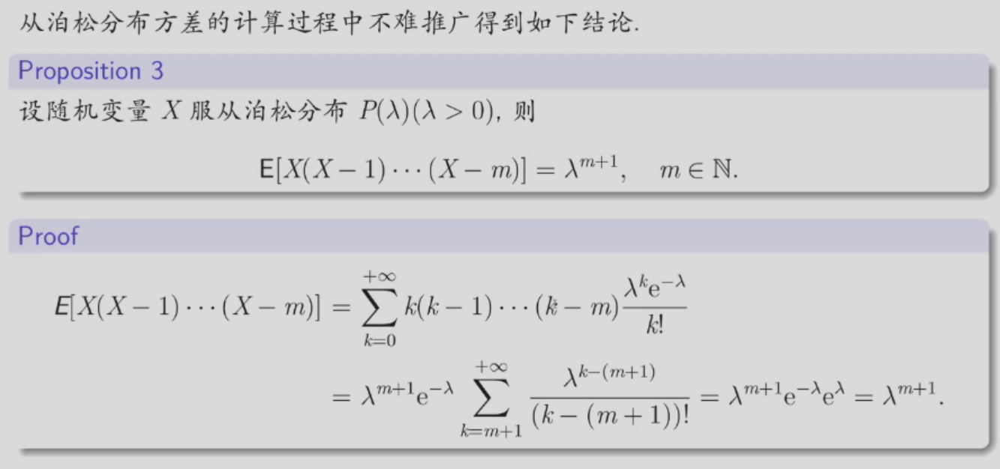
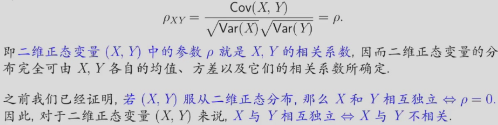
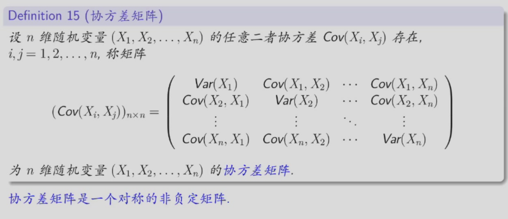

# 随机变量的数字特征
## 数学期望
### 离散型随机变量的数学期望
设离散型随机变量 $X$ 的分布律为$P(X = x_{k}) = p_{k} , k = 1 , 2 , \dotsc$，若级数$∑_{k=1}^{ + \infty}x_kp_k$绝对收敛(即$\sum_{k = 1}^{ + \infty}|x_{k}|p_{k}< + \infty$) ,则称 $X$ 的(数学)期望存在，其值为$\sum_{k = 1}^{ + \infty}x_{k}p_{k}$ ,即随机变量 $X$ 的数学期望(mathematical expectation)(通常记为 $E(X)$) 为
$$
E(X) = \sum_{k = 1}^{ + \infty}x_{k}p_{k}
$$
### 连续型随机变量的数学期望
设连续型随机变量$X$的概率密度函数为$f(x)$。若积分$\int_{ - \infty}^{ + \infty}x f(x)d x$绝对收敛（即$\int_{ - \infty}^{ + \infty} | x | f ( x ) d x < + \infty$），则称X的（数学）期望存在，其值为$\int_{ - \infty}^{ + \infty}x f(x)d x$ ,即随机变量X的数学期望（mathematical expectation）（通常记为$E(X)$）为
$$
E(X) = \int_{ - \infty}^{ + \infty}x f(x)d x
$$ 
数学期望也常简称为期望，又称为均值 (mean)
### 常见分布的数学期望
#### 两点分布 0-1(p)
$X$ 为两点分布，即$X$ 的分布律为$P(X = 0) = 1 - p$ 和 $P(X = 1) = p$，则$X$ 的数学期望为
$$
E(X) = 0 \times (1 - p) + 1 \times p = p
$$
#### 二项分布(n,p)
$X$ 为二项分布，即$X$ 的分布律为$P(X = k) = {n \choose k}p^{k}(1-p)^{n-k}$，则$X$ 的数学期望为

$$
\begin{aligned}
&E(X) = \sum_{k = 0}^{n}k \cdot C_{n}^{k}p^{k}(1 - p)^{n - k} = \sum_{k = 1}^{n}n \cdot C_{n - 1}^{k - 1}p^{k}(1 - p)^{n - k}= \\ 
&n p \sum_{k = 1}^{n}C_{n - 1}^{k - 1}p^{k - 1}(1 - p)^{(n - 1) - (k - 1)} = n p \sum_{j = 0}^{n - 1}C_{n - 1}^{j}p^{j}(1 - p)^{(n - 1) - j} = n p
\end{aligned}
$$

#### 泊松分布(λ)
$X$ 为泊松分布，即$X$ 的分布律为$P(X = k) = \frac{\lambda^{k}e^{-\lambda}}{k!}$，则$X$ 的数学期望为

$$
E(X) = \sum_{k = 0}^{ + \infty}k \frac{\lambda^{k}\hbox e^{ - \lambda}}{k !} = \sum_{k = 1}^{ + \infty}k \frac{\lambda^{k}e^{ - \lambda}}{k !} = \lambda{e}^{ - \lambda}\sum_{k = 1}^{ + \infty}\frac{\lambda^{k - 1}}{(k - 1)!} = \lambda{e}^{ - \lambda}\cdot e^{\lambda} = \lambda
$$

#### 几何分布(p)
$X$ 为几何分布，即$X$ 的分布律为$P(X = k) = (1 - p)^{k - 1}p$，则$X$ 的数学期望为

$$
\begin{aligned}
&E(X) = \sum_{k = 1}^{ + \infty}k p(1 - p)^{k - 1} = p \cdot \sum_{k = 1}^{ + \infty}((1 - p)^{k})^{\prime} = p \cdot \left(\frac{x}{1 - x}\right)^{\prime}|_{x = 1 - p} \\
&= p \cdot  \frac{1}{p^{2}} = \frac{1}{p}
\end{aligned}
$$
#### 均匀分布(a,b)
$X$ 服从均匀分布 $U(a，b)$，其概率密度为：$f ( x ) = \begin{cases} \frac{1}{b - a} , & a < x < b , \cr 0 , & 其 他 , \end{cases}$，则$X$ 的数学期望为
$$
E(X) = \int_{ - \infty}^{ + \infty}x f(x)d x = \int_{a}^{b}\frac{x}{b - a}d x = \frac{a + b}{2}
$$
#### 指数分布(λ)
 $X$ 服从指数分布 $E(λ)$，其概率密度为：$f(x) = \begin{cases} \lambda e^{ - \lambda x} , & x > 0 , \\0 , & x \le 0 , \end{cases}$则$X$ 的数学期望为

$$
\begin{aligned}
&E(X) = \int_{ - \infty}^{ + \infty}x f(x)d x = \int_{0}^{ + \infty}x \cdot \lambda{e}^{ - \lambda x}d x= - x e^{ - \lambda x}|_{0}^{ + \infty} + \int_{0}^{ + \infty}{e}^{ - \lambda x}d x \\ 
&= - \frac{1}{\lambda}{e}^{ - \lambda x}|_{0}^{ + \infty} = \frac{1}{\lambda}
\end{aligned}
$$
#### 正态分布(μ,σ)
设随机变量 $X$ 服从正态分布$N(μ, σ²)$,其概率密度函数为：$f(x) = \frac{1}{\sqrt{2 \pi}\sigma}{e}^{ - \frac{(x - \mu)^{2}}{2 \sigma^{2}}} , - \infty < x < + \infty$ ，则$X$ 的数学期望为

$$
\begin{aligned}
&E(X)=\int_{ - \infty}^{ + \infty}x f(x)d x = \int_{ - \infty}^{ + \infty}\frac{x}{\sqrt{2 \pi}\sigma}{e}^{ - \frac{(x - \mu)^{2}}{2 \sigma^{2}}}d x = \frac{1}{\sqrt{2 \pi}\sigma}\int_{ - \infty}^{ + \infty}(x - \mu)e^{ - \frac{(x - \mu)^{2}}{2 \sigma^{2}}}d x \\
&\overset{\triangle t = \frac{x - \mu}{\sigma}}{=} \mu + \frac{\sigma}{\sqrt{2 \pi}} \int_{ - \infty}^{ + \infty} t {e}^{ - \frac{t^{2}}{2}} d t = \mu + 0 = \mu 
\end{aligned}
$$

### 数学期望的计算
#### 定理1
设 $Y$ 是随机变量 $X$ 的函数： $Y=g(X)$，其中 $g(·)$是连续函数，$X$ 是离散型随机变量，它的分布律为$P ( X = x_{k} ) = p_{k} , k = 1 , 2 , . ...$若$\sum_{k = 1}^{ + \infty}g(x_{k})p_{k}$绝对收敛，则有
$$
E(Y) = E[g(X)] = \sum_{k = 1}^{ + \infty}g(x_{k})p_{k}
$$
$X$ 是连续型随机变量，它的概率密度为$f(x)$，若$\int_{ - \infty}^{ + \infty} g ( x ) f ( x ) d x$绝对收敛，则有
$$
E(Y) = E[g(X)] = \int_{ - \infty}^{ + \infty}g(x)f(x)d x
$$
#### 定理2
设 $Z$ 是随机变量 $X，Y$的函数： $Z=h(X,Y)$, 其中 $h(·,·)$是连续函数

若二维离散型随机变量$(X，Y)$的分布律为$P(X = x_{i} , Y = y_{j}) = p_{i j} , i , j = 1 , 2 , \dotsc$ ，则有
$$
E(Z) = E[h(X , Y)] = \sum_{i = 1}^{ + \infty}\sum_{j = 1}^{ + \infty}h(x_{i} , y_{j})p_{i j}
$$ 
这里设上式右边的级数绝对收敛。

若二维连续型随机变量 $(X，Y)$的概率密度为 $f(x，y)$，则有
$$
E(Z) =  E[h(X , Y)] = \int_{ - \infty}^{ + \infty}\int_{ - \infty}^{ + \infty}h(x , y)f(x , y)d x d y
$$ 
这里设上式右边的积分绝对收敛.特别地，
$$
E(X) = \int_{ - \infty}^{ + \infty}\int_{ - \infty}^{ + \infty}x f(x , y)d x d y ,  E(Y) = \int_{ - \infty}^{ + \infty}\int_{ - \infty}^{ + \infty}y f(x , y)d x d y
$$
### 数学期望的性质
- 设C是常数，则有$E(C)=C$
- 设X是一个随机变量，C为常数，则有$E(CX)=C\cdot E(X)$
- 设X，Y是两个随机变量，则有$E(X+Y)=E(X)+E(Y)$
- 设X，Y是两个相互独立的随机变量，则有$E(XY)=E(X)E(Y)$
## 方差
设$X$是一个随机变量，若$E\{\mid X- E(X) \mid^{2}\}$存在, 则称其为 $X$ 的方差 (variance)。记为 $Var(X)$ 或 $D(X)$即
$$
V a r(X) = D(X) = E\{[X - E(X)]^{2}\}
$$
将$\sqrt{V a r (X)}$记为$σ(X)$或$SD(N)$,称为N 的标准差 (standard deviation) 或均方差,它是与随机变量X具有相同量纲的量  
方差 $Var(X)$和标准差$SD(X)$均可刻画X取值的分散程度，是衡量$X$取值分散程度的常用标准。  
若$X$的取值比较集中，则$Var(X)(SD(X))$较小；若X的取值比较分散，则$Var(X)(SD(X))$较大。
### 方差的计算
若随机变量$X$的方差存在，则有
$$
Var(X) = E\{[X - E(X)]^{2}\} = E(X^{2}) - (E(X))^{2}
$$
#### 0-1分布的方差
$X$ 为0-1分布，即$X$ 的分布律为$P(X = 0) = 1 - p$ 和 $P(X = 1) = p$，则$X$ 的方差为
$$
Var(X) = E\{[X - E(X)]^{2}\} = E(X^{2}) - (E(X))^{2} = (1 - p)^{2}p + p^{2}(1 - p) = p(1 - p)
$$
#### 泊松分布的方差
$X$ 为泊松分布，即$X$ 的分布律为$P(X = k) = \frac{\lambda^{k}e^{-\lambda}}{k!}$，则$X$ 的方差为  
之前已得到期望$E(X) = λ$ ,利用方差的计算公式，先计算

$$
E(X^{2}) = E[X(X - 1) + X] = E[X(X - 1)] + E(X)= \sum_{k = 0}^{ + \infty}k(k - 1)\frac{\lambda^{k}e^{ - \lambda}}{k !} + \lambda = \lambda^{2}{e}^{ - \lambda}\sum_{k = 2}^{ + \infty}\frac{\lambda^{k - 2}}{(k - 2)!} + \lambda= \lambda^{2}e^{ - \lambda}e^{\lambda} + \lambda = \lambda^{2} + \lambda 
$$

$$
\Rightarrow V a r(X) = E(X^{2}) - [E(X)]^{2} = \lambda
$$

泊松分布的均值和方差相等，都等于参数$λ$

#### 几何分布的方差
$X$ 为几何分布，即$X$ 的分布律为$P(X = k) = (1 - p)^{k - 1}p$
之前已得期望 $E(X)=1/p$，而
$$
E(X^{2}) = E[X(X - 1) + X] = E[X(X - 1)] + E(X)= \sum_{k = 2}^{ + \infty}k(k - 1)p(1 - p)^{k - 1} + \frac{1}{p} = p(1 - p)\cdot \left(\frac{x^{2}}{1 - x}\right)' \mid_{x = 1 - p} + \frac{1}{p}= p(1 - p)\frac{2}{p^{3}} + \frac{1}{p} = \frac{2}{p^{2}} - \frac{1}{p}
$$
$$
\Rightarrow V a r(X) = E(X^{2}) - [E(X)]^{2} = \frac{1 - p}{p^{2}}
$$
#### 均匀分布的方差
$X$ 服从均匀分布 $U(a，b)$，其概率密度为：$f ( x ) = \begin{cases} \frac{1}{b - a} , & a < x < b , \cr 0 , & 其 他 , \end{cases}$，则$X$ 的方差为
$$
Var(X) = E\{[X - E(X)]^{2}\} = E(X^{2}) - (E(X))^{2} = \frac{(b - a)^{2}}{12}
$$
#### 指数分布的方差
$X$ 服从指数分布 $E(λ)$，其概率密度为：$f(x) = \begin{cases} \lambda e^{ - \lambda x} , & x > 0 , \\0 , & x \le 0 , \end{cases}$则$X$ 的方差为
$$
Var(X) = E\{[X - E(X)]^{2}\} = E(X^{2}) - (E(X))^{2} = \frac{1}{\lambda^{2}}
$$
### 方差的性质
- 设C为常数，则有$Var(C)=0$
- 设X是一个随机变量，C为常数，则有$Var(CX)=C^{2}Var(X)$
- 设X，Y是两个随机变量，则有$Var(X+Y)=Var(X)+Var(Y)+2E\{[X-E(X)][Y-E(Y)]\}$，特别的，若$X,Y$相互独立，则有$Var(X+Y)=Var(X)+Var(Y)$
- $Var(X)=0 \Leftrightarrow P(X=C)=1 且 C=E(X)$
#### 二项分布的方差
随机变量 $X$ 具有二项分布 $B(n,p)，n≥1，0<p<1$。  
（与求期望采用相同的方法）随机变量$X$可视为 $n$ 重贝努里试验中事件 $A$ 发生的次数，其中 $P(A)=p$ 引入随机变量
$$
Y_{i} = 
\begin{cases}1 , A在第i次试验发生 \cr
0 , A在第i次试验不发生\end{cases}，i = 1 , 2 , \dotsc , n
$$ 
于是$Y_{1} , Y_{2} , \dotsc , Y_{n}$相互独立，服从同一分布$0-1(p)$,且$V a r(Y_{i}) = p(1 - p) , \forall i$ 。又$X = Y_{1} + \cdots + Y_{n} = \sum_{i = 1}^{n}Y_{i}$ ,结合$Y_{1} , Y_{2} , \dotsc , Y_{n}$的独立性，可得
$$
V a r(X) = V a r(\sum_{i = 1}^{n}Y_{i}) = \sum_{i = 1}^{n}V a r(Y_{i}) = n p(1 - p)
$$
#### 正态分布的方差
随机变量 $X$ 服从正态分布$N(\mu , \sigma^{2})$   
先求标准正态随机变量$Z = \frac{X - \mu}{\sigma}$的方差.已知$E(Z)=0$,故
$$
 V a r(Z) =  E(Z^{2}) - 0^{2} = \int_{ - \infty}^{ + \infty}z^{2}\varphi(z)d z = \int_{ - \infty}^{ + \infty}\frac{z^{2}}{\sqrt{2 \pi}}e^{ - \frac{z^{2}}{2}}d z=1
$$
注意到$X = μ + σZ$ ,利用方差的性质可得：
$$
V a r(X) = V a r(\mu + \sigma Z) = \sigma^{2}V a r(Z) = \sigma^{2}
$$
## 协方差
设$X$和$Y$是两个随机变量，若$E\{[X - E(X)][Y - E(Y)]\}$存在，则称其为$X$和$Y$的协方差(covariance)，记为$Cov(X,Y)$，即
$$
Cov(X,Y) = E\{[X - E(X)][Y - E(Y)]\}
$$
### 协方差的计算
若随机变量$X$和$Y$的期望存在，则
$$
Cov(X,Y) = E(XY) - E(X)E(Y)
$$
### 协方差的性质
引入协方差后，方差的性质 (3)及其推广可重新书写.  
当随机变量$X$ 与 $Y$的方差存在时，有
$$
Var(X+Y)=Var(X)+Var(Y)+2Cov(X,Y)
$$
这一性质也可推广到任意有限个随机变量之和的情形：若 $n$ 个随机变量$X_{1} , X_{2} , \dotsc , X_{n}(n \ge 2)$的方差存在，则$\sum_{i = 1}^{n}X_{i}$的方差也存在，且
$$
V a r \Biggl(\sum_{i = 1}^{n}X_{i}\Biggr) = \sum_{i = 1}^{n}V a r(X_{i}) + 2 \sum_{1 \le i < j \le n}C o v(X_{i} , X_{j})
$$
协方差的性质如下

- $Cov(X,Y)=Cov(Y,X)$
- $Cov(X,X)=Var(X)$
- $Cov(aX,bY)=abCov(X,Y),\quad a,b \in \mathbb{R}$
- $Cov(X+Y,Z)=Cov(X,Z)+Cov(Y,Z)$
## 相关系数
对于随机变量$X$和$Y$，当$E ( X^{2} )$与$E(Y^{2})$均存在且 $Var(X), Var(Y)$ 均为非零实数时，称
$$
\rho_{X Y} = \frac{C o v(X , Y)}{\sqrt{V a r(X)}\sqrt{V a r(Y)}}
$$
为$X$ 与 $Y$ 的相关系数(correlation coefficient)，有时也简记为$\rho$，且

$$
\rho_{X Y} = Cov(X^* , Y^*) 
$$

其中$X^*$ 和 $Y^*$ 分别是$X$ 和 $Y$的标准化变量，即
$$
X^* = \frac{X - E(X)}{\sqrt{Var(X)}} , \quad Y^* = \frac{Y - E(Y)}{\sqrt{Var(Y)}}
$$
$\rho_{XY}$是一个无量纲的数字特征。  
相关系数是刻画两个变量之间相依关系的一种数字特征。
### 相关系数的性质
- $\mid \rho_{X Y}\mid \le 1$
- $|ρ_{XY}|=1⇔$存在常数 $a，b(b≠0)$,使得$P(Y=a+bX)=1$.特别地，$ρ_{XY}=1$时，$b>0$；$ρ_{XY}=-1$时，$b<0$
  
也可将(1)(2)一并写成：对于存在方差的随机变量 $X，Y$，当 $Var(X)Var(Y)≠0$ 时，有
$$
[C o v(X , Y)]^{2}\le V a r(X)V a r(Y)
$$ 
其中等号成立当且仅当$X$与 $Y$之间在概率意义下具有严格的线性关系，即存在常数$a,b(b≠0)$，使得
$$
P(Y=a+bX)=1
$$
考虑用$X$的线性函数$a+bX$近似表示Y，用均方误差$e(a , b) = E\{[Y - (a + b X)]^{2}\}$衡量用$a+bX$近似表示$Y$的好坏程度。如果$e(a，b)$越小，则$a+bX$与$Y$的近似程度越好  

相关系数$ρ_{XY}$是一个用来表征 $X，Y$之间线性关系紧密程度的数字特征

- 当$|\rho_{XY}|$较大时,$e(a_{0} , b_{0})$较小，表明 $X，Y$线性关系的程度较强；
- 当$|ρ_{XY}| = 1$时，$e(a_{0} , b_{0}) = 0$，表明 $X，Y$之间以概率1存在线性关系；
- 当$|ρ_{XY}|$较小时，$e(a_{0} , b_{0})$较大，表明 $X，Y$线性关系的程度较弱
#### 相关性
当$\rho_{X Y}> 0$时，称$X$ 与 $Y$ 为正相关，当$\rho_{X Y}< 0$时，称$X$ 与$Y$ 为负相关
当$\rho_{X Y}=0$时，称$X$ 与$Y$ 为不相关或零相关

随机变量$X$与$Y$不相关的等价条件：

- $Cov(X,Y)=0$
- $E(XY)=E(X)E(Y)$
- $Var(X+Y)=Var(X)+Var(Y)$
##### 相关性和独立性的关系
X与Y不相关，仅就二者的线性关系而言；而X与Y相互独立，是就一般关系而言的。  
$X$与$Y$相互独立$\Rightarrow$$X$与$Y$不相关  
$X$与$Y$不相关$\not\Rightarrow$ $X$与$Y$相互独立

**特例：若$(X,Y)$服从二维正态分布，则$X，Y$相互独立的充要条件是$X$与$Y$不相关**

## 其他数学特征
### 矩
- 若$E(X^{k}) , k = 1 , 2 , \dotsc$存在，则称它为$X$ 的 $k$阶 (原点)矩.
- 若$E\{[X - E(X)]^{k}\} , k = 2 , 3 , \dotsc$存在，则称它为 $X$ 的$k$ 阶中心矩.
- 若$E(X^{k}Y^{l}) , k , l = 1 , 2 , \dotsc$存在，则称它为 $X$ 和 $Y$ 的$k+l$阶混合(原点)矩.
- 若$E\{[X - E(X)]^{k}[Y - E(Y)]^{l}\} , k , l = 1 , 2 , \dotsc$存在，则称它为 $X$ 和 $Y$ 的$k+l$阶混合中心矩
### 分位数
设连续型随机变量$X$的分布函数和密度函数分别为$F(x)$和$f(x)$，称满足条件
$$
P(X>x_{\alpha})=1-F(x_{\alpha})=\int_{x_{\alpha}}^{+\infty}f(t)dt=\alpha
$$
的$x_{\alpha}$为$X$的上$\alpha$分位数（$0<\alpha<1$）。
### 众数
随机变量$X$最可能取的数值，称为众数。
对于离散型随机变量，众数是其分布律中最大概率所对应的那个可能取值。
## 多维随机变量的数字特征
### 数学期望（向量）
设 $n$维随机变量$X = (X_{1} , X_{2} , \dotsc , X_{n})^{T}$,若其每一分量的数学期望都存在，则称
$$
E(X) = (E(X_{1}) , E(X_{2}) , \dotsc , E(X_{n}))^{T}
$$
为 $n$维随机变量 $X$ 的数学期望 (向量)
### 协方差矩阵
过设二维随机变量$( X_{1} , X_{2} )$的四个二阶中心矩存在，则称
$$ 
\begin{pmatrix}
 Var(X_{1}) & Cov(X_{1} , X_{2}) \cr
 Cov(X_{2} , X_{1}) & Var(X_{2}) 
\end{pmatrix}
$$ 
为$( X_{1} , X_{2} )$的协方差矩阵

### n维正态变量的重要性质
- n维正态变量$( X_{1} , X_{2} , \dotsc , X_{n} )^{T}$中的任意子向量$(X_{i_{1}} , X_{i_{2}} , \dotsc , X_{i_{k}})^{T}(1 \le k \le n)$也服从 $k$维正态分布.特别地，每一个分量$X_{i} , i = 1 , 2 , \dotsc ,n$都是正态变量；反之，若$X_{1} , X_{2} , \dotsc , X_{n}$都是正态变量，且相互独立，则$( X_{1} , X_{2} , \dotsc , X_{n} )^{T}$是 n维正态变量
- .n 维随机变量$( X_{1} , X_{2} , \dotsc , X_{n} )^{T}$服从 $n$元正态分布当且仅当 $X_{1} , X_{2} , \dotsc , X_{n}$的任意线性组合$l_{1}X_{1} + l_{2}X_{2} + \cdots + l_{n}X_{n}$服从一元正态分布，其中$l_{1} , l_{2} , \dotsc , l_{n}$不全为零
- 若$( X_{1} , X_{2} , \dotsc , X_{n} )^{T}$服从n元正态分布，设$Y_{1} , Y_{2} , \dotsc , Y_{k}$是$X_{j}(j = 1 , 2 , \dotsc , n)$的线性函数，则$(Y_{1} , Y_{2} , \dotsc , Y_{k})^{T}$服从 k 维正态分布.这一性质称为正态变量的线性变换不变性
- 设$(X_{1} , X_{2} , \dotsc , X_{n})^{T}$服从 n元正态分布，则$X_{1} , \cdots X_{n}$相互独立$⇔X_{1} , \cdots , X_{n}$两两不相关$⇔$协方差矩阵为对角矩阵