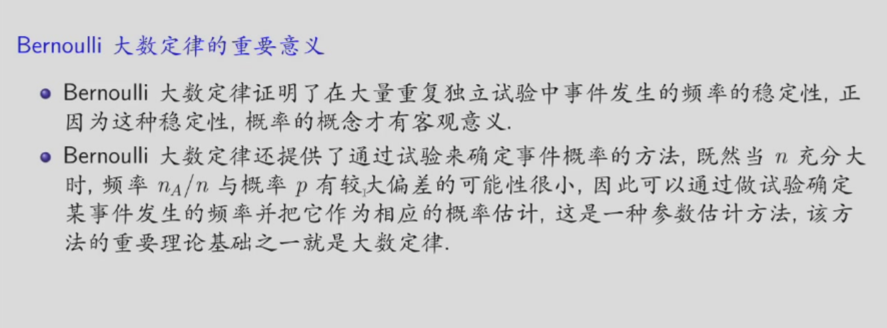

# 大数定律
 设$ X_{1},X_{2},\dotsc ,X_{n},\dotsc$ 是一列随机变量，则在一定的条件下随机变量序列 
 $Y_{n}=\frac{X_{1}+X_{2}+\cdots +X_{n}}{n}$ 收敛到 $\mu$（当 $n\rightarrow +\infty$ 时）。
## 依概率收敛
设$ Y_{1},Y_{2},\dotsc ,Y_{n},\dotsc$ 是一列随机变量，$Y$为随机变量，若对于$\forall \epsilon >0$，均有：
$$
\lim_{n\rightarrow +\infty}P(|Y_{n}-Y|>\epsilon)=0
$$
成立，则称随机变量序列$\{Y_{n},n\geq 1\}$依概率收敛于$Y$，记为$Y_{n}\xrightarrow{P}Y$，当$n\rightarrow +\infty$。
特别的，当$Y=c$为常数时，称$\{Y_{n},n\geq 1\}$依概率收敛于常数c。
### 依概率收敛的性质
若当$n\rightarrow +\infty$时，$Y_{n}\xrightarrow{P}b$，$X_{n}\xrightarrow{P}a$，且函数$g(y,x)$在$(a,b)$上连续，则：
$$
\lim_{n\rightarrow +\infty}g(Y_{n},X_{n})=g(b,a)， 当n\rightarrow +\infty时
$$
特别的，若当$n\rightarrow +\infty$时，$X_{n}\xrightarrow{P}a$，且$f(x)$在点$a$处连续，则：
$$
\lim_{n\rightarrow +\infty}f(X_{n})=f(a)， 当n\rightarrow +\infty时
$$
## Markov不等式
设随机变量$Y$的$k(k\geq 1)$阶矩存在，即$E(Y^{k})$存在，则对于任意$\epsilon >0$，有：
$$
P(|Y|\geq \epsilon)\leq \frac{E(|Y|^{k})}{\epsilon^{k}}
$$
成立。
定理的等价形式为：
$$
P(|Y|< \epsilon)\geq 1- \frac{E(|Y|^{k})}{\epsilon^{k}}
$$
## 切比雪夫不等式
设随机变量$X$具有数学期望$E(X)$，方差$\sigma^{2}$，则对于任意$\epsilon >0$，有：
$$
P(|X-\mu|>\epsilon)\leq \frac{\sigma^{2}}{\epsilon^{2}}
$$
成立。
定理的等价形式为：
$$
P(|X-\mu|< \epsilon)\geq 1- \frac{\sigma^{2}}{\epsilon^{2}}
$$
在Markov不等式中取$Y=X-\mu , k=2$即可得到切比雪夫不等式。
## 几种大数定律
### （弱）大数定律
设$\{X_i,i\geq 1\}$为一随机变量序列，若存在常数序列$\{c_n,n\geq 1\}$，使得对于任意$\epsilon >0$，有：
$$
\lim_{n\rightarrow +\infty}P(|\frac{1}{n}\sum_{i=1}^{n}X_i-c_n|\geq \epsilon)=0
$$
$$
\lim_{n\rightarrow +\infty}P(|\frac{1}{n}\sum_{i=1}^{n}X_i-c_n|<\epsilon)=1
$$
成立，即有$\frac{1}{n}\sum_{i=1}^{n}X_i-c_n \xrightarrow{P} 0$，当$n\rightarrow +\infty$，则称随机变量序列$\{X_i,i\geq 1\}$服从(弱)大数定律。
特别的，若$c_n$与$n$无关，则可写为$\frac{1}{n}\sum_{i=1}^{n}X_i \xrightarrow{P} c$，当$n\rightarrow +\infty$。
### 贝努里大数定律
设$n_A$为$n$重贝努里试验中事件A发生的次数，并记事件$A$在每次试验中发生的概率为$p$，则对于任意$\epsilon >0$，有：
$$
\lim_{n\rightarrow +\infty}P(|\frac{n_A}{n}-p|\geq \epsilon)=0
$$

### 辛钦大数定律
设$\{X_i,i\geq 1\}$为独立同分布的随机变量序列，且其期望存在，记为$\mu$，则对$\forall \epsilon >0$，有：
$$
\lim_{n\rightarrow +\infty}P(|\frac{1}{n}\sum_{i=1}^{n}X_i-\mu|\geq \epsilon)=0
$$
成立，即有$\frac{1}{n}\sum_{i=1}^{n}X_i-\mu \xrightarrow{P} 0$，当$n\rightarrow +\infty$，即随机变量序列$\{X_i,i\geq 1\}$服从大数定律。
#### 推论
设$\{X_i,i\geq 1\}$为独立同分布的随机变量序列，若$h(x)$为一连续函数，且$E(|h(X_1)|)< +\infty$，则对于任意$\epsilon >0$，有：
$$
\lim_{n\rightarrow +\infty}P(|\frac{1}{n}\sum_{i=1}^{n}h(X_i)-a|\geq \epsilon)=0
$$
成立，其中$a=E(h(X_1))$，即$\frac{1}{n}\sum_{i=1}^{n}h(X_i)\xrightarrow{P}a$，当$n\rightarrow +\infty$，即随机变量序列$\{h(X_i),i\geq 1\}$也服从大数定律。
### 切比雪夫大数定律（的推论）
设$\{X_i,i\geq 1\}$为相互独立的随机变量序列，具有相同的期望$\mu$，相同的方差$\sigma^2$，那么
$$
\frac{1}{n}\sum_{i=1}^{n}X_i \xrightarrow{P} \mu,当n\rightarrow +\infty 时
$$

## 中心极限定理
### Lindeberg-Levy定理
此定理亦称为独立同分布的中心极限定理。设随机变量$X_1,X_2,\cdots,X_n,\cdots$相互独立且同分布，满足$E(X_i)=\mu,Var(X_i)=\sigma^2,i=1,2,\cdots,$则对于充分大的$n$有:
$$
\sum_{i=1}^{n}X_i \sim N(n\mu,n\sigma^{2})\quad （近似）
$$
此时：
$$
P(a<\sum_{i=1}^{n}X_i\leq b) \approx \Phi(\frac{b-n\mu}{\sigma\sqrt{n}}) - \Phi(\frac{a-n\mu}{\sigma\sqrt{n}})
$$
类似的，有$\overline{X_n} \sim N(\mu, \frac{\sigma^{2}}{n}) \quad (\overline{X_n}=n^{-1}\sum_{i=1}^{n}X_i)$。
### De Moivre-Laplace中心极限定理
设$n_A$为$n$重伯努利试验中事件A发生的次数，并记事件$A$在每次试验中发生的概率为$p$，则对任何实数$x$，有：
$$
\lim_{n\rightarrow +\infty}P(\frac{n_A-np}{\sqrt{np(1-p)}}\leq x)= \int_{-\infty}^{x}\frac{e^{-t^2/2}}{\sqrt{2\pi}}dt=\Phi(x)
$$
即:
$$
\frac{n_A-np}{\sqrt{np(1-p)}}\sim N(0,1) \quad （近似）
$$                                                                                       
