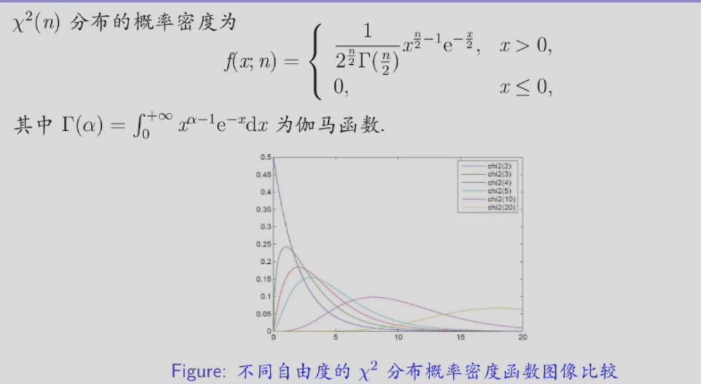
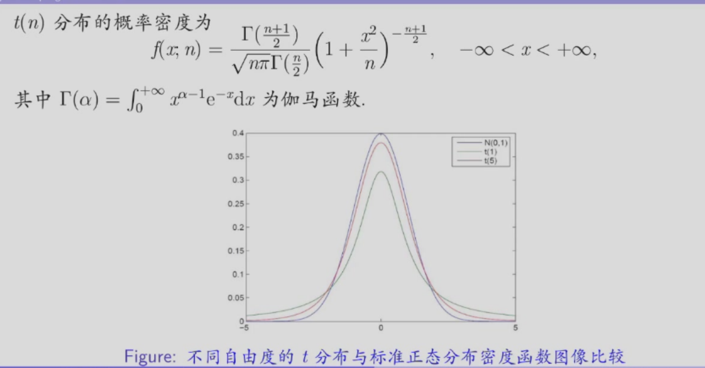
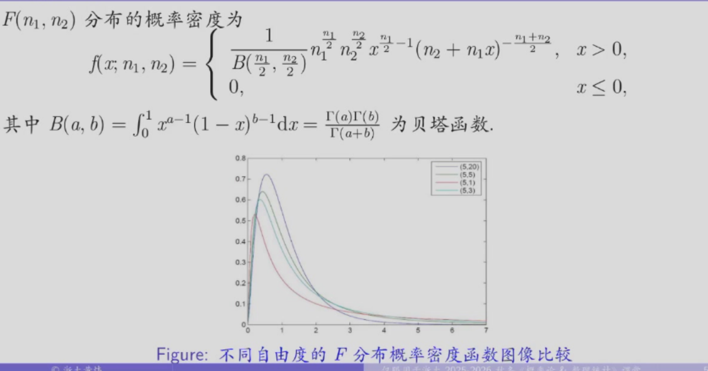
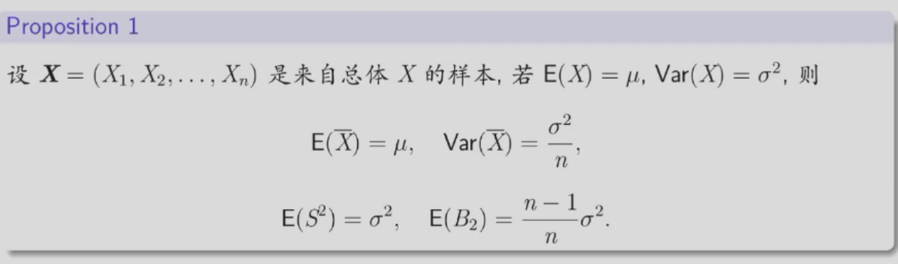
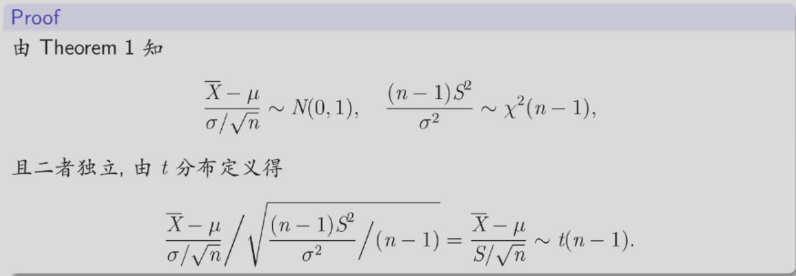
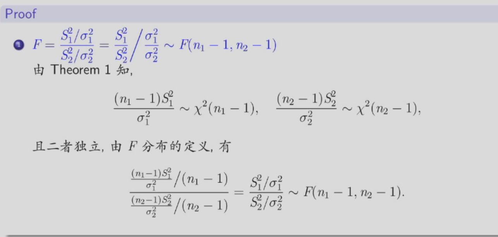
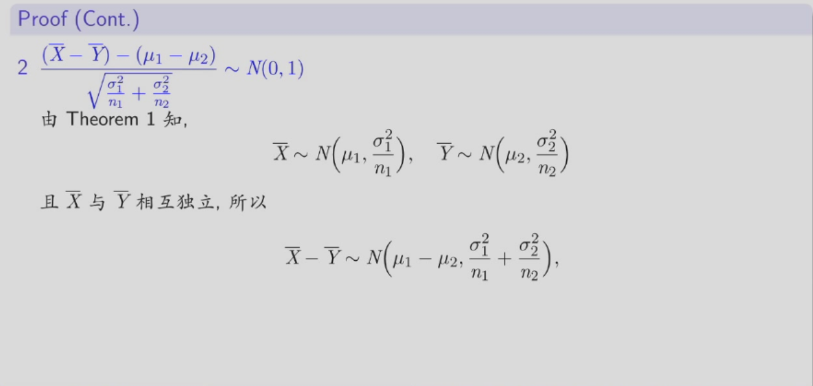
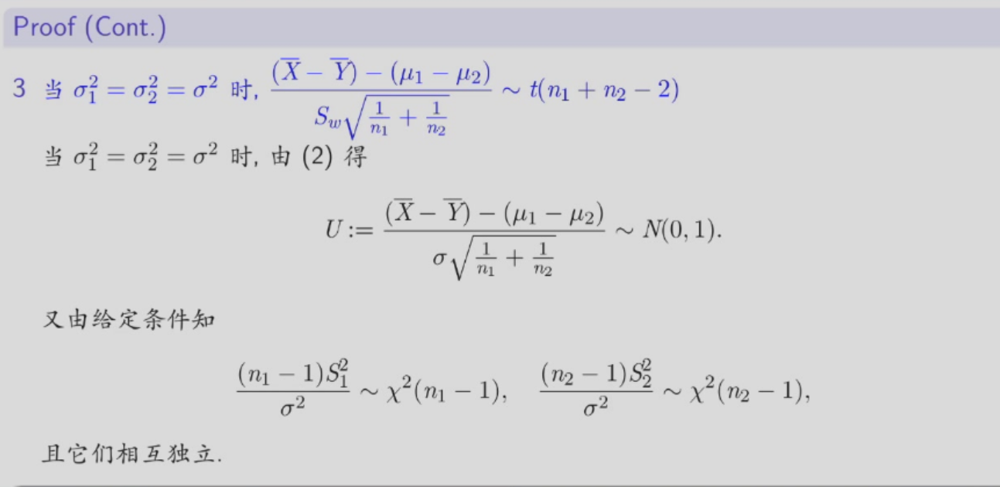
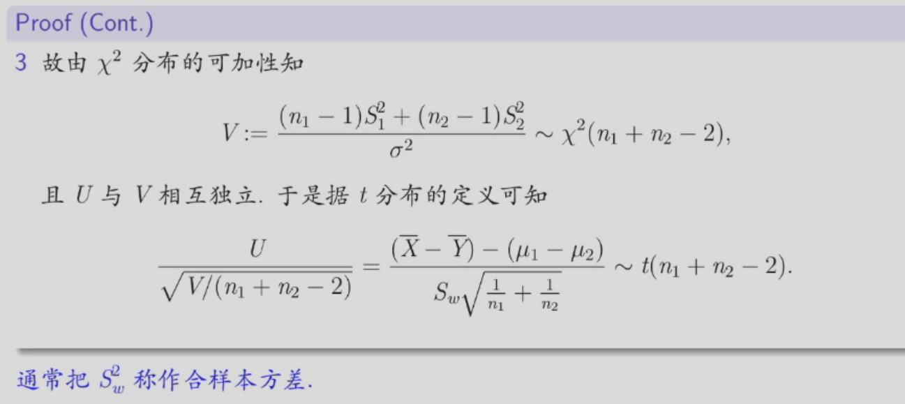

# 统计与抽样分布
## 随机抽样与统计
### 总体与个体
一个统计问题总有它明确的研究对象，把研究对象的全体称为总体或母体，总体中的每个成员称为个体。
### 有限总体与无限总体
总体中包含的个体数量被称为总体容量。根据容量是否有限，总体可以分为有限总体和无限总体。
### 随机样本
#### 样本
为推断总体的分布及其各种特征，按一定的规则从总体中抽取若干个体进行观察试验，以获得有关总体的信息，这一抽取过程称为抽样，所抽取的部分个体称为样本，通常记为：
$$
\tilde{X}= \mathbf{X} = (X_1,X_2,...,X_n)
$$
样本中包含的个体数目n称为样本容量。

每一个样本$X_i$都是随机变量（其维数与总体一致）。若总体是一维的，则容量为$n$的样本可以看作$n$维的随机向量。但是，一旦取定一组样本，得到的是$n$个具体的$\mathbf{x} = (x_1,x_2,...,x_n)$，称此为样本的一次观察值，简称样本值或仍简称为样本。
#### 简单随机样本
设$\mathbf{X} = (X_1,X_2,...,X_n)$是来自总体$X$的随机样本，若满足以下两个性质：

1. 代表性：$X_1,X_2,...,X_n$中每一个与所考察的总体$X$有相同的分布。
2. 独立性：$X_1,X_2,...,X_n$是相互独立的随机变量。

则称$\mathbf{X}$为取自总体$X$的简单随机样本。  
获得简单随机样本的抽样方法被称为简单随机抽样。

由概率论知识，若总体$X$具有分布函数$F(x)$，则简单随机样本$\mathbf{X}$具有联合分布函数：
$$
F(\mathbf{x}) = \prod_{i=1}^n F(x_i)
$$
若总体$X$是连续型（离散型）随机变量，其概率密度函数（或分布律）为$f(x)$，则简单随机样本$\mathbf{X}$具有联合概率密度函数（或联合分布律）。
### 统计量
设$\mathbf{X} = (X_1,X_2,...,X_n)$是来自总体$X$的一个简单随机样本，若$g(\mathbf{X})=g(X_1,X_2,...,X_n)$是样本$\mathbf{X}$上的函数，若$g$中不含任何未知的参数，则称$g(\mathbf{X})$为样本$\mathbf{X}$的统计量。

说明：

1. 统计量可以仅从解析式上判断
2. 统计量仍然为随机变量。
3. 统计量的分布（称为抽样分布）一般与总体分布有关，即可以依赖未知参数。
4. 若$\mathbf{x} = (x_1,x_2,...,x_n)$是样本$\mathbf{X}$的一次观察值，则$g(\mathbf{x})$是样本$g(\mathbf{X})$的观察值，称之为统计量的值。

#### 常用统计量
设$\mathbf{X} = (X_1,X_2,...,X_n)$是来自总体$X$的一个样本。

1. 样本均值：
$$
\overline{X}=\frac{1}{n}\sum_{i=1}^n X_i
$$
2. 样本方差：

$$
S^2=\frac{1}{n-1}\sum_{i=1}^n (X_i-\overline{X})^2
$$

3.样本k阶(原点)矩：
$$
A_k=\frac{1}{n}\sum_{i=1}^n X_{i}^k \quad (k=1,2,3,...,n)
$$
4.样本k阶中心距：
$$
B_k=\frac{1}{n}\sum_{i=1}^n (X_i-\overline{X})^k \quad (k=2,3,...,n)
$$
## 统计分布
### $\chi^2$分布

设随机变量 $X_1, X_2, \ldots, X_n$相互独立，$X_i \sim N(0, 1)，i = 1, 2, \ldots, n$，则称
$$
\chi^2_n = \sum_{i=1}^n X_i^2
$$

服从自由度为 $n$ 的 $\chi^2$ 分布 (chi-square distribution)，记为 $\chi^2_n \sim \chi^2(n)$。

说明：若随机变量 $K \sim \chi^2(n)$，那么一定存在相互独立的随机变量 $X_1, X_2, \ldots, X_n$，$X_i \sim N(0, 1)，i = 1, 2, \ldots, n$，使得 $K$ 可以表示为
$$
K = \sum_{i=1}^n X_i^2
$$

#### 性质
- 设随机变量$X\sim \chi^2(n)$，则$E(X)=n$，$Var(X)=2n$。
- 设$Y_1\sim \chi^2(n_1)$，$Y_2\sim \chi^2(n_2)$，且$Y_1,Y_2$相互独立，则$Y_1+Y_2\sim \chi^2(n_1+n_2)$，可推广至任意有限个的情形。
#### 分布的上（侧）分位数/点
对给定的正数$0<\alpha<1$，若连续性随机变量$X$的分布函数和密度函数分别为$F(x)$与$f(x)$，称满足条件:
$$
P(X>x_\alpha)=1-F(x_\alpha)=\int_{x_\alpha}^{\infty} f(t)dt=\alpha
$$
的实数$x_\alpha$为随机变量$X$的上（侧）$\alpha$分位数/点。

对给定的正数$0<\alpha<1$，称满足条件:$\int_{\chi^2_\alpha(n)}^{+\infty}f_n(y)dy=\alpha$的点$\chi^2_\alpha(n)$为$\chi^2(n)$分布的上$\alpha$分位数/点。  
上$\alpha$分位数的值可查$\chi^2(n)$分布表得到。
### $t$分布
设  $X \sim N(0,1) ,  Y \sim \chi^2(n)$，并且 $X, Y$ 相互独立， 则称随机变量
$$
T = \frac{X}{\sqrt{Y/n}}
$$
服从自由度为  $n$ 的 $t$ 分布 (t-distribution)， 记为 $T \sim t(n)$。也称为学生氏 (Student) 分布。

说明: 若随机变量 $T \sim t(n)$，那么一定存在随机变量 $X \sim N(0,1), Y \sim \chi^2(n)$， 并且 $X, Y$ 相互独立，使得 $T$ 可以表示为
$$
T = \frac{X}{\sqrt{Y/n}}
$$

#### 性质
- 设$T\sim t(n)$，则当$n\geq 2$时，$E(T)=0$，当$n\geq 3$时，$Var(T)=\frac{n}{n-2}$。
- 当$n$足够大时，$t(n)$分布近似于标准正态分布$N(0,1)$。
- 若$T\sim t(n),N\sim N(0,1)$，则对任意$n\geq 1$，都存在$\alpha_0>0$，使得$P(|T|\geq \alpha_0)\geq P(|N|\geq \alpha_0)$。
#### 上$\alpha$分位数/点
对给定的正数$0<\alpha<1$，称满足条件:$\int_{t_\alpha(n)}^{+\infty}f_n(t)dt=\alpha$的点$t_\alpha(n)$为$t(n)$分布的上$\alpha$分位数/点。  
上$\alpha$分位数的值可查$t(n)$分布表得到。
$t(n)$分布的上分位数/点有如下性质：

- $t_{1/2}(n)=0$
- $t_{1-\alpha}(n)=-t_{\alpha}(n)$
- 当$n>45$时，$t_\alpha(n)\approx z_{\alpha}$，其中$z_{\alpha}$为标准正态分布的上$\alpha$分位数。
### F分布
设 $U \sim \chi^2(n_1), V \sim \chi^2(n_2)$ ， 并且 $U, V$ 相互独立， 则称随机变量  
$$
F = \frac{U/n_1}{V/n_2}
$$
服从自由度为 $(n_1, n_2)$ 的  $F$ 分布 ( $F$-distribution)， 其中 $n_1$ 称为第一自由度， $n_2$ 称为第二自由度。

说明: 若随机变量 $F \sim F(n_1, n_2)$， 那么一定存在随机变量$U \sim \chi^2(n_1), V \sim \chi^2(n_2)$, 并且 $U, V$ 相互独立， 使得 $F$ 可以表示为  
$$
F = \frac{U/n_1}{V/n_2}
$$

#### 性质
- 设 $F \sim F(n_1, n_2)$，则 $\frac{1}{F} \sim F(n_2, n_1)$。
- 对任意的 $0 < \alpha < 1$，$F_{1-\alpha}(n_1, n_2) = \frac{1}{F_{\alpha}(n_2, n_1)}$。
- 若 $\xi \sim t(n)$，则 $\xi^2 \sim F(1, n)$。
#### 上$\alpha$分位数/点
对给定的正数$0<\alpha<1$，称满足条件:$\int_{F_\alpha(n_1, n_2)}^{+\infty}f(x,n_1,n_2)dx=\alpha$的点$F_\alpha(n_1, n_2)$为$F(n_1, n_2)$分布的上$\alpha$分位数/点。  
上$\alpha$分位数的值可查$F(n_1, n_2)$分布表得到。
$F(n_1, n_2)$分布的上分位数/点有如下性质：

- $F_{1-\alpha}(n_1, n_2) = \frac{1}{F_{\alpha}(n_2, n_1)}$
## 正态总体
对于一般总体，有通用结论：

### 定理1
设$X=(X_1,X_2,...,X_n)$为来自正太总体$N(\mu,\sigma^2)$的简单随机样本，$\bar{X}$为样本均值，$S^2$为样本方差，则：

- $\bar{X}\sim N(\mu,\frac{\sigma^2}{n})$，即$\frac{\bar{X}-\mu}{\frac{\sigma}{\sqrt{n}}}\sim N(0,1)$。
- $\frac{(n-1)S^2}{\sigma^2}=\frac{1}{\sigma^2}\sum_{i=1}^n (X_i-\bar{X})^2\sim \chi^2(n-1)$。
- $\bar{X}$与$S^2$相互独立。
### 定理2
设$X=(X_1,X_2,...,X_n)$为来自正太总体$N(\mu,\sigma^2)$的简单随机样本，$\bar{X}$为样本均值，$S^2$为样本方差，则：
$$
\frac{\bar{X}-\mu}{\frac{S}{\sqrt{n}}}=\frac{\sqrt{n}(\bar{X}-\mu)}{S}\sim t(n-1)
$$

### 定理3
设样本 $X = (X_1, X_2, \ldots, X_{n_1})$ 和 $Y = (Y_1, Y_2, \ldots, Y_{n_2})$ 分别来自正态总体 $N(\mu_1, \sigma_1^2)$ 和 $N(\mu_2, \sigma_2^2)$，并且它们相互独立。记 $\overline{X}, \overline{Y}$ 分别是两个样本的样本均值 $S_1^2, S_2^2$ 分别是两个样本的样本方差，则有

$$
F = \frac{S_1^2 / \sigma_1^2}{S_2^2 / \sigma_2^2} = \frac{S_1^2}{S_2^2} / \frac{\sigma_2^2}{\sigma_1^2} \sim F(n_1 - 1, n_2 - 1)
$$

$$
\frac{(\overline{X} - \overline{Y}) - (\mu_1 - \mu_2)}{\sqrt{\frac{\sigma_1^2}{n_1} + \frac{\sigma_2^2}{n_2}}} \sim N(0, 1)
$$

当$\sigma_1^2 = \sigma_2^2 = \sigma^2$时，
$$
\frac{(\overline{X} - \overline{Y}) - (\mu_1 - \mu_2)}{S_w \sqrt{\frac{1}{n_1} + \frac{1}{n_2}}} \sim t(n_1 + n_2 - 2)
$$

其中 $S_w^2 = \frac{(n_1 - 1)S_1^2 + (n_2 - 1)S_2^2}{n_1 + n_2 - 2} = \frac{\sum_{i=1}^{n_1}(X_i - \overline{X})^2 + \sum_{j=1}^{n_2}(Y_j - \overline{Y})^2}{n_1 + n_2 - 2}, \, S_w = \sqrt{S_w^2}$.

