# 估计
## 参数估计
参数：泛指反应总体某方面特征的量。  
参数估计有点估计和区间估计两种形式。 

- 点估计：用一个具体的数值（样本观察值的函数）去估计一个未知参数。
- 区间估计：把参数估计在某两个界限（都是样本观察值的函数）之间。

## 点估计
设总体$X\sim F(x;\theta)$，分布函数$F(·)$形式已知，$\theta=(\theta_1,\theta_2,\cdots,\theta_k)$未知，为待估参数。根据样本$X=(x_1,x_2,\cdots,x_n)$，对每一个未知参数$\theta_i (i=1,2,\cdots,k)$，构造出统计量：
$$
\hat{\theta_i}=\hat{\theta_i}(X)=\hat{\theta_i}(X_1,X_2,\cdots,X_n)
$$
作为参数$\theta_i$的估计，称$\hat{\theta_i}$为$\theta_i$的点估计量。若得到样本的观察值为$x=(x_1,x_2,\cdots,x_n)$，则$\hat{\theta_i}=\hat{\theta_i}(x)=\hat{\theta_i}(x_1,x_2,\cdots,x_n)$为$\theta_i$的点估计值。

说明：估计量是一个估计参数的规则（方案），没有样本观察值时也可构造估计量，当有了样本观察值，就可以根据这个规则得出$\theta$的估计值。
### 矩法
### 矩法 (Method of Moments)

**思想**: 用样本矩去估计相应的总体矩。

**总体矩**: 在总体 $X$ 的下列数学期望存在的情况下，  
总体 $k$ 阶（原点）矩：  
$$
\mu_k = E(X^k) \quad (k=1,2,\ldots)
$$
总体 $k$ 阶中心矩：  
$$
\nu_k = E\{[X-E(X)]^k\} \quad (k=2,3,\ldots)
$$

**样本矩**: 样本  $k$  阶（原点）矩：  
$$
A_k = \frac{1}{n} \sum_{i=1}^n X_i^k \quad (k=1,2,\ldots) 
$$
样本  $k$  阶中心矩：  
$$
B_k = \frac{1}{n} \sum_{i=1}^n (X_i - \overline{X})^k \quad (k=2,3,\ldots)
$$

简而言之，就是用 $A_k$ 去估计$\mu_k$，用  $B_k$ 去估计 $\nu_k$。

**具体做法**：

设总体 $X$ 的分布函数为 $F(x; \theta_1, \theta_2, \ldots, \theta_k)$，其中 $\theta_1, \theta_2, \ldots, \theta_k$ 是待估计的未知参数，假定总体 $X$ 的前 $k$阶原点矩 $E(X^k)$ 存在，则有
$$
\mu_v = E(X^v) = \mu_v(\theta_1, \theta_2, \ldots, \theta_k), \quad v = 1, 2, \ldots, k
$$

这是一个包含 $k$ 个未知参数 $\theta_1, \theta_2, \ldots, \theta_k$ 的联立方程组。从中解出 $\theta_1, \theta_2, \ldots, \theta_k$ 得
$$
\theta_i = \theta_i(\mu_1, \mu_2, \ldots, \mu_k), \quad i = 1, 2, \ldots, k
$$

对于样本 $X = (X_1, X_2, \ldots, X_n)$，其样本 $v$ 阶原点矩是
$$
A_v = \frac{1}{n} \sum_{i=1}^n X_i^v, \quad v = 1, 2, \ldots, k
$$
用 $A_i$ 代替 $\mu_i, \quad i = 1, 2, \ldots, k$，即可得到诸 $\theta_i$ 的矩法估计量

$$
\hat{\theta}_i = \theta_i(A_1, A_2, \ldots, A_k), \quad i = 1, 2, \ldots, k
$$

**基本步骤**：

1. 写出总体 $X$ 的前 $k$ 阶矩（关于 $k$ 个待估参数 $\theta_1, \theta_2, \ldots, \theta_k$ 的函数）（此步的目的是为了下一步，有时这一步可以省略）
$$
\mu_v = E(X^v) = h_v(\theta_1, \theta_2, \ldots, \theta_k), \quad v = 1, 2, \ldots, k
$$

2. 写出待估参数关于总体矩的函数表达式
$$
\theta_i = g_i(\mu_1, \mu_2, \ldots, \mu_k), \quad i = 1, 2, \ldots, k
$$

3. 将第二步中出现的总体矩用相应的样本矩“替换”，即可得待估参数的矩估计量
$$
\hat{\theta}_i = g_i(A_1, A_2, \ldots, A_k), \quad i = 1, 2, \ldots, k
$$

**理论依据**：
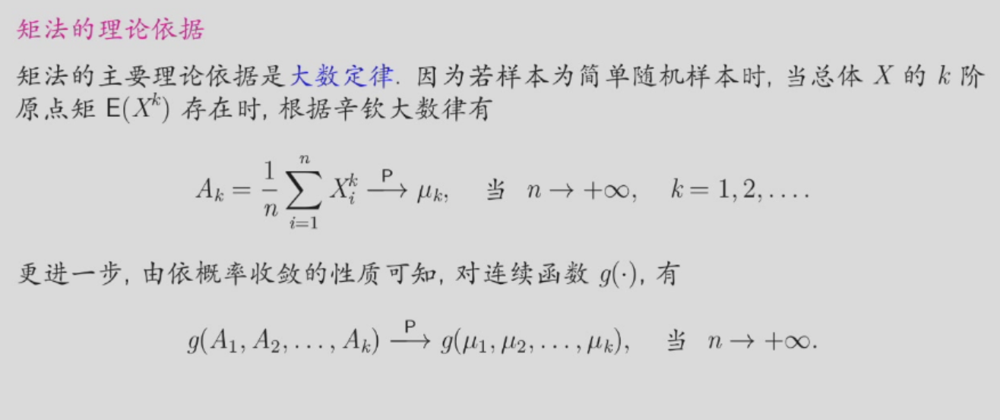

### 极大似然估计

#### 似然函数

一般地，设离散型总体  $X \sim f(x; \theta) = P\{X = x\}$ ，$\theta$ 未知，$\theta \in$  参数空间 $\Theta$。从总体中取得样本  $X = (X_1, \ldots, X_n)$ ，其样本观察值为  $x = (x_1, \ldots, x_n)$ ，则事件 $\{X = x\}$ 发生的概率为

$$
P_{\theta}\{X = x\} = P_{\theta}\{X_1 = x_1, \ldots, X_n = x_n\} = \prod_{i=1}^{n}f(x_i; \theta), \quad \theta \in \Theta
$$

它是参数$\theta$ 的函数，记为似然函数（likelihood function），即似然函数为

$$
L(\theta) = L(\theta; x) = L(\theta; x_1, \ldots, x_n) = \prod_{i=1}^{n}f(x_i; \theta), \quad \theta \in \Theta
$$

设连续型总体  $X$ 的概率密度为$f(x;\theta)$，$\theta$ 未知，$\theta \in$  参数空间 $\Theta$。从总体中取得样本  $X = (X_1, \ldots, X_n)$ ，其样本观察值为  $x = (x_1, \ldots, x_n)$，则似然函数为：

$$
L(\theta) = L(\theta; x) = \prod_{i=1}^{n}f(x_i; \theta), \quad \theta \in \Theta
$$

#### 极大似然估计值/估计量
称  
$$
\hat{\theta}(\mathbf{X}) = \arg\max_{\theta \in \Theta} L(\theta; \mathbf{X})
$$

为 $\theta$的极大似然估计值，即 $\hat{\theta}(\mathbf{X})$ 为满足  
$$
L(\hat{\theta}(\mathbf{X}); \mathbf{X}) = \max_{\theta \in \Theta} L(\theta; \mathbf{X})$$

相应的统计量  
$$
\hat{\theta}(\mathbf{X}) = \arg\max_{\theta \in \Theta} L(\theta; \mathbf{X})
$$

即为 $\theta$ 的极大似然估计量 (maximum likelihood estimator).
#### 求极大似然估计
**思想**：用“最像”$\theta$真值的值去估计$\theta$。

**本质**：在参数空间$\Theta$中，找到使得似然函数$L(\theta; \mathbf{x})$最大的$\theta$。

**基本步骤**：

设总体  $X$ 的概率密度或者分布律为  $f(x; \theta)$ ， $\theta$ 为未知参数，$\theta \in \Theta$ ，其中 $\Theta$ 为参数空间，即 $\theta$ 的取值范围。设 $x = (x_1, x_2, \ldots, x_n)$是样本 $X = (X_1, X_2, \ldots, X_n)$ 的一个观察值。

1. 写出似然函数
$$
L(\theta) = L(\theta; x) = \prod_{i=1}^n f(x_i; \theta), \quad \theta \in \Theta
$$

2. 求使 $L(\theta; x)$ 达到最大的 $\theta$ 值，称为 $\theta$ 的极大似然估计值，对应的统计量称为 $\theta$ 的极大似然估计量。

**说明**：

- 未知参数可能不是一个，一般设为 $\theta = (\theta_1, \theta_2, \ldots, \theta_k)$；
- (微分法) 在求 $L(\theta; \mathbf{X})$的最大值时，当 $L(\theta)$关于$\theta$可微时，通常转化为求似然方程
$$
\frac{\partial L(\theta)}{\partial \theta_i} = 0, \quad i = 1, 2, \ldots, k
$$
有时，还可以转换为求对数似然函数 (log likelihood function)
$$
\ln L(\theta) = \ln L(\theta; \mathbf{X}) = \sum_{i=1}^n \ln f(x_i; \theta)
$$
的最大值，当 $\ln L(\theta)$关于 $\theta$ 可微时，通常转化为求对数似然方程
$$
\frac{\partial \ln L(\theta)}{\partial \theta_i} = 0, \quad i = 1, 2, \ldots, k
$$
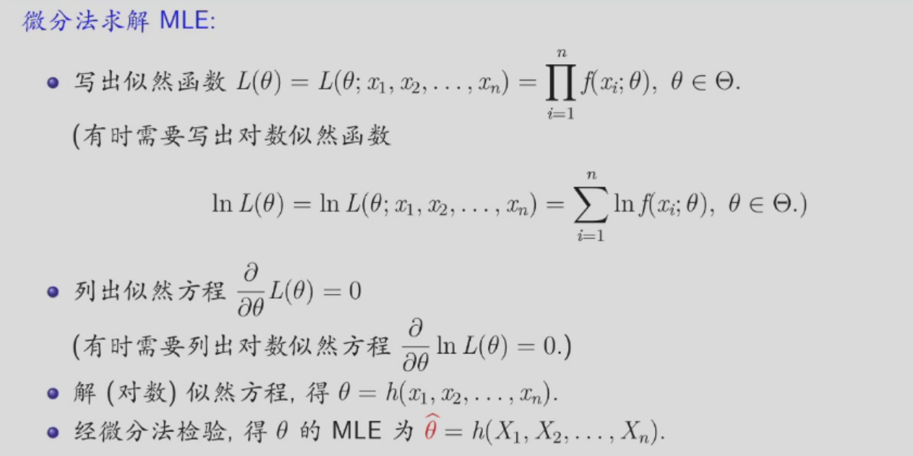
- (定义法) 若 $L(\theta)$ 关于某个 $\theta_i$是单调增（减）函数，此时 $\theta_i$ 的极大似然估计在其边界取得；
- (不变原则) 若 $\hat{\theta}$ 是 $\theta$ 的极大似然估计， $g(\theta)$ 是 $\theta$ 的连续函数，则  $g(\hat{\theta})$ 是 $g(\theta)$的极大似然估计。

### 例子
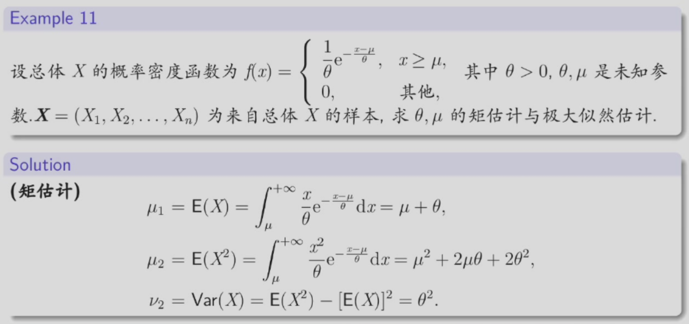
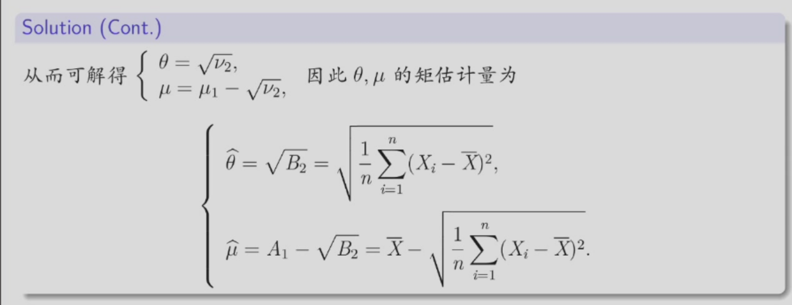
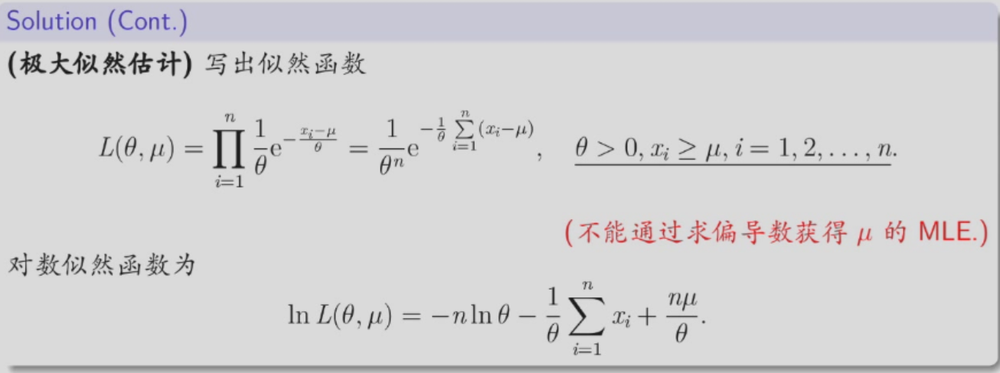
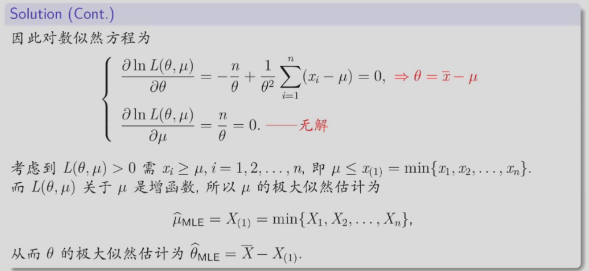

## 评价准则
### 无偏性准则
#### 无偏估计量
若参数$\theta$的估计量$\hat{\theta}=\hat{\theta}(X)$的数学期望存在，且满足
$$
E(\hat{\theta}) = \theta, \quad \forall \theta \in \Theta
$$
则称 $\hat{\theta}$ 是$\theta$的一个无偏估计量(unbiased estimator)。

若$E(\hat{\theta}) \neq \theta$，则 $\hat{\theta}$ 是$\theta$ 的一个有偏估计量，并称 $|E(\hat{\theta}) - \theta|$为估计量 $\hat{\theta}$的偏差(bias)。若$E(\hat{\theta}) \neq \theta$，但满足$\lim_{n \to +\infty} E(\hat{\theta}) = \theta$，则称$\hat{\theta}$是 $\theta$ 的渐近无偏估计量 (asymptotic unbiased estimator)。

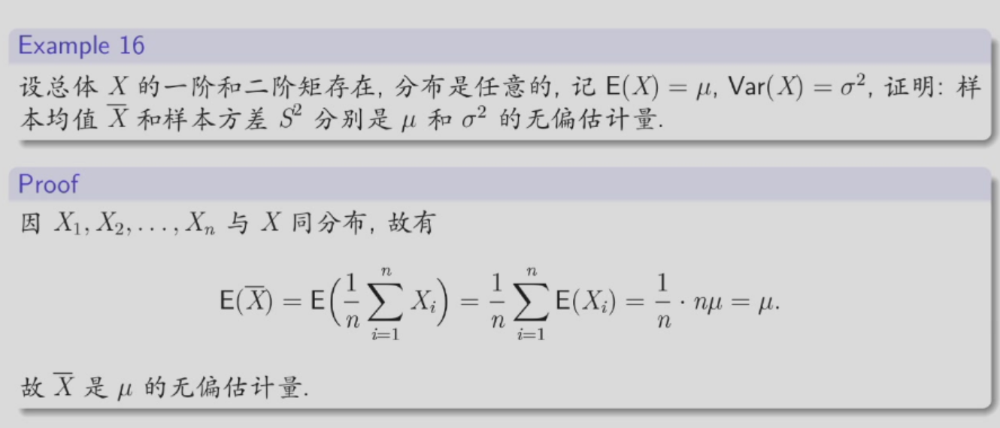
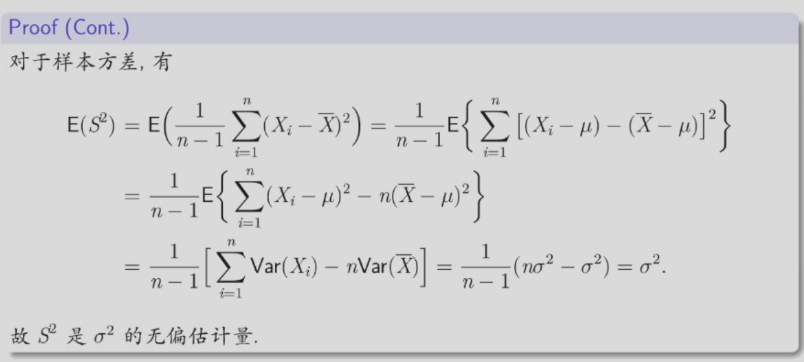

#### 纠偏
对于有偏的估计量，我们可以采用纠偏方法将其调整为无偏估计量。

如果$E(\hat{\theta}) =a\theta + b,\theta \in \Theta$，其中$a,b$为常数，且$a\neq 0$，则$\frac{1}{a}(\hat{\theta}-b)$是$\theta$的无偏估计量。

### 有效性准则

为比较两个或多个无偏估计量，一般会考察估计量的波动性，即估计量的方差。无偏估计量的方差越小，该估计量的取值越集中在参数真值的附近，这就是有效性准则。

设 $\hat{\theta}_1 = \hat{\theta}_1(X)$ 和 $\hat{\theta}_2 = \hat{\theta}_2(X)$ 都是参数 $\theta$的无偏估计，若

$$
Var(\hat{\theta}_1) \leq Var(\hat{\theta}_2), \quad \forall \theta \in \Theta
$$

且至少有一个 $\theta \in \Theta$使不等号成立，则称 $\hat{\theta}_1$ 比 $\hat{\theta}_2$有效 (effective)。

### 均方误差准则

设 $\hat{\theta} = \hat{\theta}(\mathbf{X})$是参数 $\theta$ 的估计量，其方差存在，称
$$
Mse(\hat{\theta}) = E[(\hat{\theta} - \theta)^2]
$$
为估计量$\hat{\theta}$ 的均方误差(mean squared error, MSE)。

若 $\hat{\theta}$是$\theta$的无偏估计，则有$Mse(\hat{\theta}) = Var(\hat{\theta})$

我们自然希望估计量的均方误差越小越好，即有如下准则：

设 $\hat{\theta}_1$与$\hat{\theta}_2$都是$\theta$的估计量，若  
$$
Mse(\hat{\theta}_1) \leq Mse(\hat{\theta}_2), \quad \forall \theta \in \Theta
$$
且至少有一个 $\theta \in \Theta$ 使不等号成立，则称 $\hat{\theta}_1$ 优于$\hat{\theta}_2$。

在实际应用中，有时人们认为均方误差准则比无偏性准则更为重要。  
另外，均方误差有如下分解式：  
$$
Mse(\hat{\theta}) = Var(\hat{\theta}) + [E(\hat{\theta}) - \theta]^2
$$
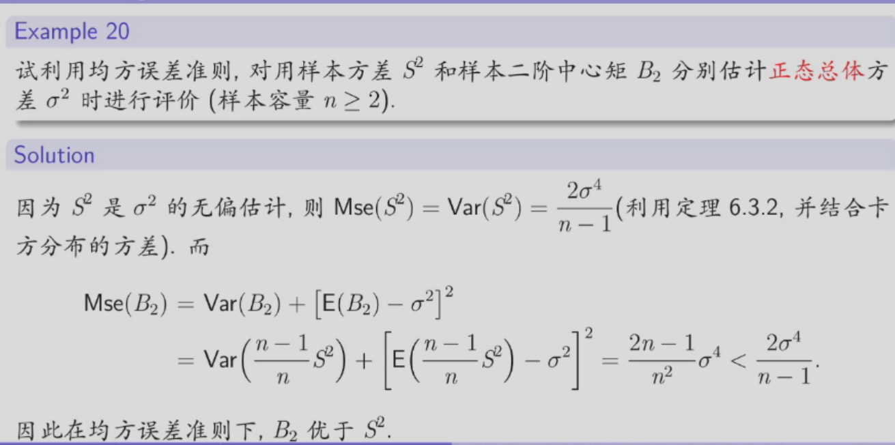

### 相合性准则

一个好的估计量，当样本容量 $n$ 越大时，该估计应该越精确越可靠，特别是当 $n \to +\infty$ 时，估计量的取值与参数真值应几乎完全一致，这就是相合性准则。

设 $\hat{\theta}_n = \hat{\theta}(X)$是参数$\theta$的估计量，若对 $\forall \theta \in \Theta$，当  $n \to +\infty$ 时，$\hat{\theta}_n$ 依概率收敛于 $\theta$，即 $\hat{\theta}_n \xrightarrow{P} \theta$，也就是

$$
\lim_{n \to +\infty} P(\|\hat{\theta}_n - \theta\| < \varepsilon) = 1, \quad \forall \varepsilon > 0
$$

则称 $\hat{\theta}_n$ 是 $\theta$ 的（弱）相合估计量（consistent estimator）或一致估计量。

一般用 Chebyshev 不等式或大数律验证，有时还需结合依概率收敛的性质。

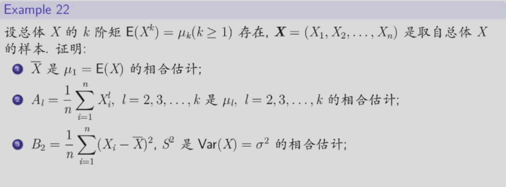
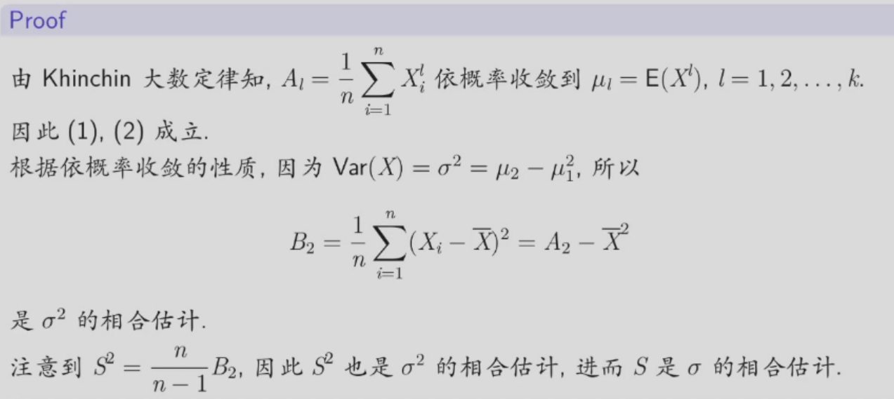

## 区间估计

点估计是由样本出发给出了未知参数 $\theta$ 的一个估计值 $\widehat{\theta}$，而区间估计则要由样本给出参数$\theta$的一个估计范围，并指出该区间包含 $\theta$的可靠程度。

设 $\theta \in \Theta \subset \mathbb{R}$是待估参数，区间估计是给出两个统计量 $\widehat{\theta}_L = \widehat{\theta}(\mathbf{X})$ 和 $\widehat{\theta}_U = \widehat{\theta}_U(\mathbf{X})$，使得随机区间 $(\widehat{\theta}_L(\mathbf{X}), \widehat{\theta}_U(\mathbf{X}))$ 以一定的可靠程度涵盖参数 $\theta$。

### 置信区间
设总体 $X$ 的分布函数 $F(x; \theta)$ 含有一个未知参数$\theta$，$X = (X_1, X_2, \ldots, X_n)$ 是来自总体 $X$ 的样本，对给定的值$\alpha(0 < \alpha < 1)$，如果有两个统计量$\hat{\theta}_L = \hat{\theta}_L(X)$和 $\hat{\theta}_U = \hat{\theta}_U(X)$满足 $\hat{\theta}_L < \hat{\theta}_U$，使得  

$$
P(\hat{\theta}_L < \theta < \hat{\theta}_U) \geq 1 - \alpha, \quad \forall \theta \in \Theta,
$$

则称随机区间 $(\hat{\theta}_L, \hat{\theta}_U)$是 $\theta$的置信水平为 $1 - \alpha$的（双侧）置信区间 (confidence interval)；$\hat{\theta}_L$ 和 $\hat{\theta}_U$ 分别称为 $\theta$ 的置信水平为 $1 - \alpha$ 的（双侧）置信下限 (lower confidence limit) 和（双侧）置信上限 (upper confidence limit)；称 $1 - \alpha$ 为置信水平 (confidence level) 或置信度。

对给定的$\alpha \in (0,1)$，如果统计量 $\hat{\theta}_L = \hat{\theta}_L(\mathbf{X})$满足  

$$
P(\hat{\theta}_L < \theta) \geq 1 - \alpha, \quad \theta \in \Theta 
$$ 

则称 $\hat{\theta}_L$ 是参数 $\theta$的置信水平为 $1 - \alpha$的单侧置信下限，随机区间 $(\hat{\theta}_L, +\infty)$是 $\theta$ 的置信水平为 $1 - \alpha$ 的单侧置信区间。

对给定的 $\alpha \in (0,1)$，如果统计量 $\hat{\theta}_U = \hat{\theta}_U(\mathbf{X})$满足  

$$
P(\theta < \hat{\theta}_U) \geq 1 - \alpha, \quad \theta \in \Theta
$$

则称 $\hat{\theta}_U$ 是参数 $\theta$ 的置信水平为 $1- \alpha$的单侧置信上限，随机区间 $(-\infty, \hat{\theta}_U)$ 是 $\theta$ 的置信水平为 $1 - \alpha$ 的单侧置信区间。

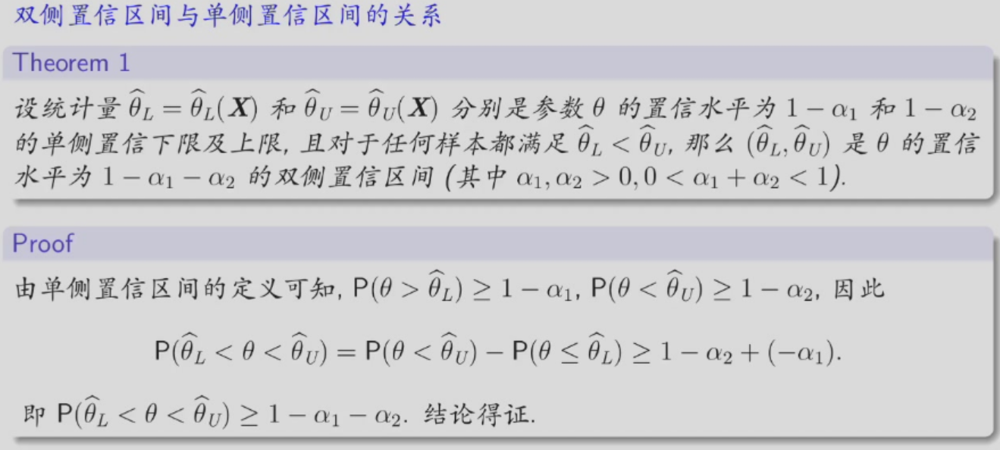

#### 置信区间的含义
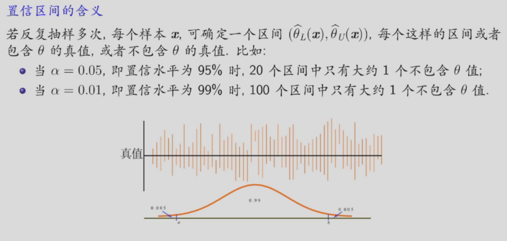
#### 评价置信区间的原则
置信度原则：希望随机区间 $(\hat{\theta}_L, \hat{\theta}_U)$ 包含真值 $\theta$ 的概率越大越好。

精确度原则：    
我们称随机区间 $(\hat{\theta}_L, \hat{\theta}_U)$ 的平均长度，即  
$$
E(\hat{\theta}_U - \hat{\theta}_L)
$$
为其精确度，希望其越短越好。并称二分之一区间的平均长度为置信区间的误差限。

当 $n$ 固定时，置信度原则和精确度原则常常是相互制约的。实际中，我们采用 Neyman 原则，即在保证置信度的前提下，尽可能提高精确度。

### 寻找区间估计的方法——枢轴量法
#### 枢轴量
枢轴量是样本$\mathbf{X}=(X_1,X_2,\cdots,X_n)$和待估参数$\theta$的函数，即
$$
G=G(\mathbf{X},\theta)=G(X_1,X_2,\cdots,X_n;\theta)
$$
一般要求$G$的分布已知，即其分布不依赖于任何未知的参数。

#### 枢轴量法

构造枢轴量 $G(X;\theta)$，其形式上是样本 $X = (X_1, X_2, \ldots, X_n)$ 和待估参数$\theta$的函数，且其分布已知，不依赖于任何未知参数；

对给定的置信水平 $1 - \alpha$ ，选择两个常数 $a$ 和 $b$，使得
$$
P(a < G(X; \theta) < b) \geq 1 - \alpha, \quad \forall \theta \in \Theta
$$

当总体  $X$ 为连续型总体时，一般选择两个常数 $a$ 和 $b$，使得
$$
P(a < G(X; \theta) < b) = 1 - \alpha \quad \forall \theta \in \Theta
$$

假如能从 $a < G(X; \theta) < b$ 得到等价的不等式
$$
\hat{\theta}_L(X) < \theta < \hat{\theta}_U(X)
$$
那么 $(\hat{\theta}_L, \hat{\theta}_U)$ 就是 $\theta$ 的置信水平为 $1 - \alpha$ 的置信区间。(若第二步中是取等号的，那么得到的置信区间为同等置信区间)

注意：

- 用枢轴量法构造区间估计，最关键在于选取一个合适的枢轴量。
  一般会根据合理的思想，得到 $\theta$ 的点估计量 $\hat{\theta}$ (如：矩估计量、极大似然估计量等)，在此基础上进行加工，以构造枢轴量。

- 若第2步中$a$和$b$的解不唯一，通常用如下两种方案处理：
    - 根据 Neyman 原则，求 $a$ 和 $b$ 使得区间平均长度 $E(\hat{\theta}_U - \hat{\theta}_L)$ 最短；
      (这样得到的置信区间称为最优置信区间。)

    - 如果最优解不存在或求解比较复杂，为应用的方便，常取 $a$ 和 $b$ 满足
      $$P(G(X; \theta) \leq a) = P(G(X; \theta) \geq b) = \alpha/2$$
      (这样得到的置信区间称为等尾置信区间。)

- 若要求单侧置信限（区间），只要将第2步中$P(a < G(X; \theta) < b) \geq 1 - \alpha$改为：
    $$
    P(a < G(X; \theta))\geq 1-\alpha 或 P(G(X; \theta) < b)\geq 1-\alpha
    $$
    即可。

#### 轴枢量和统计量的区别
- 轴枢量是样本和待估参数的函数，其分布不依赖于未知参数。
- 统计量只是样本的函数，其分布常常依赖于未知参数。

## 正态总体的区间估计
### 单个正态总体  $N(\mu, \sigma^2)$  的情形  

设 $X = (X_1, X_2, \ldots, X_n)$ 是取自正态总体  $N(\mu, \sigma^2)$  的一个样本， $\overline{X}$和 $S^2$ 分别为样本均值和样本方差，置信水平为 $1 - \alpha$。  

#### 均值  $\mu$  的置信区间  

##### 方差已知时  
$\overline{X}$ 是 $\mu$ 的一个常用估计量，且  $\overline{X} \sim N(\mu, \sigma^2/n)$ 。取枢轴量为  
$$
G(\overline{X}; \mu) = \frac{\overline{X} - \mu}{\sigma / \sqrt{n}} \sim N(0, 1)
$$

因为  $z_{1-\alpha/2} = -z_{\alpha/2}$ ，所以有

$$
P\left\{ -z_{\alpha/2} < \frac{\overline{X} - \mu}{\sigma / \sqrt{n}} < z_{\alpha/2} \right\} = 1 - \alpha
$$

即

$$
P\left\{\overline{X} - \frac{\sigma}{\sqrt{n}} z_{\alpha/2} < \mu < \overline{X} + \frac{\sigma}{\sqrt{n}} z_{\alpha/2}\right\} = 1 - \alpha
$$

因此 $\mu$的置信区间为

$$
\left( \overline{X} - \frac{\sigma}{\sqrt{n}} z_{\alpha/2}, \overline{X} + \frac{\sigma}{\sqrt{n}} z_{\alpha/2} \right)
$$

此时区间的平均长度为

$$
E\left[ \overline{X} + \frac{\sigma}{\sqrt{n}} z_{\alpha/2} - \left( \overline{X} - \frac{\sigma}{\sqrt{n}} z_{\alpha/2} \right) \right] = \frac{2\sigma}{\sqrt{n}} z_{\alpha/2}
$$

下面考虑 $\mu$的置信水平为 $1-\alpha$ 的单侧置信下限。因为仍然属于估计 $\mu$ (方差 $\sigma^2$ 已知)，故同样取枢轴量为
$$
G(\overline{X};\mu) = \frac{\overline{X}-\mu}{\sigma/\sqrt{n}} \sim N(0,1)
$$
注意到:
$$
P(\frac{\overline{X}-\mu}{\sigma/\sqrt{n}} < z_{\alpha}) = 1-\alpha, \iff P(\mu > \overline{X} - \frac{\sigma}{\sqrt{n}}z_{\alpha}) = 1-\alpha
$$
那么 $\mu$ 的置信水平为 $1-\alpha$ 的单侧置信下限为 $\overline{X} - \frac{\sigma}{\sqrt{n}}z_{\alpha}$，即 $\mu$的置信水平为 $1-\alpha$ 的单侧置信区间为
$$
\left( \overline{X} - \frac{\sigma}{\sqrt{n}}z_{\alpha}, +\infty \right)
$$

#####  方差未知时  

此时，(1) 中的 $\frac{\overline{X} - \mu}{\sigma / \sqrt{n}}$不能取为枢轴量，因为其形式上含有未知参数 $\sigma$ (非待估参数)。一个自然的想法，对于 $\frac{\overline{X} - \mu}{\sigma / \sqrt{n}}$ 中的未知的总体方差 $\sigma^2$，用其无偏估计量——样本方差 $S^2$ 代替，故可取枢轴量为
$$
T(\overline{X}; \mu) = \frac{\overline{X} - \mu}{S / \sqrt{n}} \sim t(n-1)
$$
注意到 $t$ 分布的单峰对称性，所以有
$$
P (-t_{\alpha/2}(n-1) < \frac{\overline{X} - \mu}{S / \sqrt{n}} < t_{\alpha/2}(n-1)) = 1 - \alpha
$$

因为 $z_{1-\alpha/2} = -z_{\alpha/2}$ ，所以有

$$
P\left\{ -z_{\alpha/2} < \frac{\overline{X} - \mu}{\sigma / \sqrt{n}} < z_{\alpha/2} \right\} = 1 - \alpha
$$

即

$$
P\left\{\overline{X} - \frac{\sigma}{\sqrt{n}} z_{\alpha/2} < \mu < \overline{X} + \frac{\sigma}{\sqrt{n}} z_{\alpha/2}\right\} = 1 - \alpha
$$

因此 $\mu$ 的置信区间为

$$
\left( \overline{X} - \frac{\sigma}{\sqrt{n}} z_{\alpha/2}, \overline{X} + \frac{\sigma}{\sqrt{n}} z_{\alpha/2} \right)
$$

此时区间的平均长度为

$$
E\left[ \overline{X} + \frac{\sigma}{\sqrt{n}} z_{\alpha/2} - \left( \overline{X} - \frac{\sigma}{\sqrt{n}} z_{\alpha/2} \right) \right] = \frac{2\sigma}{\sqrt{n}} z_{\alpha/2}
$$

##### 成对数据情形
例如，为考察某种降压药的降压效果，测试了 $n$ 个高血压病人在服药前后的血压（收缩压）分别为 $(X_1, Y_1), (X_2, Y_2), \ldots, (X_n, Y_n)$。

由于个人体质的差异，$X_1, X_2, \ldots, X_n$ 不能看成来自同一个正态总体的样本，即 $X_1, X_2, \ldots, X_n$ 是相互独立但不同分布的样本，$Y_1, Y_2, \ldots, Y_n$也是。

此外，对同一个个体，$X_i$ 和 $Y_i$也是不独立的。

对于此类问题，通常作差，得  
$$
D_i = X_i - Y_i, \quad i = 1, 2, \ldots, n 
$$

这就取消了个体的差异，仅与降压药的作用有关，因此可以将  $D_1, D_2, \ldots, D_n $ 看成来自同一正态总体  $N(\mu_D, \sigma_D^2)$  的样本，且相互独立。  
考察降压药的降压效果，就可转化为参数 $\mu_D$的估计问题。此时取枢轴量为  
$$
 T(D; \mu_D) = \frac{\overline{D} - \mu_D}{S_D / \sqrt{n}} \sim t(n-1)
$$

则 $\mu_D$ 的置信度为$1 - \alpha$ 的置信区间为  

$$
\left( \overline{D} - \frac{S_D}{\sqrt{n}} t_{\alpha/2}(n-1), \ \overline{D} + \frac{S_D}{\sqrt{n}} t_{\alpha/2}(n-1) \right)
$$

其中  
$$
\overline{D} = \frac{1}{n} \sum_{i=1}^{n} D_i = \overline{X} - \overline{Y}, \quad
S_D = \sqrt{\frac{1}{n-1} \sum_{i=1}^{n} (D_i - \overline{D})^2}.
$$

#### 方差  $\sigma^2$  的置信区间  

##### 均值已知时 （仅供参考）

注意到  
$$
\frac{1}{\sigma^2} \sum_{i=1}^n (X_i - \mu)^2 \sim \chi^2(n) 
$$ 
取枢轴量为  

$$
G(X; \mu) = \frac{1}{\sigma^2} \sum_{i=1}^n (X_i - \mu)^2 \sim \chi^2(n)
$$

由于  

$$
\text{P}\left\{ \chi_{1-\alpha/2}^2(n) < \frac{1}{\sigma^2} \sum_{i=1}^n (X_i - \mu)^2 < \chi_{\alpha/2}^2(n) \right\} = 1 - \alpha
$$

即

$$
P \left\{ \frac{\sum_{i=1}^{n} (X_i - \mu)^2}{\chi_{\alpha/2}^2(n)} < \sigma^2 < \frac{\sum_{i=1}^{n} (X_i - \mu)^2}{\chi_{1-\alpha/2}^2(n)} \right\} = 1 - \alpha
$$

因此 $\sigma^2$的置信区间为

$$
\left( \frac{\sum_{i=1}^{n} (X_i - \mu)^2}{\chi_{\alpha/2}^2(n)}, \frac{\sum_{i=1}^{n} (X_i - \mu)^2}{\chi_{1-\alpha/2}^2(n)} \right)
$$

区间的平均长度为

$$
E \left[ \frac{\sum_{i=1}^{n} (X_i - \mu)^2}{\chi_{1-\alpha/2}^2(n)} - \frac{\sum_{i=1}^{n} (X_i - \mu)^2}{\chi_{\alpha/2}^2(n)} \right] = n\sigma^2 \left( \frac{1}{\chi_{1-\alpha/2}^2(n)} - \frac{1}{\chi_{\alpha/2}^2(n)} \right).
$$

进一步可知 $\sigma$ 的置信区间为

$$
\left( \sqrt{\frac{\sum_{i=1}^{n} (X_i - \mu)^2}{\chi_{\alpha/2}^2(n)}}, \sqrt{\frac{\sum_{i=1}^{n} (X_i - \mu)^2}{\chi_{1-\alpha/2}^2(n)}} \right)
$$

注 如上得到的置信区间是等尾置信区间，而不是最优置信区间。

##### 均值未知时  
注意到  $\frac{(n-1)S^2}{\sigma^2} = \frac{1}{\sigma^2} \sum_{i=1}^n (X_i - \overline{X})^2 \sim \chi^2(n-1)$ ，取枢轴量为

$$
G(\overline{X};\mu) = \frac{(n-1)S^2}{\sigma^2} \sim \chi^2(n-1)
$$

由于

$$
P \left\{ \chi_{1-\alpha/2}^2(n-1) < \frac{(n-1)S^2}{\sigma^2} < \chi_{\alpha/2}^2(n-1) \right\} = 1 - \alpha
$$

即

$$
P \left\{ \frac{(n-1)S^2}{\chi_{\alpha/2}^2(n-1)} < \sigma^2 < \frac{(n-1)S^2}{\chi_{1-\alpha/2}^2(n-1)} \right\} = 1 - \alpha
$$

因此 $\sigma^2$ 的置信区间为

$$
\left( \frac{(n-1)S^2}{\chi_{\alpha/2}^2(n-1)}, \frac{(n-1)S^2}{\chi_{1-\alpha/2}^2(n-1)} \right)
$$

区间的平均长度为

$$
E\left[ \frac{(n-1)S^2}{\chi_{1-\alpha/2}^2(n-1)} - \frac{(n-1)S^2}{\chi_{\alpha/2}^2(n-1)} \right] = (n-1)\sigma^2 \left( \frac{1}{\chi_{1-\alpha/2}^2(n-1)} - \frac{1}{\chi_{\alpha/2}^2(n-1)} \right).
$$

进一步可知 $\sigma$ 的置信区间为

$$
\left( \sqrt{\frac{(n-1)S^2}{\chi_{\alpha/2}^2(n-1)}}, \sqrt{\frac{(n-1)S^2}{\chi_{1-\alpha/2}^2(n-1)} } \right).
$$

注：如上得到的置信区间也不是最优置信区间。

### 两个正态总体 $N(\mu_1, \sigma_1^2)$，$N(\mu_2, \sigma_2^2)$ 的情形

设 $X = (X_1, X_2, \ldots, X_{n_1})$ 是来自 $N(\mu_1, \sigma_1^2)$ 的样本，$Y = (Y_1, Y_2, \ldots, Y_{n_2})$ 是来自 $N(\mu_2, \sigma_2^2)$ 的样本，且两样本相互独立。 $\bar{X}, \bar{Y}$ 和 $S_1^2, S_2^2$分别是两个总体的样本均值和样本方差，置信度为 $1 - \alpha$。

#### $\mu_1 - \mu_2$ 的置信区间 (Behrens-Fisher 问题)

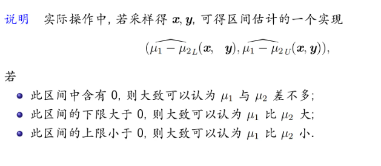

##### 方差已知时

由 $\overline{X} - \overline{Y} \sim N\left(\mu_1 - \mu_2, \frac{\sigma_1^2}{n_1} + \frac{\sigma_2^2}{n_2}\right)$，取枢轴量为

$$
G(X, Y; \mu_1, \mu_2) = \frac{(\overline{X} - \overline{Y}) - (\mu_1 - \mu_2)}{\sqrt{\frac{\sigma_1^2}{n_1} + \frac{\sigma_2^2}{n_2}}} \sim N(0, 1)
$$

可得置信区间为

$$
\left( \overline{X} - \overline{Y} - z_{\alpha/2} \sqrt{\frac{\sigma_1^2}{n_1} + \frac{\sigma_2^2}{n_2}}, \quad \overline{X} - \overline{Y} + z_{\alpha/2} \sqrt{\frac{\sigma_1^2}{n_1} + \frac{\sigma_2^2}{n_2}} \right).
$$
##### 方差未知时  
此时，自然的想法是用它们的无偏估计 $S_1^2$ 和 $S_2^2$ 代替，得  

$$
G'(X, Y; \mu_1, \mu_2) = \frac{(\overline{X} - \overline{Y}) - (\mu_1 - \mu_2)}{\sqrt{\frac{S_1^2}{n_1} + \frac{S_2^2}{n_2}}}
$$

遗憾的是，一般情况下，$G'$ 的分布依赖于未知参数，它不能成为枢轴量。

下面对几种特殊情景进行分析：
###### $\sigma_1^2 = \sigma_2^2 = \sigma^2$，但 $\sigma^2$ 未知  
此时由第六章定理知枢轴量  
$$
T(X, Y; \mu_1, \mu_2) = \frac{(\overline{X} - \overline{Y}) - (\mu_1 - \mu_2)}{S_w \sqrt{\frac{1}{n_1} + \frac{1}{n_2}}} \sim t(n_1 + n_2 - 2)
$$
因此置信区间为  

$$
\left( \overline{X} - \overline{Y} - t_{\alpha/2}(n_1 + n_2 - 2) S_w \sqrt{\frac{1}{n_1} + \frac{1}{n_2}}, \overline{X} - \overline{Y} + t_{\alpha/2}(n_1 + n_2 - 2) S_w \sqrt{\frac{1}{n_1} + \frac{1}{n_2}} \right)
$$

其中 $S_w^2 = \frac{(n_1 - 1) S_1^2 + (n_2 - 1) S_2^2}{n_1 + n_2 - 2}, S_w = \sqrt{S_w^2}$

###### $\sigma_1^2 \neq \sigma_2^2$ 且未知 （仅供参考）

当样本量 $n_1$ 和 $n_2$ 都充分大时（一般要大于 50），根据中心极限定理得

$$
\frac{(\overline{X} - \overline{Y}) - (\mu_1 - \mu_2)}{\sqrt{\frac{S_1^2}{n_1} + \frac{S_2^2}{n_2}}} \quad \text{渐近} \quad N(0, 1)
$$

取之为枢轴量，则 $\mu_1 - \mu_2$的近似置信区间为

$$
\left( \overline{X} - \overline{Y} - z_{\alpha/2} \sqrt{\frac{S_1^2}{n_1} + \frac{S_2^2}{n_2}}, \quad \overline{X} - \overline{Y} + z_{\alpha/2} \sqrt{\frac{S_1^2}{n_1} + \frac{S_2^2}{n_2}} \right)
$$

对于有限小样本，仍取之为枢轴量，可以证明
$$
\frac{(\overline{X} - \overline{Y}) - (\mu_1 - \mu_2)}{\sqrt{\frac{S_1^2}{n_1} + \frac{S_2^2}{n_2}}} \approx t(k)
$$
其中 $k = \frac{\left( \frac{S_1^2}{n_1} + \frac{S_2^2}{n_2} \right)^2}{\frac{(S_1^2)^2}{n_1^2(n_1-1)} + \frac{(S_2^2)^2}{n_2^2(n_2-1)}}$。在实际中，也常用 $\min(n_1-1, n_2-1)$ 近似代替上述自由度$k$。

则 $\mu_1 - \mu_2$ 的近似置信区间为
$$
\left( \overline{X} - \overline{Y} - t_{\alpha/2}(k) \sqrt{\frac{S_1^2}{n_1} + \frac{S_2^2}{n_2}}, \quad \overline{X} - \overline{Y} + t_{\alpha/2}(k) \sqrt{\frac{S_1^2}{n_1} + \frac{S_2^2}{n_2}} \right)
$$

#### $\frac{\sigma_1^2}{\sigma_2^2}$ 的置信区间
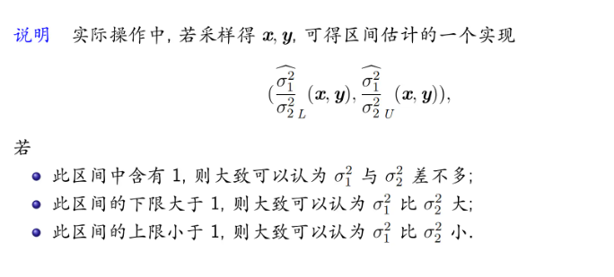
##### 均值已知时 （仅供参考）
注意到
$$
\frac{1}{\sigma_1^2} \sum_{i=1}^{n_1} (X_i - \mu_1)^2 \sim \chi^2(n_1), \quad \frac{1}{\sigma_2^2} \sum_{j=1}^{n_2} (Y_j - \mu_2)^2 \sim \chi^2(n_2)
$$
，且相互独立。取枢轴量为
$$
\frac{\frac{1}{\sigma_1^2} \sum_{i=1}^{n_1} (X_i - \mu_1)^2 / n_1}{\frac{1}{\sigma_2^2} \sum_{j=1}^{n_2} (Y_j - \mu_2)^2 / n_2} \sim F(n_1, n_2).
$$

由此可以等尾地构造出置信区间
$$
\left( \frac{\sum_{i=1}^{n_1} (X_i - \mu_1)^2 / n_1}{\sum_{j=1}^{n_2} (Y_j - \mu_2)^2 / n_2} \cdot \frac{1}{F_{\alpha/2}(n_1, n_2)}, \quad \frac{\sum_{i=1}^{n_1} (X_i - \mu_1)^2 / n_1}{\sum_{j=1}^{n_2} (Y_j - \mu_2)^2 / n_2} \cdot \frac{1}{F_{1-\alpha/2}(n_1, n_2)} \right).
$$

注意到 $F$ 分布分位数的“三变性质”，该置信区间也可以写作
$$
\left( \frac{\sum_{i=1}^{n_1} (X_i - \mu_1)^2 / n_1}{\sum_{j=1}^{n_2} (Y_j - \mu_2)^2 / n_2} \cdot F_{1-\alpha/2}(n_2, n_1), \quad \frac{\sum_{i=1}^{n_1} (X_i - \mu_1)^2 / n_1}{\sum_{j=1}^{n_2} (Y_j - \mu_2)^2 / n_2} \cdot F_{\alpha/2}(n_2, n_1) \right).
$$

##### 均值未知时

注意到 $\frac{(n_1 - 1)S_1^2}{\sigma_1^2} \sim \chi^2(n_1 - 1)$, $\frac{(n_2 - 1)S_2^2}{\sigma_2^2} \sim \chi^2(n_2 - 1)$, 且相互独立。取枢轴量为

$$
\frac{\frac{(n_1 - 1)S_1^2}{\sigma_1^2}/(n_1 - 1)}{\frac{(n_2 - 1)S_2^2}{\sigma_2^2}/(n_2 - 1)} = \frac{S_1^2/S_2^2}{\sigma_1^2/\sigma_2^2} \sim F(n_1 - 1, n_2 - 1).
$$

从而

$$
P\left\{F_{1-\alpha/2}(n_1 - 1, n_2 - 1) < \frac{S_1^2/S_2^2}{\sigma_1^2/\sigma_2^2} < F_{\alpha/2}(n_1 - 1, n_2 - 1)\right\} = 1 - \alpha,
$$

即

$$
P \left\{ \frac{S_1^2}{S_2^2} \frac{1}{F_{\alpha/2}(n_1 - 1, n_2 - 1)} < \frac{\sigma_1^2}{\sigma_2^2} < \frac{S_1^2}{S_2^2} \frac{1}{F_{1-\alpha/2}(n_1 - 1, n_2 - 1)} \right\} = 1 - \alpha.
$$

由此可以等尾地构造出置信区间

$$
\left( \frac{S_1^2}{S_2^2} \cdot \frac{1}{F_{\alpha/2}(n_1 - 1, n_2 - 1)}, \quad \frac{S_1^2}{S_2^2} \cdot \frac{1}{F_{1-\alpha/2}(n_1 - 1, n_2 - 1)} \right).
$$

注意到  $F$ 分布分位数的“三变性质”，该置信区间也可以写作

$$
\left( \frac{S_1^2}{S_2^2} \cdot \frac{1}{F_{\alpha/2}(n_1 - 1, n_2 - 1)}, \quad \frac{S_1^2}{S_2^2} \cdot F_{\alpha/2}(n_2 - 1, n_1 - 1) \right).
$$
### 总结
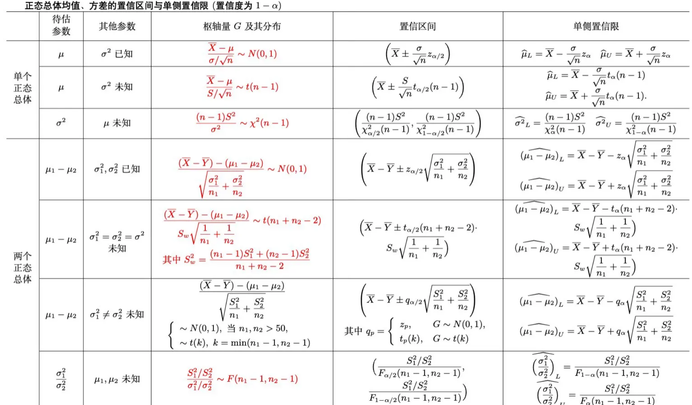

