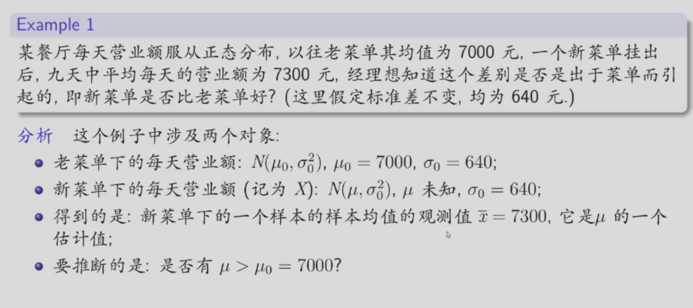
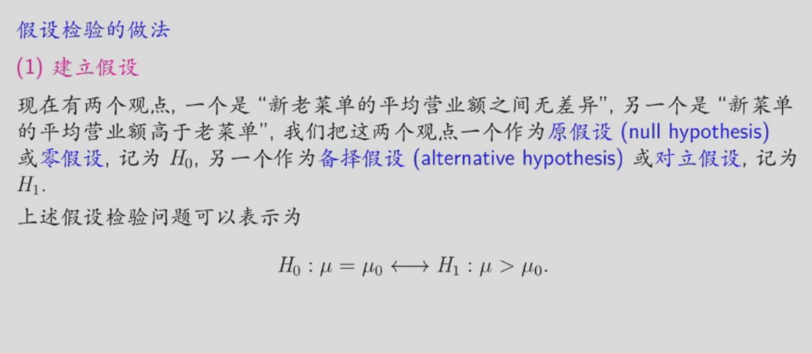
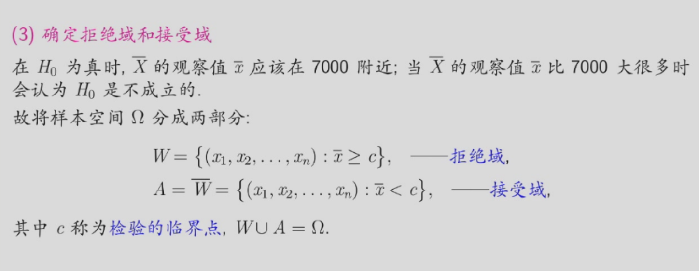
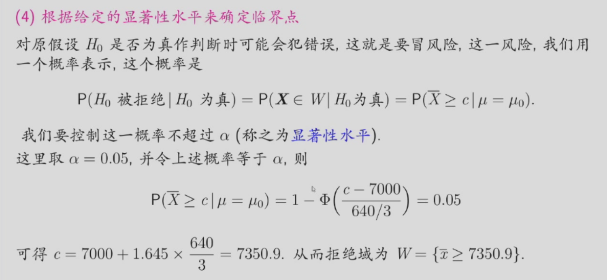
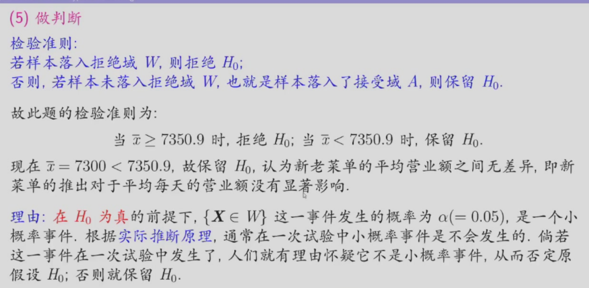
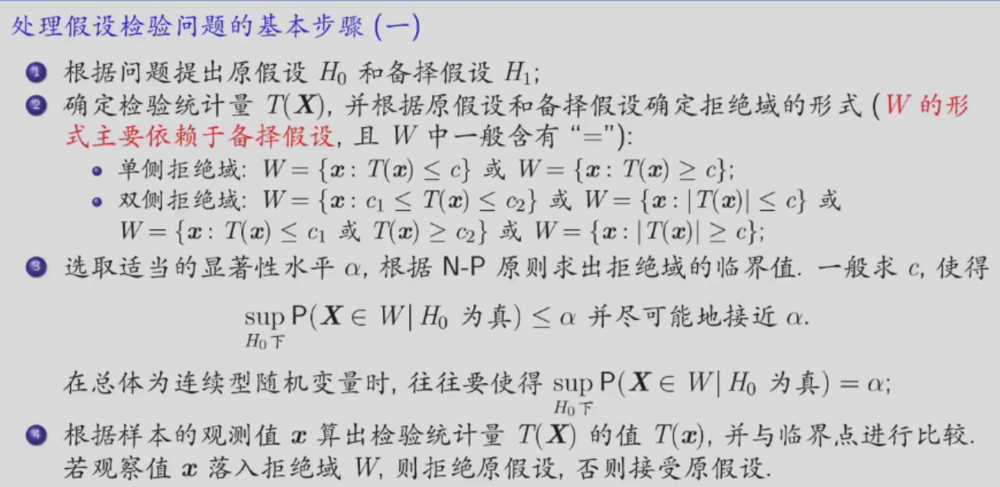
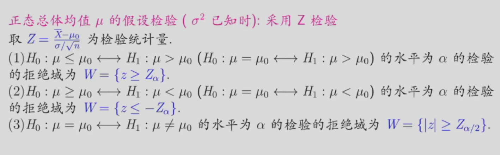

# 假设检验
## 基本思想
先对总体参数、分布形式等作出某种假设，然后利用样本信息来判断该假设是否合理。

推断理由：实际推断原理（小概率事件在一次试验中是不会发生的）

## 假设检验的步骤
我们以下面的例子来说明假设检验的步骤：

## 基本概念
### 假设
假设：指关于总体分布的命题。  

假设检验中常涉及两个假设：

- 原假设（零假设），记为 $H_0$ ：所要检验的假设。  
- 备择假设（对立假设），记为 $H_1$ ：与 $H_0$ 不相容的假设。  

给定 $H_0$ 与 $H_1$ 即构成一个检验问题，记作$(H_0, H_1)$。  

- 参数假设：对总体分布中的未知参数作假设，形式如  
  $$
  H_0 : \theta \in \Theta_0 \leftrightarrow H_1 : \theta \in \Theta_1
  $$ 
  其他假设称为非参数假设。  

参数假设检验分为：

- 简单假设：假设空间为单元素集。  
- 复杂假设：假设空间包含多个元素。

> 原假设$H_0$和备择假设$H_1$一定不相容，但不一定互补。
> 原假设$H_0$是不易被否定的，原假设和备择假设对于一定立场下不可以互换。原假设是研究者想收集证据予以反驳的假设，而备择假设是研究者想收集证据予以支持的假设。
> 参数假设问题中，我们不成文规定原假设$H_0$中一般含有“=”。

### 检验

检验：指给出一个规则，依据该规则，在获得样本观测值后，即可决定是接受（保留）还是拒绝原假设 $H_0$。这样的规则称为检验。  

检验的实质：是给出样本空间 $\Omega$ 的一个分划，即将样本空间划分为两个互补的集合 $W$和 $A$ ，满足：
  $$
  W \cup A = \Omega, \quad W \cap A = \emptyset.
  $$

  - 当样本 $x \in W$  时，拒绝$H_0$ ，称  $W$ 为拒绝域（或否定域）；  
  - 当样本 $x \in A$  时，接受  $H_0$ ，称$A$为接受域。  

这一划分即构成了检验的规则。

为了确定拒绝域，需要构造一个统计量，称能从样本空间中划分出拒绝域的统计量为检验统计量。

### 两类错误

由于样本的随机性，在应用任何检验规则时，都有可能做出错误的判断。

- 第Ⅰ类错误（弃真）：拒绝了实际上为真的原假设 $H_0$ 。  
  犯第Ⅰ类错误的概率称为弃真概率，通常记为 $\alpha(\theta)$，即：
  $$
  \alpha(\theta) = P\{\text{第Ⅰ类错误}\} = P\{\text{拒绝 } H_0 \mid H_0 \text{ 为真}\} = P\{X \in W \mid H_0 \text{ 为真}\}.
  $$

- 第Ⅱ类错误（取伪/存伪）：接受了实际上为假的原假设  $H_0$ 。  
  犯第Ⅱ类错误的概率称为取伪概率，通常记为 $\beta(\theta)$，即：
  $$
  \beta(\theta) = P\{\text{第Ⅱ类错误}\} = P\{\text{接受 } H_0 \mid H_0 \text{ 为假}\} = P\{X \in A \mid H_0 \text{ 为假}\}.
  $$

>两类错误的关系：当$n$固定时，$\alpha$越小，$\beta$就越大；$\alpha$越大，$\beta$就越小。

### 显著性水平

目标是控制犯第Ⅰ类错误的概率不超过给定的 $\alpha$（其中 $0 < \alpha < 1$），即要求：
  $$
  \sup_{\theta \in \Theta_0} \alpha (\theta) \leq \alpha.
  $$

为了兼顾控制犯第Ⅱ类错误的概率，通常选取检验的临界点，使得：
  $$
  \sup_{\theta \in \Theta_0} \alpha (\theta) = \alpha \quad \text{或尽量接近 } \alpha.
  $$

凡控制犯第Ⅰ类错误的概率不超过 $\alpha$ 的检验，称为 显著性水平为 $\alpha$ 的检验。

>显著性水平时事先由研究者指定的犯第一类错误的最大允许值，通常记为$\alpha (0<\alpha<1)$。
>常用的$\alpha$值有0.01、0.05、0.1。
>拒绝原假设，表明检验的结果是显著的，否则表明检验的结果是不显著的。

## 假设检验的基本步骤

## 正态分布总体下参数的假设检验
### 单个正态总体
设总体 $X \sim N(\mu, \sigma^2)$，$\overline{X} = (X_1, X_2, \cdots, X_n)$ （有时也常记为 $\bar{X}$）是取自该总体的容量为 $n$  的（简单随机）样本。并记样本均值和样本方差分别为：

$$
\overline{X} = \frac{1}{n} \sum_{i=1}^n X_i,
$$
$$
S^2 = \frac{1}{n-1} \sum_{i=1}^n (X_i - \overline{X})^2.
$$

#### 正态总体均值 $\mu$的假设检验
##### $\sigma^2$ 已知时

###### $H_0 : \mu = \mu_0 \longleftrightarrow H_1 : \mu > \mu_0$

由于 $\overline{X}$ 是 $\mu$ 的极大似然估计量（也是矩法估计量）且为其无偏估计量，故可取它做检验统计量。  

相对于备择假设$H_1$ 而言，当原假设 $H_0$ 为真时，$\overline{X}$ 的值不应该太大。而当 $\overline{X}$ 过大（比 $\mu_0$ 大很多）时，应拒绝 $H_0$。  
  于是拒绝域应有如下形式：  
  $$
  W = \{\mathbf{x}: \overline{x} \geq C\} = \{(x_1, x_2, \cdots, x_n): \overline{x} \geq C\} \equiv \{\overline{x} \geq C\},
  $$
  其中 $C$ 为待定的临界值。

由于 $\overline{X} \sim N(\mu, \sigma^2/n)$，故当原假设 $H_0$ 为真时，有 $\overline{X} \sim N(\mu_0, \sigma^2/n)$。此时，犯第一类错误的概率为：

$$
\alpha(\mu) = P_\mu \left( \overline{X} \geq C \mid H_0 \text{ 为真} \right) = P \left( \overline{X} \geq C \mid \mu = \mu_0 \right)
$$

$$
= P \left( \frac{\overline{X} - \mu_0}{\sigma/\sqrt{n}} \geq \frac{C - \mu_0}{\sigma/\sqrt{n}} \;\Big|\; \mu = \mu_0 \right) = 1 - \Phi \left( \frac{C - \mu_0}{\sigma/\sqrt{n}} \right)。
$$

对于给定的显著性水平 $\alpha$，需确定临界值 $C$，使得犯第一类错误概率的上确界等于 $\alpha$，即：

$$
\sup_{\mu = \mu_0} \alpha(\mu) = 1 - \Phi \left( \frac{C - \mu_0}{\sigma/\sqrt{n}} \right) = \alpha。
$$

由此可得：

$$
\frac{C - \mu_0}{\sigma/\sqrt{n}} = Z_\alpha, \quad \text{即} \quad C = \mu_0 + Z_\alpha \cdot \frac{\sigma}{\sqrt{n}}。
$$

因此，所求的显著性水平为 $\alpha$ 的检验，其拒绝域为：

$$
W = \{ \bar{x} \geq \mu_0 + Z_\alpha \cdot \frac{\sigma}{\sqrt{n}} \}。
$$

而

$$
\{\bar{x} \geq \mu_0 + Z_\alpha \cdot \frac{\sigma}{\sqrt{n}}\} = \left\{ \frac{\bar{x} - \mu_0}{\sigma / \sqrt{n}} \geq Z_\alpha \right\},
$$

所以，可取检验统计量

$$
Z = Z(X) = \frac{\bar{X} - \mu_0}{\sigma / \sqrt{n}}, \quad \text{当 } \mu = \mu_0 \text{ 时，} Z \sim N(0,1).
$$

拒绝域可写为

$$
W = \{Z(x) \geq Z_\alpha\} = \left\{ \frac{\bar{x} - \mu_0}{\sigma / \sqrt{n}} \geq Z_\alpha \right\},
$$

简写为  $W = \{z \geq Z_\alpha\}$ 。

###### $H_0 : \mu = \mu_0 \longleftrightarrow H_1 : \mu < \mu_0 $

仍取  
$$
Z = \frac{\overline{X} - \mu_0}{\sigma / \sqrt{n}}, \quad \text{当 } \mu = \mu_0 \text{ 时，} Z \sim N(0, 1)
$$
作为检验统计量。

此时，拒绝域具有形式  $W = \{ z \leq C \}$ 。  
检验犯第一类错误的概率为  
$$
\alpha(\mu) = P_\mu (Z \leq C \mid H_0 \text{ 为真}) = \Phi(C).
$$

###### $H_0 : \mu = \mu_0 \longleftrightarrow H_1 : \mu \neq \mu_0$

仍取  
$$
Z = \frac{\overline{X} - \mu_0}{\sigma / \sqrt{n}}, \quad \text{当 } \mu = \mu_0 \text{ 时，} Z \sim N(0, 1)
$$
为检验统计量。

当 $H_0$  为真时，$\overline{X}$ 与 $\mu_0$ 的差异不应过大，即 $|Z|$ 的值不应过大。因此，检验的拒绝域取为以下形式：  
$$
W = \{ |z| \geq C \}.
$$

检验犯第一类错误的概率为  
$$
P_\mu (|Z| \geq C \mid \mu = \mu_0) = P_{\mu_0} (|Z| \geq C) = 2 \left(1 - \Phi(C) \right).
$$

对于给定的显著性水平 $\alpha$，需确定常数 $C$，使其满足  
$$
2 \left(1 - \Phi(C) \right) = \alpha.
$$

######  $H_0 : \mu \geq \mu_0 \longleftrightarrow H_1 : \mu < \mu_0$ 

此类问题仍属于正态总体均值 $\mu$ 的检验（已知 $\sigma$），故仍取检验统计量为：
$$
Z = \frac{\overline{X} - \mu_0}{\sigma / \sqrt{n}}, \quad \text{当 } \mu = \mu_0 \text{ 时，} Z \sim N(0, 1).
$$

拒绝域的形式为：
$$
W = \{ z \leq c \}.
$$

接下来需要确定临界值 $c$。犯第一类错误的概率为：
$$
\alpha(\mu) = P_\mu \left( \frac{\overline{X} - \mu_0}{\sigma / \sqrt{n}} \leq C \;\Big|\; H_0 \text{ 为真} \right) = P_\mu \left( \frac{\overline{X} - \mu_0}{\sigma / \sqrt{n}} \leq C \;\Big|\; \mu \geq \mu_0 \right).
$$

那么要求
$$
\sup_{\mu \geq \mu_0} P_\mu \left( \frac{\bar{X} - \mu_0}{\sigma / \sqrt{n}} \leq C \right) \leq \alpha.
$$

注意到
$$
LHS = \sup_{\mu \geq \mu_0} P_\mu \left( \frac{\bar{X} - \mu}{\sigma / \sqrt{n}} \leq C + \frac{\mu_0 - \mu}{\sigma / \sqrt{n}} \right) = \sup_{\mu \geq \mu_0} \Phi (C + \frac{\mu_0 - \mu}{\sigma / \sqrt{n}})
$$

而在$mu \geq \mu_0$时，$\alpha(\mu)$ 是 $\mu$的严格减函数，故其最大值在 $\mu = \mu_0$ 处达到。因此，对于给定的显著性水平 $\alpha$，要求 $C$ 满足
$$
\sup_{\mu \geq \mu_0} \alpha(\mu) = \Phi (C) = \alpha
$$

此时，有 $C = Z_{1-\alpha} = -Z_\alpha$。拒绝域为
$$
W = \{ x : z(x) \leq -Z_\alpha \} = \{ x : \frac{\bar{x} - \mu_0}{\sigma / \sqrt{n}} \leq -Z_\alpha \}
$$

（这与 $H_0 : \mu = \mu_0 \longleftrightarrow H_1 : \mu < \mu_0$ 的拒绝域是相同的，两者的 $P$ 值也是相同的）

###### $H_0 : \mu \leq \mu_0 \longleftrightarrow H_1 : \mu > \mu_0$ 

仍取

$$
Z = \frac{\overline{X} - \mu_0}{\sigma / \sqrt{n}}
$$

为检验统计量。这时拒绝域形为 $W = \{ z \geq C \}$ 。检验犯第一类错误的概率为

$$
\alpha(\mu) = P_\mu (Z \geq C | H_0 为真)
$$

$$
= P_\mu \left( \frac{\overline{X} - \mu}{\sigma / \sqrt{n}} \geq C + \frac{\mu_0 - \mu}{\sigma / \sqrt{n}} \right)
$$

$$
= 1 - \Phi \left( C + \frac{\mu_0 - \mu}{\sigma / \sqrt{n}} \right), \quad \mu \leq \mu_0
$$

在 $\mu \leq \mu_0$ 时，$\alpha(\mu)$ 是 $\mu$ 的严格增函数，故其最大值在 $\mu = \mu_0$ 时达到。从而对给定的显著性水平 $\alpha$，要求$C$ 满足

$$
\sup_{\mu \leq \mu_0} \alpha(\mu) = \alpha(\mu_0) = 1 - \Phi(C) = \alpha
$$

那么得 $C = Z_\alpha$。故拒绝域为 $\{z \geq Z_\alpha\}$ 的检验就是所要求的水平为 $\alpha$ 的检验。

（与 $H_0 : \mu = \mu_0 \longleftrightarrow H_1 : \mu > \mu_0$的拒绝域是一样的）

（两者的 $P$ 值也是一样的）

###### 总结

##### $\sigma^2$ 未知时

当 $\sigma^2$ 已知时，检验统计量为
$$
Z = \frac{\overline{X} - \mu_0}{\sigma / \sqrt{n}}
$$
而现在不能用 $Z$ 作为检验统计量，因为它含有未知参数 $\sigma$。一个自然的想法就是用 $\sigma^2$ 的无偏估计

$$
S^2 = \frac{1}{n-1} \sum_{i=1}^n (X_i - \overline{X})^2
$$

代替 $\sigma^2$，得检验统计量为

$$
t = t(\overline{X}) = \frac{\overline{X} - \mu_0}{S / \sqrt{n}}
$$

当$H_0 : \mu \geq \mu_0 \longleftrightarrow H_1 : \mu < \mu_0$时

取检验统计量为

$$
t = t(X) = \frac{\overline{X} - \mu_0}{S / \sqrt{n}}
$$

那么拒绝域形为： $W = \{t(x) \leq C\}$ 。而检验犯第一类错误的概率为
$$
\alpha(\mu) = P_{\mu, \sigma^2}(t(X) \leq C|H_0 为真), \quad \mu \geq \mu_0
$$
我们要取临界值 $C$ 使得

$$
\sup_{\mu \geq \mu_0} P_{\mu, \sigma^2}(t(X) \leq C) = \alpha
$$

可证其检验的拒绝域为（具体证明略）：
$$
W = \{t \leq t_\alpha(n-1)\}
$$

类似地，假设检验问题  
$$
H_0 : \mu \leq \mu_0 \Longleftrightarrow H_1 : \mu > \mu_0  
$$

的水平为 $\alpha$ 的检验的拒绝域为  
$$
W = \{ t \geq t_{\alpha}(n-1) \} 
$$

假设检验问题  
$$
H_0 : \mu = \mu_0 \Longleftrightarrow H_1 : \mu \neq \mu_0 
$$
的水平为 $\alpha$ 的检验的拒绝域为  
$$
W = \{ |t| \geq t_{\alpha/2}(n-1) \}  
$$
这些检验称为 $t$-检验法。

#### 正太总体方差 $\sigma^2$ 的假设检验

我们主要讨论$\mu$未知的情况。

当 $\mu$ 已知时，检验统计量为

$$
\chi^2 = \chi^2(\mathbf{X}) = \frac{\sum_{i=1}^n (X_i - \mu)^2}{\sigma_0^2}
$$

但此统计量不能作为 $\mu$ 未知时的检验统计量。一个自然的想法是：用 $\mu$ 的无偏估计量 $\overline{X}$ 去代替，即取检验统计量为：

$$
\chi^2 = \chi^2(\mathbf{X}) = \frac{(n-1)S^2}{\sigma_0^2} = \frac{\sum_{i=1}^n (X_i - \overline{X})^2}{\sigma_0^2}
$$

当$H_0 : \sigma^2 \geq \sigma_0^2 \longleftrightarrow H_1 : \sigma^2 < \sigma_0^2$时拒绝域为
$$ 
W = \{ \chi^2 \leq C \}
$$

$C$ 由下式确定
$$
\alpha = \sup_{\sigma^2 \geq \sigma_0^2} P_{\sigma^2, \mu} (\chi^2 \leq C) = \sup_{\sigma^2 \geq \sigma_0^2} P_{\sigma^2, \mu} \left( \frac{\sum_{i=1}^n (X_i - \overline{X})^2}{\sigma^2} \leq C \frac{\sigma_0^2}{\sigma^2} \right)
$$
$$
= \sup_{\sigma^2 \geq \sigma_0^2} P_{\sigma^2, \mu} \left( \chi^2 (n-1) \leq C \frac{\sigma_0^2}{\sigma^2} \right) = P \left( \chi^2 (n-1) \leq C \right)
$$

所以此问题显著性水平为 $\alpha$ 的检验的拒绝域为 $\{ \chi^2 \leq \chi_{1-\alpha}^2 (n-1) \}$

类似地，假设检验问题

$$
 H_0 : \sigma^2 \leq \sigma_0^2 \longleftrightarrow H_1 : \sigma^2 > \sigma_0^2 
$$

的显著性水平为 $\alpha$ 的检验的拒绝域为

$$
W = \{ \chi^2 \geq \chi_{\alpha}^2 (n - 1) \} 
$$

假设检验问题

$$ 
H_0 : \sigma^2 = \sigma_0^2 \longleftrightarrow H_1 : \sigma^2 \neq \sigma_0^2 
$$

的显著性水平为 $\alpha$ 的检验的拒绝域为
$$
W = \{ \chi^2 \geq \chi_{\alpha/2}^2 (n - 1) \text{ 或 } \chi^2 \leq \chi_{1-\alpha/2}^2 (n - 1) \} 
$$
这些检验也称为 $\chi^2$-检验。

### 两个正态总体

$X_1, X_2, \cdots, X_m$ 是来自正态总体$N(\mu_X, \sigma_X^2)$的样本，$Y_1, Y_2, \cdots, Y_n$ 是来自正态总体 $N(\mu_Y, \sigma_Y^2)$ 的样本，且两个样本相互独立。并记
$$
\overline{X} = \frac{1}{m} \sum_{i=1}^m X_i, \quad \overline{Y} = \frac{1}{n} \sum_{j=1}^n Y_j
$$
$$
S_X^2 = \frac{1}{m-1} \sum_{i=1}^m (X_i - \overline{X})^2, \quad S_Y^2 = \frac{1}{n-1} \sum_{j=1}^n (Y_j - \overline{Y})^2
$$

#### 比较均值的假设检验 

##### $\sigma_X^2$ 和 $\sigma_Y^2$ 均已知时  
这时 $\mu_X$ 和 $\mu_Y$ 的 MLE 分别为 $\overline{X}$ 和 $\overline{Y}$。 与作为尺度参数的方差不同, 均值是位置参数, 位置可以平行移动, 我们取  

$$
d = \overline{X} - \overline{Y}
$$
作为检验统计量. 注意到  

$$
\overline{X} - \overline{Y} \sim N\left(\mu_X - \mu_Y, \sigma_X^2/m + \sigma_Y^2/n\right)
$$

我们可取 
$$
Z = \frac{\overline{X} - \overline{Y}}{\sqrt{\sigma_X^2/m + \sigma_Y^2/n}}
$$
作检验统计量。
这样与单个正态总体的均值的 $Z$-检验类似, 我们得
$$
H_0 : \mu_X \geq \mu_Y \Longleftrightarrow H_1 : \mu_X < \mu_Y,
$$
$$
W = \{(x, y) : z \leq -z_\alpha\}
$$
$$
H_0 : \mu_X \leq \mu_Y \Longleftrightarrow H_1 : \mu_X > \mu_Y,
$$
$$
W = \{(x, y) : z \geq z_\alpha\}
$$
$$
H_0 : \mu_X = \mu_Y \Longleftrightarrow H_1 : \mu_X \neq \mu_Y,
$$
$$
W = \{(x, y) : |z| \geq z_{\alpha/2}\}
$$

##### $\sigma_X^2$ 和 $\sigma_Y^2$ 均未知时 
我们只考虑 $\sigma_X^2=\sigma_Y^2=\sigma^2$ 的情况。 
这时，$S_w^2 = (Q_X^2 + Q_Y^2)/(m+n-2)$ 是 $\sigma^2$ 的无偏估计，其中 $Q_X^2 = \sum_{i=1}^m (X_i - \overline{X})^2$，  
$Q_Y^2 = \sum_{j=1}^n (Y_i - \overline{Y})^2$。用它代替 $Z$ 中的 $\sigma_X^2$ 和 $\sigma_Y^2$ 得  

$$
t = \frac{\overline{X} - \overline{Y}}{S_w \sqrt{\frac{1}{m} + \frac{1}{n}}}
$$

取 $t$ 为检验统计量，得

$$
H_0 : \mu_X \geq \mu_Y \longleftrightarrow H_1 : \mu_X < \mu_Y,
$$
$$
W = \{(x, y) : t \leq -t_\alpha (n + m - 2)\}
$$
$$
H_0 : \mu_X \leq \mu_Y \longleftrightarrow H_1 : \mu_X > \mu_Y,
$$
$$
W = \{(x, y) : t \geq t_\alpha (n + m - 2)\}
$$
$$
H_0 : \mu_X = \mu_Y \longleftrightarrow H_1 : \mu_X \neq \mu_Y,
$$
$$
W = \{(x, y) : t \leq -t_\alpha / 2 (n + m - 2) \text{ 或 } t \geq t_\alpha / 2 (n + m - 2)\}
$$

#### 比较方差的假设检验

我们只考虑$μ_X$ 和 $μ_Y$ 都未知。  
这时 $σ_X^2$ 和 $σ_Y^2$ 的无偏估计量分别为  
$$
S_X^2 = \frac{1}{m-1} \sum_{i=1}^m (X_i - \overline{X})^2, \quad S_Y^2 = \frac{1}{n-1} \sum_{j=1}^n (Y_j - \overline{Y})^2.
$$
取  
$$
F = \frac{S_X^2}{S_Y^2} = \frac{\sum_{i=1}^m (X_i - \overline{X})^2 / (m-1)}{\sum_{j=1}^n (Y_i - \overline{Y})^2 / (n-1)}
$$
作检验统计量。且  
$$
\frac{F}{\sigma_X^2 / \sigma_Y^2} = \frac{S_X^2 / \sigma_X^2}{S_Y^2 / \sigma_Y^2} \sim F(m-1, n-1).
$$

### 总结
**正态分布总体下参数的假设检验中检验统计量与相应正态分布总体下参数的区间估计的枢轴量有关。把枢轴量中出现的未知参数替换成假设检验中未知参数与之比较的数之后，就可以得到相应的检验统计量。且检验统计量的分布和枢轴量的分布一样**