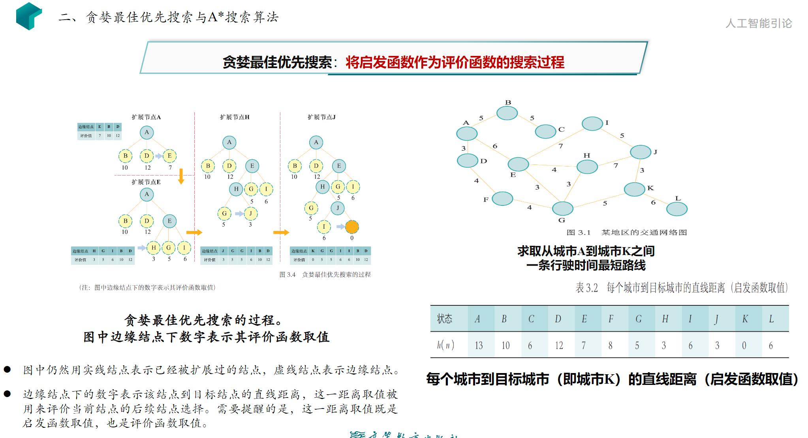
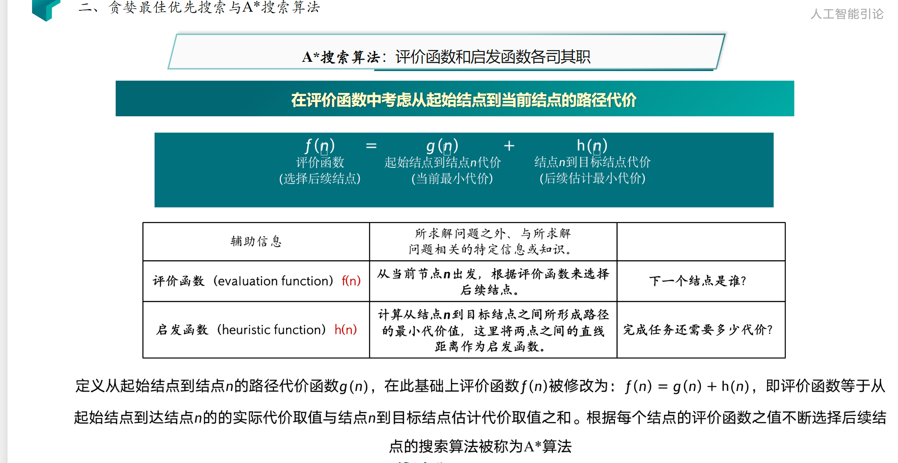
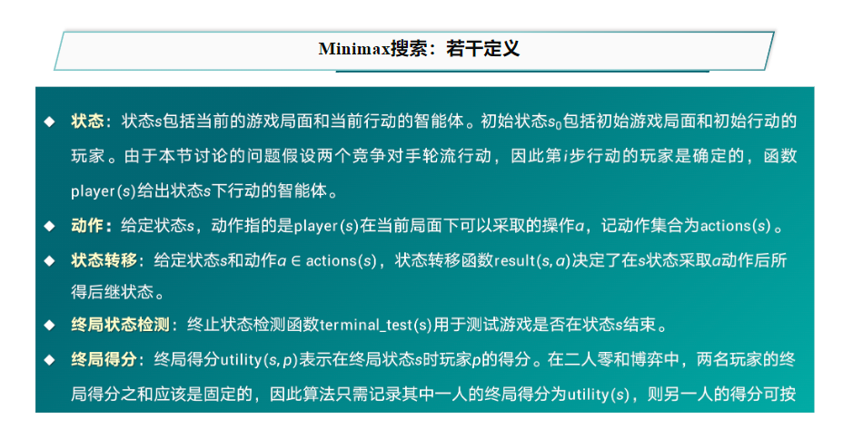
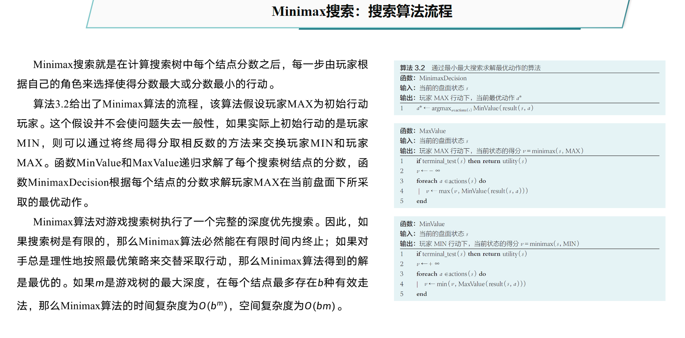
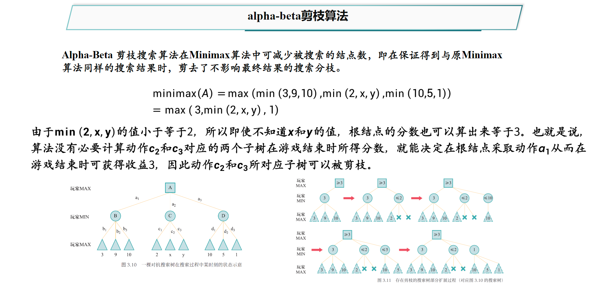
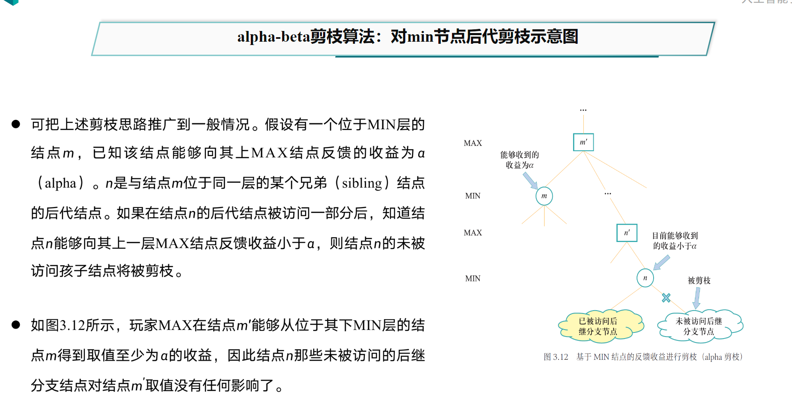
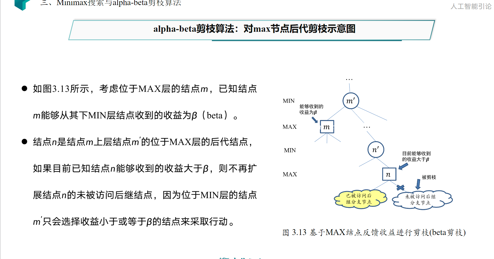
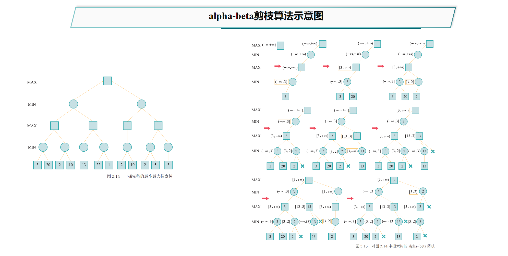
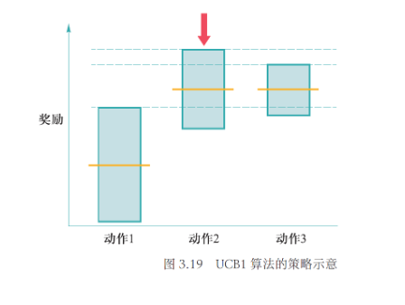
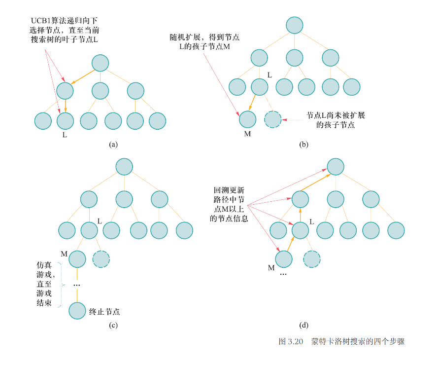

# 搜索探寻与问题求解
## 搜索的基本概念
### 搜索的形式化描述
- 状态：广义来说，状态是对搜索算法和搜索环境当前所处情形的描述信息。
- 动作：算法从一个状态转移到另一个状态的行为称为动作。
- 状态转移：算法选择了一个动作后，其所处的状态也会发生相应变化，这个过程被称为状态转移。
- 路径：以一个状态为起点，搜索算法通过执行一系列动作后，将会在不同状态之间不断转移。将这个过程中经历的状态记录下来，可以得到一个状态序列，称为路径。
- 代价：通过该路径的时间开销。
- 目标测试：用于判断状态s是否为目标状态，目标测试通过意味着搜索算法完成。
- 搜索过程可视为搜索树的构建。
### 搜索算法的评判标准
- 完备性：当问题存在解时，算法是否能找出一个解。
- 最优性：算法是否保证找到的第一个解为最优解。
- 时间复杂度
- 空间复杂度
### 评价函数和启发函数
- 评价函数：从当前节点n出发，根据评价函数来选择后续节点。
- 启发函数：计算从节点n到目标节点之间所形成路径的最小代价值。

## 贪婪最佳优先搜索
- 将启发函数作为评价函数的搜索过程。
- 具有完备性但不一定具有最优性

## A*搜索
- 评价函数与启发函数各司其职，考虑历史轨迹。

### A*搜索的性能分析
A*算法的完备性和最优性取决于搜索问题和启发函数的性质。

#### 启发函数的性质
启发函数有两条性质：可容性和一致性。
##### 可容性
- 对于任意节点n，有$h(n)\leq h^*(n)$，如果n是目标节点，则有$h(n)=0$。
- $h^*(n)$是从节点n出发到达终止结点所付出的最小代价。
- 可容性的启发函数即启发函数不会过高估计从节点n到终止节点所应该付出的代价（即估计代价小于等于实际代价）。
- 在上述问题中，对每个节点其状态（城市）到目标状态K之间的行驶距离不会小于两城的直接距离，启发函数满足可容性。
##### 一致性
- 启发函数的一致性满足条件$h(n)\leq c(n,a,m)+h(m)$，其中$c(n,a,m)$表示节点n通过动作a到达其相应后续节点m的代价。
- 在上述问题中，对任意节点n，m，单步代价定义为n,m在二维平面内的欧式距离，由于三角形不等式，城市n到目标城市K之间直线距离一定小于等于从城市n到其相邻城市m的直线距离与城市m到目标城市K之间直线距离之和，因此启发函数满足一致性。
- 一致性必然导致可容性

### 完备性
如果求解问题和启发函数满足以下条件，则A*算法是完备的：

- 搜索树中分支数量是有限的，即每个节点的后继节点数是有限的。
- 单步代价的下界是一个正数。
- 启发函数有下界。
### 最优性
- **如果启发函数是可容的，那么A*算法满足最优性**

## Minimax搜索————对抗搜素或博弈搜素

## Alpha-Beta剪枝
- Alpha-Beta剪枝是一种启发式搜索方法，它通过对搜索树进行剪枝来减少搜索树的大小，从而提高搜索效率。

## **蒙特卡洛树搜索**
### 问题引出
以经典的多臂赌博机 (Multi-armed Bandit)问题为例。先考虑一个简化问题：假设智能体面前有K个赌博机，每个赌博机有一个臂膀。每次转动一个赌博机臂膀，赌博机则会随机吐出一些硬币或不吐出硬币，将每次吐出的硬币的币值表示为收益分数。现在假设给智能体$\tau(\tau > K)$次转动臂膀的机会，那么智能体如何选择赌博机、转动$τ$次赌博机臂膀，以获得更多的收益分数呢。
### 问题要素
- 状态：每个被摇动的臂膀即为一个状态，记K个状态分别为$\{s_{1} , s_{2} , \cdots , s_{K}\}$，没有摇动任何臂膀的初始状态记为$s₀$。
- 动作：动作对应着摇动一个赌博机的臂膀，在多臂赌博机问题中，任意状态下的动作集合都为$\{a_{1} , a_{2}\cdots , a_{K}\}$，分别对应摇动某个赌博机的臂膀。
- 状态转移：选择动作$a_{i}(1 ≤ i ≤ K)$后，将状态相应地转换为$sᵢ$。然而这个问题和前两节讨论的搜索问题的不同之处在于，由于存在随机性，智能体摇动赌博机臂膀若干个$τ$次，任意两个$τ$次的结果可能都不一样，为此引入如下奖励要素。
- 奖励(reward)：假设从第i个赌博机获得收益分数的分布为$D_{i}$，其均值为$μᵢ$。如果智能体在第t次行动中选择转动了第$I_t$个赌博机臂膀，那么智能体在第t次行动中所得收益分数$\hat{r}_{t}$服从分布$D_{I_t}$，$\hat{r}_{t}$被称为第t次行动的奖励。
- 悔值(regret) 函数根据智能体前T次动作，可以如下定义悔值函数：$\rho_{T} = T \mu^{ * } - \sum_{t = 1}^{T}\hat{r}_{t}$其中$\mu^{ * } = max_{i=1,...,K} μ_i$。显然为了尽量减少悔恨，在每次操作时，智能体应该总是转动能够提供最大期望奖励的赌博机臂膀，但是这是不现实的，因为智能体并不知道哪个臂膀的奖励期望最大。这一公式告诉我们，将T次操作中最优策略的期望得分减去智能体的实际得分，就是悔值函数的结果。显然，问题求解的目标为最小化悔值函数的期望，该悔值函数的取值取决于智能体所采取的策略。
### 策略计算
#### 贪心算法
- 一种直观的做法是，智能体记录下每次摇动的赌博机臂膀和获得的相应收益分数。给定第$i(1 ≤ i ≤ K)$个赌博机，记在过去$t-1$次摇动赌博机臂膀的行动中，一共摇动第$i$个赌博机臂膀的次数为$T_{(i , t - 1)}$，可以计算得到第$i$个赌博机在过去$T_{(i , t - 1)}$次被摇动过程中的收益分数平均值$\overline{x}_{i , {T}_{(i , t - 1)}}$这样，智能体在第t步，只要选择$\overline{x}_{i , {T}_{(i , t - 1)}}$值最大的赌博机臂膀进行摇动，这是贪心算法的思路。
- 贪心算法基本上是利用从已有尝试结果中所得估计来指导后续动作，但问题是所得估计往往不能准确反映未被(大量)探索过的动作，如由于很少摇动其他编号的赌博机而无法准确估计其他编号赌博机可能带来的收益分数。因此，需要在贪心算法中增加一个能够改变其“惯性”的内在动力，以使得贪心算法能够访问那些尚未被 (充分)访问过的空间。
#### $\epsilon$-贪心算法
- $\epsilon$-贪心算法就是这样一种在探索与利用之间进行平衡的搜索算法。
- 在第$t$步，$\epsilon$-贪心算法按照如下机制来选择摇动赌博机：以$1-\epsilon$的概率选择在过去$t-1$次摇动赌博机臂膀行动中所得平均收益分数最高的赌博机进行摇动；以$\epsilon$的概率随机选择一个赌博机进行摇动。
- 人工智能蒙特卡洛树搜索：上限置信区间算法$\epsilon$-贪心算法虽然能有效地促使算法进行探索，但通过这种随机机制来选择动作进行探索的做法很可能不是最优的。
- 直观来看，执行一个动作后所得奖励的样本少，那么算法对这个动作的奖励期望估计会不准确。比如，可能存在一个给出更好奖励期望的动作，但因为智能体对其探索次数少而认为其期望奖励小。因此，需要对那些探索次数少或几乎没有被探索过的动作赋予更高的优先级。
- 但是$\epsilon$-贪心算法没有将每个动作被探索的次数纳入考虑，这似乎是不合理的。另一方面，简单地优先去尝试探索次数少的动作也未必合理，因为只需要少量的探索次数，就能够较好估计方差较小的动作的奖励期望。
- 总结以上想法，在探索过程中，应该优先探索估计值不确定度高动作。另外还应注意到，如果从已有探索样本中知道一个动作的奖励估计值极端偏小，那么即使该动作的估计值不确定度很大，算法也没有必要将其作为优先探索对象。
#### 上限置信区间算法
- 上限置信区间 (Upper Confidence Bounds,UCB1) 算法正是采用这一思路来进行探索。
- UCB1算法的策略是：为每个动作的奖励期望计算一个估计范围，优先采用估计范围上限较高的动作。如图3.19所示，动作1的奖励期望取值的不确定度 (估计范围)虽然最大，但是因为其均值太小，因此UCB1算法不优先考虑探索动作1。动作2和3的奖励期望的均值相同，但是动作2的奖励期望取值的不确定度 (估计范围)更大，于是因为置信上限更大，动作2会被UCB1算法优先考虑。

- 上限置信区间算法策略UCB1算法的策略可以描述为，在第$t$次时选择使得上述不等式右侧足够小的动作$a_{I_{t}}$，其中$I_{t}$由如下式子计算得到：
  
$$
I_{t} = \arg\max_{i} \overline{x}_{i , {T}_{(i , t - 1)}} + C\sqrt{\frac{2 \ln t}{T_{(i , t - 1)}}}
$$

 
- 文献证明了：UCB1算法在经过$T$次测试后，悔值函数的期望上界为$O \left(\frac{K \ln T}{\Delta}\right)$，其中$\Delta = \min_{i = 1 , \cdots , K ;\mu^{ * } < \mu_{i}}\mu_{i}- \mu^{ * }$
### 基本定义
- 无论是一般搜索问题，还是对抗搜索问题，在问题特别复杂时，搜索树可能会变得十分巨大，以至于搜索算法很难在短时间内完全探索整棵搜索树。
- 为了解决这个问题，前面章节分别探讨了如何利用辅助信息来找到高效的结点扩展顺序以及介绍了可减少不必要扩展的结点数量的 alpha-beta剪枝算法。
- 不难发现，对搜索算法进行优化以提高搜索效率基本上是在解决如下两个问题：优先扩展哪些结点以及放弃扩展哪些结点，综合来看也可以概括为如何高效地扩展搜索树。
- 如果将目标稍微降低，改为求解一个近似最优解，则上述问题可以看成是如下探索性问题：算法从根结点开始，每一步动作为选择 (在非叶子结点)或扩展 (在叶子结点)一个孩子结点。可以用执行该动作后所收获奖励来判断该动作优劣。奖励可以根据从当前结点出发到达目标路径的代价或游戏终局分数来定义。算法会倾向于扩展获得奖励较高的结点。
- 算法事先不知道每个结点将会得到怎样的代价（或终局分数）分布，只能通过采样式探索来得到计算奖励的样本。由于这个算法利用蒙特卡洛法通过采样来估计每个结点的价值，因此它被称为蒙特卡洛树搜索（Monte-Carlo Tree Search）算法。
### 基本步骤
- 选择 (selection)：选择指算法从搜索树的根结点开始，向下递归选择子结点，直至到达叶子结点或者到达尚未被完全扩展的结点L，如图(a)所示。这个向下递归选择过程可由UCB1算法来实现，在递归选择过程中记录下每个结点被选择次数和每个结点得到的奖励均值。
- 扩展 (expansion)：如果结点L 不是一个终止结点 (或对抗搜索的终局结点)，则随机扩展它的一个未被扩展过的后继结点M，如图(b)所示。
- 模拟 (simulation)：从结点M出发，模拟扩展搜索树，直到找到一个终止结点，如图(c)所示。模拟过程使用的策略和采用UCB1算法实现的选择过程并不相同，前者通常会使用比较简单的策略，例如使用随机策略。
- 反向传播 (Back Propagation) : 用模拟所得结果 (终止结点的代价或游戏终局分数)回溯更新模拟路径中M以上 (含M)结点的奖励均值和被访问次数，如图(d)所示。 

### 具体实例

