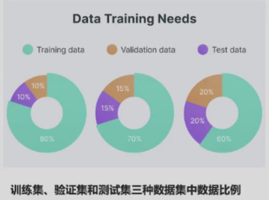
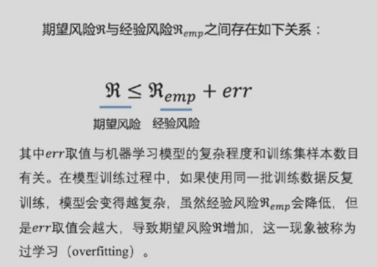
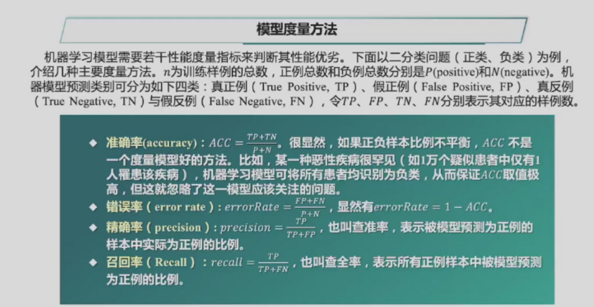
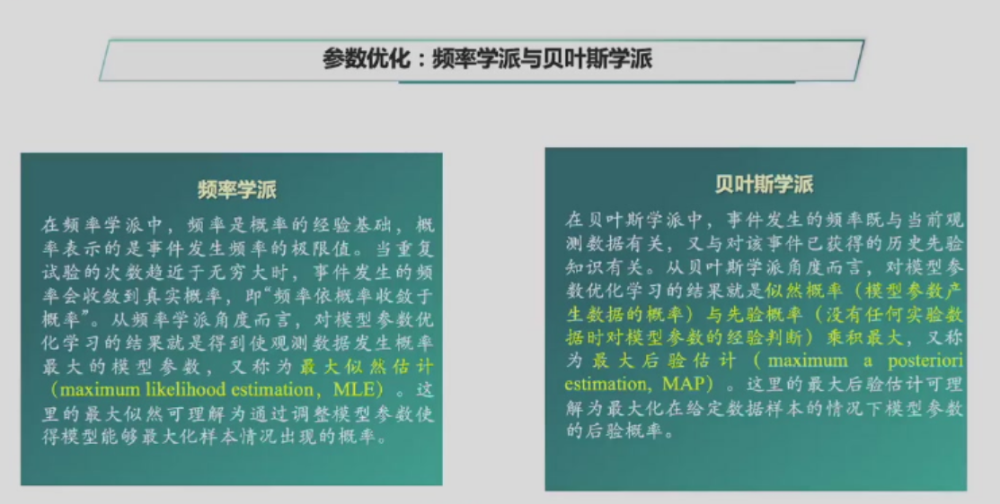
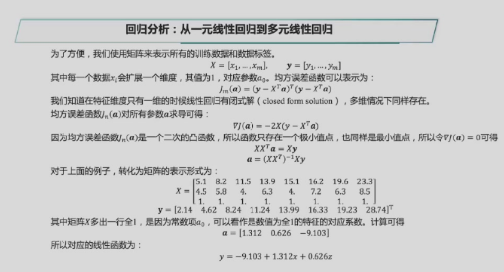
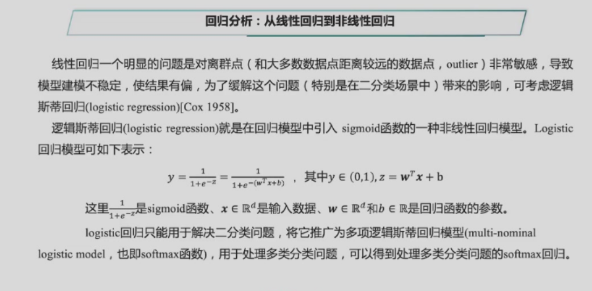

# 机器学习
## 机器学习的基本概念
- 机器学习通过对数据的优化学习，建立能够刻画数据中所蕴含语义概念或分布结构等信息的模型。在模型学习过程中，采用合适手段来利用有标签数据或无标签数据，对模型参数不断进行优化，从而提升模型性能。
- 从数据利用的角度，可将机器学习划分为监督学习(supervised learning)、无监督学习(unsupervised learning)及半监督学习(semi-supervised learning)等。
## 监督学习
- 监督学习是一种在实践中运用最为广泛的一种机器学习方法，其目标是给定带有标签信息数据的训练集$D=\{(x_i,y_i)\}_{i=1}^n$，学习一个从输入$x_i$到输出$y_i$的映射。$x_i$是文档、图像、音频或蛋白质基因等数据或者数据的特征表达，$y_i$为所对应的论文类别、人脸对象、歌曲语音或生命功能等语义内容，其中$D$被称为训练集，$n$是训练样例的数量。
- 监督学习算法从假设空间（hypothesis space）学习得到一个最优映射函数$f$（又称决策函数），映射函数$f$将输入数据映射到语义标注空间，实现数据的分类和识别。无监督学习则是直接从无标签数据$\left\{x_i,1,…,n\right\}$出发学习映射函数，而半监督学习在学习映射函数过程中使用的一部分数据有标签、一部分数据没有标签。
### 训练集、验证集、测试集
- 训练一旦在训练集上完成了模型参数优化后，需要在测试数据集上对模型性能进行测试。为了在训练优化过程中挑选更好的模型参数，一般可将训练集中一部分数据作为验证集(validation set) 。在训练集上训练模型的同时会在验证集上对模型进行评估，以便得到最佳参数，最后在测试集上进行测试，将测试结果作为模型性能最终结果。
- 要注意的是，训练集、验证集和测试集所包含的数据之间没有任何交叉。可以说，训练集用于模型训练（好比学生的练习册）、验证集用于评估模型以调整相应参数（好比学生的模拟考卷或小测验）、测试集用于得到模型的优劣水平（好比真正考试）。

### 损失函数
- 泛化能力：在机器学习中，需要保证模型在训练集上所取得性能与在测试集上所取得性能保持一致，即模型具有泛化能力。
- 将映射函数记为$f$、第i个训练数据记为$(x_{i} , y_{i})$以及$f$对$x_i$的预测结果记为$\hat{y_{i}}$（即$\hat{y_{i}} = f(x_{i})$）,可定义损失函数$L o s s(f(x_{i}) , y_{i})$来估量预测值$\hat{y_{i}}$和真实值$yᵢ$之间差异。很显然，$y_{i}$在训练过程中希望映射函数在训练集上累加差异最小，即$\min \sum_{i = 1}^{n}L o s s(f(x_{i}) , y_{i})$。
### 经验风险和期望风险
- 经验风险(empirical risk)：在训练集上，损失函数$L o s s(f(x_{i}) , y_{i})$的期望值，即$\frac{1}{n} \sum_{i = 1}^{n}L o s s(f(x_{i}) , y_{i})$。
- 期望风险(expected risk)：在整个分布上，损失函数$L o s s(f(x_{i}) , y_{i})$的期望值，即$E_{x,y}[L o s s(f(x) , y)]$。
- 当然，由于无法事先获得任何任务对应的所有数据分布（例如无法通过收集世界中所有人脸图像来确信完成人脸识别），使得计算期望风险这一目标难以实现。因此，机器学习中模型优化目标通常为经验风险最小化（empirical risk minimization），虽然机器学习的目标是追求期望风险最小化，即不断提升模型泛化能力

### 模型度量方法

### 回归分析
#### 一元线性回归
为高中所学知识。
#### 多元线性回归与非线性回归

### 决策树
决策树将分类问题分解为若干基于单个信息的推理任务，采用树状结构来逐步完成决策判断。
#### 构建决策树
建立决策树的过程，就是不断选择属性值对样本集进行划分，直至每个子样本为同一个类别。
构建决策树时划分属性的顺序选择是重要的。性能好的决策树随着划分不断进行，决策树分支结点样本集的"纯度"会越来越高，即其所包含样本尽可能属于相同类别。
信息熵(entropy)就是一种衡量样本集合"纯度"的指标。如果我们计算选择不同属性划分后样本集的"纯度"，那么就可以比较和选择属性。信息熵越大，说明该集合的不确定性越大，"纯度"越低。选择属性划分样本集前后信息熵的减少量被称为信息增益(information gain)，也就是说信息增益被用来衡量样本集合复杂度(不确定性)所减少的程度。
假设有$K$个信息，其组成了集合样本$D$ ，记第$k$个信息发生的概率为$p_{k} ( 1 ≤ k ≤ K )$ 。如下定义这$K$个信息的信息熵：
$$
E(D) = - \sum_{k = 1}^{K}p_{k}\log_{2}p_{k}
$$
$E(D)$值越小，表示D包含的信息越确定，也称D的纯度越高。需要指出，所有 $p_k$累加起来的和为1。
## 无监督学习
### K均值聚类
$k-means$算法的目标是将$n$个$d$维数据$\{x_{i} , i = 1 , \dotsc , n\}$划分为$K$个聚簇，使得簇内方差最小化。由于原始数据可能的聚类结果数量巨大，要求一个特定的聚类算法总是能达到最优是不切实际的。所以，$k-means$算法找到的是一个“局部”最优 ，即没有任何其他的聚类结果，能够让簇内的方差更小，但不能保证找到全局最优[Hartigan 1979]。$k-means$同时也是一个易受初始值影响的迭代算法，可以用不同的初始值重复几次，以达到上述的“局部”最优，常用的初始化方法包括 Forgy和 Random Partition[Hamerly2002]。
#### kmeans聚类算法
- 输入：n个d维数据${x,i=1,...,n}$，聚类数目$K$
- 输出：每个数据所属聚类标签
- 算法步骤：
    - 初始化聚类质心
    - 根据预定的相似度/距离函数（通常为欧氏距离）对数据进行聚类
    - 根据每个聚类集合中所包含的数据，更新该聚类集合质心值
    - 重复(2)和(3)，直到收敛

kmean算法的目标：
聚类算法的目标都是得到一个聚类结果，最小化类内距离(或最大化类内相似度)，而最大化类间距离 (或最小化类间相似度)。
k-means聚类就是通过最小化聚簇内的数据方差来实现最大化类内相似度的，即最小化每个类簇方差，使得最终聚类结果中每个聚类集合所包含的数据呈现出的差异性最小。
## 监督学习与非监督学习下的特征降维
### 线性判别分析——监督学习
线性判别分析(linear discriminant analysis, LDA)是一种基于监督学习的降维方法，也称为Fisher线性判别分析 (fisher's discriminant analysis, FDA)[Fisher 1936]。**对于一组具有标签信息的高维数据样本，LDA利用其类别信息，将其线性投影到一个低维空间上，在低维空间中同一类别样本尽可能靠近，不同类别样本尽可能彼此远离。**

假设样本集为$\mathcal D = \{(x_{i} , y_{i})\}_{i = 1}^{n}$，样本$x_{i}\in \mathbb{R}^{d}$的类别标签为$y_i$。其中，$y_i$的取值范围是$\{\mathcal C_{1} , \mathcal C_{2} , \dotsc , \mathcal C_{K}\} $，即一共有$K$类样本。
定义$X$为所有样本构成集合、$N_{i}$为第$i$个类别所包含样本个数、$X_{i}$为第$i$类样本的集合、$m$为所有样本的均值向量、$m_{i}$为第$i$类样本的均值向量。$\sum_{i}$为第$i$类样本的协方差矩阵，其定义为：
$$
\sum_{i} = \sum_{x \in X_{i}}(x - m_{i})(x - m_{i})^{T}
$$
先来看$K=2$的情况，即二分类问题。在二分类问题中，训练样本归属于$\mathcal C_{1}$或$\mathcal C_{2}$两个类别，并通过如下的线性函数投影到一维空间上：
$$
y(x) = w^{T}x(w \in \mathbb{R}^{n})
$$
投影之后类别$\mathcal C_{1}$的协方差矩阵$s₁$为：
$$
s_{1} = \sum_{x \in \mathcal C_{1}} ( w^{T} x - w^{T} m_{1} )^{2} = w^{T} \sum_{x \in \mathcal C_{1}} [ ( x - m_{1} ) ( x - m_{1} )^{T} ] w
$$
同理可得到投影之后类别$\mathcal C_{2}$的协方差矩阵$s_{2}$
最大化的目标$J(w)$，定义如下：
$$
J(w) = \frac{\|m_{2} - m_{1}\|_{2}^{2}}{s_{1} + s_{2}
}$$
可以把上述式子右边改写成与$w$相关的式子：
$$
J(w) = \frac{\|w^{T}(m_{2} - m_{1})\|_{2}^{2}}{w^{T}\sum_{1}w+w^{T}\sum_{2}w}=\frac{w^{T}(m_{2} - m_{1})(m_{2} - m_{1})^{T}w}{w^{T}(\sum_{1}+\sum_{2})w}=\frac{w^{T}S_{b}w}{w^{T}S_{w}w}
$$
其中，$S_{b}$，称为类间散度矩阵(between-class scatter matrix) ，即衡量两个类别均值点之间的"分离"程度，可定义如下：
$$
S_{b} = (m_{2} - m_{1})(m_{2} - m_{1})^{T}
$$
$S_{w}$，则称为类内散度矩阵（within-class scatter matrix），即衡量每个类别中数据点的"分离"程度，可定义如下：
$$
S_{w} = \sum_{1} + \sum_{2}
$$
优化目标由于$J(w)$的分子和分母都是关于$w$的二项式，因此最后的解只与$w$的方向有关，与$w$的长度无关，因此可令分母$w^{T}S_{w}w = 1$，然后用拉格朗日乘子法来求解这个问题。拉格朗日乘子法就是求在某个/某些约束条件下的函数极值的方法，其主要思想是将约束条件函数与原函数联立，从而求出使原函数取得极值时各个变量的解。
上述带约束条件 (即$w^{T}S_{W}w - 1 = 0$)的函数极大值 (即$w^{T}S_{b}w$取值最大)优化问题所对应拉格朗日函数为：
$$
L(w) = w^{T}S_{b}w - \lambda(w^{T}S_{w}w - 1)
$$
对w求偏导并使其求导结果为零，可得$S_{w}^{ - 1}S_{b}w = \lambda w$，由此可见，$λ$和$w$分别是$S_{w}^{ - 1}S_{b}$的特征根和特征向量，$S_{w}^{ - 1}S_{b}w = \lambda w$也被称为 Fisher线性判别 ( Fisher线性判别)。
因为$S_{b} = (m_{2} - m_{1})(m_{2} - m_{1})^{T}$ ,令实数$\lambda_{w} = (m_{2} - m_{1})^{T}w$ ,那么$S_{b}w = (m_{2} - m_{1})(m_{2} - m_{1})^{T}w =(m_{2} - m_{1}) × \lambda_{w}$，将其代入 Fisher线性判别，可得：
$$
S_{w}^{ - 1}S_{b}w = S_{w}^{ - 1}(m_{2} - m_{1}) × \lambda_{w} = \lambda w
$$
由于对$w$的放大和缩小操作不影响结果，因此可约去上式中的未知数$λ$和$λ_{w}$ ,得到：$w = S_{w}^{ - 1}(m_{2} - m_{1})$

为了获得“类内汇聚、类间间隔”的最佳投影结果，只需要分别求出待投影数据的均值和方差，就可以设计得到最佳投影方向$w$，这就是线性判别分析的做法。将原始数据通过$w^Tx$进行投影 ，实现了从高维到低维的映射，因此也是一种降维操作，实现了数据约减少 ，且这一降维结果保持了样本数据的“类内汇聚、类间间隔”结构分布。
于是，给定原始$d$维数据样本$x_i$，通过$x_{i}W$将其从$d$维空间映射到$r$维空间，实现了原始数据的降维，也使得原始数据形成了具有区别力的紧凑表达。在后续分类等操作中，只是使用$x_i$降维后的结果，而不是$x_i$的原始特征。  
下面对线性判别分析的降维步骤描述如下：

- 计算数据样本集中每个类别样本的均值
- 计算类内散度矩阵$S_w$和类间散度矩阵$S_{b}$
- 根据$S_{w}^{ - 1}S_{b}W = \lambda W$来求解$S_{w}^{ - 1}S_{b}$所对应前$r$个最大特征值所对应特征向量$(w_{1} , w_{2} , \cdots , w_{r})$，构成矩阵$W$
- 通过矩阵$W$将每个样本映射到低维空间，实现特征降维。

需要注意的是，通过LDA对原始$d$维数据进行降维后，所得维度$r$最大取值为$min(K-1,d)$，这是因为$S_{b}$的秩为$\min(K - 1 , d)$。这也说明了在二分类问题中，原始高维数据只能被投影到一维空间中(无论其原始维度是多少)。
### 主成分分析——无监督学习
主成分分析(principal component analysis)是一种特征降维方法，在消除数据噪声、冗余等方面具有广泛应用。主成分分析也被称为KL变换(Karhunen-Loève transform,KLT) 、霍林特变换(Hotelling transform) 或者本征正交分解 (proper orthogonal decomposition,POD) 等。
顾名思义，主成分分析即通过分析找到数据特征的主要成分，使用这些主要成分来代替原始数据。这样一方面可以加深对数据本身的理解（认识到数据的主要成分）；另一方面，简化后的数据（主要成分）在用于下游的其他任务时，有着噪声少、易于处理计算的特点。
**主成分分析要求“降维后的结果要保持原始数据的原有结构”**，例如，对于图像数据，要求保持视觉对象区域构成的空间分布；对于文本数据，要求保持单词之间的(共现)相似或不相似的特性。更准确地说，主成分分析要求最大限度保持原始高维数据的总体方差结构。
主成分分析的思想是将$d$维特征数据映射到$l$维空间 (一般$d \gg l$) ,，去除原始数据之间的冗余性 (通过去除相关性手段达到这一目的)。将原始数据向这些数据方差最大的方向进行投影。一旦发现了方差最大的投影方向，则继续寻找保持方差第二的方向且进行投影。其目标是使得数据每一维的方差都尽可能大。

#### 主成分分析算法描述
- 输入：$n$个$d$维样本数据所构成的矩阵$X$，降维后的维数$l$
- 输出：映射矩阵$W = \{w_{1} , w_{2} , \cdots , w_{1}\}$
- 算法步骤：
  - 对于每个样本数据$xᵢ$进行中心化处理：$x_{i} = x_{i} - μ , μ = (1/n)∑_{i=1}^{n}x_{j}$
  - 计算原始样本数据的协方差矩阵：$Σ = (1/(n-1))X^T X$
  - 对协方差矩阵$Σ$进行特征值分解，对所得特征根进行排序：$λ₁ ≥ λ₂ ≥ λ_l$ 
  - 取前$l$个最大特征根所对应的特征向量$w₁ , w₂ , \cdots , w_l$组成映射矩阵。

在特征维度较高的情况下，主成分分析算法暴力求解特征向量是一个耗时操作，这里可以通过奇异值分解来实现主成分分析，对原始数据进行降维。