# 强化学习
## 强化学习的若干概念
- 智能体：强化学习的主体，它能够根据经验做出主观判断并执行动作，是整个智能系统的核心。
- 环境：智能体以外的一切统称为环境，环境在与智能体的交互中，能被智能体所采取的动作影响，同时环境也能向智能体反馈状态和奖励。虽说智能体以外的一切都可视为环境，但在设计算法时常常会排除不相关的因素建立一个理想的环境模型来对算法功能进行模拟。
- 状态：状态可以理解为智能体对环境的一种理解和编码，通常包含了对智能体所采取决策产生影响的信息。
- 动作：动作是智能体对环境产生影响的方式，这里说的动作常常指概念上的动作，如果是在设计机器人时还需考虑动作的执行机构。
- 策略：策略是智能体在所处状态下去执行某个动作的依据，即给定一个状态，智能体可根据一个策略来选择应该采取的动作。
- 奖励： 奖励是智能体序贯式采取一系列动作后从环境获得的收益。注意奖励概念是现实中奖励和惩罚的结合，一般用正值来代表实际奖励，用负值来代表实际惩罚。
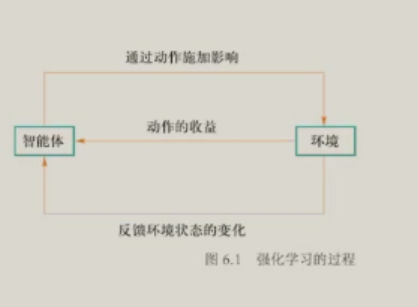
## 强化学习的特点
强化学习实际上是智能体在与环境交互中去学习能帮助其获得最大化奖励这一策略的过程。在每一次迭代中，智能体根据当前策略选择一个动作，该动作影响了环境，导致环境发生了改变，智能体此时从环境得到状态变化和奖励反馈等信息，并根据这些反馈来更新其内部的策略。这一过程与人类从与环境交互中学习这一方式具有相似之处。

- 基于评估： 强化学习利用环境评估当前策略，以此为依据进行优化
- 交互性： 强化学习的数据在与环境的交互中产生

- 序列决策过程： 智能主体在与环境的交互中需要作出一系列的决策，这些决策往往是有序关联的

注： 现实中强化学习问题往往还具有奖励滞后、基于条件的评估等特点

### 监督学习、无监督学习和强化学习的区别

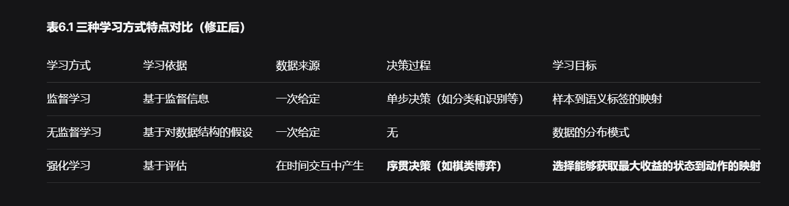

## 马尔可夫决策过程
### 具体问题
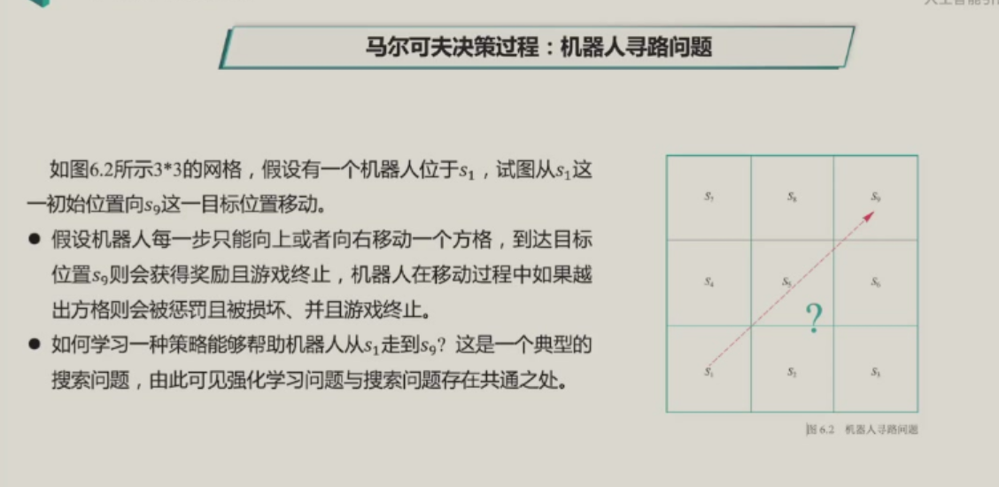
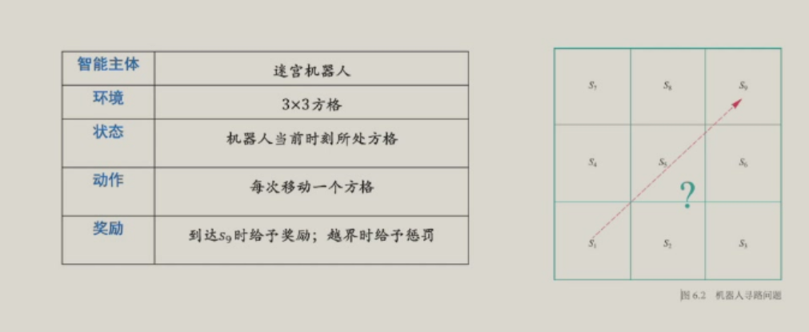
### 离散马尔可夫链
- 一个随机过程实际上是一列随时间变化的随机变量，其中当时间是离散量时，一个随机过程可以表示为$\{X_t\}_{t=0,1,2,\cdots}$，其中每个$X_t$都是一个随机变量，这被称为离散随机过程。
- 马尔科夫链：满足马尔可夫性的离散随机过程，也被称为离散马尔可夫过程。
- 马尔可夫性：在时刻$t$的状态只依赖于时刻$t-1$的状态。
$$
Pr(X_{t+1}=x_{t+1}|X_t=x_t,X_{t-1}=x_{t-1},\cdots,X_1=x_1)=Pr(X_{t+1}=x_{t+1}|X_t=x_t)
$$

### 马尔可夫奖励过程
为了对目标进行优化，需要在马尔可夫随机过程的框架中加入奖励机制：

- 奖励函数$R:S\times S \rightarrow R$，其中$R(S_t,S_{t+1})$描述了从第$t$步状态转移到第$t+1$步状态时获得的奖励。
- 在一个序列决策过程中，不同状态之间的转移产生了一系列奖励$(R_1,R_2,\cdots)$，其中$R_{t+1}$为$R(S_t,S_{t+1})$。
- 引入奖励机制，这样可以衡量任意序列的优劣，即对序列决策进行评价。

#### 回报过程
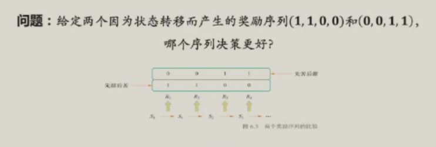
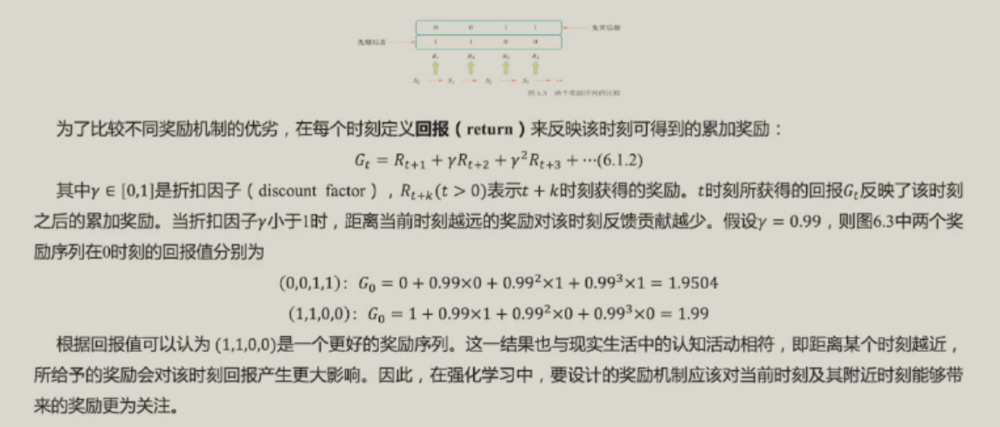
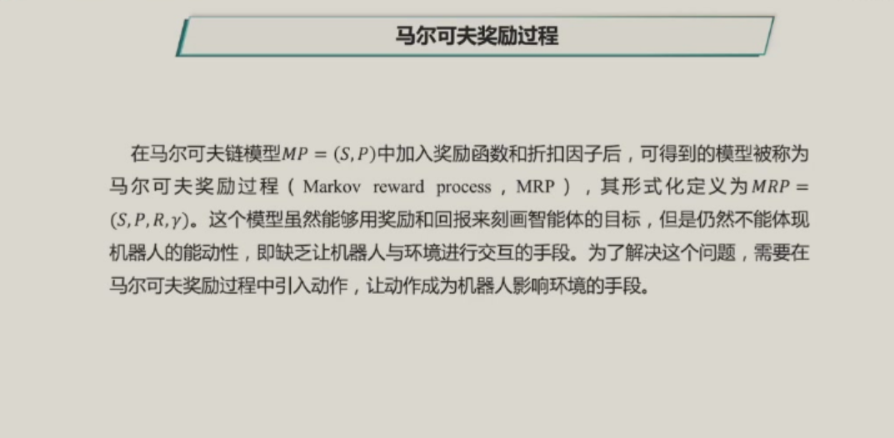

### 马尔可夫决策过程
如下定义马尔可夫决策过程（Markov Decision Process，MDP）$MDP =(S,A,P,T,R,γ)$。

- 状态集合S：所求解问题中所有可能出现的状态所构成的集合，这个集合可能是一个有限的集合，也可能是一个无限的集合。
- 动作集合A：所求解问题中智能体能够采取的所有动作所构成集合，这个集合同样可以是有限的，也可以是无限的，本章所述内容中均假设该集合是一个有限集合。
- 状态转移概率$P(S_{t+1}|S_t,A_t)$：表示在当前状态$S_t$下采取了动作$A_t$后进入下一时刻状态$S_{t+1}$的概率。显然，状态转移概率满足马尔可夫性。状态转移可以是概率性的（stochastic），也可以是确定的（deterministic）。确定的状态转移指在给定状态$S_t$下采取了动作$A_t$后，转移到某一状态的概率为1。
- 奖励函数$R(S_t,A_t,S_{t+1})$：在状态$S_t$执行了动作$A_t$后到达状态$S_{t+1}$时，智能体能够得到的奖励。
- 折扣因子$γ$：后续时刻奖励对当前动作的价值系数，$γ \in [0,1] $。

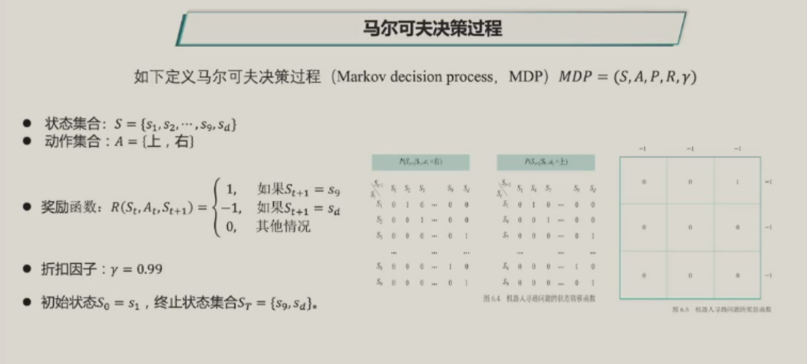
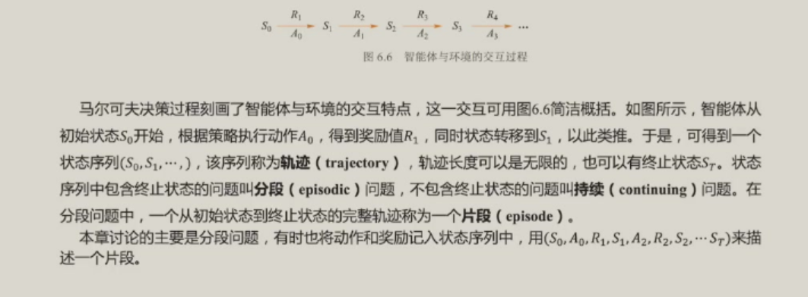

## 强化学习的定义

- 策略函数 $π$：策略函数刻画了智能体选择动作的机制。策略函数 $π:S×A↦[0,1]$，$π(s,a)$表示智能体在状态$s$下采取动作$a$的概率。策略函数可以是概率性的，也可以是确定的。确定的策略函数指在给定状态$s$情况下，只有一个动作$a$使得概率 $π(s,a)$取值为1。对于确定的策略函数，为了简化符号，记 $a=π(s)$。一个好的策略函数应该能够使得智能体在采取了一系列行动后可得到最佳奖励，即最大化每一时刻的回报值$G_t=R_{t+1}+γR_{t+2}+γ^2R_{t+3}+⋯$。从$G_t$的定义可知，$G_t$要根据一次包含了终止状态的轨迹序列计算所得。
- 价值函数：$V:S↦R$，其中$V_\pi(s)=E_\pi[G_t|S_t=s]$，表示智能体在时刻$t$处于状态$s$时，按照策略$π$采取行动时所获得回报的期望。价值函数衡量了某个状态的好坏程度，反映了智能体从当前状态转移到该状态时能够为目标完成带来多大“好处”。
- 动作-价值函数：$q:S×A↦R$，其中$q_\pi(s,a)=E_\pi[G_t|S_t=s,A_t=a]$，表示智能体在时刻$t$下处于状态$s$，采取动作$a$时，在$t$时刻后根据策略$π$所获得的回报的期望。动作-价值函数反映了智能体在当前状态下采取某个动作的好坏程度。

强化学习可以转化为一个策略学习问题，其定义为：给定一个马尔科夫决策过程$MDP=(S,A,P,R,γ)$，学习一个最优策略$\pi^*$，使得对任意$s\in S$，使得$V_{\pi^*}(s)$值最大。

## 贝尔曼方程

贝尔曼方程也被称为动态规划方程，由理查德·贝尔曼提出。

- 价值函数方程：$V(s)=E_\pi[R_{t+1}+\gamma R_{t+2}+\gamma^2R_{t+3}+⋯|S_t=s]$
- 动作价值函数方程：$q(s,a)=E_\pi[R_{t+1}+\gamma R_{t+2}+\gamma^2R_{t+3}+⋯|S_t=s,A_t=a]$

对于价值函数：

$$
\begin{aligned}
&V_\pi(s)=E_\pi[R_{t+1}+\gamma R_{t+2}+\gamma^2R_{t+3}+⋯|S_t=s] \\
&= E_{a\sim\pi(s,·)}[E_\pi[R_{t+1}+\gamma R_{t+2}+\gamma^2R_{t+3}+⋯|S_t=s]] \\
&= \sum_{a\in A} \pi(a|s)q_\pi(s,a)
\end{aligned}
$$

其中$\pi(a|s)$表示采取策略$\pi$时，在状态$s$下采取动作$a$的概率。$q_\pi(s,a)$表示在状态$s$下采取动作$a$后，智能体获得的回报的期望。

对于动作价值函数：

$$
\begin{aligned}
&q_\pi(s,a)=E_\pi[R_{t+1}+\gamma R_{t+2}+\gamma^2R_{t+3}+⋯|S_t=s,A_t=a] \\
&= E_{s'\sim P(·|s,a)}[R(s,a,s')+\gamma E_\pi[R_{t+2}+\gamma R_{t+3}+⋯|S_{t+1}=s']] \\
&= \sum_{s'\in S} P(s'|s,a) [R(s,a,s')+\gamma V_\pi(s')]
\end{aligned}
$$

其中$P(s'|s,a)$表示在状态$s$下采取动作$a$后，转移到状态$s'$的概率。$R(s,a,s')$表示在状态$s$下采取动作$a$后，到达状态$s'$时，智能体获得的回报，$V_\pi(s')$表示智能体在状态$s'$下能够获得的回报的期望。

价值函数的贝尔曼方程：
$$
V_\pi(s)=E_{a\sim\pi(s,·)}E_{s'\sim P(·|s,a)}[R(s,a,s')+\gamma V_\pi(s')]
$$
动作价值函数的贝尔曼方程：
$$
q_\pi(s,a)=E_{s'\sim P(·|s,a)}[R(s,a,s')+\gamma E_{a'\sim\pi(s',·)}[q_\pi(s',a')]]
$$
贝尔曼方程描述了价值函数或动作价值函数的递推关系，是研究强化学习问题的重要手段。

## 基于价值的强化学习
回顾强化学习的定义：给定一个马尔科夫决策过程$MDP=(S,A,P,R,γ)$，学习一个最优策略$\pi^*$，使得对任意$s\in S$，使得$V_{\pi^*}(s)$值最大。  
为了求解最优策略$\pi^*$,下图展示了一种思路：从一个任意的策略开始，首先计算该策略下的价值函数（或动作价值函数），然后根据价值函数调整改进策略使其更优，不断迭代这个过程直到策略收敛。通过策略计算价值函数的过程叫做策略评估（policy evaluation），通过价值函数优化策略的过程叫做策略优化（policy improvement），策略评估和策略优化交替进行的强化学习的求解方法叫做通用策略迭代（generalized policy iteration,GPI）。

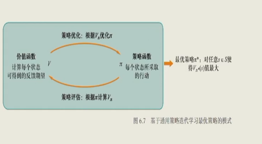

### 策略评估
#### 动态规划
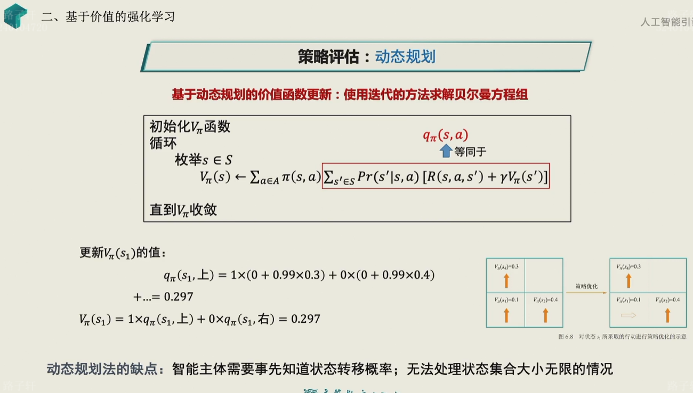
#### 蒙特卡洛采样
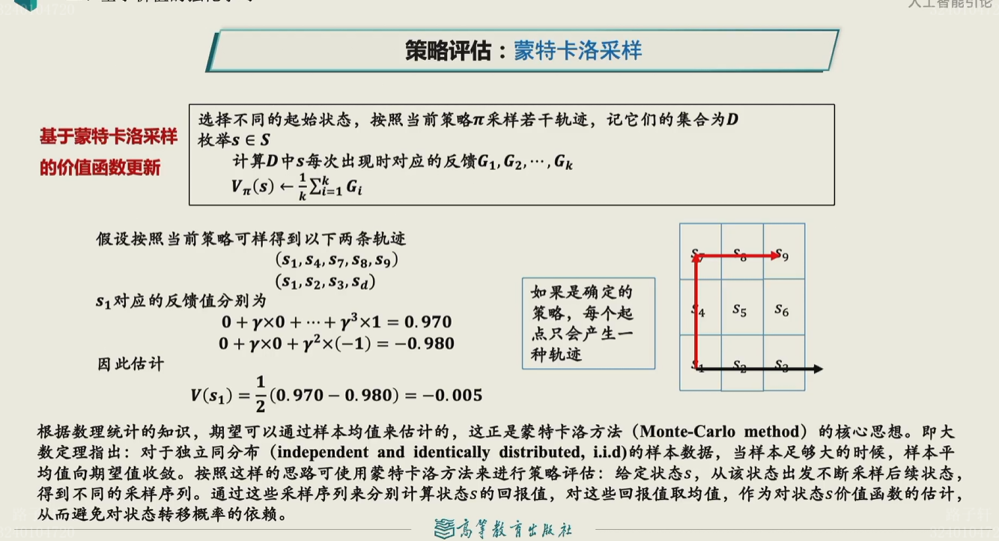
#### 时序差分
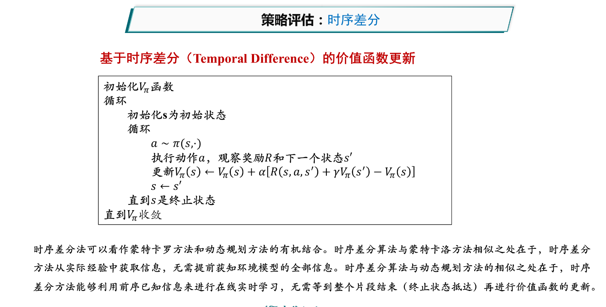
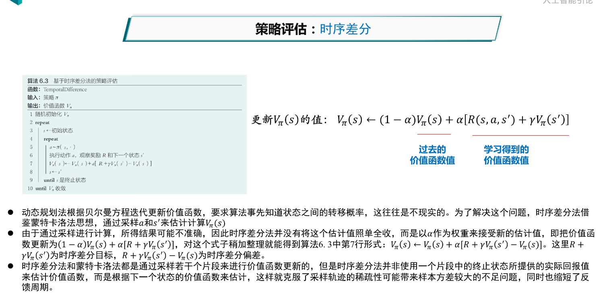
#### 基于价值的强化学习算法
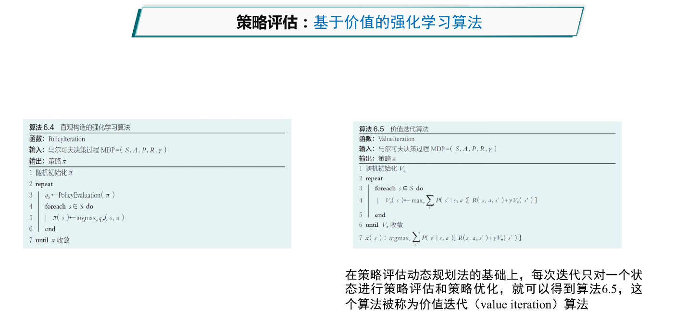
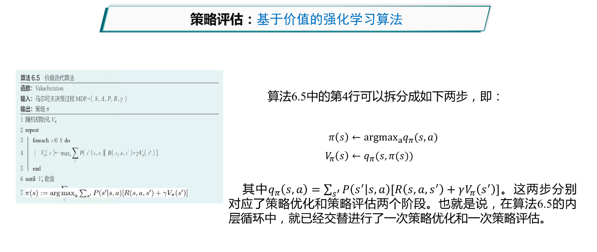
#### Q学习算法
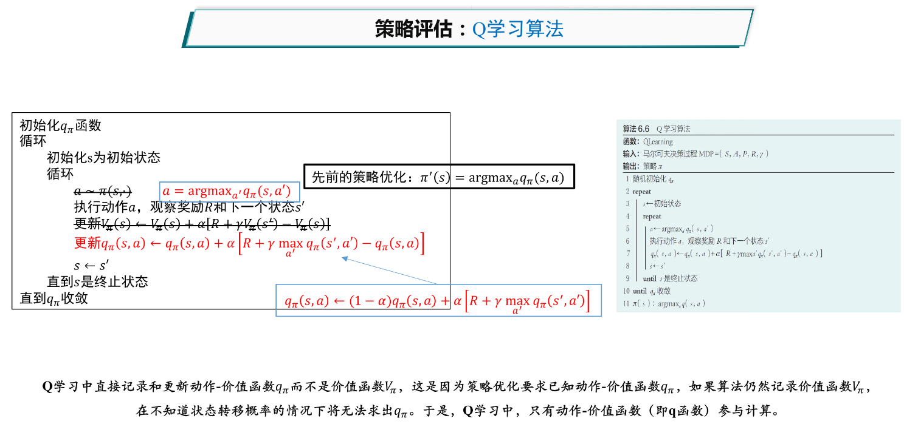
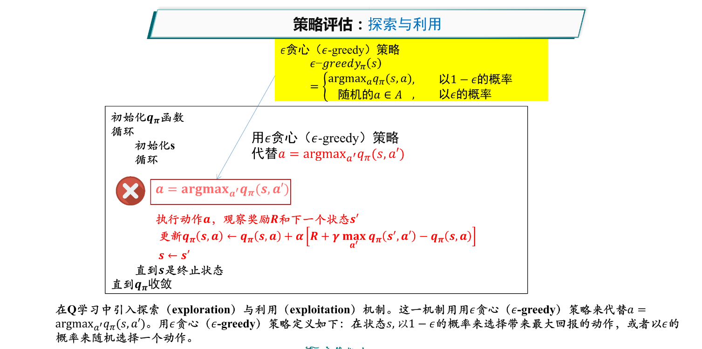
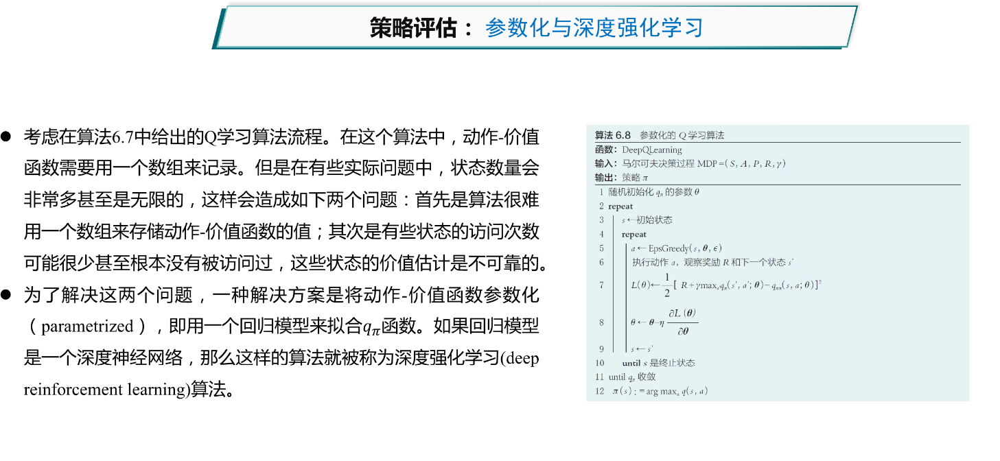
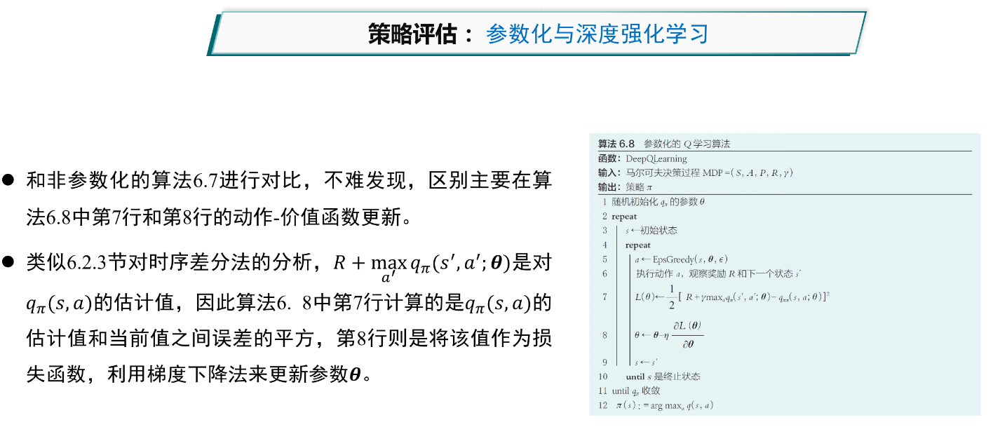
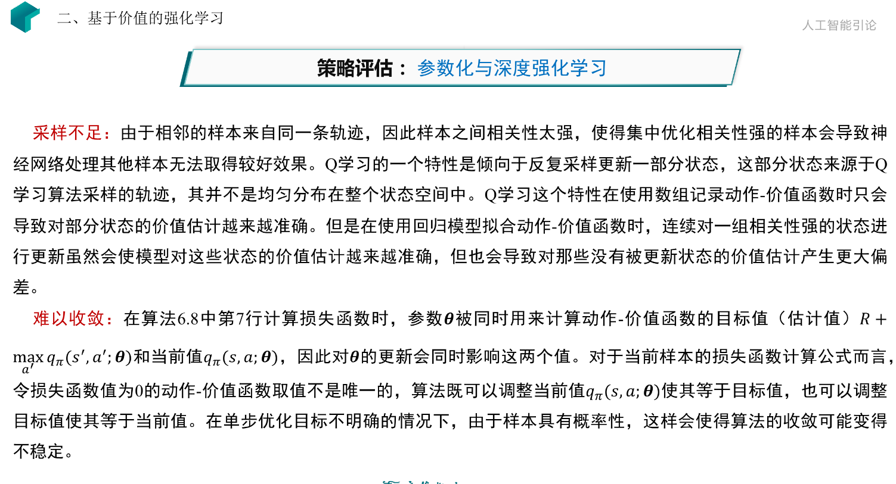
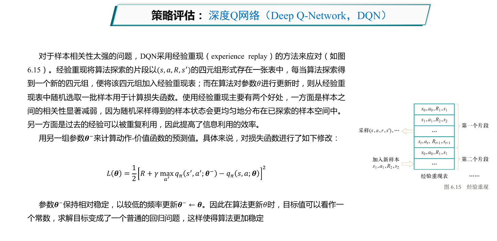
### 策略优化
#### 策略优化定理
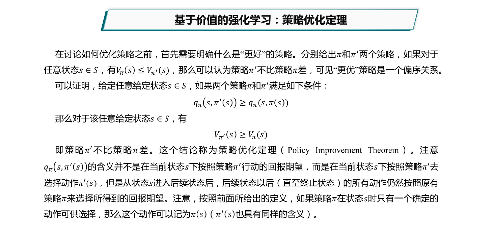
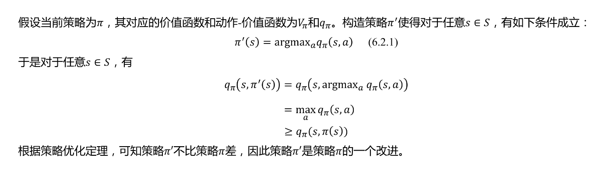
## 基于策略的强化学习
### 策略梯度法
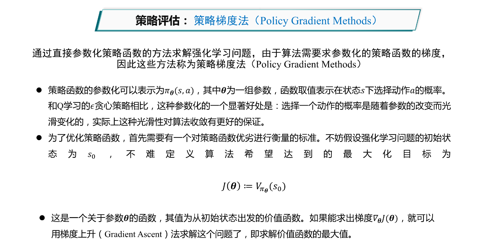
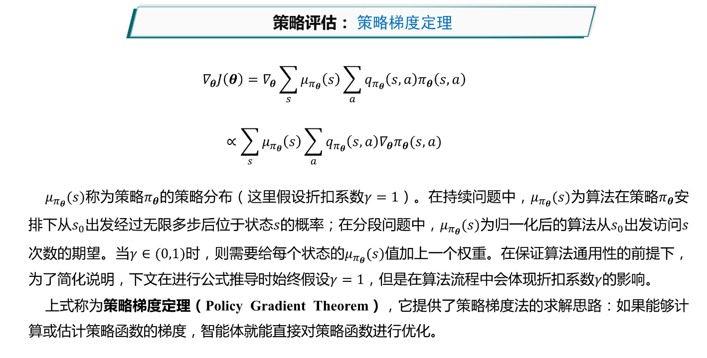
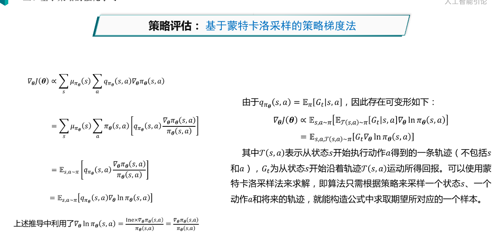
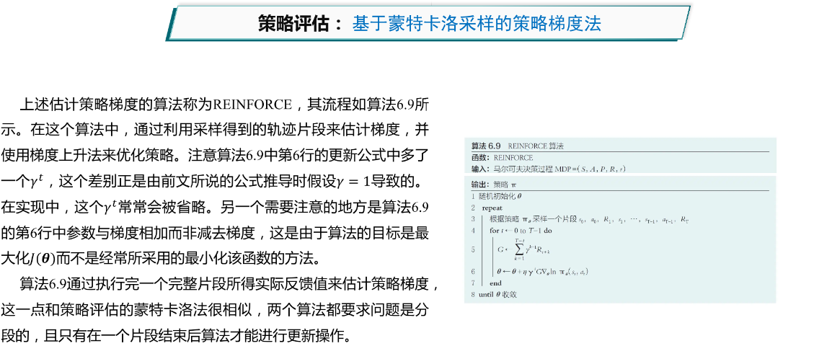
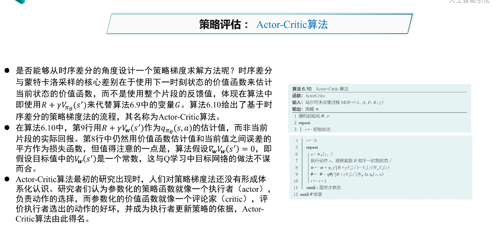3