# 博弈论
## 博弈论相关概念
- 参与者或玩家（player）：参与博弈的决策主体  
- 策略（strategy）：参与者可以采取的行动方案，是一整套在采取行动之前就已经准备好的完整方案。  
- 某个参与者可采纳策略的全体组合形成了策略集（strategy set）。所有参与者各自采取行动后形成的状态被称为局势（outcome）。如果参与者可以通过一定概率分布来选择若干个不同的策略，这样的策略称为混合策略（mixed strategy）。若参与者每次行动都选择某个确定的策略，这样的策略称为纯策略（pure strategy）。  
- 收益（payoff）：各个参与者在不同局势下得到的利益。混合策略定义下的收益应为期望收益（expected payoff）。  
- 规则（rule）：对参与者行动的先后顺序、参与者获得信息多少等内容的规定  
- 博弈论研究的范式：建模者对参与者（player）规定可采取的策略集（strategy sets）和取得的收益，观察当参与者选择若干策略以最大化其收益时会产生什么结果
## 博弈的分类
- 合作博弈与非合作博弈
    - 合作博弈（cooperative game）：部分参与者可以组成联盟以获得更大的收益
    - 非合作博弈（non-cooperative game）：参与者在决策中都彼此独立，不事先达成合作意向
- 静态博弈与动态博弈
    - 静态博弈（static game）：所有参与者同时决策，或参与者互相不知道对方的决策
    - 动态博弈（dynamic game）：参与者所采取行为的先后顺序由规则决定，且后行动者知道先行动者所采取的行为
- 完全信息博弈与不完全信息博弈
    - 完全信息（complete information）：所有参与者均了解其他参与者的策略集、收益等信息
    - 不完全信息（incomplete information）：并非所有参与者均掌握了所有信息

## 纳什均衡
- 博弈的稳定局势即为纳什均衡（Nash equilibrium）：指的是参与者所作出的这样一种策略组合，在该策略组合上，任何参与者单独改变策略都不会得到好处。换句话说，如果在一个策略组合上，当所有其他人都不改变策略时，没有人会改变自己的策略，则该策略组合就是一个纳什均衡。
- Nash定理：若参与者有限，每位参与者的策略集有限，收益函数为实值函数，则博弈必存在混合策略意义下的纳什均衡。
- 囚徒困境中两人同时认罪就是这一问题的纳什均衡。

## 策梅洛定理
- 策梅洛定理（Zermelo's theorem）：对于任意一个有限步的双人完全信息零和动态博弈，一定存在先手必胜策略或后手必胜策略或双方保平策略。
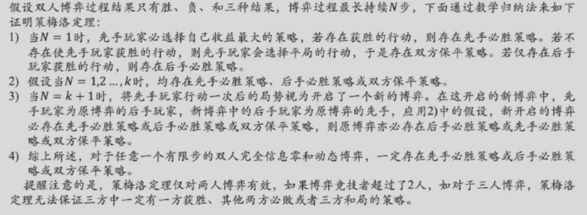

## 博弈策略求解
### 遗憾最小化算法
#### 算法背景
- 定义：对于一个有 $N$ 个玩家参加的博弈，玩家$i$在博弈中采取的策略记为 $\sigma_i$。对于所有玩家来说，他们的所有策略构成了一个策略组合，记作 $\sigma = [\sigma_1, \sigma_2, ..., \sigma_N]$。策略组中，除玩家 $i$ 外，其他玩家的策略组合记作 $\sigma_{-i} = [\sigma_1, \sigma_2, ..., \sigma_{i-1}, \sigma_{i+1}, ..., \sigma_N]$。
- 最优反应策略：给定策略组合 $\sigma$，玩家在终结局势下的收益记作 $u_i(\sigma)$。在给定其他玩家的策略组合$\sigma_{-i}$ 的情况下，对玩家 $i$ 而言的最优反应策略 $\sigma_i^*$ 满足如下条件：$u_i(\sigma_i^*, \sigma_{-i}) \geq \max_{\sigma_i' \in \Sigma_i} u_i(\sigma_i', \sigma_{-i})$。这里 $\Sigma_i$ 是玩家 $i$ 可以选择的所有策略，如上条件表示当玩家 $i$ 采用最优反应策略时，玩家 $i$ 能够获得最大收益。

- 在策略组合 $σ^*$ 中，如果每个玩家的策略相对于其他玩家的策略而言都是最佳反应策略，那么策略组合 $σ^*$ 就是一个纳什均衡（Nash equilibrium）策略。在有限对手、有限策略情况下，纳什均衡一定存在。

- 策略组合 $σ^* = \{\sigma_1^*, \sigma_2^*, ..., \sigma_N^*\}$ 对任意玩家 $i = 1, ..., N$，满足如下条件：

$$
u_i(\sigma^*) \geq \max_{\sigma_i'\in E_i} \mu_i(\sigma_1^*, \sigma_2^*, ..., \sigma_i', ..., \sigma_N^*)
$$

- 在博弈策略求解的过程中，希望求解得到每个玩家最优反应策略，若所有玩家都是理性的，则算法求解最优反应策略组合就是一个纳什均衡。考虑到计算资源有限这一前提，难以通过遍历博弈中所有策略组合来找到一个最优反应策略，因此需要找到一种能快速发现近似纳什均衡的方法。
#### 算法内容
- 遗憾最小化算法是一种根据以往博弈过程中所得遗憾程度来选择未来行为的方法。
- 玩家在过去 $T$ 轮中采取策略 $\sigma_i$ 的累加遗憾值定义如下：
  $$
  Regret_i^T(\sigma_i) = \sum_{t=1}^T (u_i(\sigma_i, \sigma_{-i}^t) - u_i(\sigma^t))
  $$
  其中$\sigma^t$ 和 $\sigma_{-i}^t$ 分别表示第 $t$ 轮中所有玩家的策略组合和除了玩家 $i$以外的策略组合。简单地说，累加遗憾值代表着在过去 $T$ 轮中，玩家 $i$在每一轮中选择策略 $\sigma_i$ 所得收益与采取当前采取策略所得收益之差的累加。
- 在得到玩家$i$的所有可选策略的遗憾值后，可以根据遗憾值的大小来选择后续第 $T+1$轮博弈的策略，这种选择方式被称为遗憾匹配[Greenwald 2006]。
- 当然，通常遗憾值为负数的策略被认为不能提升下一时刻收益，所以如下定义有效遗憾值：
  $$
  Regret_i^{T,+}(\sigma_i) = \max(Regret_i^T(\sigma_i),0)
  $$
- 利用有效遗憾值的遗憾匹配可得到玩家$i$在$T$轮后第$T + 1$轮选择策略$σ_i$的概率$P(σ_i^{T+1})$为：

$$
P(σ_i^{T+1}) = 
\begin{cases} 
\frac{Regret_i^{T,+}(\sigma_i)}{\sum_{\sigma_i' \in \Sigma_i} Regret_i^{T,+}(\sigma_i')} & \text{if } \sum_{\sigma_i' \in \Sigma_i} Regret_i^{T,+}(\sigma_i') > 0 \\ 
\frac{1}{|\Sigma_i|} & \text{otherwise}
\end{cases}
$$

- $|\Sigma_i|$表示玩家i所有策略的总数。显然，如果在过往$T$轮中策略$σ_i$所带来的遗憾值大、其他策略$σ_i'$所带来的遗憾值小，则在第$T + 1$轮选择策略$σ_i$的概率值$P(σ_i^{T+1})$就大。也就是说，带来越大遗憾值的策略具有更高的价值，因此其在后续被选择的概率就应该越大。如果没有一个能够提升前$T$轮收益的策略，则在后续轮次中随机选择一种策略。依照一定的概率选择行动是为了防止对手发现自己所采取的策略（如取遗憾值最大的策略）。

#### 例子
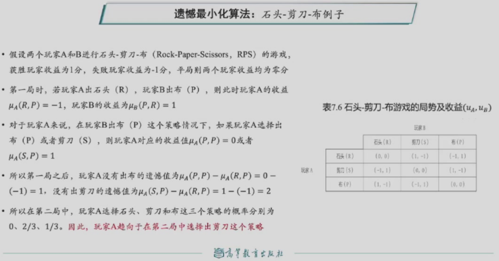
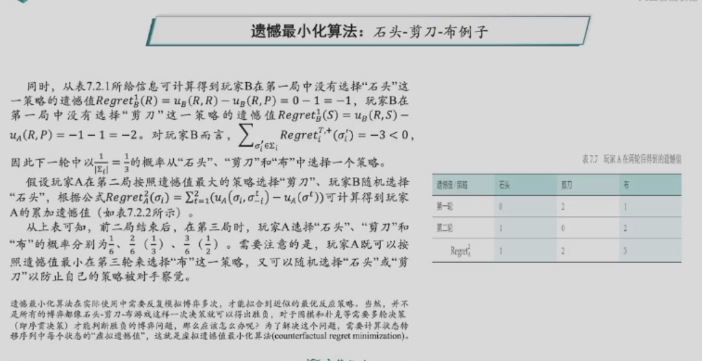

### 虚拟遗憾最小化算法
- 对于任何序贯决策的博弈对抗，可将博弈过程表示成一棵博弈树，博弈树中的每一个中间节点都是一个信息集$I$，信息集中包含了博弈中当前的状态。给定博弈树的每一个节点，玩家都可以从一系列的动作中选择一个，然后状态发生转换，如此周而复始，直到终局（博弈树的叶子节点）。玩家在当前状态下可采取的策略就是当前状态下所有可能动作的一个概率分布。

- 具体而言，在信息集$I$下，玩家可以采取的行动集合记作$A(I)$。玩家$i$所采取的行动$a_i \in A(I)$ 可以认为是其采取的策略$\sigma_i$的一部分。在信息集$I$下采取行动$a$所代表的策略记为$\sigma_{I\rightarrow a}$。这样，要计算虚拟道德值的对象就是博弈树中每个中间节点在信息集下所采取的行动，并根据道德值匹配得到该节点在信息集下应该采取的策略$\sigma_{I\rightarrow a}$。

- 在策略组合 $\sigma$ 下，对玩家 $i$ 而言，如下计算从根节点到当前节点的行动序列路径 $h$ 的虚拟价值：
  $$
  v_i(\sigma, h) = \sum_{z \in Z} \pi^\sigma_{-i}(h) \times \pi^\sigma(h, z) \times u_i(z)
  $$

    $\pi^\sigma_{-i}(h)$表示不考虑玩家的策略到达当前节点概率，$\pi^\sigma(h, z)$从当前节点到叶子结点概率，$u_i(z)$叶子结点$z$收益

- 在上式中，$\pi^\sigma_{-i}(h)$表示从根节点出发，不考虑玩家的策略，仅考虑其他玩家策略而经过路径 $h$ 到达当前节点的概率。也就是说，即使玩家 $i$ 有其他策略，总是要求玩家 $i$ 在每次选择时都选择路径 $h$ 中对应的动作，以保证从根节点出发能够到达当前节点。可见，行动序列路径 $h$的虚拟价值等于如下三项结果的乘积：不考虑玩家的策略（仅考虑其他玩家策略）经过路径 $h$ 到达当前节点的概率，从当前节点走到叶子结点（博弈结束）的概率，所到达叶子节点的收益。

- 在定义了行动序列路径 $h$ 的虚拟价值之后，就可如下计算玩家 $i$ 在基于路径 $h$ 到达当前节点采取行动 $a$ 的遗憾值：
  
  $$
  r_i(h,a) = v_i(\sigma_{i-a}, h) - v_i(\sigma, h)
  $$
  
  该遗憾值是玩家 $i$ 通过行动序列 $h$ 到达当前节点采取行动 $a$ 所得虚拟价值减去采用策略 $\sigma$ 所得路径 $h$ 的虚拟价值。

- 对能够到达同一个信息集$I$（即博弈树中同一个中间节点）的所有行动序列的遗憾值进行累加，即可得到信息集 $I$ 的遗憾值：
  $$
  r_i(I,a) = \sum_{h\in I} r_i(h,a)
  $$

- 类似于遗憾最小化算法，虚拟遗憾最小化的遗憾值是  $T$ 轮重复博弈后的累加值：
  $$
  Regret^T_I(I,a) = \sum_{t=1}^T r^t_I(I,a)
  $$
  $r^t_I(I,a)$ 表示玩家 $i$ 在第 $t$ 轮中于当前节点选择行动 $a$ 的遗憾值。

- 进一步可以定义有效虚拟遗憾值：
  $$
  Regret_t^{T,+}(I,a) = \max(R_i^T(I,a),0)
  $$
- 根据有效虚拟遗憾值进行遗憾匹配以计算经过$T$轮博弈后，玩家$i$在信息集$I$情况下于后续$T + 1$轮选择行动$a$的概率：
  $$
  \sigma_i^{T+1}(I,a) =
  \begin{cases} 
  \frac{Regret_i^{T,+}(I,a)}{\sum_{a \in A(I)} Regret_i^{T,+}(I,a)} & \text{if } \sum_{a \in A(I)} Regret_i^{T,+}(I,a) > 0 \\
  \frac{1}{|A(I)|} & \text{otherwise}
  \end{cases}
  $$
#### 例子
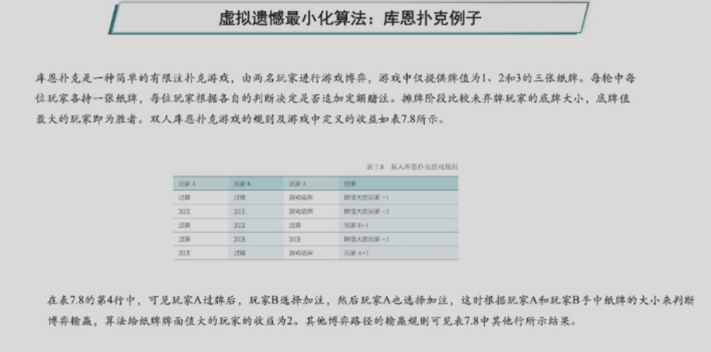
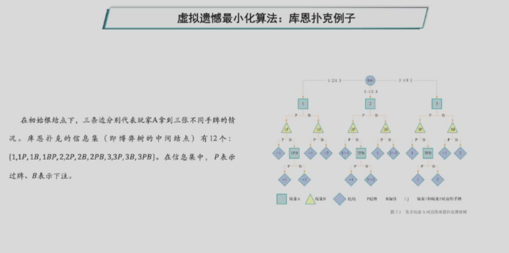
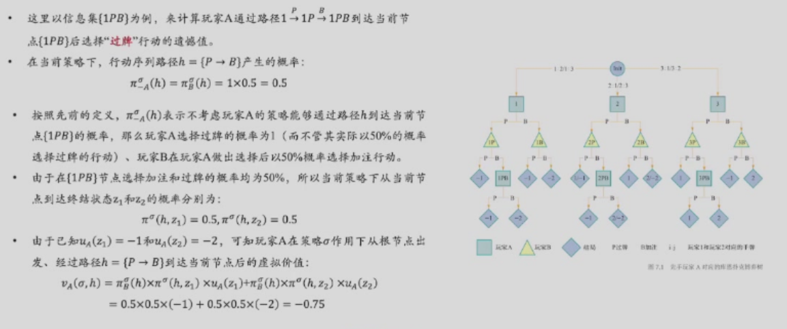
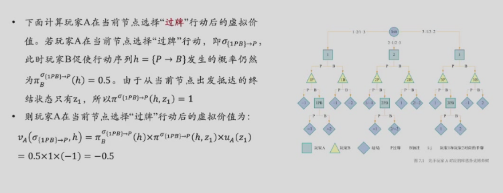
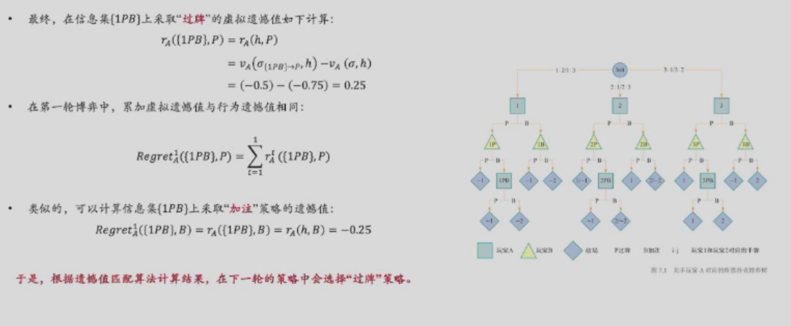

### 安全子博弈
从当前以完成的部分博弈出发，将接下来的博弈过程视为一个单独子博弈，然后找到子博弈的最优反应策略，这样可以减小计算量，以便在接近叶节点的情况下得到更精确的结果。
#### 例子
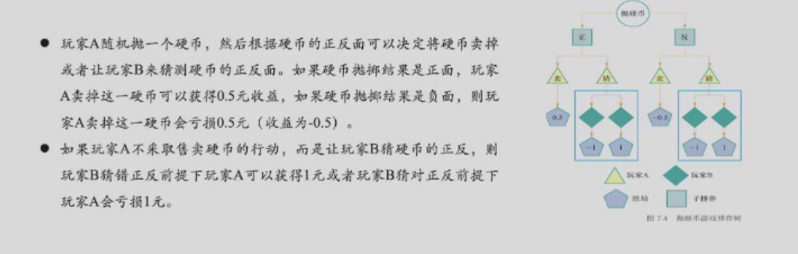
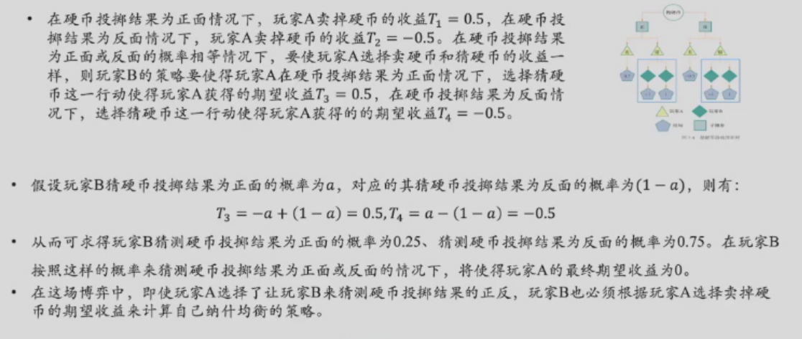

## 博弈规则设计
### 双边匹配问题
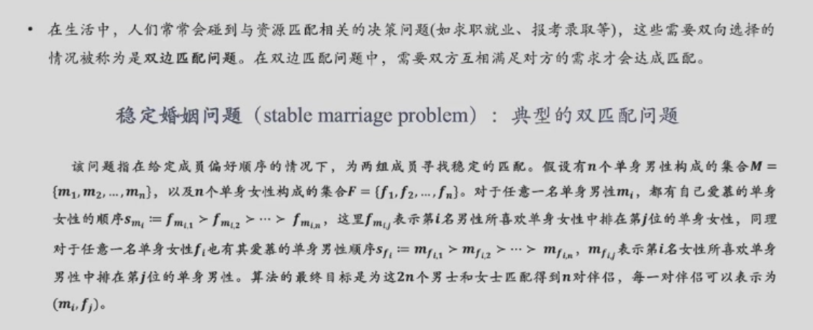
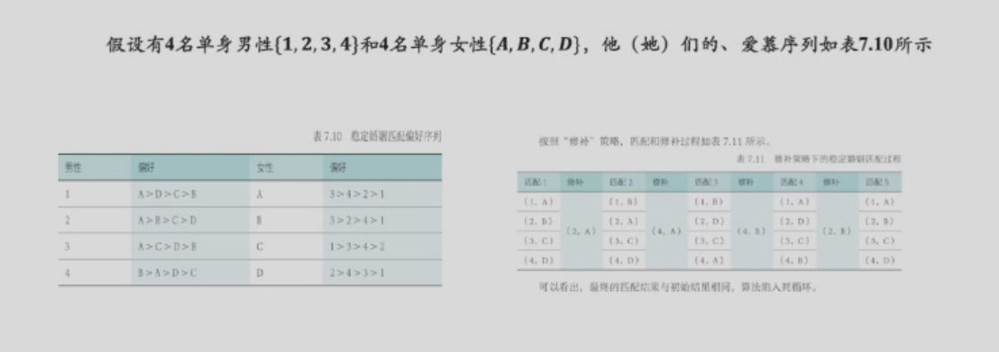
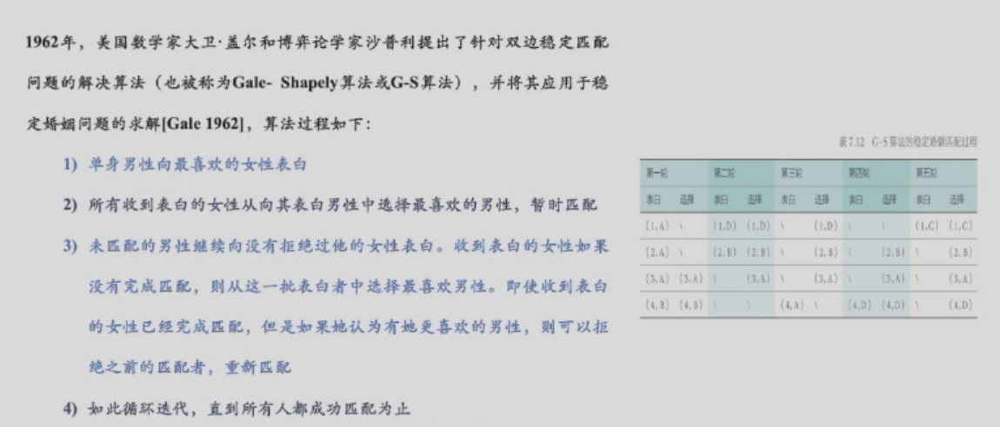
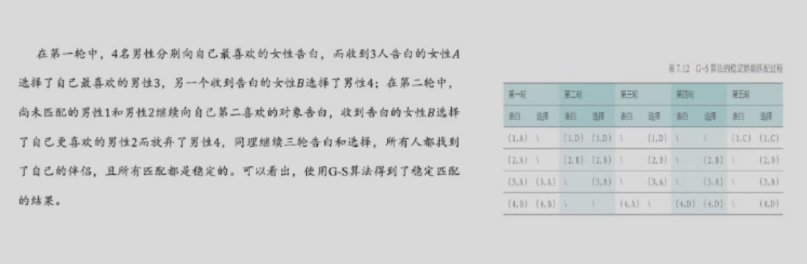
### 单边匹配问题
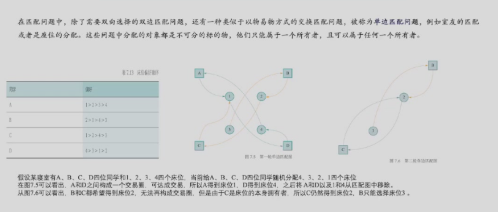
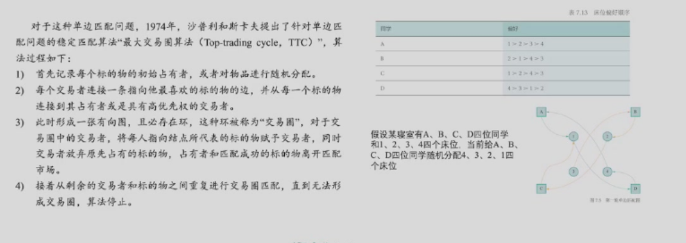
