# 人工智能伦理与安全
## 人工智能的伦理问题
  英国技术哲学家大卫·科林格里奇（David Collingridge）在1980年出版的《技术的社会控制（The Social Control of Technology）》一书的“前言”中写道：我们不能在一种技术的生命早期阶段就预言到它的社会后果。然而，当我们发现其不好的后果之时，技术通常已经成为整个经济与社会结构的一部分，以至于对它的控制变得极端困难。这就是控制的困境。当容易进行改变时，对它的需要无法得以预见；当改变的需要变得清楚明了之时，改变已经变得昂贵、困难而且频繁时日。这就是对新技术进行控制的困境，也被称为“科林格里奇困境（Collingridge's Dilemma）”。
## 人工智能模型安全
### 对模型的攻击
#### 对抗攻击
在输入识别样本中人为故意添加若干人类无法察觉的细微干扰信息，导致模型以高置信度给出错误识别结果，这一攻击人工智能模型的行为被称为对抗攻击（adversarial attack）。

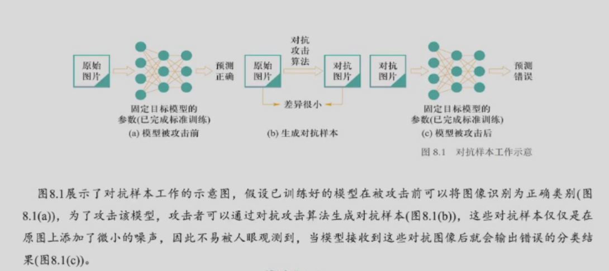

##### 对抗样本生成
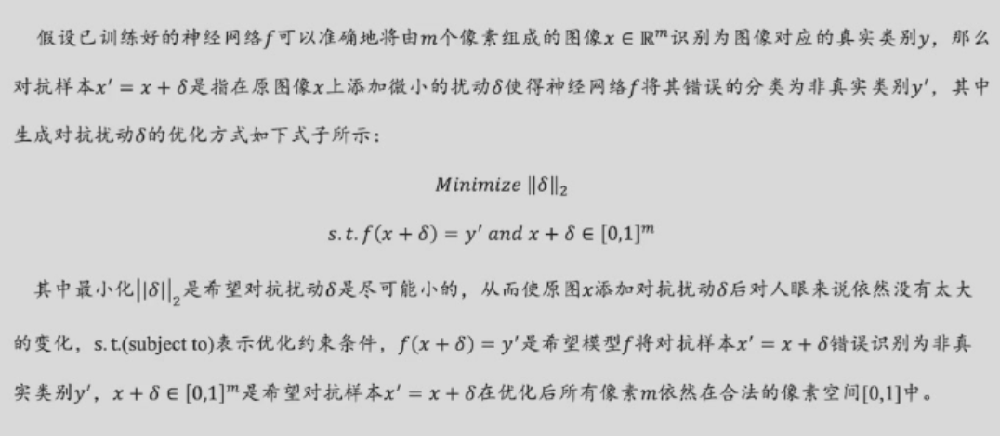
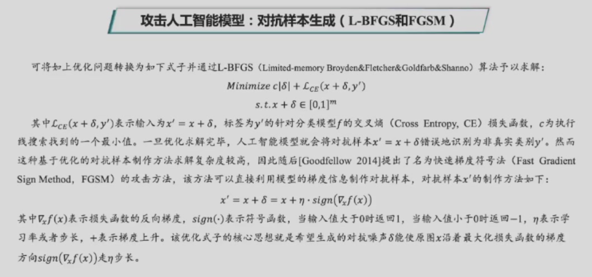
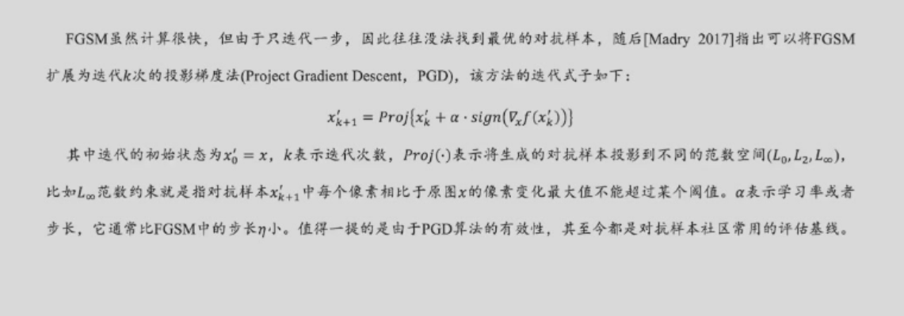

#### 数据投毒
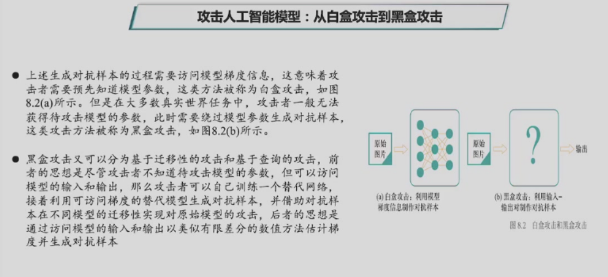
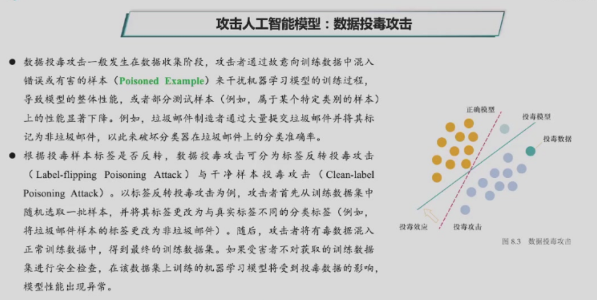
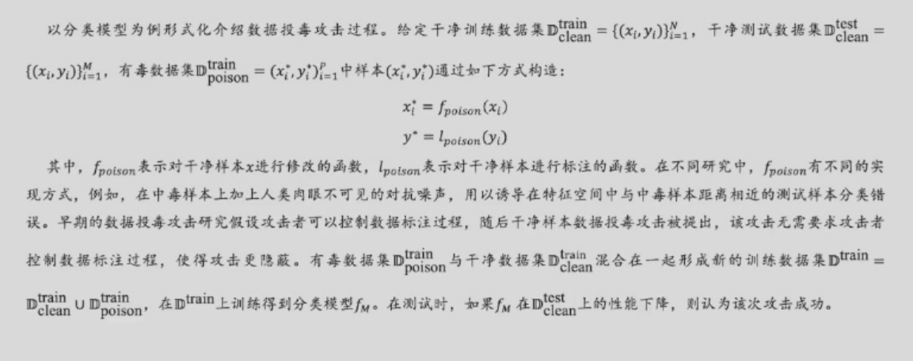

#### 后门攻击

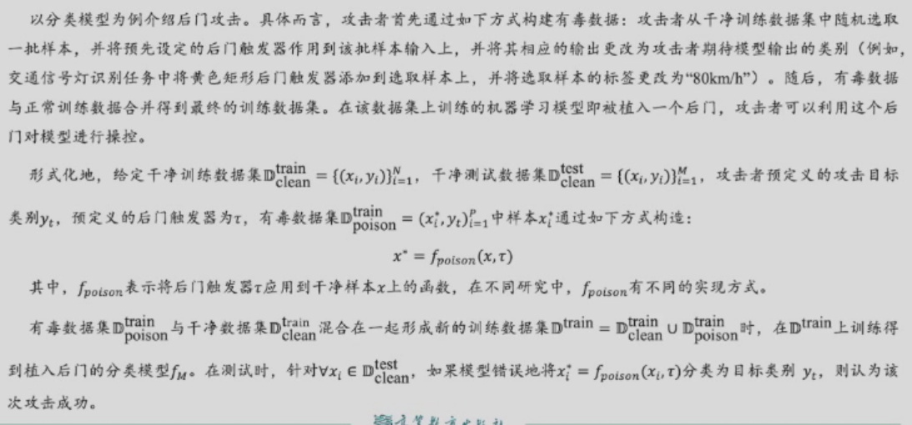

### 模型防御
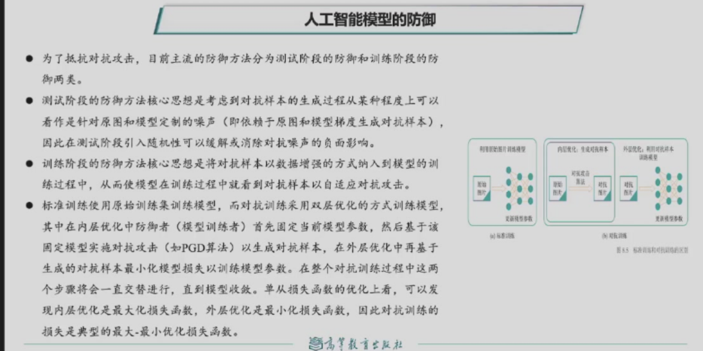
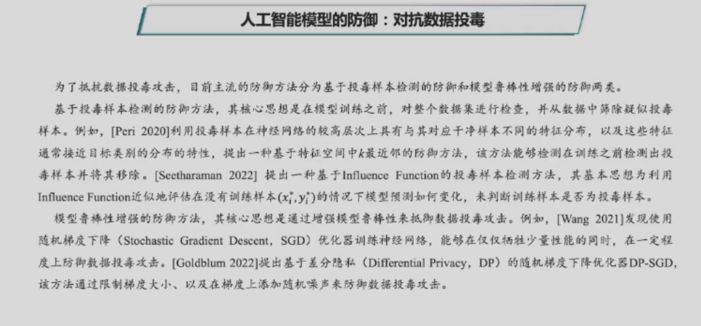
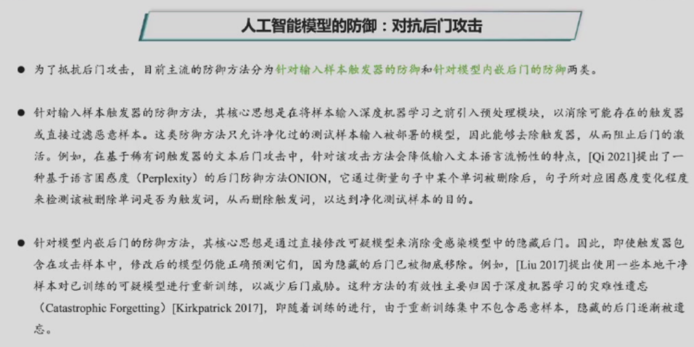
### 人工智能模型安全
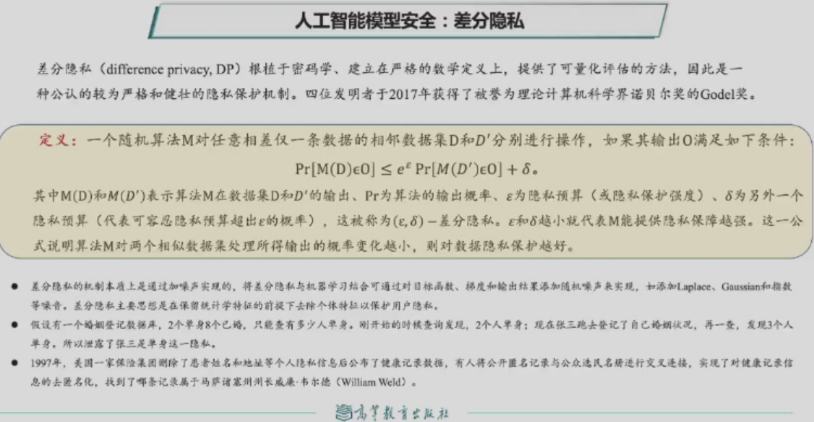
## 人工智能的可解释性
- 一般而言，可解释人工智能（interpretable AI或者explainable AI）是指智能体如何有效解释自己的行为过程机制和任务结果原因，取得人类用户的信任，以便让人类可以始终如一预测模型结果。可解释人工智能与黑盒式（black box）正好相反，后者无法给出过程和结果的合理性描述。

- 但是，目前以数据驱动为代表的深度学习一般以概率输出来完成分类识别、内容合成和判断决策等任务，难以在所得任务结果与推理计算过程之间建立起清晰联系，如手机中一个app软件为什么将一幅图像识别为人脸、一系列黑棋落子为什么能战胜一系列白棋落子、自动驾驶程序为什么将交通灯识别为红灯而不是斑马线等等？深度学习以概率论为基础输出任务结果与符号主义人工智能以逻辑推理输出结果相径庭，使得研究人工智能模型的可解释性变得更为重要。

