# 数据库介绍

## 基础概念

数据库是长期存储在计算机内、有组织的、可共享的数据集合。

数据库管理系统（DBMS）是一组用于访问、更新和管理数据库中数据的程序，它的主要目标是提供一种既方便又高效的存储和检索数据库信息的方式。

数据库系统则是数据库、数据库管理系统、应用程序、用户、硬件构成的集合。

DBMS有许多优点，如：数据访问的高效性与可扩展性，缩短应用程序开发时间，数据独立性（包括物理数据独立性和逻辑数据独立性），数据完整性与安全性，并发访问与稳健性（鲁棒性）。
## 文件处理系统
在数据库系统出现之前，文件处理系统是处理大量数据的主要手段。  
文件处理系统由传统的操作系统（OS）支持。在文件系统中，如果有需要，必须编写新的应用程序，并且根据需要创建新的数据文件，这就导致数据文件可能以不同格式存在，数据文件是彼此独立的。  
这会产生一系列问题，如：

- 数据冗余和不一致性：多种文件格式导致不同文件中的信息重复。
- 数据访问困难：需要为每个新任务编写新程序。
- 数据孤立：多个文件和多个格式导致数据难以检索和共享。
- 完整性问题：完整性约束成为程序代码的一部分（如检查数据是否有效），难以添加新的约束或修改现有约束。
- 更新缺乏原子性。
- 难以实现多用户并发访问。
- 安全问题。

## 数据视图和数据模型
数据库系统的一个主要目的是为用户提供数据的抽象视图。它通过两种方式来实现这一点：一是数据模型，二是数据抽象。

数据模型是用于描述数据、数据关系、数据语义和一致性约束的概念工具的集合。它有多种类型如：关系模型、实体-关系模型（主要用于数据库设计）、基于对象的数据模型（面向对象和对象-关系）等等。

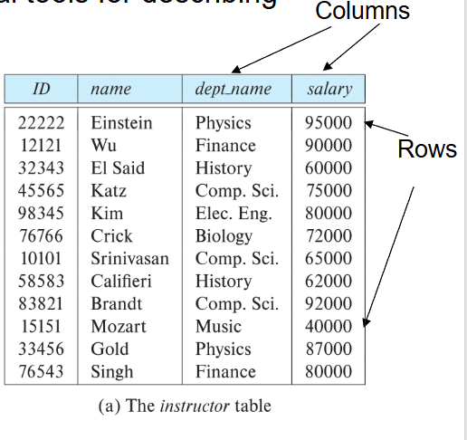

在数据库中，有不同层次的抽象来处理数据：

- 物理层：描述记录是如何存储的。
- 逻辑层：描述存储在数据库中的数据，以及上一层中数据之间的关系。
- 视图层：应用程序，隐藏了数据类型的细节。请注意，出于安全目的，视图也可以隐藏信息（例如，员工的工资）。

以下是一个数据库系统的层次：

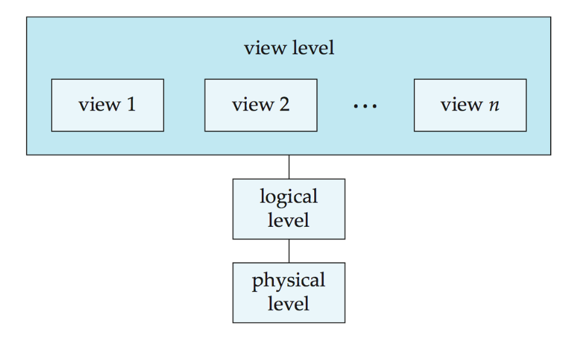

## 模式与实例
模式是数据库在不同层次上的结构，它类似于程序中变量的类型信息。

- 物理模式：在物理层设计的数据库结构。
- 逻辑模式：在逻辑层设计的数据库结构。
- 子模式：视图层的数据库结构。

实例则是数据库在某一特定时间点的实际内容，它类似于变量的值。

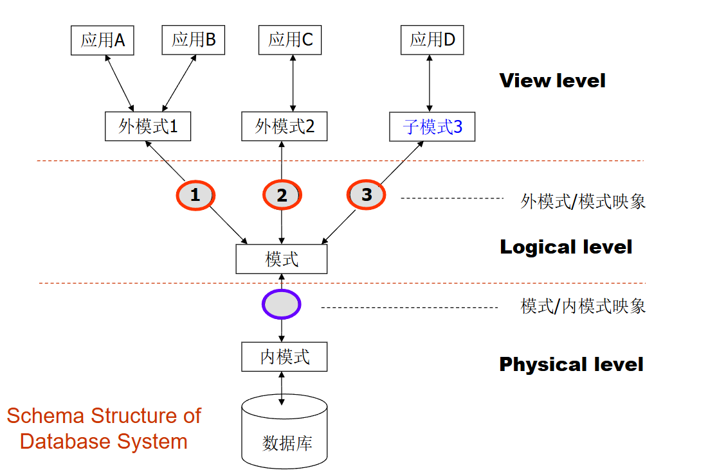

## 独立性
独立性是指能够修改某一层次的模式定义，同时不影响更高层次的模式定义的性质。  
数据库中的独立性有两种：物理数据独立性和逻辑数据独立性。

物理数据独立性能够修改物理模式，同时无需改变逻辑模式。即上层应用程序与数据的结构和存储方式相隔离，依赖于逻辑模式。这是使用数据库管理系统最重要的优势之一。

逻辑数据独立性是保护应用程序免受数据逻辑结构变更的影响。逻辑数据独立性难以实现，因为应用程序严重依赖于数据的逻辑结构。

## 数据库语言
数据库语言分为三种：

- 数据定义语言：用于定义数据库模式的规范表示法。
- 数据操作语言：用于访问和操作由相应数据模型组织的数据的语言。
- 数据控制语言：GRANT 和 REVOKE 等命令用于管理用户对数据库的访问权限。
### 数据定义语言（DDL）
将数据库模式定义为关系模式集合的规范。同时规定存储结构、访问方法和一致性约束。  
DDL 语句经过编译后，生成一组表，这些表存储在称为数据字典的特殊文件中。

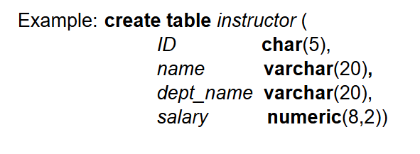

数据字典包含关于以下内容的元数据（即关于数据的数据）

- 数据库模式
- 完整性约束
    - 主码
    - 引用完整性
- 授权：谁可以访问什么
    - 读取授权、插入授权、更新授权、删除授权

### 数据操作语言（DML）
DML是用于访问和更新由相应数据模型组织的数据的语言。它规定从数据库中检索数据，插入、删除和更新数据。DML 也称为查询语言。

DML分为两类：

- 过程化 DML：用户指定需要什么数据以及如何获取这些数据（例如，C、Pascal、Java 等）。
- 声明式/非过程化 DML：用户指定需要什么数据，但不指定如何获取这些数据（例如，SQL、Prolog 等）。

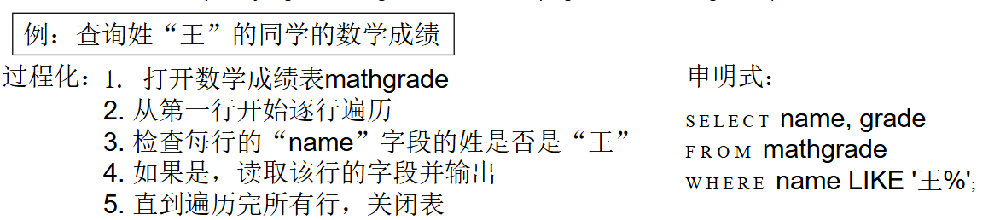

## 数据库设计
数据库设计包括以下步骤：

- 需求分析
    - 需要哪些数据、应用程序和操作。

- 概念数据库设计
    - 使用实体-联系模型或类似的高级数据模型，对数据和约束进行高层次描述。

- 逻辑数据库设计
    - 将概念设计转换为数据库模式。

- 模式优化
    - 关系规范化：检查关系模式是否存在冗余及相关异常。

- 物理数据库设计
    - 索引、查询、聚类和数据库调优。

- 创建和初始化数据库及安全设计
    - 加载初始数据，进行测试。
    - 识别不同的用户组及其角色。
  
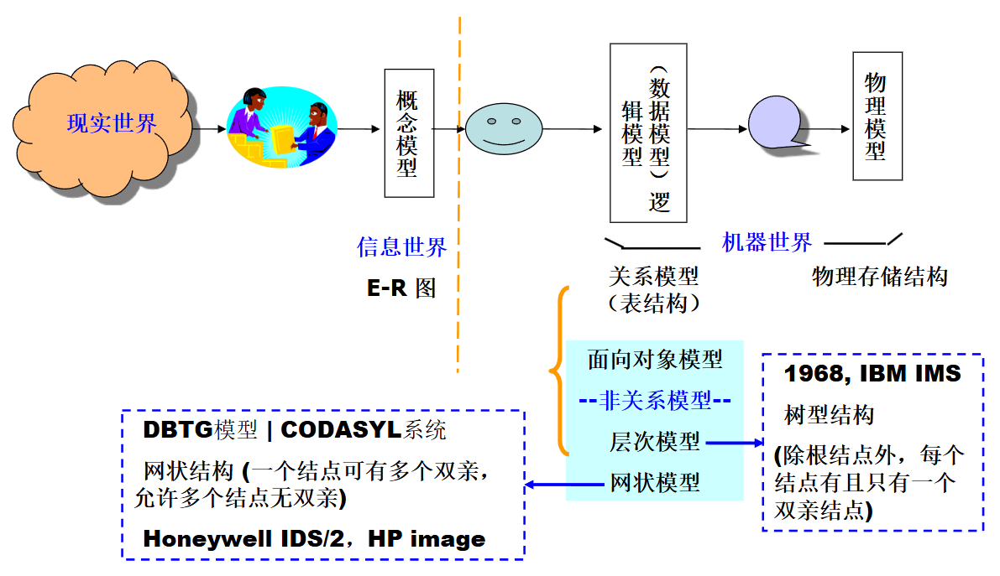

### 实体-联系模型
实体-联系模型（E-R模型）是一种用于描述实体和实体间关系的建模方法。
实体是指现实世界中某种事物的抽象，如人、物品、组织、事件等。实体由一组属性描述。  
联系是实体间的关系，如一对一、一对多、多对多等。联系由一组联系属性描述。

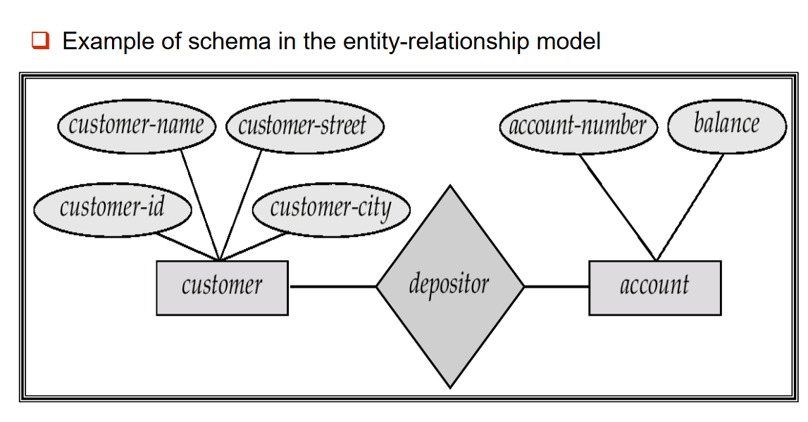

构造出实体-联系模型后，可以转换为关系模式。

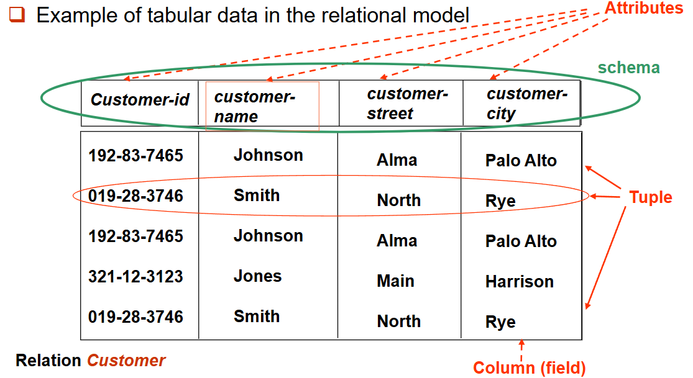

## 数据库用户
用户根据其期望与系统交互的方式而有所区分。

- 初级用户：调用先前由高级语言编写好的永久应用程序之一。（例如：通过网络访问数据库的人、银行柜员、职员。）
- 应用程序员 – 通过 SQL 调用与系统交互。
- 专业用户：用数据库查询语言形成请求。（例如：联机分析处理、数据挖掘。）
- 特殊用户：编写不适合传统数据处理框架的专用数据库应用程序。（例如：计算机辅助设计、专家系统、KDB 数据库。）

后三者也被称为高级用户。

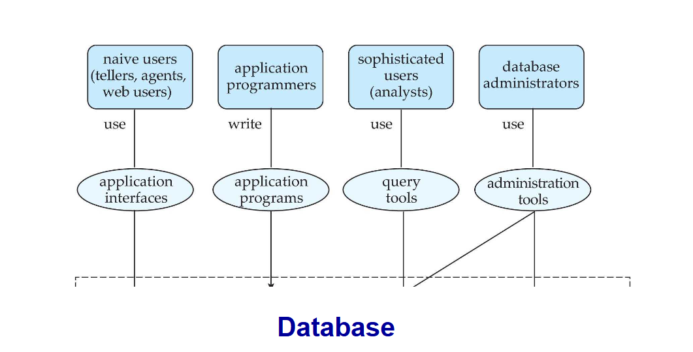

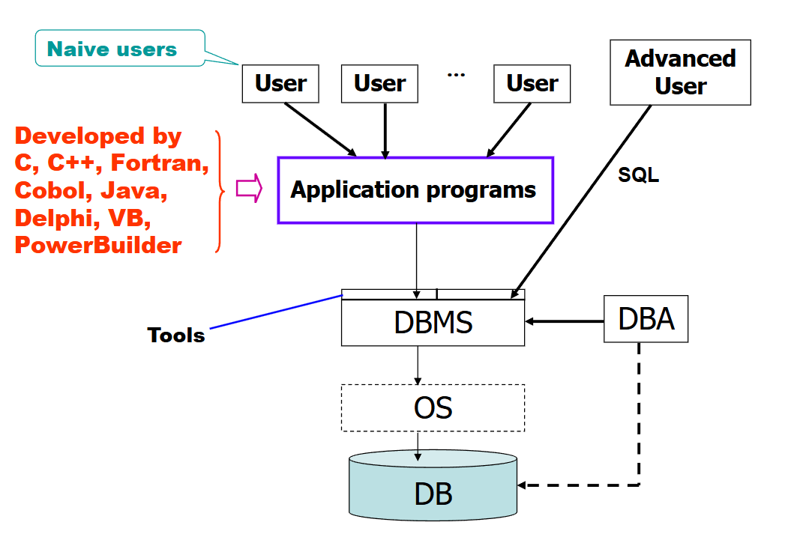

### 数据库管理员（DBA）
数据库管理员是一种特殊用户，他对数据库以及访问这些数据的程序拥有集中控制权。他拥有数据库的最高权限，并控制所有用户对数据库的权限。他负责协调数据库系统的所有活动。

数据库管理员的职责包括：

- 模式定义
- 存储结构和访问方法定义
- 模式和物理组织修改
- 授予数据访问权限
- 路由维护
- 性能监控
- 数据库安全

## 事务管理

并发使用/访问很重要，但也会引发问题/冲突。  
事务是在数据库应用程序中执行单个逻辑功能的一组操作。  
事务的要求包括原子性、一致性、隔离性、持久性。  
事务管理组件确保尽管发生系统故障（例如，电源故障和操作系统崩溃）和事务故障，数据库仍保持一致（或正确）状态。（这主要通过备份和恢复子系统实现）  
并发控制管理器控制并发事务之间的相互影响。

## 数据库架构
以下是一个数据库架构的示意图：

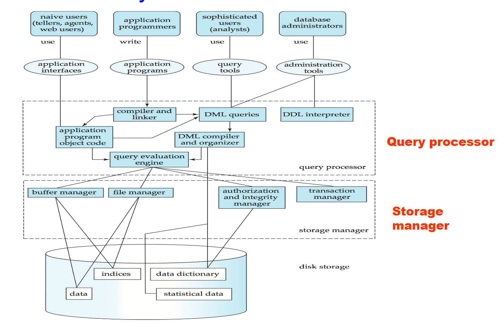
### 存储管理器

存储管理器是一个程序模块，它在数据库中存储的低级数据与提交给系统的应用程序和查询之间提供接口。  
存储管理器负责以下任务：  
- 与文件管理器进行交互
- 高效地存储、检索和更新数据

存储管理器包括：  
- 事务管理器
- 授权与完整性管理器
- 文件管理器（与文件系统交互，处理数据文件、数据字典和索引文件）:文件系统由操作系统提供和管理，而非数据库管理系统。数据库管理系统仅使用文件系统的接口，以文件和块的形式读写数据，并不直接访问物理磁盘。
- 缓冲区管理器

存储管理器实现几种数据结构作为物理系统实现的一部分：  
- 数据文件:存储数据库本身
- 数据字典:存储关于数据库结构的元数据，特别是数据库的模式。
- 索引:可以提供对数据项的快速访问。数据库索引提供指向含有特定值的数据项的指针。

### 查询处理器

查询处理器包括 DDL 解释器、DML 编译器和查询执行引擎。  
查询处理器负责：    
- 解析和解释 DDL 语句
- 编译和优化 DML 语句
- 执行查询

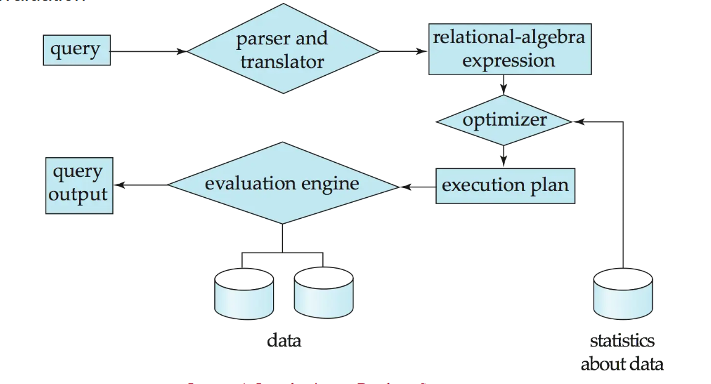

查询处理优化主要是评估给定查询的替代方式，如等价表达式或是每种操作的不同算法。它需要估算操作的执行成本。

### 层级架构
数据库系统的层级架构主要分为两层架构和三层架构。

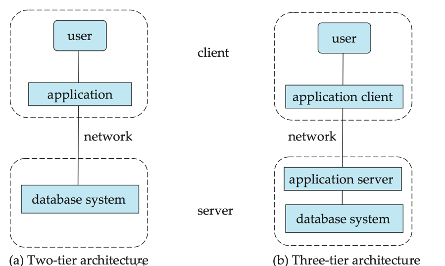

