# 事务

对于数据库管理系统（DBMS），必须处理两个主要问题：

- 多用户或多程序的并发执行。
- 各种类型的故障，例如硬件故障和系统崩溃。

## 事务概念

如何在数据库并发执行时保持其正确性、一致性和完整性？我们引入事务的概念。

事务是程序执行的一个单元，它访问并可能更新各种数据项。

通常，一个事务由若干条 SQL 语句组成，以 commit（提交）或 rollback（回滚）语句结束。

在事务执行期间，数据库可能处于不一致状态，但当事务提交后，数据库必须达到一致状态。

### 事务的特性

事务是程序执行的一个单元，它访问并可能更新各种数据项。为了保持数据的**完整性**，数据库系统必须确保：

- **原子性（Atomicity）**。事务的所有操作要么全部正确地在数据库中反映出来，要么全部不反映。
- **一致性（Consistency）**。事务的单独执行保持数据库的一致性。
- **隔离性（Isolation）**。尽管多个事务可能并发执行，但每个事务必须感知不到其他并发执行的事务。中间事务结果必须对其他并发执行的事务隐藏。

> 也就是说，对于任意一对事务 $T_i$ 和 $T_j$，在 $T_i$ 看来，要么 $T_j$ 在 $T_i$ 开始之前已经完成执行，要么 $T_j$ 在 $T_i$ 完成之后才开始执行。

- **持久性（Durability）**。事务成功完成后，它对数据库所做的更改将持久存在，即使发生系统故障也是如此。

以下是一个事务示例：

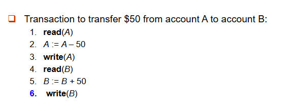

- 原子性要求：如果事务在第 3 步之后、第 6 步之前失败，资金将会“丢失”，导致数据库状态不一致。系统应确保部分执行的事务的更新不会反映在数据库中。
- 持久性要求：一旦用户收到事务已完成的通知（即 50 美元的转账已完成），即使发生软件或硬件故障，事务所做的数据库更新也必须持久存在。
- 一致性要求：一致性要求包括：
    - 显式指定的完整性约束，例如主键和外键
    - 隐式的完整性约束：例如，所有账户余额之和减去所有贷款金额之和必须等于手头现金金额。
    - 在事务执行期间，数据库可能暂时处于不一致状态。当事务成功完成时，数据库必须保持一致（错误的事务逻辑可能导致不一致）。

- 隔离性要求：如果在第 3 步和第 6 步之间，允许另一个事务 T2 访问部分更新的数据库，那么 T2 将看到一个不一致的数据库（$A + B$ 的总和会小于应有值）。
    - 通过串行执行事务（即一个接一个地执行）可以简单地保证隔离性。

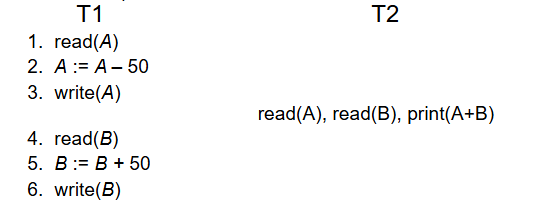

## 事务状态

常见的事务状态有：

- Active（活跃）：初始状态，事务在执行期间保持此状态。
- Partially committed（部分提交）：在最后一条语句执行之后。（此时要输出的结果数据可能还在内存 buffer 中）
- Failed（失败）：在发现正常执行无法继续之后。
- Aborted（中止）：在事务已回滚且数据库恢复到事务开始之前的状态之后。中止之后有两种选择：重启事务（仅当没有内部逻辑错误时才能执行）或终止事务。
- Committed（提交）：成功完成之后。

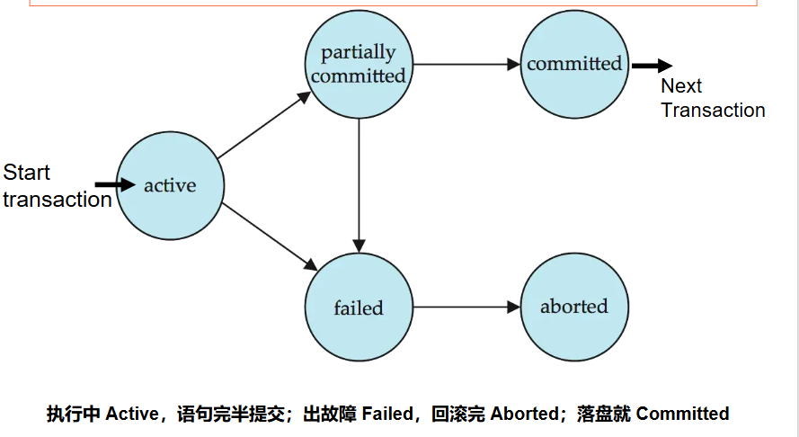

## 原子性与持久性的实现

数据库系统的恢复管理组件实现了对原子性和持久性的支持。

影子数据库方案：一种简单但低效的方案：一个名为 `db_pointer` 的指针始终指向当前数据库的一致副本。

所有更新都在一个新创建的数据库副本上进行。原始的副本———影子副本（影子拷贝）保持不变（由 `db_pointer` 指向）。

- 如果中止：只需删除新副本。
- 如果提交：
    - 将新副本在内存中的所有页面写入磁盘（在 Unix 中，使用 *flush* 命令）。
    - 将 `db_pointer` 改为指向新副本——使其成为当前副本，同时删除旧副本。

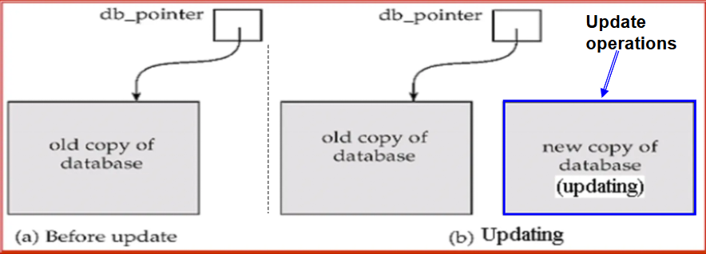

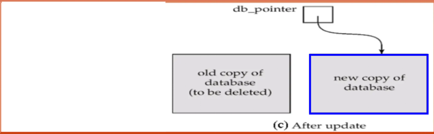

要求：原子性地更新数据库指针（这由磁盘系统保证，将其存储在一个单独的扇区中）；不支持并发事务；假设磁盘不会发生故障。

该思路对文本编辑器很有用。但对于大型数据库来说极其低效：执行单个事务就需要复制整个数据库。

## 并发操作

数据库系统中允许多个事务并发运行。

并发执行的优点包括：
- 提高处理器和磁盘的利用率，从而提升事务吞吐量：一个事务可以使用 CPU，而另一个事务则在进行磁盘读写。
- 降低事务的平均响应时间：短事务无需等待长事务完成。

但并发可能破坏一致性，即使每个单独的事务本身是正确的。

并发控制方案：实现隔离的机制，即控制并发事务之间的交互，以防止它们破坏数据库的一致性。这是DBMS的核心功能之一。

调度（Schedules）：表示并发事务中指令执行先后顺序的序列。

- 一个针对若干事务的调度必须包含这些事务的所有指令
- 必须保持每个事务内部指令出现的顺序

## 可串行化

若每个事务都保持数据库的一致性。则一组事务的串行执行能够保持数据库的一致性。

一个（可能并发的）调度如果等价于某个串行调度，则称该调度是可串行化的。

我们对事务进行简化，我们假设事务在读和写之间可以对本地缓冲区中的数据执行任意计算，使得简化的调度仅包含读和写指令。

### 冲突指令

事务 $T_i$ 的指令 $l_i$ 与事务 $T_j$ 的指令 $l_j$ **冲突**，当且仅当存在某个数据项 $Q$ 被 $l_i$ 和 $l_j$ 同时访问，并且这两条指令中至少有一条对 $Q$ 进行了写操作。

- $l_i = \text{read}(Q), l_j = \text{read}(Q)$。$l_i$ 和 $l_j$ **不冲突**。
- $l_i = \text{read}(Q), l_j = \text{write}(Q)$。它们**冲突**。
- $l_i = \text{write}(Q), l_j = \text{read}(Q)$。它们**冲突**。
- $l_i = \text{write}(Q), l_j = \text{write}(Q)$。它们**冲突**。

直观地讲，$l_i$ 与 $l_j$ 之间的冲突强制了它们之间的（逻辑上的）时间顺序。

如果在一个调度中 $l_i$ 和 $l_j$ 是连续的，并且它们不冲突，那么即使交换它们在调度中的顺序，其结果也保持不变。

**若两个操作是有冲突的，则二者执行次序不可交换。若两个操作不冲突，则可以交换次序。**

### 冲突可串行化

如果一个调度 $S$ 可以通过一系列对无冲突指令的交换转换为调度 $S'$，则称 $S$ 和 $S'$ 是**冲突等价**的。

如果一个调度 $S$ 与某个串行调度冲突等价，则称调度 $S$ 是**冲突可串行化**的。

如下例，调度 3 可以通过一系列对无冲突指令的交换，转换为调度 6（一个串行调度，其中 $T_2$ 在 $T_1$ 之后执行）。因此，调度 3 是冲突可串行化的。

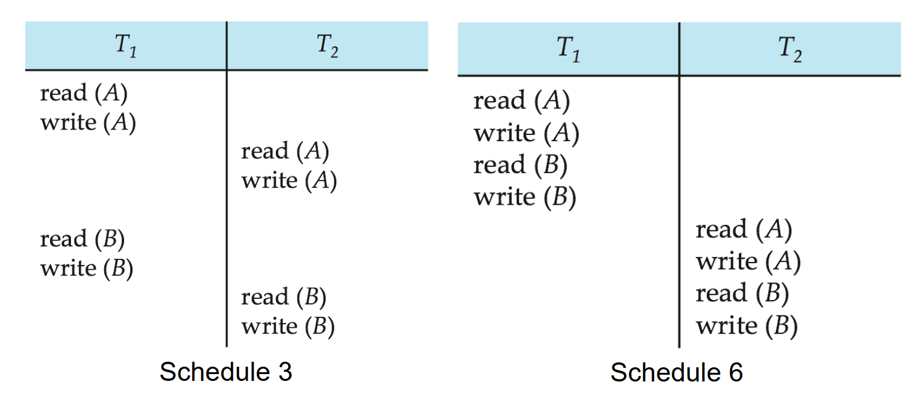

以下是一个不是冲突可串行化的调度示例：

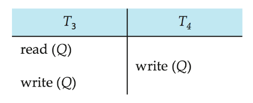

我们无法通过交换上述调度中的指令来得到串行调度 $< T_3, T_4 >$ 或串行调度 $< T_4, T_3 >$ 。

### 视图可串行化

设 $S$ 和 $S'$ 是两个具有相同事务集合的调度。若对于每个数据项 $Q$，以下三个条件均成立，则称 $S$ 和 $S'$ 是**视图等价**的：

- **首读**：1. 如果在调度 $S$ 中，事务 $T_i$ 读取了 $Q$ 的初始值，那么在调度 $S'$ 中，也必须是事务 $T_i$ 读取 $Q$ 的初始值。
- **写读**：2. 如果在调度 $S$ 中，事务 $T_i$ 执行了 $\text{read}(Q)$，并且该值是由事务 $T_j$（如果有的话）写入的，那么在调度 $S'$ 中，也必须是事务 $T_i$ 读取由事务 $T_j$ 的同一个 $\text{write}(Q)$ 操作所产生的 $Q$ 值。
- **末写**：3. 在调度 $S$ 中执行最后一个 $\text{write}(Q)$ 操作的事务（如果有的话）也必须在调度 $S'$ 中执行最后一个 $\text{write}(Q)$ 操作。

由此可见，视图等价也完全基于**读**和**写**操作本身。

如果一个调度 $S$ 与某个串行调度视图等价，则称 $S$ 是视图可串行化的。

每个冲突可串行化的调度也都是视图可串行化的。

下面是一个视图可串行化但不是冲突可串行化的调度。

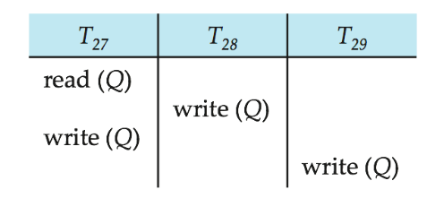

每个视图可串行化但不是冲突可串行化的调度都包含**盲写**操作。

### 其他可串行化概念

下面的调度与串行调度 $< T_1, T_5 >$ 产生相同的结果，但既不是冲突等价的，也不是视图等价的。

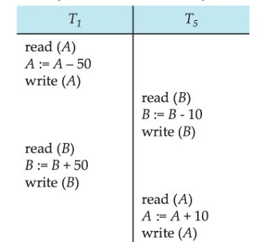

确定这种等价性需要分析读写以外的操作。

## 可恢复化

需要处理事务失败对并发运行的事务所造成的影响。

可恢复调度：如果事务 $T_j$ 读取了之前由事务 $T_i$ 写入的数据项，那么 $T_i$ 的提交操作必须出现在 $T_j$ 的提交操作之前。

下面的调度如果 $T_9$ 在读取后立即提交，则是不可恢复的。

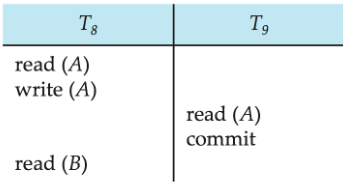

如果 $T_8$ 在提交前失败并回滚，那么 $T_9$ 会读取（并且可能向用户显示）一个不一致的数据库状态。因此，数据库必须确保调度是可恢复的。

### 级联回滚

级联回滚：单个事务失败导致一系列事务回滚。考虑以下调度，其中所有事务都尚未提交（因此该调度是可恢复的）

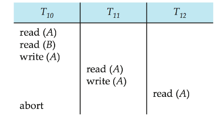

如果 $T_{10}$ 失败，$T_{11}$ 和 $T_{12}$ 也必须回滚。这种级联回滚可能导致大量工作被撤销。

### 无级联回滚

无级联调度：不会发生级联回滚；对于每对事务 $T_i$ 和 $T_j$，如果 $T_j$ 读取了之前由 $T_i$ 写入的数据项，那么 $T_i$ 的提交操作必须出现在 $T_j$ 的读取操作之前。

每个无级联调度也都是可恢复的。

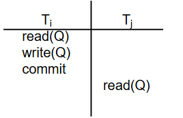

## 隔离性的实现

一次只允许一个事务执行的策略会产生串行调度，但并发度很低。

为了数据库的一致性，调度必须是**冲突可串行化**或**视图可串行化**且可恢复的，并且最好是**无级联**的。

并发控制方案需要在允许的并发程度与产生的开销之间进行权衡。

一些方案只允许生成冲突可串行化的调度，而另一些方案则允许生成视图可串行化但非冲突可串行化的调度。

## SQL 中的事务定义

数据操作语言必须包含一个结构，用于指定构成一个事务的动作集合。
在 SQL 中，事务是隐式开始的。

SQL 中的事务通过以下方式结束：

- `COMMIT WORK` 提交当前事务并开始一个新事务。
- `ROLLBACK WORK` 使当前事务中止。

在几乎所有数据库系统中，默认情况下，每条 SQL 语句如果成功执行，也会隐式提交。

可以通过数据库指令关闭隐式提交。例如，在 JDBC 中：`connection.setAutoCommit(false)`

## 可串行化测试

考虑一组事务$T_1, T_2, \dots, T_n$ 的某个调度

前驱图：一个有向图，其中顶点是事务（名称）

如果两个事务冲突，并且 $T_i$ 较早访问了产生冲突的数据项，则画一条从 $T_i$ 到 $T_j$的弧。 可以用所访问的数据项来标记该弧。

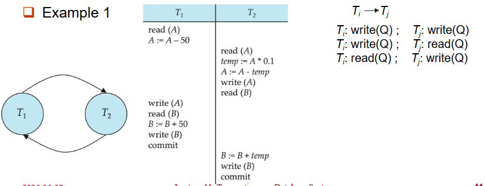

一个调度是冲突可串行化的**当且仅当**它的前驱图是无环的。

如果前驱图是无环的，则可以通过图的**拓扑排序**获得串行化顺序。

例如，调度 A 的一个串行化顺序可能是：$T_5 \to T_1 \to T_3 \to T_2 \to T_4$

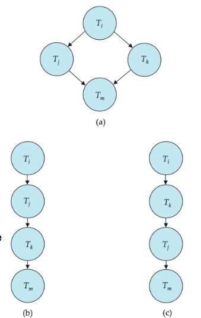