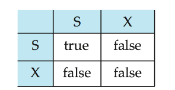
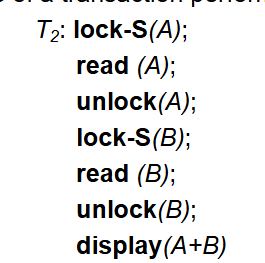
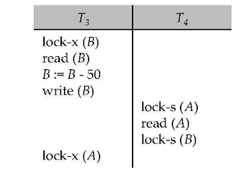
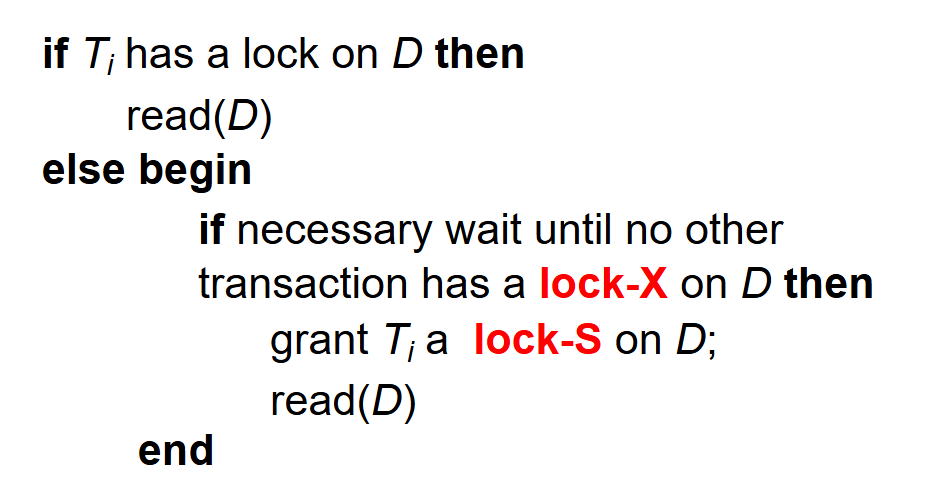
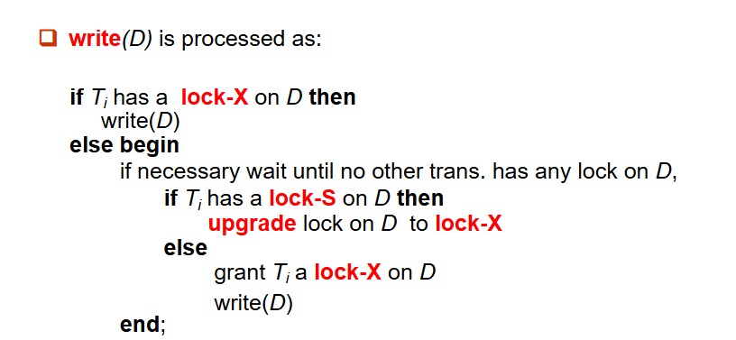
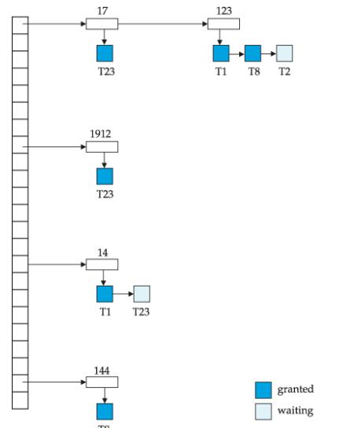

# 并发控制

## 基于锁的协议

数据项可以用两种模式加锁：

-  **排他（X）模式**：数据项既可读也可写。使用 **lock-X** 指令请求 X 锁。
- **共享（S）模式**：数据项**只能读**。使用 **lock-S** 指令请求 S 锁。

锁请求是向**并发控制管理器**发出的。事务**只有在请求被批准后才能继续执行**。

对一个数据项的多个锁请求可以通过锁兼容性矩阵来检查。

如果请求的锁与其他事务已经持有的该数据项上的锁兼容，则该事务可以被授予该数据项上的锁。

任意数量的事务可以持有同一数据项上的共享锁，

但如果任一事务持有该数据项上的排他锁，则其他任何事务都不能在该数据项上持有任何锁。

如果无法授予锁，则请求锁的事务将被要求等待，直到其他事务持有的所有不兼容锁都被释放，然后该锁才能被授予。

锁不一定能保证可串行化，如下例：如果在读取 $A$ 和 $B$ 之间 $A$ 和 $B$ 被更新，那么显示的总和将会出错。

**锁协议**是所有事务在请求和释放锁时所遵循的一组规则。锁协议限制了可能产生的调度集合。

### 死锁

如下例:

$T_3$ 和 $T_4$ 都无法推进——执行 **lock-S(B)** 导致 $T_4$等待 $T_3$ 释放其在 B 上的锁，而执行 **lock-X(A)** 导致 $T_3$ 等待 $T_4$ 释放其在 A 上的锁。这种情况称为**死锁**。

处理死锁时，必须回滚 $T_3$ 或 $T_4$ 中的一个，并释放其锁。

### 饥饿

如果并发控制管理器设计不当，也可能发生**饥饿**。例如：

- 一个事务可能正在等待某个数据项上的 X 锁，而一系列其他事务相继请求并获得了同一数据项上的 S 锁。
- 同一事务因死锁而被反复回滚。

并发控制管理器可以通过设计来防止饥饿。

### 两阶段锁协议

这是一种确保调度冲突可串行化的协议。

第一阶段：增长阶段
- 事务可以获得锁
- 事务不能释放锁

第二阶段：收缩阶段
- 事务可以释放锁
- 事务不能获得锁

该协议保证了可串行化。可以证明，事务可以按照其**锁点**（即事务获得最后一个锁的时刻）的顺序进行串行化。

两阶段锁**并不能**确保不会发生死锁。

在两阶段锁下，级联回滚是可能发生的。为了避免这种情况，可以遵循一种称为严格两阶段锁（Strict Two-Phase Lock）的改进协议。在该协议中，事务必须持有其所有的**排他锁**直到提交或中止。

严谨两阶段锁（Rigorous Two-Phase Lock）则更为严格：在该协议中，**所有锁**（包括共享锁）都持有到提交或中止为止。在此协议下，事务可以按照它们提交的顺序进行串行化。

存在某些冲突可串行化的调度，在使用两阶段锁时无法得到。

然而，在缺乏额外信息（例如对数据项的访问顺序）的情况下，两阶段锁在以下意义上是冲突可串行化所必需的：  
给定一个不遵循两阶段锁的事务 $T_i$，我们总能找到另一个使用两阶段锁的事务 $T_j$，使得 $T_i$ 与 $T_j$ 的某个调度不是冲突可串行化的。

在两阶段锁协议中，我们可以对锁进行转换：

第一阶段：
- 可以获取数据项上的 S 锁
- 可以获取数据项上的 X 锁
- 可以将 S 锁转换为 X 锁（升级）

第二阶段：
- 可以释放 S 锁（解锁）
- 可以释放 X 锁（解锁）
- 可以将 X 锁转换为 S 锁（降级）

该协议保证了可串行化。但仍然依赖于程序员插入各种锁指令。

在基于锁的协议中，read(D)的操作可以处理为：

write(D)的操作可以处理为：

### 锁管理器

锁管理器可以实现为一个独立的进程，事务向其发送锁请求和释放锁请求。

锁管理器通过发送锁授权消息（或者在发生死锁时发送要求事务回滚的消息）来回复锁请求。

请求的事务会一直等待，直到其请求得到答复。

锁管理器维护一个称为**锁表**的数据结构，用于记录已授予的锁和未决的请求。**锁表**通常实现为内存中的哈希表，以被锁定的数据项的名称作为索引。

以下是锁管理器处理锁请求的基本流程：

- 事务向锁管理器发送 lock-S(A)/lock-X(A) 请求；
- 管理器查询锁表，检查 A 当前的锁状态：
     - 若请求兼容，授予锁并更新锁表，发送 grant 消息；
     - 若请求不兼容，将事务加入 A 的等待队列，事务进入阻塞；
- 事务完成操作后发送 unlock(A) 请求，管理器释放锁，唤醒等待队列中的下一个事务。

以下是一个锁表的示例：

