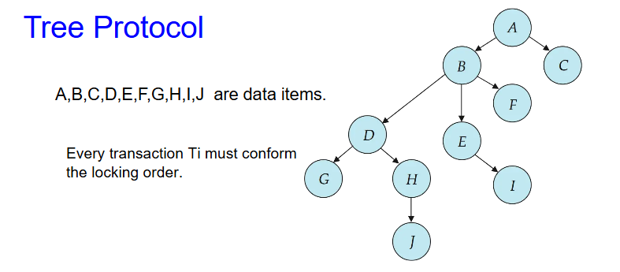
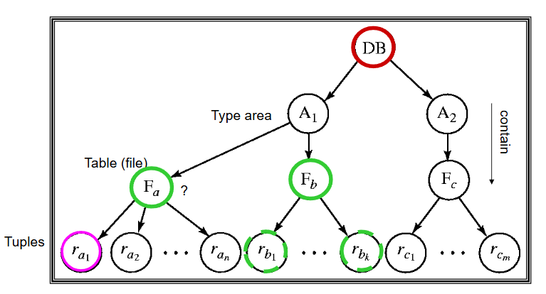
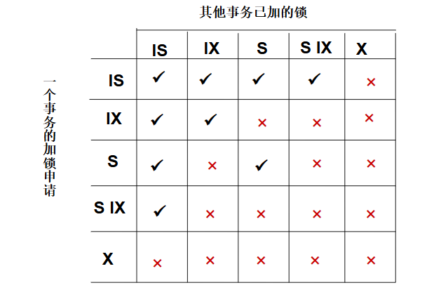
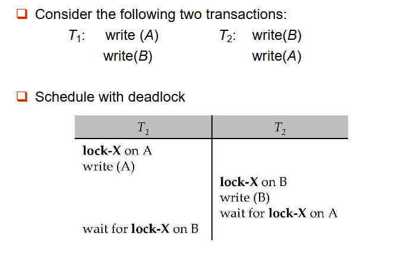
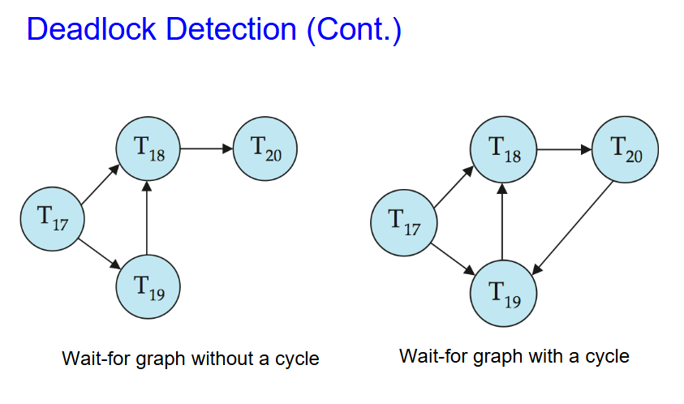

# 并发控制

## 基于锁的协议

数据项可以用两种模式加锁：

-  **排他（X）模式**：数据项既可读也可写。使用 **lock-X** 指令请求 X 锁。
- **共享（S）模式**：数据项**只能读**。使用 **lock-S** 指令请求 S 锁。

锁请求是向**并发控制管理器**发出的。事务**只有在请求被批准后才能继续执行**。

对一个数据项的多个锁请求可以通过锁兼容性矩阵来检查。

如果请求的锁与其他事务已经持有的该数据项上的锁兼容，则该事务可以被授予该数据项上的锁。

任意数量的事务可以持有同一数据项上的共享锁，

但如果任一事务持有该数据项上的排他锁，则其他任何事务都不能在该数据项上持有任何锁。

如果无法授予锁，则请求锁的事务将被要求等待，直到其他事务持有的所有不兼容锁都被释放，然后该锁才能被授予。

锁不一定能保证可串行化，如下例：如果在读取 $A$ 和 $B$ 之间 $A$ 和 $B$ 被更新，那么显示的总和将会出错。

**锁协议**是所有事务在请求和释放锁时所遵循的一组规则。锁协议限制了可能产生的调度集合。

### 死锁

如下例:

$T_3$ 和 $T_4$ 都无法推进——执行 **lock-S(B)** 导致 $T_4$等待 $T_3$ 释放其在 B 上的锁，而执行 **lock-X(A)** 导致 $T_3$ 等待 $T_4$ 释放其在 A 上的锁。这种情况称为**死锁**。

处理死锁时，必须回滚 $T_3$ 或 $T_4$ 中的一个，并释放其锁。

### 饥饿

如果并发控制管理器设计不当，也可能发生**饥饿**。例如：

- 一个事务可能正在等待某个数据项上的 X 锁，而一系列其他事务相继请求并获得了同一数据项上的 S 锁。
- 同一事务因死锁而被反复回滚。

并发控制管理器可以通过设计来防止饥饿。

### 两阶段锁协议

这是一种确保调度冲突可串行化的协议。

第一阶段：增长阶段
- 事务可以获得锁
- 事务不能释放锁

第二阶段：收缩阶段
- 事务可以释放锁
- 事务不能获得锁

该协议保证了可串行化。可以证明，事务可以按照其**锁点**（即事务获得最后一个锁的时刻）的顺序进行串行化。

两阶段锁**并不能**确保不会发生死锁。

在两阶段锁下，级联回滚是可能发生的。为了避免这种情况，可以遵循一种称为严格两阶段锁（Strict Two-Phase Lock）的改进协议。在该协议中，事务必须持有其所有的**排他锁**直到提交或中止。

严谨两阶段锁（Rigorous Two-Phase Lock）则更为严格：在该协议中，**所有锁**（包括共享锁）都持有到提交或中止为止。在此协议下，事务可以按照它们提交的顺序进行串行化。

存在某些冲突可串行化的调度，在使用两阶段锁时无法得到。

然而，在缺乏额外信息（例如对数据项的访问顺序）的情况下，两阶段锁在以下意义上是冲突可串行化所必需的：  
给定一个不遵循两阶段锁的事务 $T_i$，我们总能找到另一个使用两阶段锁的事务 $T_j$，使得 $T_i$ 与 $T_j$ 的某个调度不是冲突可串行化的。

在两阶段锁协议中，我们可以对锁进行转换：

第一阶段：
- 可以获取数据项上的 S 锁
- 可以获取数据项上的 X 锁
- 可以将 S 锁转换为 X 锁（升级）

第二阶段：
- 可以释放 S 锁（解锁）
- 可以释放 X 锁（解锁）
- 可以将 X 锁转换为 S 锁（降级）

该协议保证了可串行化。但仍然依赖于程序员插入各种锁指令。

在基于锁的协议中，read(D)的操作可以处理为：

write(D)的操作可以处理为：

### 锁管理器

锁管理器可以实现为一个独立的进程，事务向其发送锁请求和释放锁请求。

锁管理器通过发送锁授权消息（或者在发生死锁时发送要求事务回滚的消息）来回复锁请求。

请求的事务会一直等待，直到其请求得到答复。

锁管理器维护一个称为**锁表**的数据结构，用于记录已授予的锁和未决的请求。**锁表**通常实现为内存中的哈希表，以被锁定的数据项的名称作为索引。

以下是锁管理器处理锁请求的基本流程：

- 事务向锁管理器发送 lock-S(A)/lock-X(A) 请求；
- 管理器查询锁表，检查 A 当前的锁状态：
     - 若请求兼容，授予锁并更新锁表，发送 grant 消息；
     - 若请求不兼容，将事务加入 A 的等待队列，事务进入阻塞；
- 事务完成操作后发送 unlock(A) 请求，管理器释放锁，唤醒等待队列中的下一个事务。

以下是一个锁表的示例：

### 基于图的协议/树形协议

基于图的协议是两阶段锁协议的另一种选择。

在全体数据项的集合 $\mathbf{D} = \{d_1, d_2, \dots, d_h\}$ 上施加一个偏序关系 $\rightarrow$。

若 $d_i \rightarrow d_j$，则任何同时访问 $d_i$ 和 $d_j$ 的事务必须先访问 $d_i$ 再访问 $d_j$。

这意味着集合 $\mathbf{D}$ 现在可以看作一个**有向无环图**，称为**数据库图**。

**树形协议**是一种简单的基于图的协议。

1. 只允许使用互斥锁。

2. 事务 $T_i$ 可以首先锁定任意数据项。之后，只有当 $Q$ 的父节点当前已被 $T_i$ 锁定时，$T_i$ 才能锁定数据项 $Q$。

3. 数据项可以在任何时候解锁。

4. 已被 $T_i$ 锁定并解锁过的数据项，之后不能再被 $T_i$ 重新锁定。

优点：

- 树形协议既能保证冲突可串行化，也能避免死锁。
- 与两阶段锁定协议相比，树锁协议中可以更早地解锁。

缺点：

- 协议不能保证可恢复性或无级联。需要引入提交依赖来确保可恢复性。
- 事务可能需要锁定它们不会访问的数据项。锁定开销增加，等待时间增加。可能导致并发性下降。

在两阶段锁协议下不可能的一些调度，在树协议下是可能的，反之亦然。

## *基于时间戳的协议

每个事务在进入系统时都会被分配一个时间戳。如果一个旧事务 $T_i$ 的时间戳为 $TS(T_i)$，那么一个新事务 $T_j$ 会被分配一个时间戳 $TS(T_j)$，满足 $TS(T_i) < TS(T_j)$。

该协议管理并发执行，使得时间戳决定可串行化的顺序。

为了确保这样的行为，协议为每个数据项 $Q$ 维护两个时间戳值：

- **写时间戳**( $Q$ ) 是成功执行了 **write**( $Q$ ) 的所有事务中的最大时间戳。
- **读时间戳**( $Q$ ) 是成功执行了 **read**( $Q$ ) 的所有事务中的最大时间戳。

时间戳排序协议确保所有冲突的读和写操作按时间戳顺序执行。

假设事务 $T_i$ 发出读操作 $\text{read}(Q)$：

- 若 $TS(T_i) \leq W\text{-timestamp}(Q)$，则 $T_i$ 需要读取的 $Q$ 值已经被覆盖。因此，该读操作被拒绝，$T_i$ 被回滚。

- 若 $TS(T_i) \geq W\text{-timestamp}(Q)$，则执行读操作，并将 $R\text{-timestamp}(Q)$ 设置为 $R\text{-timestamp}(Q)$ 和 $TS(T_i)$ 中的最大值。

假设事务 $T_i$ 发出写操作 $\text{write}(Q)$：

- 若 $TS(T_i) < R\text{-timestamp}(Q)$，则 $T_i$ 正在生成的 $Q$ 值之前已被需要，且系统曾假定该值永远不会产生。因此，该写操作被拒绝，$T_i$ 被回滚。
- 若 $TS(T_i) < W\text{-timestamp}(Q)$，则 $T_i$ 试图写入一个过时的 $Q$ 值。因此，该写操作被拒绝，$T_i$ 被回滚。
- 否则，执行写操作，并将 $W\text{-timestamp}(Q)$ 设置为 $TS(T_i)$。

时间戳排序协议保证了可串行化，因为前驱图中的所有弧都具有以下形式：时间戳较小的事务 → 时间戳较大的事务。因此，precedence 图中不会出现环。

时间戳协议确保不会发生死锁，因为事务从不等待。

但调度可能不是无级联的，甚至可能不是可恢复的。

时间戳排序协议的问题：

- 假设 $T_j$ 回滚，但 $T_j$ 已经读取了由 $T_i$ 写入的数据项
- 那么 $T_j$ 必须回滚；如果 $T_j$ 之前已经被允许提交，则调度是**不可恢复的**。
- 此外，任何读取了由 $T_j$ 写入的数据项的事务也必须回滚
- 这可能导致**级联回滚**。

解决方案：
- 事务被结构化，使其所有写操作都在处理过程的最后执行
- 一个事务的所有写操作构成一个原子动作；在写操作进行期间，不允许其他事务执行
- 回滚的事务将使用新的时间戳重新启动

### Thomas 写规则

时间戳排序协议的一种修改版本，在某些情况下可以忽略过时的**写**操作。

当 $T_i$ 试图写入数据项 $Q$ 时，如果 $TS(T_i) < W\text{-timestamp}(Q)$，则 $T_i$ 试图写入 $\{Q\}$ 的一个过时值。因此，与其像时间戳排序协议那样回滚 $T_i$，不如忽略这个**写**操作。

除此之外，该协议与时间戳排序协议相同。

Thomas 写规则允许更大的潜在并发性。与之前的协议不同，它允许一些视图可串行化但非冲突可串行化的调度。

## *基于验证的协议

事务 $T_i$ 的执行分为三个阶段。

1. 读取和执行阶段：事务 $T_i$ 仅对临时局部变量进行写入操作。
2. 验证阶段：事务 $T_i$ 执行“验证测试”，以确定是否可以在不违反可串行化的前提下写入局部变量。
3. 写入阶段：如果 $T_i$ 通过验证，则将其更新写入数据库；否则，$T_i$ 被回滚。

并发执行的事务的三个阶段可以交错进行，但每个事务必须按顺序经历这三个阶段。

为简单起见，假设验证阶段和写入阶段一起原子地、串行地执行，即一次只有一个事务执行验证/写入。

这种基于验证的协议也称为乐观并发控制。

为了实现基于验证的协议，我们再引入时间戳。每个事务 $T_i$ 有三个时间戳：

- $\text{Start}(T_i)$：$T_i$ 开始执行的时间
- $\text{Validation}(T_i)$：$T_i$ 进入其验证阶段的时间
- $\text{Finish}(T_i)$：$T_i$ 完成其写入阶段的时间

可串行化顺序由验证时赋予的时间戳决定，以提高并发性。

当冲突概率较低时，该协议非常有用，并能提供更高的并发度。

## 多粒度锁

方便起见，允许数据项根据需要以不同大小进行锁定——即多粒度。

定义一个数据粒度的层次结构，其中小粒度嵌套在大粒度中，可以用树形结构图形化表示（但不要与树锁协议混淆）。

当事务显式锁定树中的一个节点时，它会以相同的模式隐式地锁定该节点的所有后代节点。

锁定的粒度（树中进行锁定的层级）：

- **细粒度**（树中较低层）：高并发性，高锁定开销
- **粗粒度**（树中较高层）：低锁定开销，低并发性

以下是一个多粒度锁的示例：

### 意向锁

在一个节点被显式锁定之前，我们可以先将意向锁加在该节点的所有祖先节点上。

意向锁表明祖先节点的后代节点被锁定的锁的类型。通过对意向锁的检查，可以锁定更高层的节点，而无需检查所有后代节点上的锁的类型是否兼容。

多粒度下有三种意向锁模式：
  
- **意向共享锁（IS）**：表示在树结构的较低层使用共享锁显式加锁。（表明其后代存在 S 锁）
- **意向排他锁（IX）**：表示在树结构的较低层使用排他锁显式加锁。（表明其后代存在 X 锁）
- **共享意向排他锁（SIX）**：该节点为根的子树以共享模式显式锁定，同时在较低层使用排他锁模式进行显式锁定。**SIX = S + IX**

我们可以根据一个节点的意向锁模式以及其本身的锁模式来构建锁兼容性矩阵。

事务 $T_i$ 可以使用以下规则锁定节点 $Q$：

1. 必须遵守锁兼容性矩阵。
2. 必须首先锁定树的根节点，并且可以以任何模式锁定。
3. 仅当 $Q$ 的父节点当前已被 $T_i$ 以 $IX$ 或 $IS$ 模式锁定时，$T_i$ 才能以 $S$ 或 $IS$ 模式锁定节点 $Q$。
4. 仅当 $Q$ 的父节点当前已被 $T_i$ 以 $IX$ 或 $SIX$ 模式锁定时，$T_i$ 才能以 $X$、$SIX$ 或 $IX$ 模式锁定节点 $Q$。
5. $T_i$ 只有在之前没有解锁过任何节点的情况下才能锁定节点（即 $T_i$ 是两阶段的）。
6. 仅当 $Q$ 的所有子节点当前都没有被 $T_i$ 锁定时，$T_i$ 才能解锁节点 $Q$。

注意，锁的获取顺序是 **从根到叶**，而释放顺序是 **从叶到根**。

意向锁优点：增强并发性，降低加锁开销。

## *多版本方案

多版本方案通过保留数据项的旧版本来提高并发性。

每次成功的写操作都会创建所写数据项的一个新版本。使用时间戳来标记版本。当发起 读(Q) 操作时，根据事务的时间戳选择 Q 的适当版本，并返回所选版本的值。

读操作永远不需要等待，因为会立即返回一个合适的版本。

多版本方案的基本思路如下：

- 每个数据项 $Q$ 都有一系列版本 $<Q_1, Q_2, \dots, Q_m>$。  
- 每个版本 $Q_k$ 包含三个数据字段：  
    - **内容** —— 版本 $Q_k$ 的值。  
    - **写时间戳**（$W\text{-timestamp}(Q_k)$）—— 创建（写入）该版本的事务的时间戳。  
    - **读时间戳**（$R\text{-timestamp}(Q_k)$）—— 成功读取该版本的事务中最大的时间戳。  

- 当事务 $T_i$ 创建 $Q$ 的一个新版本 $Q_k$ 时，$Q_k$ 的写时间戳和读时间戳都被初始化为 $TS(T_i)$。  

- 每当有事务 $T_j$ 读取 $Q_k$，并且 $TS(T_j) > R\text{-timestamp}(Q_k)$ 时，$Q_k$ 的读时间戳就会被更新为该事务的时间戳。

假设事务 $T_i$ 发起 **读($Q$)** 或 **写($Q$)** 操作。令 $Q_k$ 表示 $Q$ 的这样一个版本：其写时间戳是小于或等于 $TS(T_i)$ 的所有写时间戳中最大的那个。

- 如果事务 $T_i$ 发起 **读($Q$)**，则返回版本 $Q_k$ 的内容。

- 如果事务 $T_i$ 发起 **写($Q$)**：
    - 若 $TS(T_i) < R\text{-timestamp}(Q_k)$，则事务 $T_i$ 被回滚。
    - 若 $TS(T_i) = W\text{-timestamp}(Q_k)$，则覆盖 $Q_k$ 的内容。
    - 否则，为 $Q$ 创建一个新版本。

该协议保证可串行化。

在多版本方案协议的基础上，我们也可以实现多版本两阶段锁，在此不再讨论。

## 死锁的处理

我们之前提到过死锁的现象。对于死锁，我们需要对它进行预防、检测和处理。

### 死锁预防

死锁预防协议确保系统永远不会进入死锁状态。以下是几种常见的死锁预防协议：

- 要求每个事务在执行开始前锁定其所有数据项（要么全部锁定，要么一个都不锁）—— **保守两阶段锁定**。缺点是并发性差，难以预测。
- 对所有数据项施加偏序，并要求事务 **只能按该顺序锁定数据项**（基于图的协议）。
- 事务仅等待锁指定的时间长度。超过该时间后，等待超时，事务被回滚。这种方法实现简单；但可能发生饥饿。此外，难以确定合适的超时时间间隔值。
- 等待-死亡（Wait-die）方案（非抢占式）
    - 较旧的事务可以等待较新的事务释放数据项。较新的事务从不等待较旧的事务，而是被回滚。
    - 一个事务在获得所需数据项之前可能会死亡多次。
    - 例如 $T14$、$T15$、$T16$ 的时间戳分别为 5、10、15。$T14$ 可以等待 $T15$ 释放数据项；$T16$ 不能等待 $T15$ 释放数据项，而是直接回滚。

- 负伤-等待（Wound-wait）方案（抢占式）
    - 较旧的事务使较新的事务“负伤”（强制回滚），而不是等待它。较新的事务可以等待较旧的事务。
    - 与 **等待-死亡** 方案相比，可能的回滚次数更少。

在 wait-die 和 wound-wait 两种方案中，被回滚的事务会以其原始时间戳重新启动。因此，较旧的事务优先于较新的事务，从而避免了饥饿。

### 死锁检测

死锁可以被描述为**等待图**，它由一对 $G = (V, E)$ 构成。

- $V$ 是顶点集合（系统中所有事务）
- $E$ 是边的集合；每个元素是一个有序对 $T_i \to T_j$。

若 $T_i \to T_j$ 在 $E$ 中，则存在一条从 $T_i$ 指向 $T_j$ 的有向边，表示 $T_i$ 正在等待 $T_j$ 释放某个数据项。

当 $T_i$ 请求一个当前由 $T_j$ 持有的数据项时，边 $T_i \to T_j$ 将被插入等待图中。只有当 $T_j$ 不再持有 $T_i$ 所需的那个数据项时，这条边才会被移除。

系统处于死锁状态当且仅当等待图中存在**环**。必须周期性地调用死锁检测算法来查找环。

### 死锁恢复

当检测到死锁时，必须回滚某个事务（作为牺牲者）以打破死锁。选择代价最小的事务作为牺牲者。

回滚分为两种：

- 完全回滚：中止该事务，然后重新启动它。
- 部分回滚：仅将事务回滚到足以打破死锁的程度更为有效。

如果同一个事务总是被回滚，就会发生饥饿。应将回滚次数计入代价因素以避免饥饿。

## 插入与删除操作

若使用两阶段锁：

- 只有在删除元组的事务对该元组持有排他锁时，才能执行删除操作。
- 向数据库中插入新元组的事务会获得该元组上的排他锁。

插入和删除可能导致幻影现象（phantom phenomenon）。扫描某个关系的事务（例如，计算 Perryridge 分行所有账户余额的总和）与在该关系中插入元组的事务（例如，在 Perryridge 插入一个新账户）在（概念上）会发生冲突，尽管它们没有共同访问任何元组。如果仅使用元组锁，则可能产生不可串行化的调度。

扫描关系的事务正在读取指示该关系包含哪些元组的信息，而插入元组的事务则更新相同的信息。所以为了避免幻影现象，该信息应当被加锁。

一种解决方案是将一个数据项与关系关联起来，用于表示该关系包含哪些元组的信息。扫描关系的事务在该数据项上获取共享锁。插入或删除元组的事务在该数据项上获取排他锁。（注意：该数据项上的锁与单个元组上的锁不冲突。）

上述协议对于插入/删除操作提供的并发性非常低。索引锁协议通过要求对某些索引桶加锁，在防止幻影现象的同时提供更高的并发性。

索引锁协议规定每个关系必须至少有一个索引。对关系的访问只能通过该关系上的某个索引来进行。

执行查找操作的事务$T_i$必须对其访问的所有索引桶以共享模式（S 模式）加锁。

事务 $T_i$ 在不更新关系到 $r$ 的所有索引的情况下，不得向关系 $r$ 插入元组 $t_i$。若想插入元组，$T_i$ 必须在每个索引上执行查找，以找到所有可能包含指向元组 $t_i$ 的指针的索引桶（若该元组已经存在的话），并以排他模式（X 模式）获取所有这些索引桶上的锁。$T_i$ 还必须以 X 模式获取其修改的所有索引桶上的锁。

## *索引结构的并发性

索引与其他数据库项不同，其唯一作用是帮助访问数据。索引结构的访问频率通常远高于其他数据库项，所以将索引结构视同其他数据库项（例如，通过对索引节点采用两阶段锁）会导致并发性较低。

存在多种索引并发协议，在这些协议中，内部节点上的锁会被提前释放，并且不采用两阶段方式。

只要索引的准确性得以保持，对索引进行不可串行化的并发访问是可以接受的。特别是，在 B+ 树的内部节点中读到的确切值无关紧要，只要最终能到达正确的叶节点即可。

