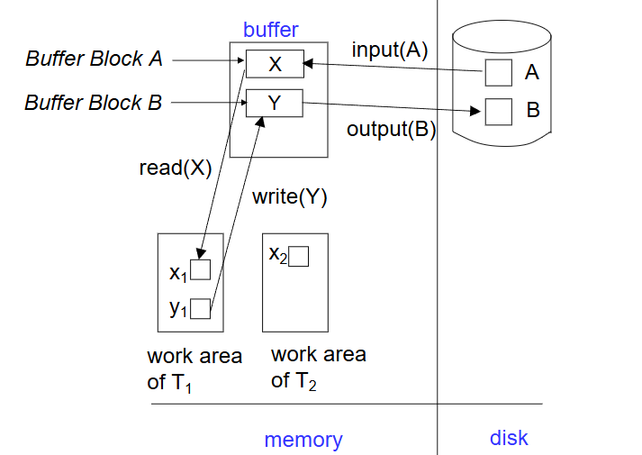
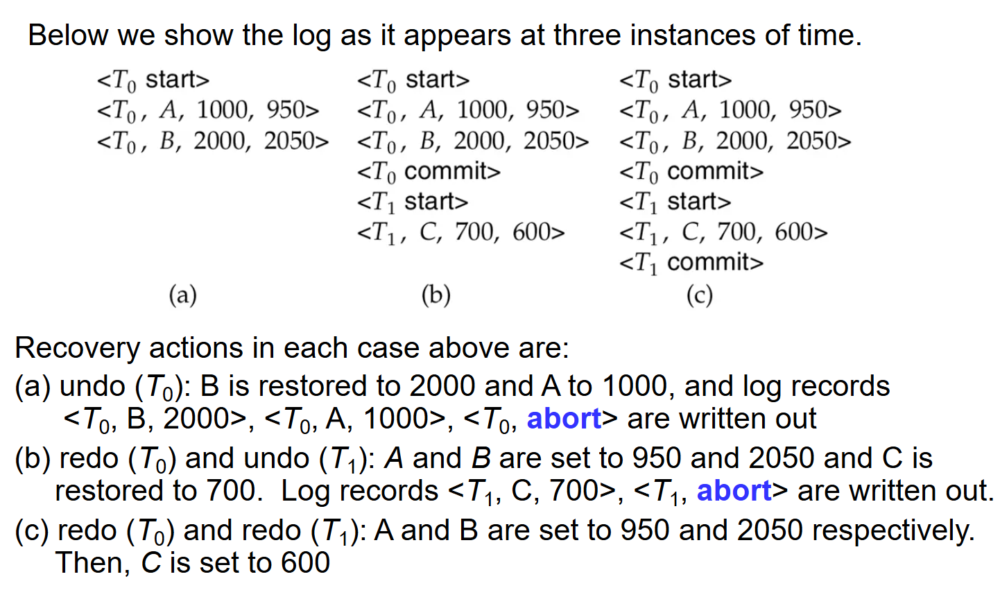
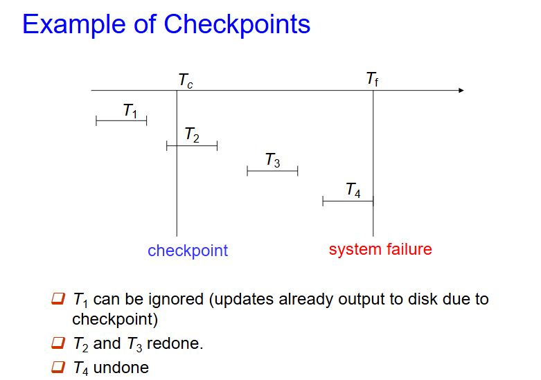
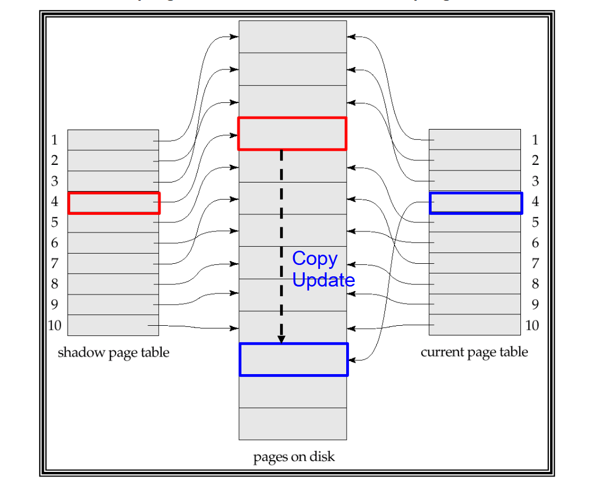
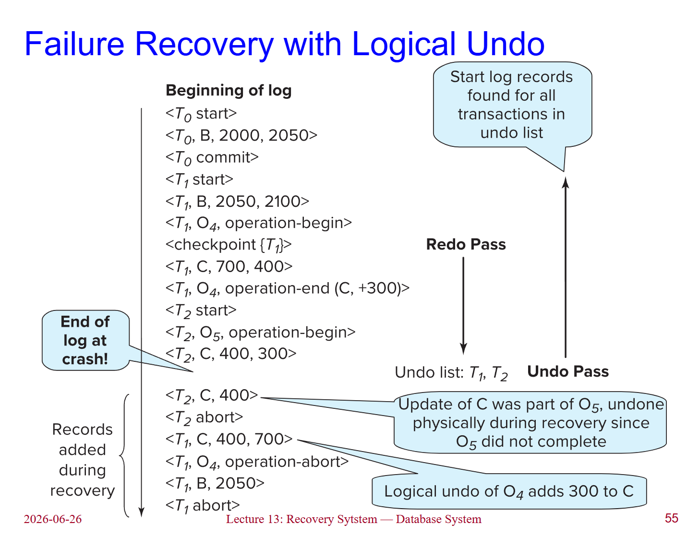
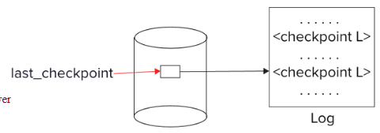
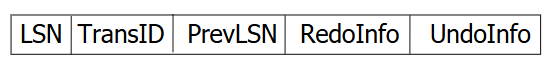
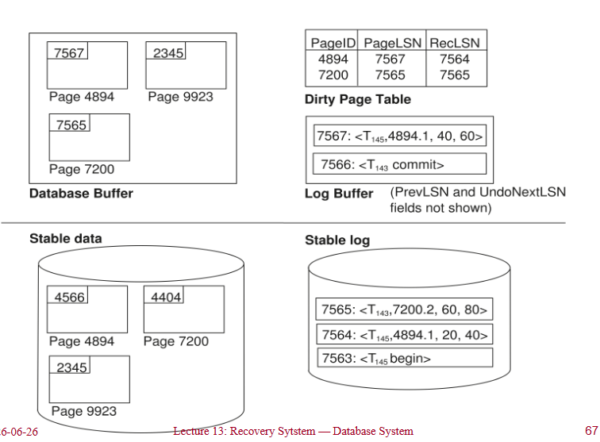
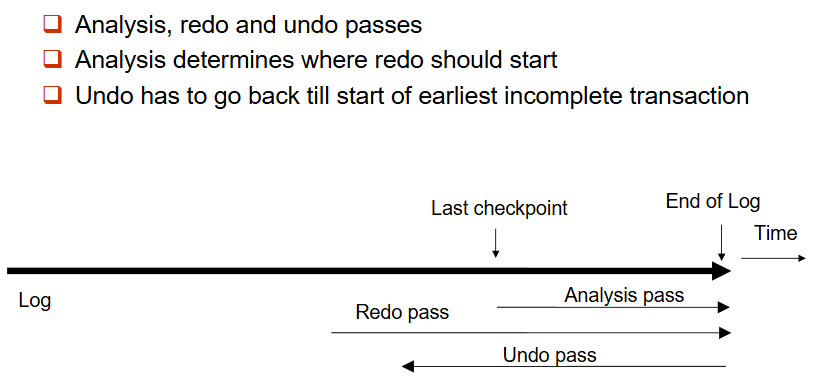
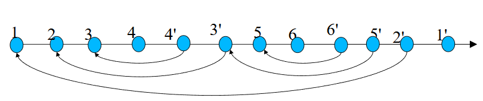

# 恢复系统

## 故障分类

- 事务故障：
    - **逻辑错误**：事务因内部错误条件（如溢出、错误输入、数据未找到等）而无法完成。
    - **系统错误**：数据库系统因错误条件（如死锁）而必须终止一个活跃事务。
- 系统崩溃：电源故障或其他硬件或软件故障导致系统崩溃。
    - **故障停止假设**：非易失性存储内容不会因系统崩溃而损坏。
    - 数据库系统有大量的完整性检查机制，以防止磁盘数据损坏。
- 磁盘故障：磁头碰撞或类似的磁盘故障破坏磁盘存储的部分或全部内容。
    - 假定此类破坏是可检测的：磁盘驱动器使用校验和来检测故障。

故障恢复算法包含两个部分：

- 正常事务处理期间采取的行动，以确保存在足够的信息用于从故障中恢复
- 故障发生后采取的行动，以将数据库内容恢复到能够保证原子性、一致性和持久性的状态

## *存储结构

存储结构按照存储介质的易失性分为三类：

- 易失性存储：系统崩溃后无法保留数据。例如：主存、高速缓存。
- 非易失性存储：系统崩溃后仍能保留数据，但仍可能发生故障并丢失数据。例如：磁盘、磁带、闪存、非易失性（电池供电的）RAM。
- 稳定存储：一种能承受所有故障的理想化存储形式，可以通过在多个不同的非易失性介质上维护多个副本来实现近似。

## *数据访问

物理块是那些驻留在磁盘上的块。缓冲块是那些临时驻留在主存中的块。

磁盘与主存之间的块移动通过以下两个操作发起：

- `input(B)` 将物理块 $B$ 传送到主存。
- `output(B)` 将缓冲块 $B$ 传送到磁盘，并覆盖那里的相应物理块。

为简单起见，我们假设每个数据项适合且存储在一个单独的块内。

每个事务 $T_i$ 都有自己的私有工作区，其中保存了它所访问和更新的所有数据项的本地副本。

在系统缓冲块与其私有工作区之间传输数据项通过以下操作完成（$T_i$ 中数据项 $X$ 的本地副本称为 $x_i$）：

- `read(X)` 将数据项 $X$ 的值赋给局部变量 $x_i$。
- `write(X)` 将局部变量 $x_i$ 的值赋给缓冲块中的数据项 $X$。

注意：`output(B_x)` 不必紧跟在 `write(X)` 之后。系统可以在其认为合适的时候执行输出操作。

事务必须在首次访问 $X$ 之前执行 `read(X)`（后续读取可从本地副本进行）。`write(X)` 可以在事务提交之前的任何时间执行。

## 基于日志的恢复

**日志**是一系列日志记录，记录了对数据库的更新活动。它保存在稳定存储器上。

以下是一些常见的日志记录类型：

- 当事务 $T_i$ 开始时，它通过写入一条 $<T_i \text{ start}>$ 日志记录来注册自身。
- 在 $T_i$ 执行 write($X$) 之前，会写入一条日志记录$<T_i, X, V_1, V_2>$，其中 $V_1$ 是写操作之前 $X$ 的值（**旧值**），$V_2$ 是要写入 $X$ 的值（**新值**）。
- 当 $T_i$ 执行完最后一条语句时，会写入日志记录 $<T_i \text{ commit}>$。

使用日志有两种方法：延迟数据库修改和即时数据库修改。

**延迟数据库修改**方案将所有修改记录到日志中，但将所有**写**操作推迟到部分提交之后执行。

我们假设事务串行执行。事务开始时写入 $<T_i \text{ start}>$ 日志记录。write($X$) 操作导致写入一条日志记录 $<T_i, X, V>$，其中 $V$ 是 $X$ 的新值（注意：该方案不需要旧值），此时不对 $X$ 执行写操作，而是推迟执行。当 $T_i$ 部分提交时，将 $<T_i \text{ commit}>$ 写入日志。最后，读取日志记录并用它们来实际执行之前推迟的写操作。

**即时数据库修改**方案允许在事务提交之前，将未提交事务的更新写入缓冲区或磁盘本身。

更新日志记录必须在数据库项被写入**之前**写入（我们假设日志记录直接输出到稳定存储器）。更新块输出到稳定存储器（output）可以在事务提交之前或之后的任何时间进行。块的输出顺序可以与它们被写入的顺序不同。

即时数据库修改的恢复过程有两个操作：

- undo($T_i$) 将 $T_i$ 更新的所有数据项的值恢复为旧值，从 $T_i$ 的最后一条日志记录开始向前回退。
- redo($T_i$) 将 $T_i$ 更新的所有数据项的值设置为新值，从 $T_i$ 的第一条日志记录开始向后推进。

两个操作都必须是幂等的（idempotent），也就是说，即使操作被执行多次，其效果也与仅执行一次相同。

故障后恢复时：如果日志包含 $<T_i \text{ start}>$记录但不包含$<T_i \text{ commit}>$记录，则需要撤销事务 $T_i$（undo）。如果日志同时包含 $<T_i \text{ start}>$ 记录和 $<T_i \text{ commit}>$ 记录，则需要重做事务 $T_i$（redo）。

先执行undo操作，然后再执行redo操作。

以下是一个简单的例子：

检查点：重做/撤销日志中记录的所有事务可能会非常慢。且我们可能不必要地重做了那些已经将其更新输出到数据库的事务。我们可以通过定期执行检查点来简化恢复过程。

在执行检查点时：
- 将当前驻留在主存中的所有日志记录输出到稳定存储器。
- 将所有修改过的缓冲区块输出到磁盘。
- 将一条日志记录 $<\text{checkpoint } L>$ 写入稳定存储器，其中 $L$ 是在检查点时刻所有活跃事务的列表。
- 在执行检查点期间，所有更新操作都会暂停。

在恢复期间，我们只需要考虑检查点之前开始的最晚事务 $T_i$，以及在 $T_i$ 之后开始的事务。我们从日志末尾开始向后扫描，找到最近的 $<\text{checkpoint } L>$ 记录。只有 $L$ 中的事务或在检查点之后开始的事务才需要重做或撤销。在检查点之前提交或中止的事务，其所有更新已经输出到稳定存储器。

日志中某些更早的部分可能仍需要用于撤销操作。继续向后扫描，直到为 $L$ 中的每个事务 $T_i$ 都找到一条$<T_i \text{ start}>$记录。在上述最早的 $<T_i \text{ start}>$ 记录之前的日志部分在恢复中不再需要，可以在任何时候根据需要擦除。

以下是一个简单的例子：

以下是恢复的具体过程：

- 当系统从崩溃中恢复时：将 **undo-list**（撤消列表）和 **redo-list**（重做列表）初始化为空。
- 从日志末尾开始**反向扫描**，直到找到第一个 $<\text{checkpoint } L>$  记录时停止扫描。在反向扫描过程中，对于遇到的每条日志记录：
    - 如果是 $<T_i \text{ commit}>$ 记录，则将 $T_i$ 加入 **redo-list**。
    - 如果是 $<T_i \text{ start}>$ 记录，并且 $T_i$ 不在 **redo-list** 中，则将 $T_i$ 加入 **undo-list**。
    - 如果是 $<T_i \text{ abort}>$ 记录，则将 $T_i$ 加入 **undo-list**。
- 对于$L$中的每个事务 $T_i$，如果 $T_i$ 不在 **redo-list** 中，则将其加入 **undo-list**。
- 至此，**undo-list** 中包含必须撤消的未完成事务，而 **redo-list** 中包含必须重做的已提交事务。

## *影子分页

影子分页是基于日志的恢复的一种替代方案；当事务串行执行时，该方案非常有用。

影子分页的思路是在事务执行期间维护两个页表：当前页表和影子页表。

将影子页表存储在非易失性存储器中，以便恢复事务执行之前的数据库状态。影子页表在执行期间从不被修改。

开始时，两个页表是相同的。在事务执行期间，只有当前页表用于数据项访问。

每当某个页第一次要被写入时：将该页复制到一个未使用的页上。然后使当前页表指向该副本。在副本上执行更新。而原本的页并不被修改，且依旧被影子页表指向。

在提交事务时，我们需要将主存中所有修改过的页刷新到磁盘。将当前页表输出到磁盘并将当前页表设为新的影子页表。

影子页表的更新由指针实现。在磁盘上的一个固定（已知）位置保存指向影子页表的指针。要将当前页表设为新的影子页表，只需更新该指针，使其指向磁盘上的当前页表即可。一旦指向影子页表的指针被写入，事务即提交完成。

崩溃后无需恢复，新事务可以立即使用影子页表开始执行。当前页表或影子页表未指向的页应当被释放（垃圾回收）。

与基于日志的方案相比，影子分页无需写日志记录的开销且恢复非常简单。

缺点是：

- 复制整个页表开销非常大（可以通过使用类似 B+ 树结构的页表来减少开销，且无需复制整棵树，只需复制树中通向被更新叶节点的路径即可）
- 即使采用上述扩展，提交开销仍然很高，需要刷新每个被更新的页以及页表
- 数据会产生碎片（相关页在磁盘上被分离存放）
- 每个事务完成后，包含被修改数据旧版本的数据库页需要被垃圾回收
- 难以扩展该算法以允许事务并发执行，而基于日志的方案更容易扩展

## 日志记录缓冲

通常，向稳定存储器的输出是以块为单位的，而一条日志记录通常远小于一个块。因此，日志记录在内存中缓冲，而不是直接输出到稳定存储器。

日志记录在以下情况时输出到稳定存储器：

- 缓冲区中的日志记录块已满
- 或执行了日志强制（log force）操作（例如，检查点发生时）

日志强制操作用于提交事务，即强制将该事务的所有日志记录（包括提交记录 $<T_i \text{ commit}>$）输出到稳定存储器。

如果日志记录采用缓冲方式，则必须遵循以下 4 条规则：

- 日志记录按照其**创建的顺序**输出到稳定存储器。
- 事务 $T_i$ 只有在日志记录 $<T_i \text{ commit}>$ 已输出到稳定存储器后，才能进入提交状态。
- 在 $<T_i \text{ commit}>$ 输出到稳定存储器之前，所有与 $T_i$ 相关的日志记录都必须已经输出到稳定存储器。
- 在内存中的某个数据块输出到数据库之前，所有与该数据块中的数据相关的日志记录都必须已经输出到稳定存储器。（日志应先于数据写到磁盘）。这条规则称为**先写日志规则**（write-ahead logging rule），简称 **WAL**。

## 数据库缓冲

数据库在内存中维护一个数据块的缓冲区。当需要一个新的数据块时，如果缓冲区已满，则需要从缓冲区中移除一个现有块。如果被选中移除的块已被更新，则必须将其写回磁盘。

恢复算法支持非强制策略（no-force policy），即事务提交时，已更新的数据块不必立即写入磁盘。也支持强制策略（force policy）：要求在事务提交时将更新的数据块写入磁盘。

恢复算法支持窃取策略（steal policy），即包含未提交事务更新的数据块，甚至可以在事务提交之前就被写回磁盘。

如果某个包含未提交更新的数据块被写回磁盘，则必须先将该更新所对应的撤销信息（undo information）日志记录输出到稳定存储器的日志中。（即先写日志规则）

当数据块被写回磁盘时，不应有任何更新操作正在该块上进行。这也是通过锁机制保证的：在写入数据项之前，事务获取包含该数据项的块上的排他锁。写入完成后即可释放该锁。（这种持有时间很短的锁称为闩锁（latches））

数据块输出到磁盘的步骤如下：

- 首先获取该块上的排他闩锁。
- 然后执行日志刷新（log flush）。
- 然后将该块输出到磁盘。
- 最后释放排他闩锁。

数据库缓冲区可以通过以下两种方式实现：

- 在为主存中为数据库预留的专用区域中实现。
- 在虚拟内存中实现。

在预留的主存区域中实现缓冲区存在以下缺点：
- 内存在数据库缓冲区和应用程序之间被预先划分，限制了灵活性。
- 需求可能会发生变化，尽管操作系统了解在任意时刻应如何划分内存，但它无法改变内存的固定分区方式。

数据库缓冲区通常实现在虚拟内存中，尽管存在一些缺点：

- 当操作系统需要换出一个已被修改的页面时，该页面会被写入磁盘上的**交换空间**。
- 当数据库决定将**缓冲页**写回磁盘时，该缓冲页可能位于交换空间中，因此可能需要先从磁盘上的交换空间读入，再输出到磁盘上的数据库中，从而导致额外的 I/O 开销！这被称为**双重分页**问题。

- 理想情况下，当操作系统需要从缓冲区中换出一个页面时，它应将控制权交给数据库，由数据库执行以下操作：
    - 如果该页已被修改，则将其输出到数据库而不是交换空间（并确保先输出相应的日志记录）。
    - 释放该缓冲页，供操作系统使用。
- 这样即可避免双重分页问题，但常见的操作系统并不支持此类功能。

## 非易失性存储丢失的故障处理

到目前为止，我们一直假设非易失性存储不会丢失。

处理非易失性存储丢失的技术与检查点技术类似：即定期将数据库的**全部内容转储**到稳定存储器。

在转储过程中，不能有任何事务处于活动状态；必须执行类似于检查点的过程：

- 将当前驻留在内存中的所有日志记录输出到稳定存储器。
- 将所有缓冲块输出到磁盘。
- 将数据库的内容复制到稳定存储器。
- 在稳定存储器的日志中输出一条 `<dump>` 记录。

从磁盘故障中恢复的步骤：

- 从最近一次转储中恢复数据库。
- 查阅日志，重做所有在转储之后提交的事务。

此方法可以扩展为允许在转储期间有事务处于活动状态，这称为**模糊转储（fuzzy dump）**或**在线转储（online dump）**。

## 高级恢复技术

### 撤销

像 B+ 树插入和删除这类操作会提前释放锁。它们无法通过恢复旧值（即物理撤销）来撤消，因为一旦锁被释放，其他事务可能已经更新了 B+ 树。取而代之的是，插入操作（相应地，删除操作）通过执行删除操作（相应地，插入操作）来撤消（称为逻辑撤销）。

对于此类操作，撤消日志记录应包含要执行的撤消操作。这称为逻辑撤销日志，与物理撤销日志相对。物理撤销是按位置还原字节（粗暴覆盖，要求期间无人碰这块数据）。逻辑撤销则是执行反向业务操作（适应当前最新数据结构，允许期间其他事务修改）。

操作日志的记录方式如下：

- 当操作开始时，记录日志 $<T_i, O_j, \text{operation-begin}>$。其中 $O_j$ 是该操作实例的唯一标识符。
- 在操作执行期间，按正常方式记录包含物理重做信息和物理撤销信息的日志记录。
- 当操作完成时，记录日志 $<T_i, O_j, \text{operation-end}, U>$，其中 $U$ 包含执行逻辑撤销所需的信息。

如果在操作完成之前发生崩溃或回滚，则将找不到操作结束日志记录，则使用物理撤销信息来撤消该操作。

如果在操作完成之后发生崩溃或回滚：会找到操作结束日志记录，在此情况下，使用 $U$ 执行逻辑撤销；该操作的物理撤销信息将被忽略。

操作的恢复重做（在崩溃之后）仍然使用物理重做信息。

以下是采用逻辑撤销日志的恢复过程：

系统崩溃恢复时采取以下操作：

1.从最近一条 **< checkpoint L >** 记录开始**正向扫描**日志。

- 通过**物理重做**所有事务的所有更新来**重现历史（Repeat history）**；
- 在扫描过程中按如下方式维护 **undo-list**（撤消列表）：
    - 初始时将undo-list 设置为 $L$（检查点时的活动事务列表）；
    - 每当遇到$<T_i \text{ start}>$ 时，将 $T_i$ 加入 undo-list；
     - 每当遇到 $<T_i \text{ commit}>$ 或 $<T_i \text{ abort}>$ 时，将 $T_i$ 从 undo-list 中删除。

这样操作后，数据库将恢复到崩溃时的状态，即已提交事务和未提交事务的更新都被重做了。

此时，undo-list 中包含的是**未完成**的事务，即既未提交也未完全回滚的事务。

2.反向扫描日志，对 undo-list 中的事务所对应的日志记录执行撤消操作。

- 事务按前述方式进行回滚。
- 当为undo-list中的事务 $T_i$ 找到 $<T_i \text{ start}>$ 记录时，写入一条 $<T_i \text{ abort}>$ 日志记录。
- 当为undo-list中的所有 $T_i$ 都已找到 $<T_i \text{ start}>$ 记录时，停止扫描。

- 这样就撤消了未完成事务（既没有 **commit** 也没有 **abort** 日志记录的事务）的影响。此时恢复完成。

以下是一个例子：

### 模糊检查点（Fuzzy checkpointing）

普通的检查点在执行期间，不允许事务执行任何操作。而模糊检查点允许在检查点中最耗时的部分执行期间，事务仍可继续执行。

模糊检查点（Fuzzy checkpointing）的执行方式如下：

- 暂时停止所有事务的更新操作。
- 写入一条 `<checkpoint L>` 日志记录，并将日志强制输出到稳定存储器。
- 记录已修改缓冲块的列表$M$。
- 之后允许事务继续执行其操作。
- 将列表 $M$ 中的所有已修改缓冲块输出到磁盘。
     - 在输出过程中，这些块不应被更新。
     - 遵循 WAL 规则：所有与某一块相关的日志记录必须在该块被输出之前输出。
- 将指向该**检查点**记录的指针存储到磁盘上的固定位置 **last_checkpoint** 中。

使用模糊检查点进行恢复时，从 **last_checkpoint** 所指向的检查点记录开始扫描。

## ARIES 恢复算法（利用语义的恢复与隔离算法）

与我们之前描述的恢复算法不同，ARIES 具有以下特点：

- 使用日志序列号（LSN） 来标识日志记录：在页中存储 LSN，以标识哪些更新已经应用到数据库页上。
- 生理重做（Physiological redo）
- 脏页表（Dirty page table）：用于避免恢复期间不必要的重做。
- 模糊检查点（Fuzzy checkpointing）：只记录脏页信息，而不要求在检查点时刻将脏页写出。

ARIES 使用了多种数据结构：

- 日志序列号（LSN）：用于标识每条日志记录，必须是顺序递增的，通常采用从日志文件开头计算的偏移量，以便快速访问，可轻松扩展以处理多个日志文件。
- 页 LSN（Page LSN）
- 多种不同类型的日志记录
- 脏页表（Dirty page table）

### 页 LSN

每个页包含一个 **PageLSN**，即**最后**一条其效果已反映在该页上的日志记录所对应的 LSN。

更新页面的步骤：

- 对该页加 X 闩锁（X-latch），并写入日志记录；
- 更新页面；
- 将该日志记录的 LSN 记录在 PageLSN 中；
- 解锁页面。

将页刷出到磁盘时，必须首先对该页加 S 闩锁（S-latch）。因此，磁盘上的页状态是**操作一致**的。这是支持生理重做（physiological redo）所必需的。

PageLSN 在恢复期间用于防止重复重做。从而确保**幂等性**（idempotence）。

### 日志记录

每条日志记录包含同一事务中前一条日志记录的 LSN。

日志记录中的 LSN 可以是隐式的。

有一种特殊的只做重做的日志记录，称为补偿日志记录（Compensation Log Record，CLR），用于记录恢复期间执行的操作，这些操作永远不需要被撤消。  
它包含一个 UndoNextLSN 字段，用于指示下一条（更早的）需要撤消的记录。介于两者之间的记录应当已经被撤消。这是为了避免重复撤消已经撤消的操作。

### 脏页表（DirtyPageTable）

缓冲区中已被更新的页面的列表。

对于其中的每个页面，包含以下信息：
- 该页的 **PageLSN**（页LSN）。
- **RecLSN**（恢复LSN）：是一个日志序列号，表示该 LSN 之前的日志记录已经应用到了磁盘上的该页版本。
    - 当一个页面被插入脏页表时（即在被更新之前），RecLSN 被设置为当前日志末尾的 LSN。
    - 该信息记录在检查点中，有助于最大限度地减少重做工作量。

### 检查点日志记录

包含以下信息：

- 脏页表（DirtyPageTable）和活动事务列表；
- 对于每个活动事务，包含 **LastLSN**，即该事务写入的最后一条日志记录的 LSN；
- 磁盘上的固定位置记录了最近一次完成的检查点日志记录的 LSN。

检查点期间不写出脏页，而是在后台持续地将脏页刷出到磁盘（模糊检查点）。因此检查点的开销非常低，可以频繁地执行检查点。

### ARIES 恢复过程

ARIES 恢复过程分为三个阶段：

分析阶段（Analysis pass）：确定以下内容

- 哪些事务需要撤消
- 崩溃时哪些页是脏页（磁盘版本不是最新的）
- RedoLSN：重做应该从该 LSN 开始

重做阶段（Redo pass）：

- 重现历史，从 RedoLSN 开始重做所有操作。利用 RecLSN 和 PageLSN 来避免重做那些已反映在页上的操作。

撤消阶段（Undo pass）：

- 回滚所有未完成的事务
- 先前已完成回滚（abort）的事务不再撤消
   - 核心思想：无需撤消这些事务；因为早期的撤消操作已被记录在日志中，并会在需要时被重做。

#### 分析阶段

- 从最近一次完整的检查点日志记录开始。
    - 从日志记录中读取脏页表（DirtyPageTable）。
    - 将 RedoLSN 设置为脏页表中所有页的 RecLSN 中的最小值。
    - 如果没有脏页，则 RedoLSN = 检查点记录的 LSN。
    - 将 undo-list 设置为检查点日志记录中的事务列表。
- 从检查点开始正向扫描日志。
  - 如果发现某条日志记录所属的事务不在 undo-list 中，则将该事务加入 undo-list。
  - 每当遇到一条更新日志记录时：如果该页不在脏页表（DirtyPageTable）中，则将其加入，并将其 RecLSN 设置为该更新日志记录的 LSN。
  - 如果遇到事务结束日志记录，则将该事务从 undo-list 中删除。
  - 持续跟踪 undo-list 中每个事务的**最后一条日志记录**。后续撤消时可能需要用到。
- 分析阶段结束时：
  - **RedoLSN** 决定了重做阶段的起始位置。
  - 脏页表中每个页的 **RecLSN** 用于尽量减少重做工作量。
  - undo-list 中的所有事务都需要回滚。

#### 重做阶段

通过重放每一个尚未反映在磁盘页上的操作来重现历史，具体如下：

- 从 RedoLSN 开始**正向扫描**日志。每当遇到一条更新日志记录时：
    - 如果该页不在脏页表中，或者该日志记录的 LSN 小于脏页表中该页的 RecLSN，则**跳过**该日志记录。
    - 否则，从磁盘读取该页。如果从磁盘读取的该页的 PageLSN 小于该日志记录的 LSN，则**重做**该日志记录。
- 注意：如果上述任一条件不满足，则说明该日志记录的效果已反映在该页上。第一个测试甚至可以避免从磁盘读取该页！

#### 撤消阶段

当对一条更新日志记录执行撤消时：
- 生成一条 CLR（补偿日志记录），其中包含所执行的撤消操作（撤消期间执行的操作以物理或生理方式记录）。
    - 下图中，记录$n$的 CLR 记为 $n'$。
- 将 CLR 的 UndoNextLSN 设置为该更新日志记录的 PrevLSN 值。
    - 图中的箭头表示 UndoNextLSN 的值。

ARIES 支持部分回滚。下图展示了部分回滚之后的前向操作：最初是记录 3 和 4，之后是 5 和 6，最后是完整回滚。

撤销阶段：对日志进行反向扫描，撤消 undo-list 中的所有事务。通过跳过不必要的日志记录来优化反向扫描，具体方式如下：

- 将每个事务的“下一条待撤消 LSN”设置为分析阶段找到的该事务最后一条日志记录的 LSN。
- 每一步选择这些 LSN 中最大的一个进行撤消，跳转到该位置并执行撤消操作。
- 在撤消一条日志记录之后：
    - 对于普通日志记录，将该事务的下一条待撤消 LSN 设置为该日志记录中记录的 PrevLSN。
    - 对于补偿日志记录（CLR），将该事务的下一条待撤消 LSN 设置为该 CLR 中记录的 UndoNextLSN。所有介于两者之间的记录都会被跳过，因为它们应已被撤消。

### ARIES 其他特性

- 恢复独立性（Recovery Independence）：各个页可以独立于其他页进行恢复。例如，如果某些磁盘页发生故障，可以在其他页仍被使用的同时，从备份中恢复这些故障页。

- 保存点（Savepoints）；事务可以记录保存点，并回滚到保存点。对于复杂事务非常有用。

