# 关系模型
## 关系和关系模型
关系数据库是一个或多个基于关系模型的关系的集合。  
关系是一种具有行和列的表格。关系模型就是定义这种表格的规则。  
关系模型的主要优势在于其直观的数据表示方式，以及即使复杂查询也能轻松表达的特性。

>联系（relationship）和关系（relation）是两个不同的概念。联系是若干实体之间的关联。关系是一个数学概念，通常代表一张表格。

## 关系型数据库的结构
### 关系
给定集合$D_1, D_2, \dots, D_n$ 其中 $D_i = \{ a_{ij} \mid j=1,\dots,k \}$），  关系 $r$ 是 $D_1 \times D_2 \times \dots \times D_n$（域列表 $D_i$ 的笛卡儿积）的一个子集。

因此，关系是 $n$ 元组 $(a_{1j}, a_{2j}, \dots, a_{nj})$的集合，其中每个 $a_{ij} \in D_i$（$i \in [1, n]$）。

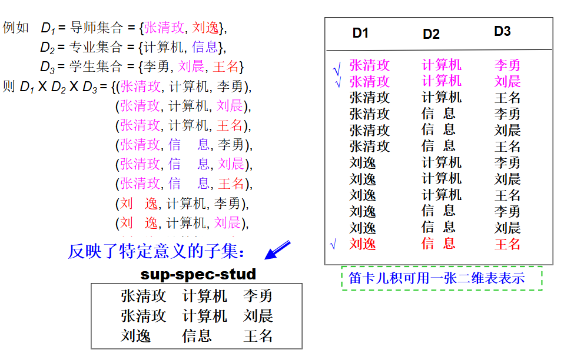

### 属性

属性是关系的列。关系的每个属性都有一个名称。 

每个属性允许的取值集合称为该属性的域。    

（通常）要求属性值是原子的，即不可分割的。（关系理论第一范式 1st NF）  
例如：多值属性和复合属性（如日期和地址）的值就不是原子的。

特殊值 null是每个域的成员。它表示缺失或未知值，用于标识该字段没有存储实际值。  
>null 值不同于零（0）或空字符串（“”）。

### 关系模式和关系实例
关系涉及两个概念：关系模式（relation schema）和关系实例（relation instance）。

关系模式描述了关系的结构，关系实例对应于特定时刻关系中数据的快照。

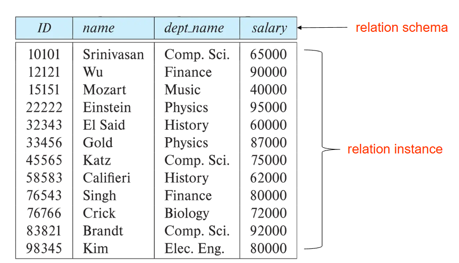

假设 $A_1, A_2, \dots, A_n$ 是属性，则$R = (A_1, A_2, \dots, A_n)$一个关系模式。  
例如，$instructor = ( ID, name, dept\_name, salary )$

$r(R)$是关系模式 $R$ 上的一个关系。  
例如，$instructor(instructor-schema)= instructor( ID, name, dept\_name, salary )$

关系的当前值（即关系实例）由一张表来指定。  
$r$ 中的一个元素$t$是一个元组，由表中的一行表示。$t[name]$表示元组 $t$ 在 $name$ 属性上的取值。

关系有以下几个性质：  
- 元组的顺序是无关紧要的（即，元组可以任意顺序存储）。
- 关系中不允许有重复元组。
- 属性需满足原子性约束。

### 键/码
设 $K \subseteq R$，若对于关系 $r(R)$ 的每个可能实例，$K$ 的值足以唯一标识一个元组，则称 $K$ 为 $R$ 的一个超码。    
例如，在关系instructor 中，$\{ID\}$ 和$\{ID, name\}$ 都是超码。

若 $K$ 是超码，且其任意真子集都不是超码，则称 $K$为候选码。  
例如，在关系instructor中，$\{ID\}$ 是一个候选码，因为它是超码且没有更小的子集是超码。

若 $K$ 是候选码，并且由用户显式指定，则称$K$为主码，主码通常用下划线标出。对于主码来讲，不能取null值。  

### 外键/外码
假设存在关系$r$和$s$：$r(A,B,C),S(B,D)$，属性$A$为关系$r$的主码，属性$B$为关系$s$的外码，。我们可以认为关系$r$中的属性$B$是引用关系$s$的外键，且$r$是参照关系（引用关系），$s$是被参照关系（被引用关系）  
例：学生(学号，姓名，性别，专业号，年龄)是参照关系，专业（专业号，专业名）是被参照关系。则其中属性“专业号”是关系“学生”的外码。  
参照关系中的外码的值必须在被参照关系中实际存在，或为null。  

主码和外码是完整性约束。一个属性既可以是主码，也可以是外码。

### 查询语言
查询语言是用户通过它从数据库请求信息的语言。

纯查询语言：指遵循纯粹性原则的查询语言，即没有副作用，仅依赖于输入数据产生输出。（使用纯查询语言执行的查询不会对数据库的状态产生任何改变，只会基于输入数据生成输出结果。）它包括关系代数、元组关系演算、域关系演算等。纯查询语言构成了人们实际使用的查询语言的基础。

## 基本关系代数操作
基本关系代数操作有六个：选择(Select)$\sigma$、投影(Project)$\pi$、并(Union)$\cup$、差(Difference)$-$、笛卡尔积(Cartesian Product)$\times$、改名(Rename)$\rho$。  
这些运算符以一个或两个关系作为输入，并产生一个新的关系作为输出。输入一元关系的是一元运算符，输入二元关系的是二元运算符。

### 选择(Select)$\sigma$
选择操作会选择满足给定谓词的元组。  
我们用$\sigma_{P}(R)$表示关系$R$中满足谓词$P$的元组，其中$P$被称为选择谓词。  
$\sigma_{P}(R)$可以定义为$\sigma_{P}(R)=\{t|t\in R :P(t)\}$。  

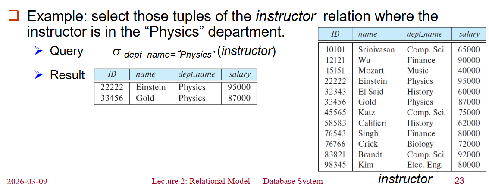

在选择谓词$P$中，可以使用比较运算符$=,\neq, <,>,\leq,\geq$，可以包含两个属性之间的比较。  
单个谓词的一般形式为$<atrribute> op <attribute> or <constant>$，其中$op$是比较运算符，$atrribute$是属性名，$constant$是常数。   
我们可以使用连接词$\land,\lor,\neg$将多个谓词集合组合成一个更大的谓词。

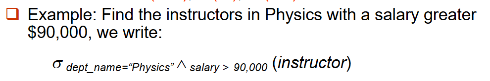

注意：在进行选择操作时，选择条件需要针对同一元组的属性值。

### 投影(Project)$\Pi$
投影操作是一种一元操作，返回其参数关系，但省略某些属性。  
符号表示：$\Pi_{A1, A2, \dots, Ak}(r)$，其中$A_1, \dots, A_k$是属性名称，$r$ 是关系名称。  
结果定义为通过擦除未列出的列而获得的具有$k$ 列的关系。结果中的重复行将被移除，因为关系是集合。
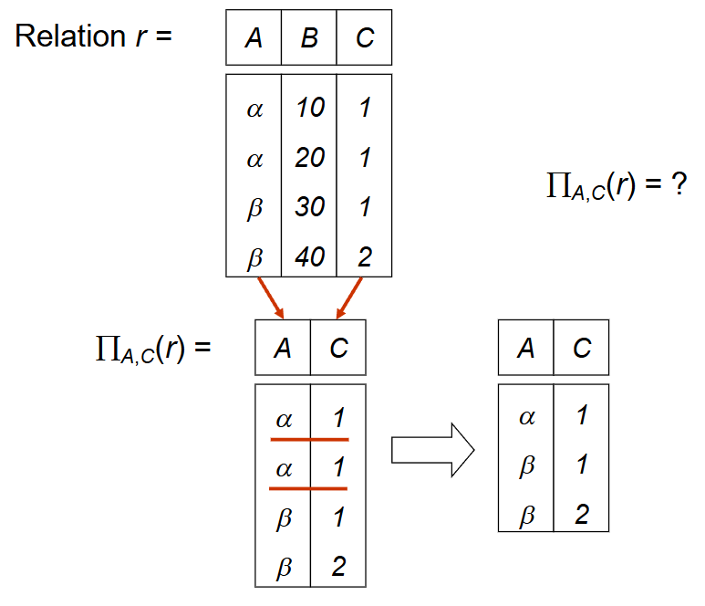

### 并(Union)$\cup$
并操作允许我们合并两个关系。  
符号表示：$r \cup s$ ，定义为：$r \cup s = \{ t | t \in r \text{ 或 } t \in s \}$   
要使 $r \cup s$ 有效，必须满足：
  - $r$ 和 $s$必须具有相同的元数（即相同数量的属性）
  - 属性域必须兼容

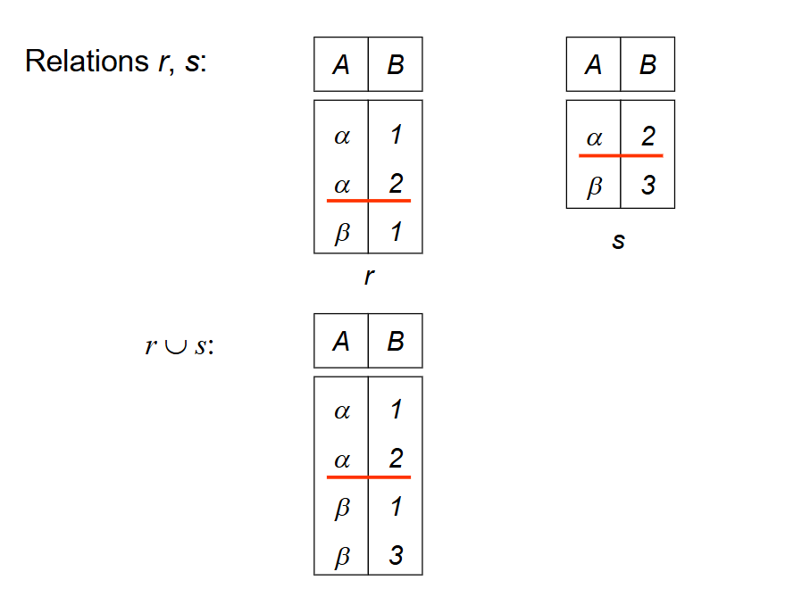

### 差(Difference)$-$
集合差操作允许我们找出在一个关系中但不在另一个关系中的元组。  
符号表示：$r - s$ ，定义为：$r - s = \{ t | t \in r \text{ 且 } t \notin s \}$     
集合差必须在兼容的关系之间进行。
  - $r$ 和 $s$ 必须具有相同的元数。
  - $r$ 和 $s$ 的属性域必须兼容。

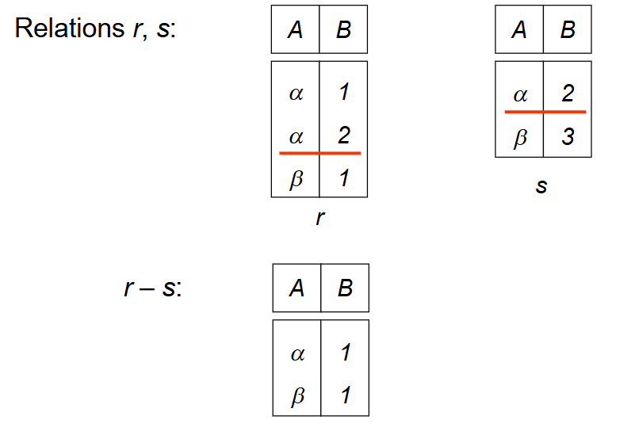

### 笛卡尔积(Cartesian Product)$\times$

笛卡尔积操作（用 $\times$ 表示）允许我们组合任意两个关系中的信息。  
符号表示：$r \times s$，定义为：$r \times s = \{ \{ t \, q \} \mid t \in r \text{ 且 } q \in s \}$

这里我们假设 $r(R)$ 和 $s(S)$ 的属性是不相交的（即 $R \cap S = \emptyset$）。

如果 $r(R)$ 和 $s(S)$ 的属性不是不相交的，则必须对属性进行重命名（可以将属性原本所属的关系名称附加到该属性上）。

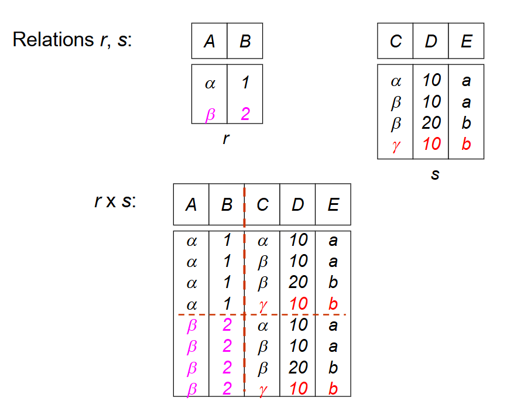

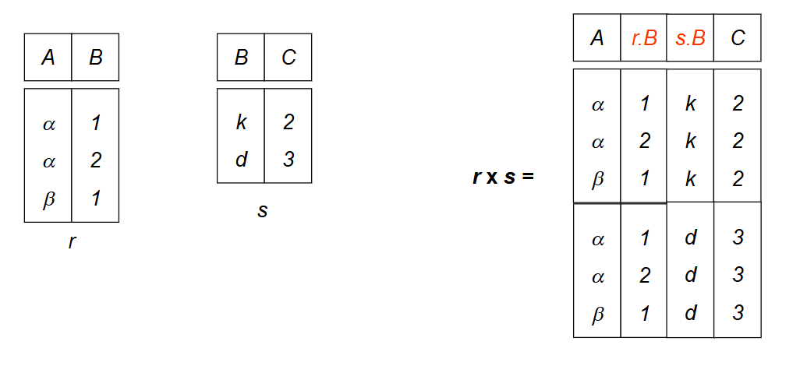

### 改名(Rename)$\rho$
改名操作允许我们命名并因此引用关系代数表达式的结果。（过程性），允许我们通过多个名称引用一个关系。  
表达式：$\rho_X(E)$，返回名称为 $X$ 的表达式 $E$ 

如果关系代数表达式 $E$ 的元数为 $n$ ，则$\rho_{X(A1, A2, ..., An)}(E)$表示对关系$E$ 及其属性都重命名，返回表达式 $E$ 的结果。

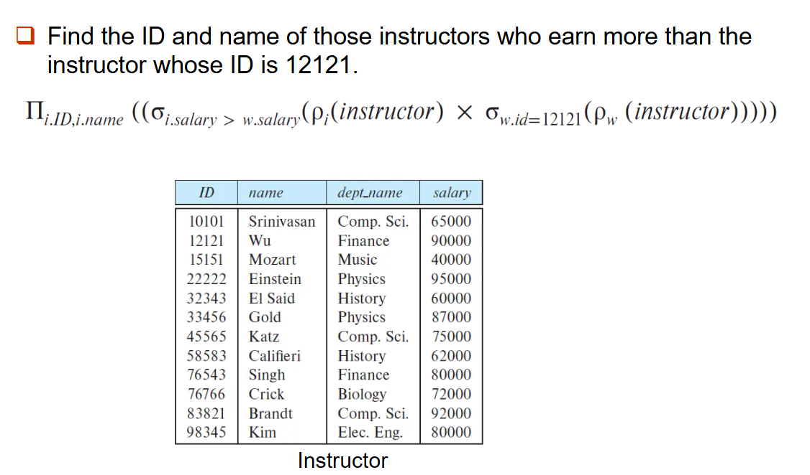

### 关系组合
由于关系代数操作的结果是关系，因此关系代数操作可以组合在一起形成关系代数表达式。

如：查找物理系所有教师的姓名。  
$$
\Pi_{\text{name}}(\sigma_{\text{dept\_name}="Physics"} (\text{instructor}))
$$

这里不是将关系名称作为投影操作的参数，而是给出了一个计算结果为关系的表达式。

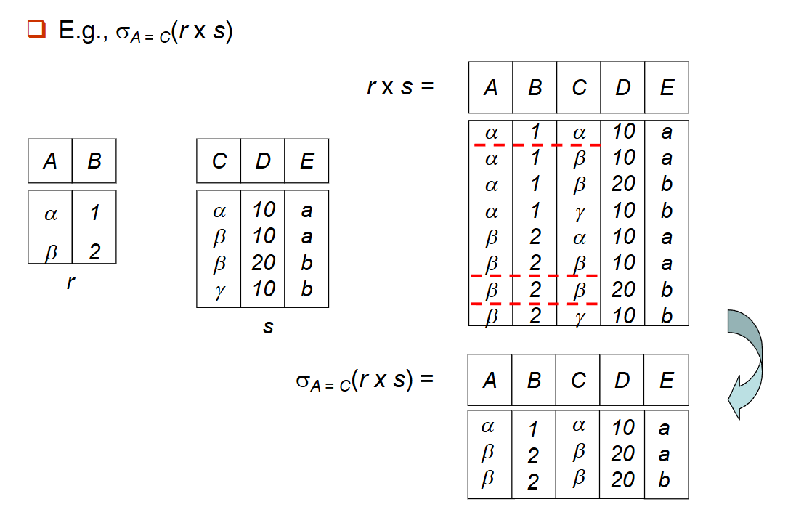

## 附加关系代数操作
### 交(Intersection)$\cap$
集合交操作允许我们找出同时存在于两个输入关系中的元组。  
符号表示：$r \cap s$，定义为：$r \cap s = \{ t | t \in r \text{ 且 } t \in s \}$

前提条件：
  - $r$ 和$s$ 具有相同的元数。
  - $r$ 和 $s$ 的属性是兼容的。

注：$r \cap s = r - (r - s)$

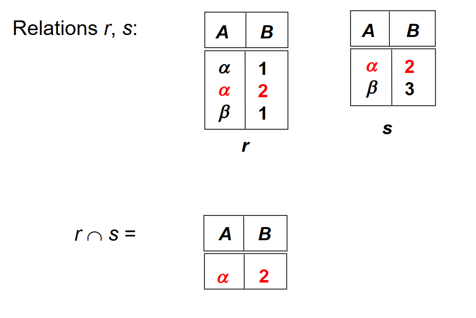

### 连接(Join)$\bowtie_{\theta}$
连接操作允许我们将选择操作和笛卡尔积操作合并为单个操作。   
考虑关系 $r(R)$ 和 $s(S)$，令 $\theta$ 为模式 $R$ 与 $S$ 的并集上属性的一个谓词。连接操作 $r \bowtie_\theta s$ 定义如下：

$$
r \bowtie_\theta s = \sigma_\theta (r \times s)
$$

$\sigma_{\text{instructor.id} = \text{teaches.id}} (\text{instructor} \times \text{teaches})$ 可等价地写为$\text{instructor} \bowtie_{\text{Instructor.id} = \text{teaches.id}} \text{teaches}$。  
这个操作也称为 Theta 连接。

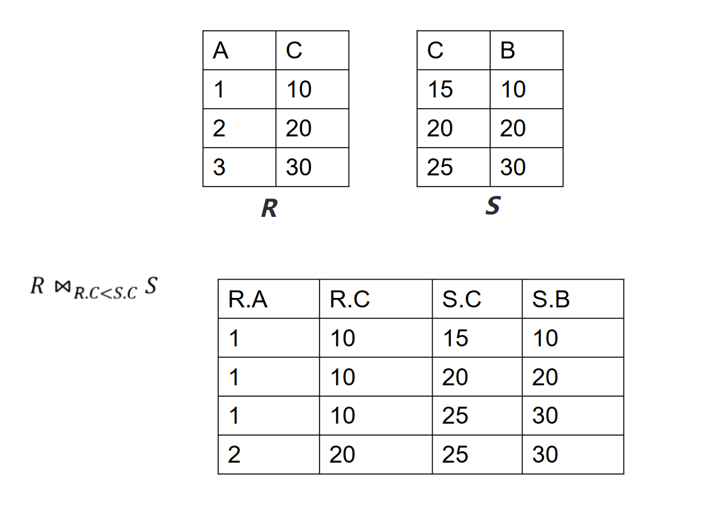

### 自然连接(Natural Join)$\bowtie$

自然连接操作将 $\bowtie_\theta$ 中的谓词 $\theta$ 替换为一个隐含谓词，该谓词要求在左右两个关系模式中都出现的那些属性上进行相等比较。

符号表示：$r \bowtie s$

示例：$R = (A, B, C, D), S = (B, D, E)$，则$r$ 和 $s$ 自然连接的结果模式 $= (A, B, C, D, E)$，$r \bowtie s = \Pi_{r.A, r.B, r.C, r.D, s.E}(\sigma_{r.B = s.B \land r.D = s.D} \, (r \times s))$。

设 $r$和 $s$  分别为模式 $R$ 和 $S$ 上的关系。那么，$r \bowtie s$ 是模式 $R \cup S$ 上的一个关系，其获取方式如下：  
- 考虑来自 $r$ 的每个元组  $t_r$  和来自 $s$ 的每个元组 $t_s$ 组成的一对元组。
- 如果 $t_r$ 和 $t_s$ 在 $R \cap S$ 中的每个属性上都具有相同的值，则将元组 $t$ 添加到结果中，其中
    - $t$ 在 $r$ 的所有属性上与 $t_r$ 具有相同的值。
    - $t$ 在 $s$ 的所有属性上与  $t_s$ 具有相同的值。

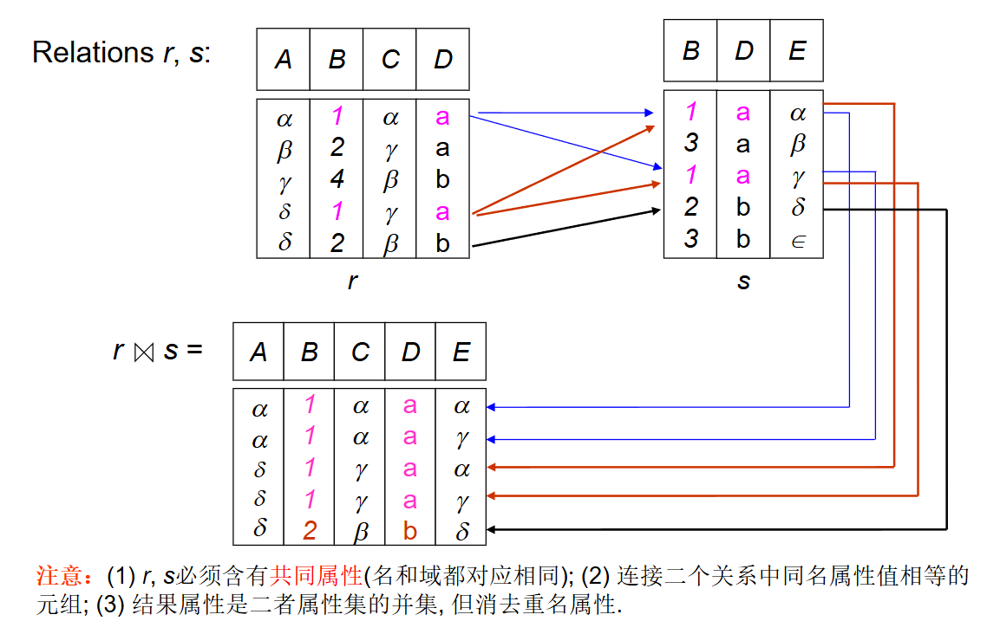

### 除(Division)$\div$

符号表示：$r \div s$

设 $r$ 和 $s$ 分别为模式 $R$ 和 $S$ 上的关系，其中 $R = (A_1, \dots, A_m, B_1, \dots, B_n)$，$S = (B_1, \dots, B_n)$。那么，$r \div s$ 的结果是模式$R - S = (A_1, \dots, A_m)$上的一个关系，并且:

$$
r \div s = \{ t \mid t \in \Pi_{R-S}(r) \land \forall u \in s, (tu \in r) \}
$$

注意，$\Pi_{R-S}(r)$ 包含了 $r \div s$ 的结果，同时，元组 $t$ 与 $s$ 中所有元组的拼接都被 $r$ 覆盖。

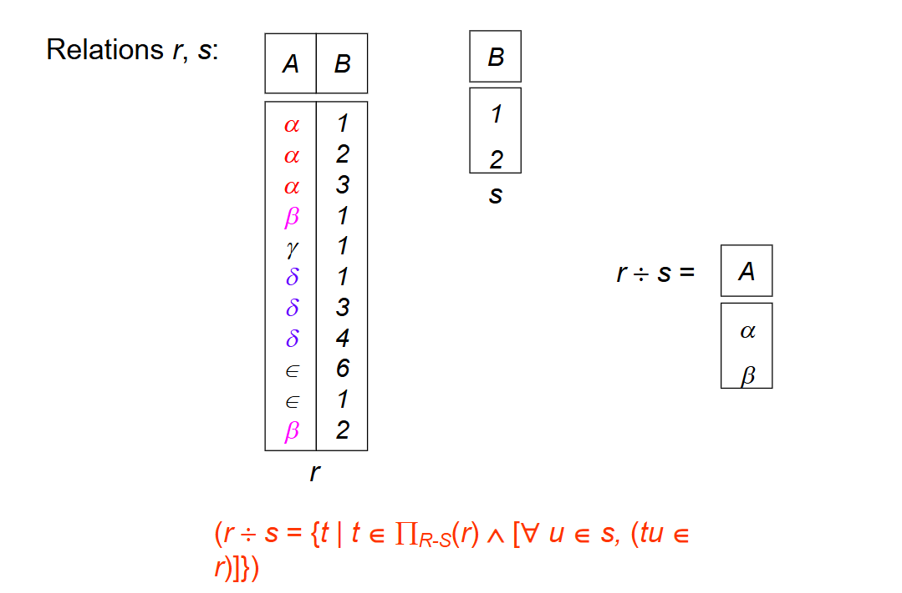

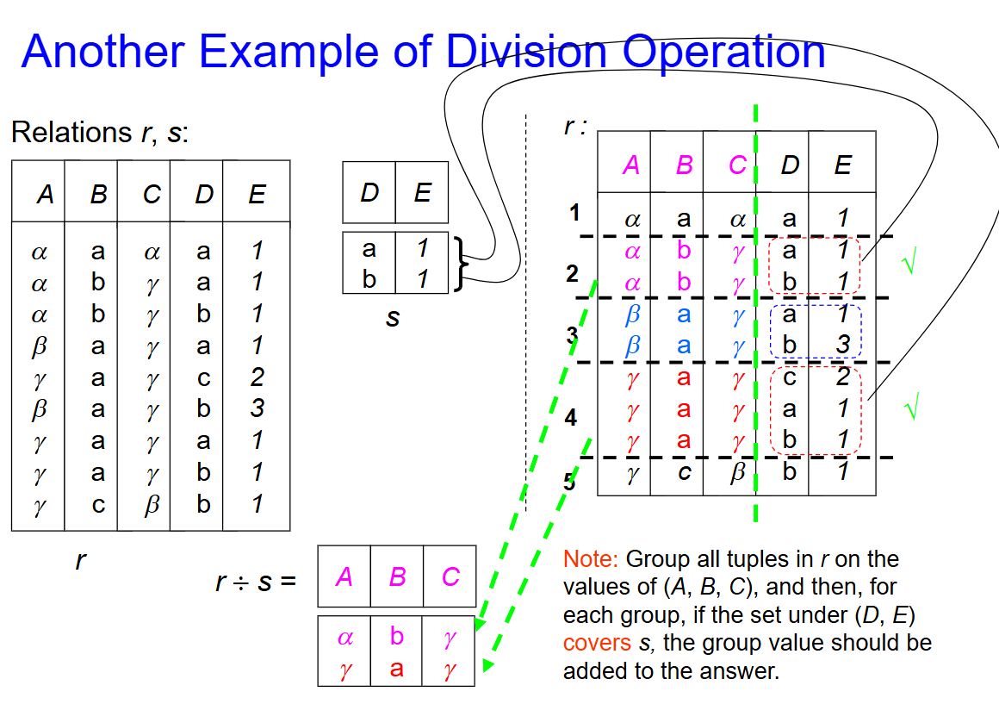

若$S$不是$R$的子集，那我们可以不用考虑不包含在$S$中的属性。

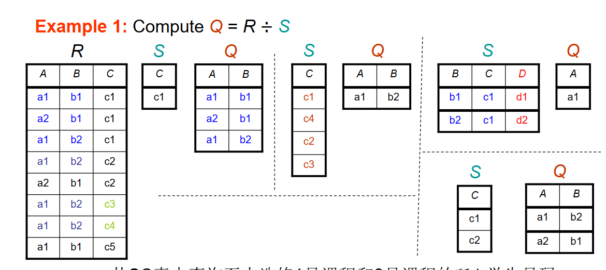

设 $q = r \div s$，则 $q$ 是满足 $q \times s \subseteq r$ 的最大关系。

用基本代数运算也可以定义除法：设 $r(R)$ 和 $s(S)$ 是关系，且 $S \subseteq R$，则:

$$
r \div s = \Pi_{R-S}(r) - \Pi_{R-S}((\Pi_{R-S}(r) \times s) - \Pi_{R-S,S}(r))
$$

### 赋值(Assignment)$\leftarrow$

符号表示：$r \leftarrow P$

赋值操作（$\leftarrow$）提供了一种表达复杂查询的便捷方式。  
赋值必须始终赋给一个临时关系变量，可以在后续表达式中使用该变量。

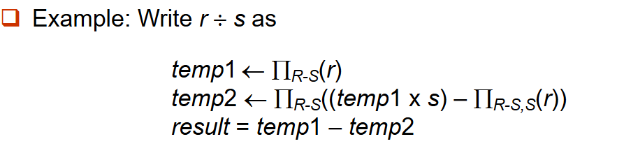

### 运算符优先级

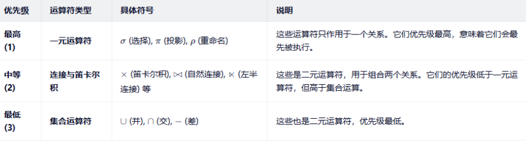

## 扩展关系代数操作
### 广义投影(Generalized Projection)$\Pi^*$

广义投影操作通过在投影列表中允许使用算术运算，扩展了投影操作的功能。

$$
\Pi_{F_1, F_2, ..., F_n}(E)
$$

其中 $E$ 是任意关系代数表达式，而每个 $F_1, F_2, \dots, F_n$ 是由常量及$E$的模式中的属性组成的算术表达式。

例：给定关系credit-info(customer-name, limit, credit-balance)，查询每位客户还能消费的额度：

$$
\Pi_{customer-name, limit - credit-balance}(\text{credit-info}) 
$$

### 聚合函数和聚合操作（Aggregation）

聚合函数接收一个值的集合，并返回单个值作为结果。

- `avg`：平均值
- `min`：最小值
- `max`：最大值
- `sum`：总和
- `count`：计数

关系代数中的聚合操作：

$$
_{G_1, G_2, \dots, G_n} \mathcal{F}_{F_1(A_1), F_2(A_2), \dots, F_m(A_m)}(E)
$$

其中 $E$ 是任意关系代数表达式，$G_1, G_2, \dots, G_n$ 是分组依据的属性列表（可为空），每个 $F_i$ 是一个聚合函数，每个 $A_i$ 是一个属性名。

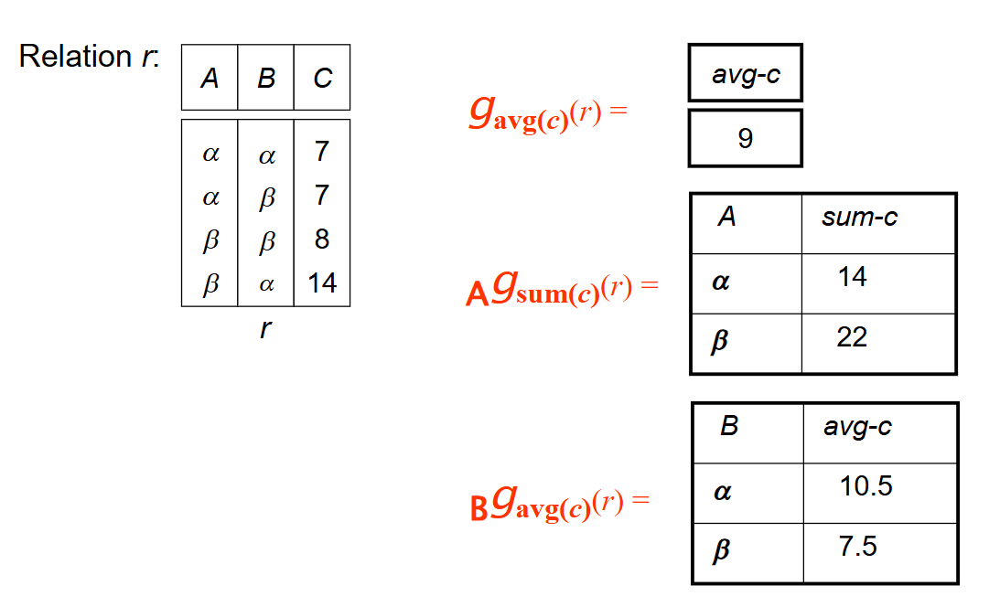

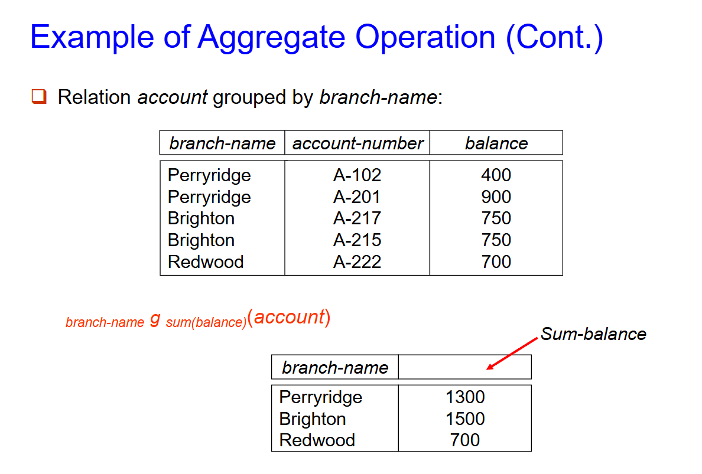

聚合结果没有名称，可以使用重命名操作为其命名。为方便起见，我们也允许在聚合操作中直接进行重命名。

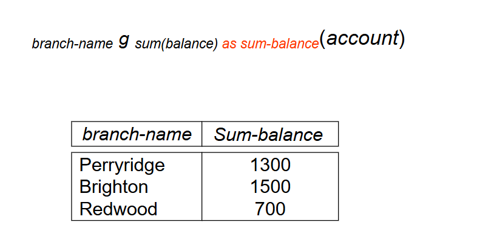

### 其他连接操作

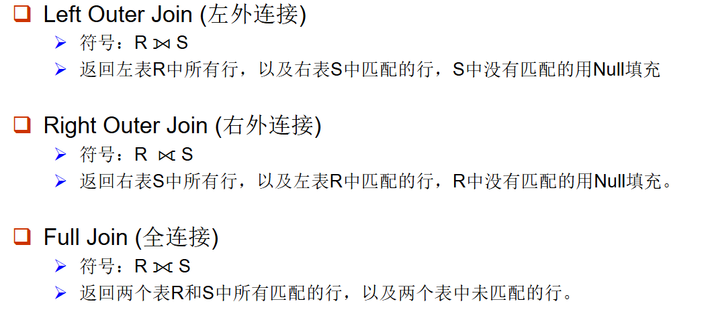

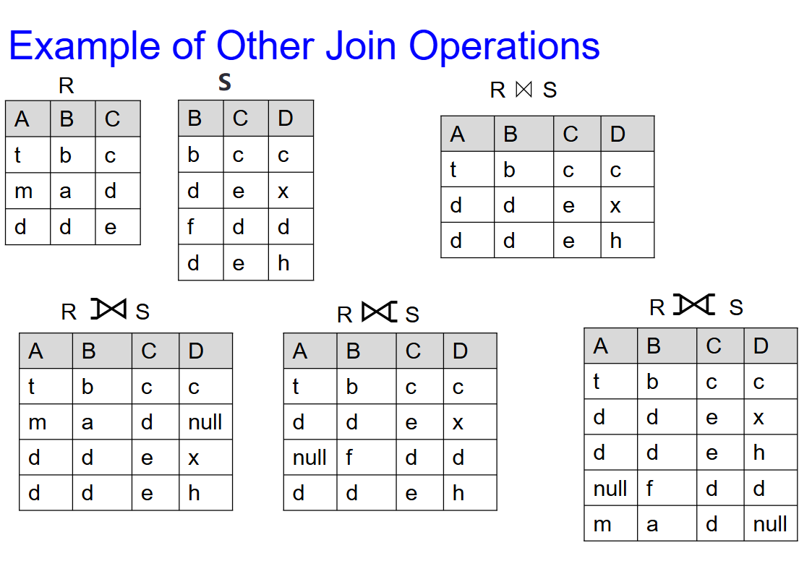

## 数据库的修改
数据库内容可以进行修改，包括插入、删除、更新操作。所有这些操作都可以使用关系代数表达式来表示。
### 删除操作
删除请求的表达方式与查询类似，不同之处在于，它不是将元组展示给用户，而是将选中的元组从数据库中移除。

它只能删除完整的元组；不能删除某些特定属性上的值。

关系代数中的删除操作表示为：  

$$
r \leftarrow r - E
$$

其中  $r$ 是一个关系，$E$ 是一个关系代数查询。

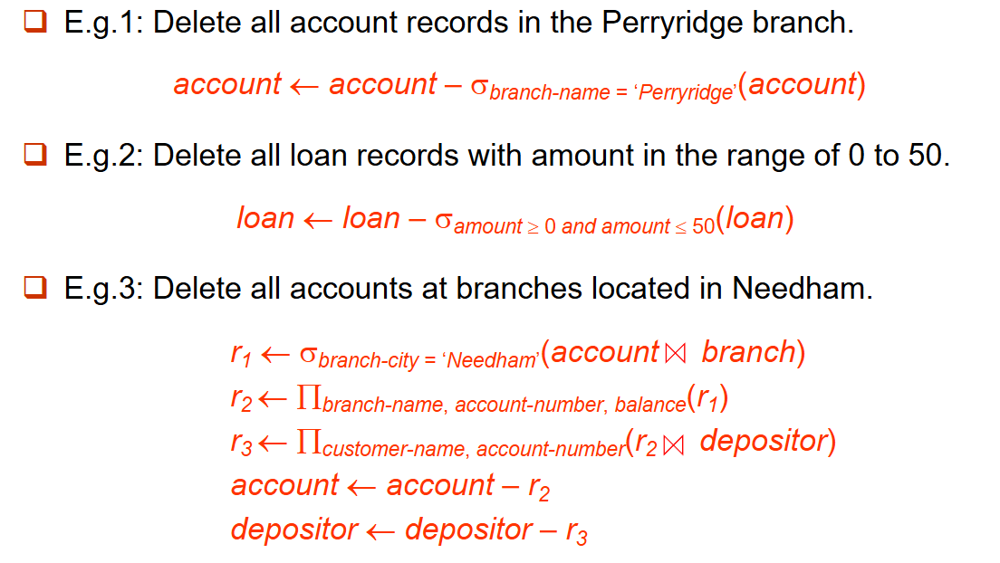

### 插入操作

要向关系中插入数据，我们可以：指定一个要插入的元组。之后，编写一个查询，其结果是一个要插入的元组集合。

在关系代数中，插入操作表示为：

$$
r \leftarrow r \cup E
$$

其中 $r$ 是一个关系，$E$  是一个关系代数表达式。

插入单个元组可以通过让 $E$ 成为一个只包含一个元组的常量关系来实现。

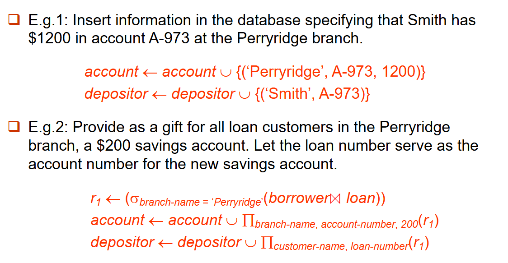

### 更新操作
一种在不改变元组中所有值的情况下，修改元组中某个值的机制。

使用广义投影操作符来完成此任务：

$$
r \leftarrow \Pi_{F_1, F_2, \dots, F_l}(r) 
$$

其中每个 $F_i$ 要么是 $r$ 的第 $i$ 个属性（如果该属性不被更新），要么，如果要更新该属性，则 $F_i$ 是一个只涉及常量与 $r$ 的属性的表达式，用于给出该属性的新值。

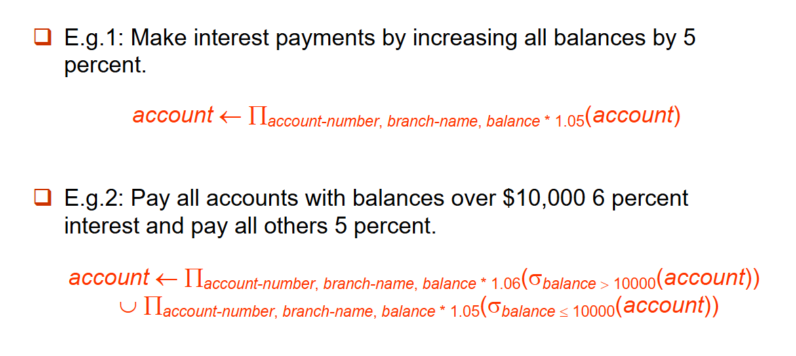