# SQL 语言基础

## 数据定义语言（Data Definition Language，DDL）

SQL 数据定义语言（DDL）允许指定关于关系的信息

DDL 的主要功能包括：

- 定义每个关系的模式
- 定义与每个属性相关联的值的域
- 定义完整性约束
- 定义每个关系在磁盘上的物理存储结构
- 定义为每个关系维护的索引
- 定义关系上的视图

### 常见的 SQL 数据类型

- `char(n)`：固定长度字符串，用户指定长度。
- `varchar(n)`：可变长度字符串，用户指定最大长度 $n$ 。
- `int`：整数（依赖于机器的整数集的有限子集）。
- `smallint`：小整数（依赖于机器的整数域类型的子集）。
- `numeric(p, d)`：定点数，用户指定总精度为 $p$ 位数字，其中小数点右边有 $d$ 位数字。
- `real`、`double precision`：浮点数和双精度浮点数，精度依赖于机器。
- `float(n)`：浮点数，用户指定精度至少为 $n$ 位数字。
- 所有域类型都允许空值。将属性声明为 `not null` 则禁止该属性取空值。

- `date`：日期，包含（4位数字）年、月和日。
    - 例如：date '2007-2-27'
- `time`：一天中的时间，包含小时、分钟和秒。
    - 例如：time '11:18:16'、time '11:18:16.28'
- `timestamp`：日期加时间。
    - 例如：timestamp '2011-3-17 11:18:16.28' 

### 关系定义
SQL 关系是通过 `create table` 命令定义的：

```sql
CREATE TABLE r (A₁D₁, A₂D₂, ..., AₙDₙ,
    (完整性约束₁),
    ...,
    (完整性约束ₖ));
```

-  $r$  是关系的名称
- 每个 $A_i$ 是关系 $r$ 的模式中的一个属性名
- $D_i$ 是属性 $A_i$的域中值的数据类型

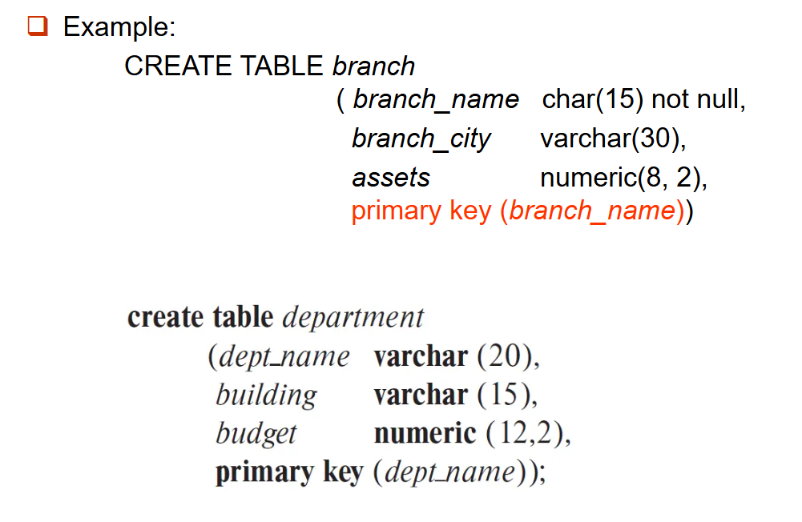

关系定义时的完整性约束包括：

- `not null`：属性不能为空值。
- `primary key`（$A_1, ..., A_n$）:定义主键。
- `check (P)`：定义属性值的约束，其中$P$ 是一个谓词
- 从 SQL_92 开始，属性上的主键声明自动确保非空，在 SQL_89 中需要显式声明

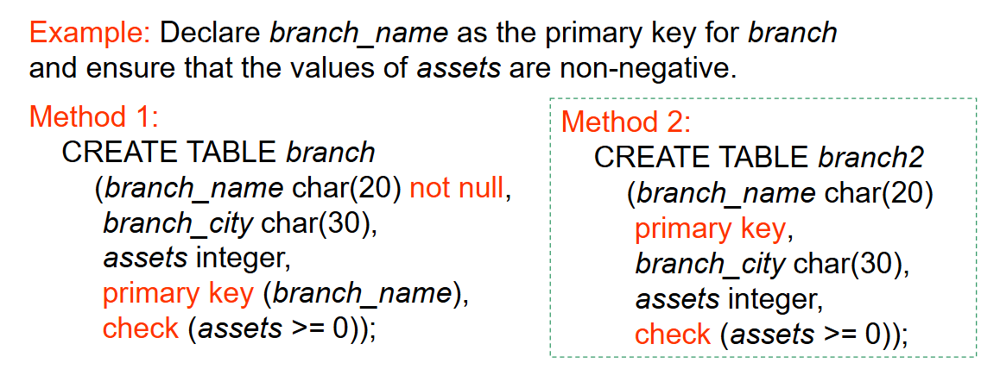

### 关系的删除和修改

`drop table` 命令会从数据库中删除有关被删除关系的所有信息。

格式：`DROP TABLE 关系名;`

>与`delete from r`有差别，`drop table`命令会删除整个关系，而`delete from r`仅删除表格中的数据。

`alter table` 命令也可以用于删除关系的属性  

格式为：`ALTER TABLE r DROP A`。其中 $A$ 是关系 $r$ 中的一个属性名

请注意，许多数据库不支持删除属性。

`alter table` 命令也可以用于修改关系的属性  

例如：`ALTER TABLE branch MODIFY (branch_name char(30), assets not null)`

### 索引的创建和删除

创建索引：`CREATE INDEX <索引名> ON <表名> (<属性列表>);`

```sql
create index b_index on branch (branch_name);
create index cust_strt_city_index on customer (customer_city, customer_street);
```

指定一个候选键：`CREATE UNIQUE INDEX <索引名> ON <表名> (<属性列表>)`

```sql
create unique index uni_acnt_index on account (account_number);
```

删除索引：`DROP INDEX <索引名>;`

```sql
DROP INDEX b_index;
```

## 基本结构

一个典型的 SQL 查询具有如下形式：

```sql
  SELECT A1, A2,..., An 
  FROM r_1, r_2, ..., r_m
  WHERE P
```
  其中 $A_i$ 是属性，$r_i$ 是关系，$P$ 是谓词。

该查询等价于下面的关系代数表达式

$$
\Pi_{A_1, A_2, \dots, A_n} (\sigma_P(r_1 \times r_2 \times \dots \times r_m))
$$

SQL 查询的结果是一个关系。

### SELECT 子句

`select` 子句列出查询结果中想要的属性。对应于关系代数中的投影操作。

例如：查找 `loan` 关系中所有分支的名称。

```sql
SELECT branch_name
FROM loan
```

对应关系代数：$\Pi_{branch\_name}(loan)$

>注意：SQL 不允许在名称中使用`-`字符，因此在实际实现中使用 `branch_name` 而不是 `branch-name`。
  
>注意：SQL 名称不区分大小写，即可以使用大写或小写字母。（`SELECT age FROM student`和`SELECT AGE FROM STUDENT`等价）

SQL 允许关系和查询结果中存在重复值。若要强制消除重复，在 `select` 后插入关键字 `distinct`即可。

例如：查找 `loan` 关系中的所有分支机构名称，并去除重复值

```sql
SELECT DISTINCT branch_name
FROM loan
```

与之相反的关键字`all`则允许重复，例如：

```sql
SELECT ALL branch_name
FROM loan
```

默认情况下，允许重复，即默认使用 `all`。

select 子句中的星号 * 表示所有属性。

```sql
SELECT * FROM loan
```

select 子句可以包含涉及运算符 +、-、* 和 / 的算术表达式，这些表达式可以对常量或元组的属性进行操作。

```sql
SELECT loan_number, branch_name, amount * 100 FROM loan
```

一个属性可以是一个字面量，不带 `from`子句。如： `select '437'`，结果是一个表，包含一列和一行，值为“437”。  
可以使用以下方式给该列命名：`select '437' as FOO`

也可以带 `from`子句。如：`select 'A' from instructor`，结果是一个表，包含一列和 $N$ 行（即 instructor 表中的元组数），每行的值为$A$。

### WHERE 子句

WHERE 子句指定结果必须满足的条件。

例如：查找在 Perryridge 支行发放的、贷款金额大于 1200 美元的所有贷款编号。

$$
\Pi_{loan\_number}(\sigma_{branch\_name = 'Perryridge'} \land amount > 1200)(loan) 
$$

对应 SQL 查询：

```sql
SELECT loan_number
FROM loan
WHERE branch_name = 'Perryridge' AND amount > 1200
```

在 WHERE 子句中，比较结果可以使用逻辑连接词 AND、OR 和 NOT 进行组合，也可以使用 BETWEEN 比较运算符来指定一个范围。

例如：查找贷款金额在 90,000 美元到 100,000 美元之间（即 ≥ 90,000 美元且 ≤ 100,000 美元）的贷款编号。

```sql
SELECT loan_number
FROM loan
WHERE amount BETWEEN 90000 AND 100000
```


行构造器：$(V_1, V_2, \dots, V_n)$ 表示一个包含值$ V_1, V_2, \dots, V_n$ 的 $n$ 元元组。

```sql
select name, course_id
from instructor, teaches
where instructor.ID = teaches.ID and dept_name = 'Biology';
```

```sql
select name, course_id
from instructor, teaches
where (instructor.ID, dept_name) = (teaches.ID, 'Biology');
```

某些 SQL 实现（例如 Oracle）不支持这种语法。

### FROM 子句

FROM 子句列出查询中涉及的关系。  
如果在 FROM 子句中指定了多个关系，则对应于关系代数中的笛卡尔积操作。

例如查找笛卡尔积$borrower × loan$

```sql
SELECT *
FROM borrower, loan
```

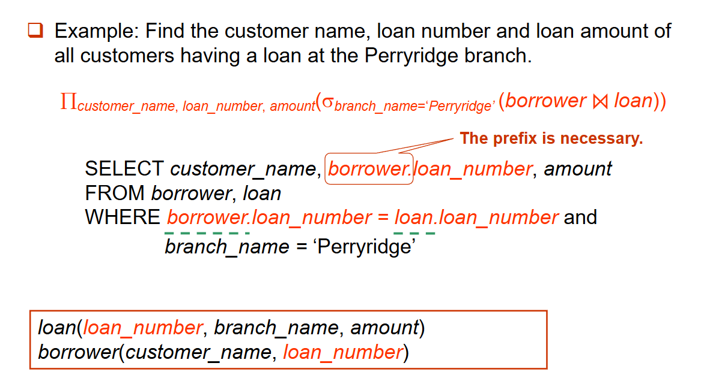

###  重命名操作

元组变量在 FROM 子句中通过使用 `as`子句来定义。（相关名称、表别名、相关变量）

示例：找出银行所有客户的客户姓名、他们的贷款编号和贷款金额。

```sql
SELECT customer_name, T.loan_number, S.amount
FROM borrower as T, loan as S
WHERE T.loan_number = S.loan_number
```

### 字符串操作
SQL 通过将字符串括在单引号中来指定字符串。

在SQL标准中字符串是大小写敏感的，但是在实际系统中不一定。

SQL 包含一个用于字符串比较的字符串匹配操作符。like 操作符的使用与两个特殊字符（通配符）有关：  

- `%` 匹配任意子串（类似于文件系统中的 `*`）
- `_` 匹配任意单个字符（类似于文件系统中的 `?`）

这两个通配符的使用可以实现模糊匹配（放在 WHERE 子句中，并且必须与 LIKE 操作结合使用）。

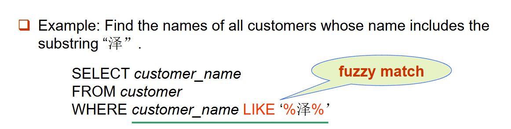

对于包含特殊字符（即 `%` 和 `_`）的字符串，SQL 允许指定一个转义字符。

转义字符通过 `escape` 关键字在 like 比较中定义。

匹配名字“Main%”：`LIKE 'Main\%' escape '\'`  
匹配名字“ab\cd%”：`LIKE 'ab\\cd\%' escape '\'`  

SQL 允许我们使用 `not like` 比较运算符来搜索不匹配的内容，而非匹配的内容。

SQL支持字符串之间连接（使用`||`），例如： 

```sql
SELECT '客户名=' || customer_name
FROM customer
WHERE …
```

输出为：
```
客户名=Adams
客户名=Brooks
客户名=Curry
```

SQL还支持许多其他的字符串操作，包括：

- 使用函数 lower( ) 和 upper( ) 进行大小写转换（以及反向转换）
- 获取字符串长度
- 提取子串
- 使用 trim( ) 去除字符串末尾的空格


### 元组排序
`order by` 子句可以对查询结果进行排序。

我们可以指定 `desc` 表示降序，或 `asc` 表示升序，对于每个属性，升序是默认值。

排序可以在多个属性上进行  
例如：

```sql
    SELECT * FROM customer
    ORDER BY customer_city, customer_street DESC, customer_name
```

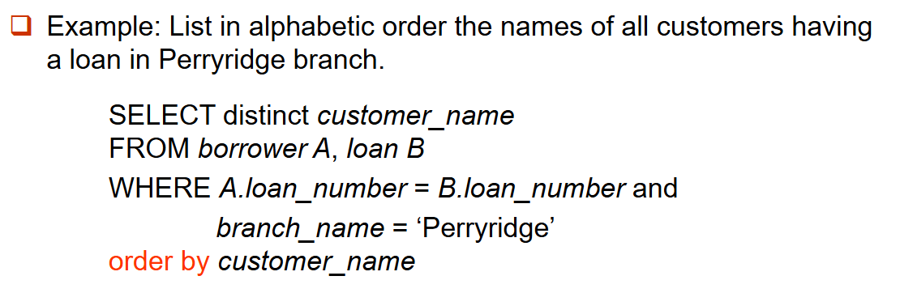

### 重复


在传统关系理论中，不存在重复，但在实践中我们需要重复。

某些关系代数运算符的多重集版本，包括 $\sigma_\theta$、$\Pi_A$、$\times$，它们支持多重集。

给定多重集关系 $r_1$ 和 $r_2$:  

- $\sigma_\theta(r_1)$：如果元组 $t_1$ 在 $r_1$中有 $c_1$ 个副本，并且 $t_1$ 满足选择条件 $\sigma_\theta$，那么在 $\sigma_\theta(r_1)$ 中就有 $c_1$ 个 $t_1$ 的副本。

- $\Pi_A(r_1)$：对于 $r_1$ 中元组 $t_1$ 的每一个副本，在 $\Pi_A(r_1)$ 中就有一个元组 $\Pi_A(t_1)$ 的副本，其中 $\Pi_A(t_1)$ 表示对单个元组 $t_1$ 的投影。

- $r_1 \times r_2$：如果元组 $t_1$在 $r_1$ 中有 $c_1$ 个副本，元组 $t_2$ 在 $r_2$中有 $c_2$ 个副本，那么在$r_1 \times r_2$中就有$c_1 \times c_2$个元组 $t_1.t_2$ 的副本。

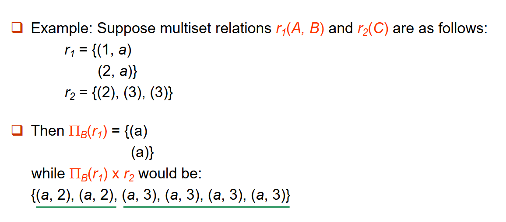

SQL 中的 `select` 语句也支持多重集运算符，包括  $\sigma_{\theta} 、 \Pi_{A} 、 \times$。禁止重复就在SELECT 子句中使用 `distinct` 关键字。

## 集合操作

在 SQL 中，使用集合操作包括 UNION、INTERSECT 和 EXCEPT，它们对关系进行操作，并对应于关系代数运算 $\cup$、$\cap$ 和 $-$。

UNION、INTERSECT 和 EXCEPT每个操作都会自动消除重复。

若要保留所有重复，我们可以使用相应的多重集版本，包括 UNION ALL、INTERSECT ALL 和 EXCEPT ALL。

假设一个元组在 $r$ 中出现 $m$ 次，在 $s$ 中出现 $n$ 次，那么它在以下操作结果中出现的次数为：
  - 在 $r \, \text{UNION ALL} \, s$ 中出现 $m + n$ 次
  - 在 $r \, \text{INTERSECT ALL} \, s$ 中出现 $\min(m, n)$ 次
  - 在 $r \, \text{EXCEPT ALL} \, s$ 中出现 $\max(0, m - n)$ 次

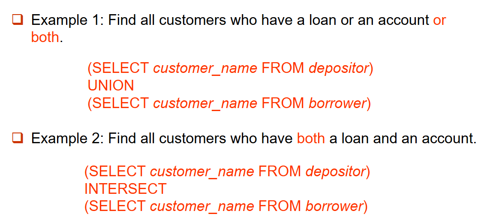

注意：  

- Oracle 使用 UNION、UNION ALL、INTERSECT 和 MINUS（代替EXCEPT）；但不支持 INTERSECT ALL 和 MINUS ALL。
- SQL Server 2000 仅支持 UNION 和 UNION ALL。

## 聚合函数
聚合函数对关系列的多重集值进行操作，并返回一个值。

常见的聚合函数包括：

- `avg(col)`：平均值
- `min(col)`：最小值
- `max(col)`：最大值
- `sum(col)`：总和
 - `count(col)`：计数


示例：查找 Perryridge 支行的平均账户余额。

$$
g_{\text{avg(balance)}}(\sigma_{\text{branch\_name}=\text{'Perryridge'}}(\text{account}))
$$

```sql
SELECT branch_name,avg(balance) avg_bal
FROM account
WHERE branch_name = 'Perryridge'
```

上述编写方法大概率会报错，当select 子句中出现聚合函数之外的属性时，这个属性必须出现在 group by 列表中。

```sql
SELECT branch_name, avg(balance) avg_bal
FROM account
WHERE branch_name = 'Perryridge'
GROUP BY branch_name
```

如果不用 group by 子句，我们可以写成以下形式：

```sql
SELECT avg(balance) avg_bal
FROM account
WHERE branch_name = 'Perryridge'
```

group by 子句可以对分组进行聚合，而不仅仅是对所有元组进行聚合。

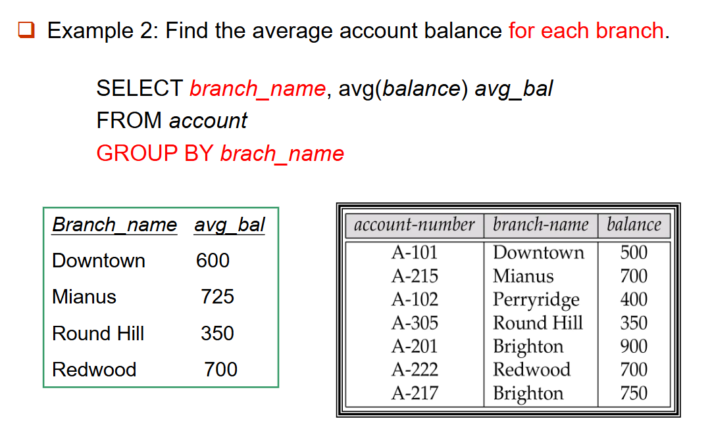

聚合函数`count()`中同样能用`distinct`关键字消除重复计算。`count(*)`表示计算所有元组的个数，此时`distinct`关键字无效。

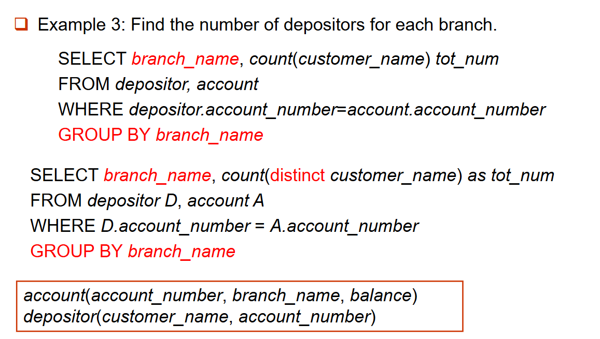

`HAVING`子句用于过滤聚合函数的结果。`HAVING`子句的语法与`WHERE`子句类似，但`WHERE`子句作用于单条元组，而`HAVING`子句作用于多个元组形成的group，常与`GROUP BY`子句一起使用。两者不能混用！

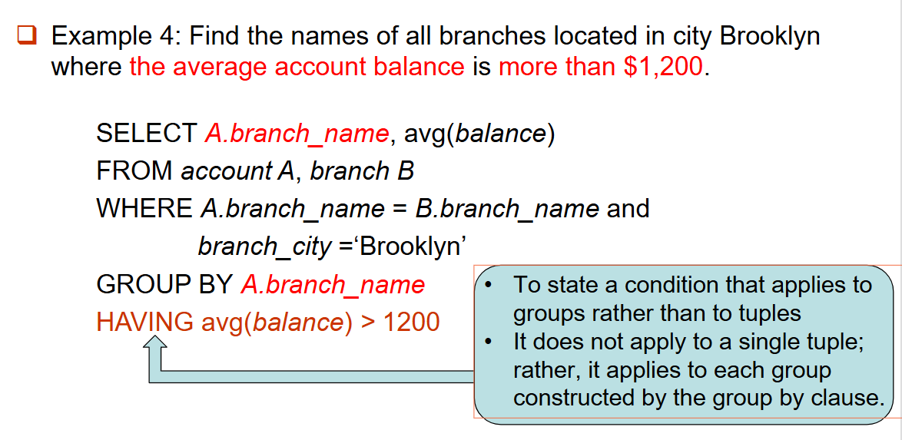


## SELECT 语句及其子句总结
SELECT 语句的形式如下：
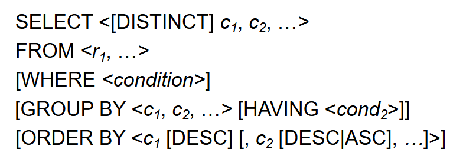

SELECT 语句的执行顺序是：From → where → group (aggregate) → having → select → distinct → order by 


## 空值（NULL）
`Null` 是SQL中使用的一种特殊标记，其含义是“缺失的信息”或“不适用的信息”，即值未知或值不存在。 

任何涉及 null 的算术表达式的结果均为 null。  
例如：`5 + null` 返回 null。

与 null 进行的任何比较均返回 `unknown`（除 `true` 和 `false` 之外的第三种逻辑值 ）  
 例如：`5 < null`、`null <> null` 或 `null = null`

以下是三值逻辑：

- OR：
    - `unknown or true = true`
    - `unknown or false = unknown`
    - `unknown or unknown = unknown`
- AND：
    - `unknown and true = unknown`
    - `unknown and false = false`
    - `unknown and unknown = unknown`
- NOT：
    - `not true = false`
    - `not false = true`
    - `not unknown = unknown`

若 `where` 子句谓词的结果为 `unknown`，则将其视为 `false`。

谓词 `is null` 和 `is not null` 可用于检查空值。（不能使用`= null`。

```sql
SELECT loan_number
FROM loan
WHERE amount is null
```
若谓词 $P$的结果为 `unknown`，则 `P is unknown`的值为 `true`。

除 `count(*)` 之外的所有聚合操作都会忽略被聚合属性上取空值的元组。如：计算所有贷款金额的总和  

```sql
SELECT sum(amount) FROM loan
```

上述语句会忽略 `amount` 为空的记录，若不存在非空的 `amount` 值，即 loan 表中所有 `amount` 值均为空，则结果返回空值。


## 嵌套查询
SQL 提供了一种子查询嵌套机制，子查询即是嵌套在另一个查询内部的select_from_where表达式。

嵌套可以在以下 SQL 查询的各个部分中实现：
```sql
  select A1, A2, ..., An
  from r1, r2, ..., rm
  where P
```

- From 子句：$r_i$ 可被任意合法的子查询替换。
- Where 子句：$P$ 可被如下形式的表达式替换：$B <\text{操作符}> \text{(子查询)}$。其中 $B$ 是一个属性，$<\text{操作符}>$ 将在后续定义。
- Select 子句：$A_i$可被一个生成单个值的子查询替换。


子查询的一个常见用途是通过在 where 子句中嵌套子查询来执行集合成员资格测试、进行集合比较以及确定集合基数。

### 集合成员资格测试

`in`连接词用于测试集合成员资格，其中的集合是由 select 子句产生的一组值。`not in` 连接词用于测试是否不属于集合。  
示例：查找在银行同时拥有账户和贷款的所有客户。
```sql
SELECT distinct customer_name
FROM borrower
WHERE customer_name in (SELECT customer_name FROM depositor)
```

### 集合比较

集合之间比较的运算符有

  - some
    - `<some, <= some, >= some, = some, 和 <> some`
    - 例如：`> some` 表示大于至少一个

- all
    - `<all, <= all, >= all, = all, 和 <> all`
    - 例如：`> all` 表示大于所有

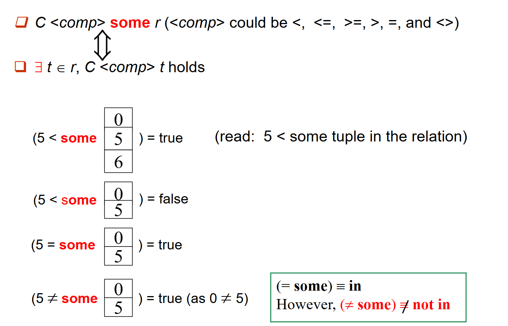

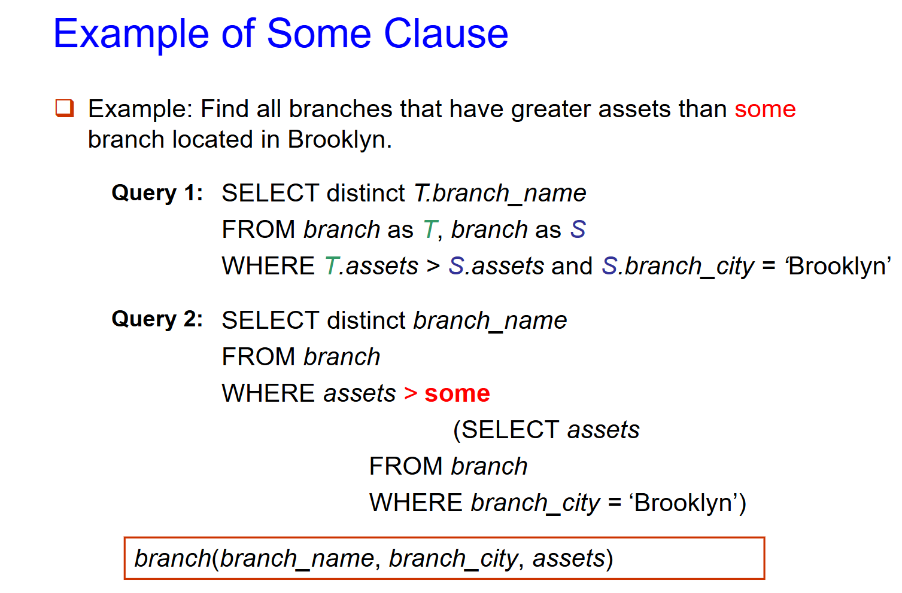

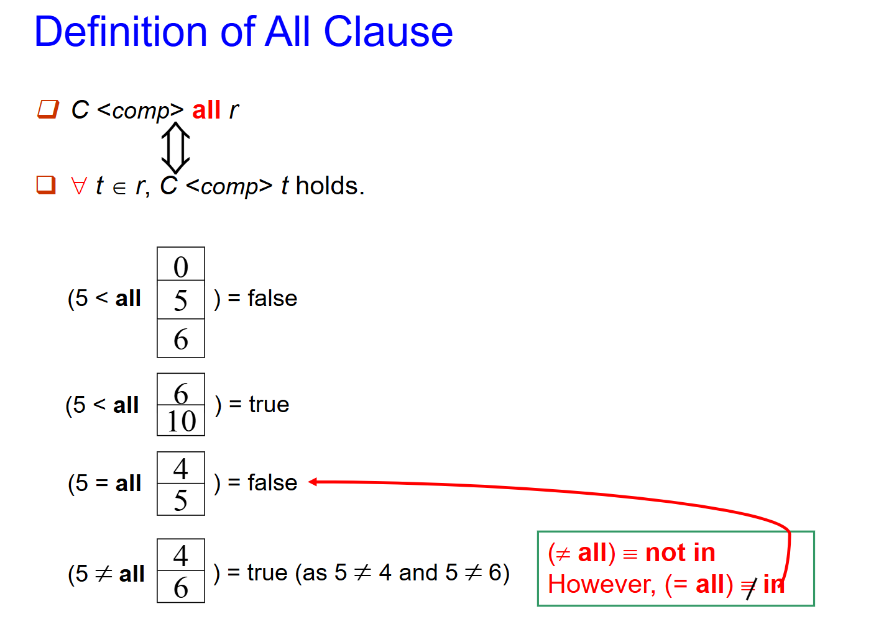

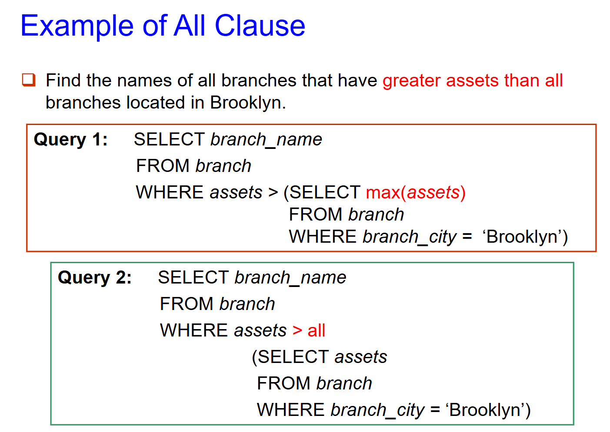

### 集合基数确定

SQL 包含一项用于测试子查询结果中是否存在元组的功能：exists, not exists

- `exists r`: (1) `r ≠ ∅: TRUE` (2) `r = ∅: FALSE`
- `not exists r`: (1) `r ≠ ∅: FALSE` (2) `r = ∅: TRUE`


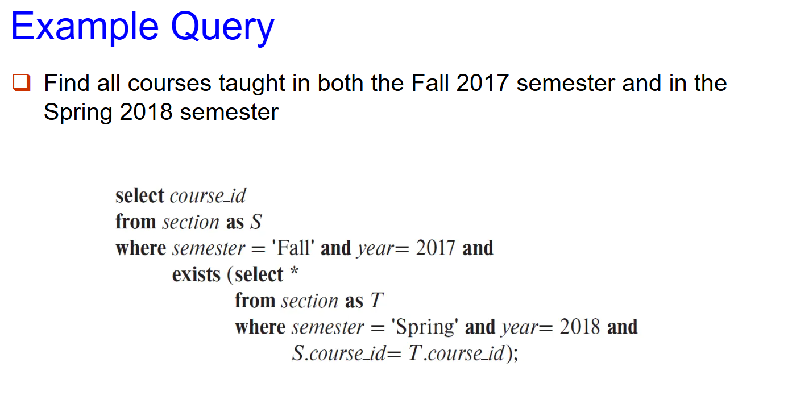

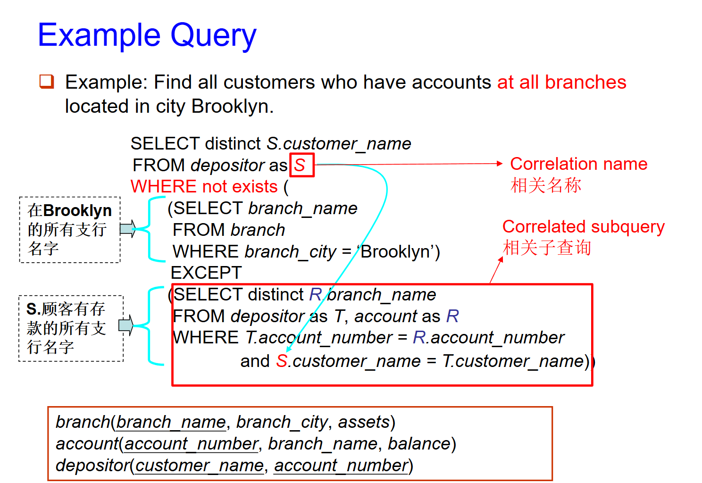

unique和not unique构造用于测试子查询的结果中是否存在重复元组。
- `unique r`: (1) `r 中没有重复元组: TRUE` (2) `r 中有重复元组: FALSE`
- `not unique r`: (1) `r 中没有重复元组: FALSE` (2) `r 中有重复元组: TRUE`

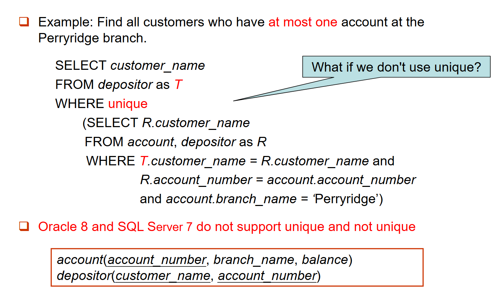

### 子查询的限制

- 在 `from` 子句中嵌套的子查询**不能**使用同一 `from` 子句中其他关系的关联变量。

- 自 SQL 2003 起，SQL 标准允许在 `from` 子句中使用带有 **`lateral`** 关键字的子查询，以访问同一 `from` 子句中位于其之前的表或子查询的属性。

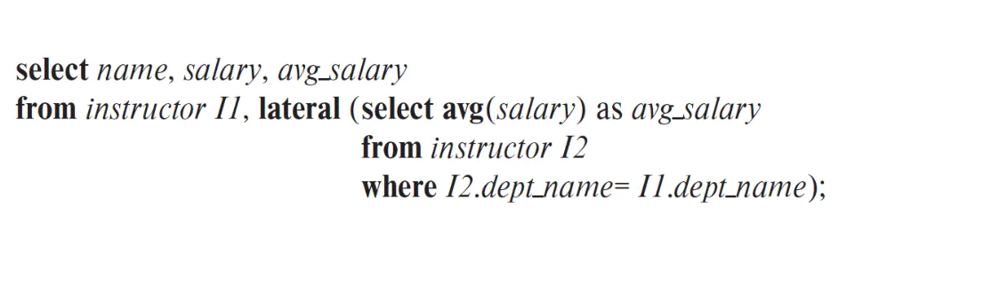

### WITH 子句

with子句提供了一种定义临时关系的方式，该临时关系的定义仅对其所在的查询可用。

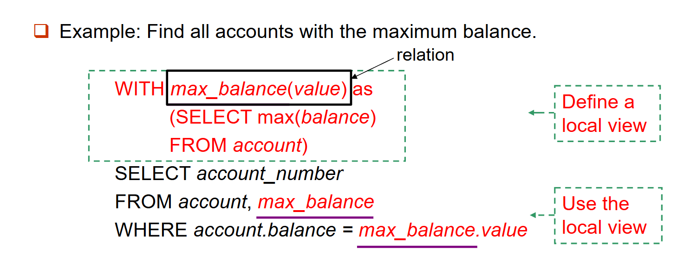

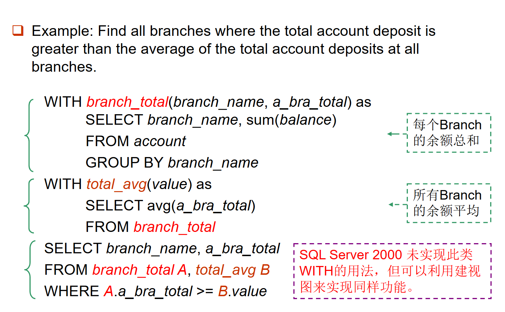

### 标量子查询

子查询仅返回包含单个属性的一个元组；这类子查询称为标量子查询。

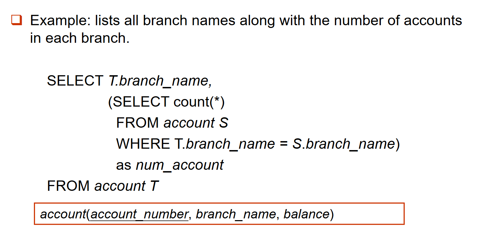

## 数据库修改

### 删除数据
```sql
DELETE FROM table_name
WHERE condition;
```

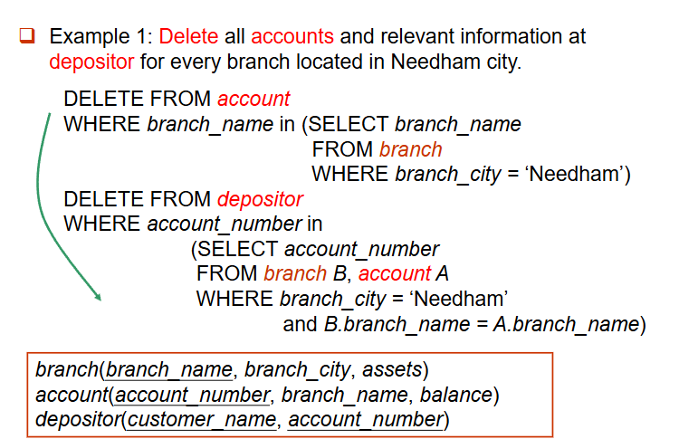

要区分delete和drop语句。delete语句的作用是删除表格中的元组，而drop可以删除整个表格本身。

注意：删除命令仅作用于单个关系，如果我们想从多个关系中删除元组，必须为每个关系使用一个删除命令。

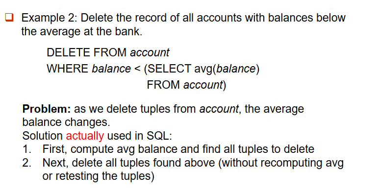

### 插入数据
```sql
INSERT INTO table_name (column1, column2,...)
VALUES (value1, value2, ...);

INSERT INTO table_name(column1, column2,...)
SELECT expression1, expression2...
FROM ...
```

如果插入的元组仅对模式中的部分属性赋值，则其余属性将被设置为 null 值。

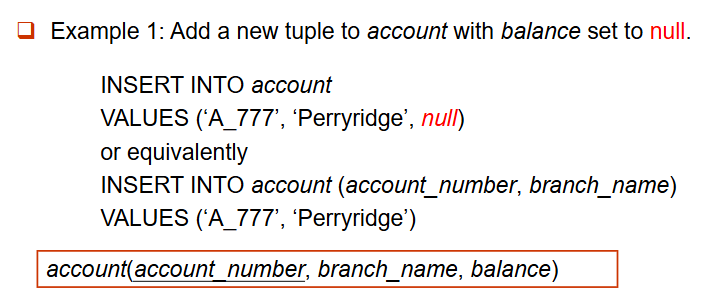

我们可以根据查询结果插入元组。

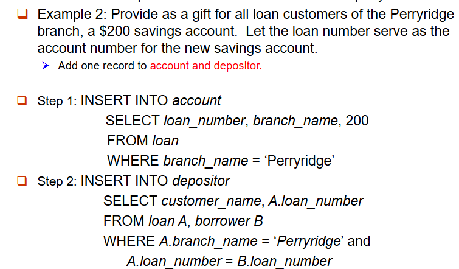

由于“select from where” 语句在将其任何结果插入到关系之前会被完整求值，所以可以支持一些看似矛盾的操作。

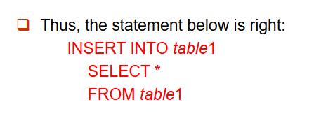

### 更新数据
```sql
UPDATE table_name
SET column1 = value1, column2 = value2, ...
WHERE condition;
```

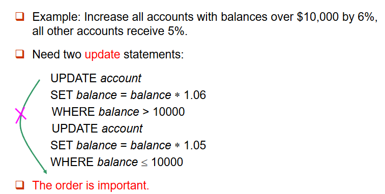

在多种情况的更新中，我们可以用case语句来实现更复杂的更新。

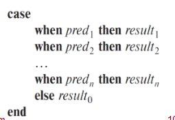

则上例可以被修改为：

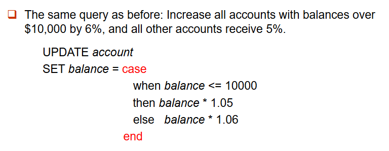