# 进阶SQL
## 连接关系
在SQL中，我们也可以对多个表进行连接。

在from子句中，我们可以对多个表进行自然连接操作。
```sql
select A1, A2, ..., An
from r1 natural join r2 natural join ... natural join rn;
where P;
```

如果不加natural join，而是以逗号分隔，则会默认进行笛卡尔积操作。
```sql
select A1, A2, ..., An
from r1 naturn join r2,r3
where P;
```
为了避免错误地将属性等同起来，我们可以使用“using”结构，它允许我们精确指定哪些列应该被等同。

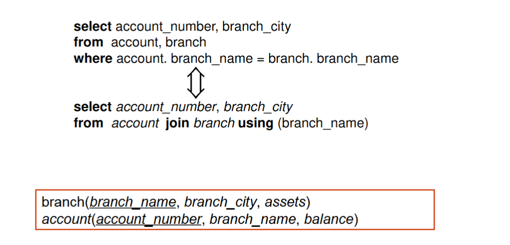

on条件允许在连接的关系上使用通用谓词。

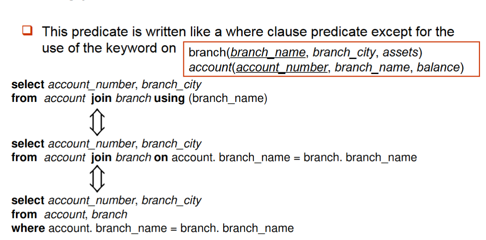

默认对表进行内连接，对应`inner`关键字，如果想要对表进行外连接，应使用`outer`关键字显式表示。

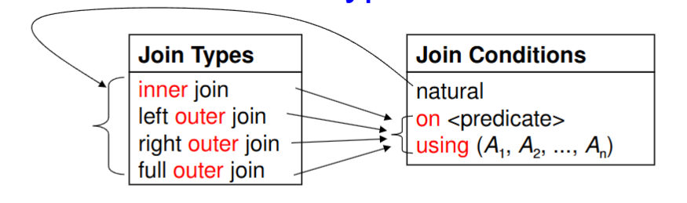
## View
在某些情况下，让所有用户都看到完整的逻辑模型（即数据库中存储的所有实际关系）并不合适。

视图提供了一种机制，可以针对某些用户隐藏部分数据。

任何不属于概念模型、但作为“虚拟关系”对用户可见的关系，都称为视图。

使用视图有很多优点，如安全性高，易于使用，支持逻辑独立性等。

通过以下命令来创建视图：

```sql
CREATE VIEW view_name AS
SELECT c1,c2,... FROM ...
```

或者
```sql
CREATE VIEW view_name (c1,c2,...) AS
SELECT e1,e2...FROM ...
```

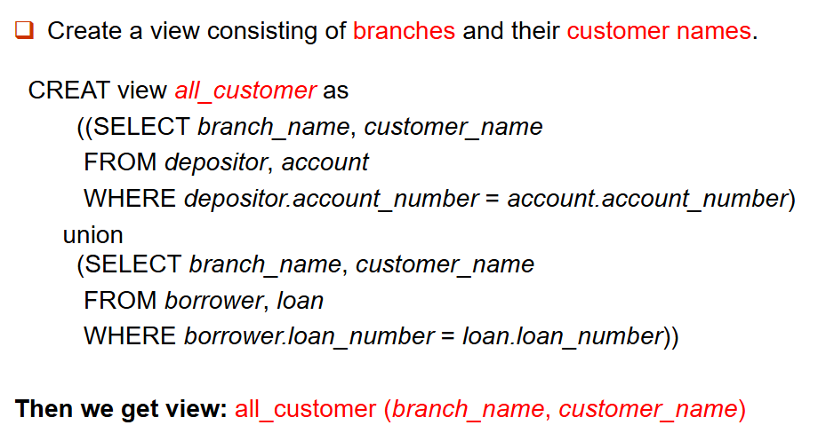

如果想删除视图，可以使用以下命令：

```sql
DROP VIEW view_name
```

一旦视图被定义，就可以使用该视图名来引用视图所生成的虚拟关系。

视图定义与通过计算查询表达式来创建新关系不同。视图定义实际上是保存了一个表达式；在使用该视图的查询中，该表达式会被代入执行。

### 视图依赖
一个视图可以用于定义另一个视图的表达式中。

若视图关系 $v_2$ 被用于定义视图关系 $v_1$ 的表达式中，则称 $v_1$ 直接依赖于$v_2$。

若 $v_1$ 直接依赖于 $v_2$，或存在一条从 $v_1$ 到 $v_2$ 的依赖路径，则称视图关系 $v_1$依赖于视图关系 $v_2$。

若视图关系 $v$ 依赖于自身，则称该视图是递归视图。

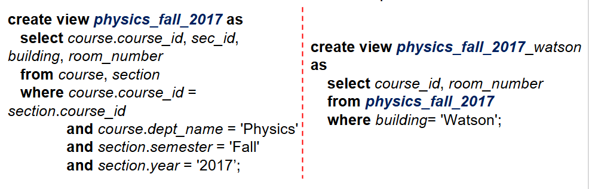

表达式的视图展开重复执行以下替换步骤：

- 查找表达式 $e_1$ 中的任意视图关系 $v_i$
- 将视图关系 $v_i$替换为定义 $v_i$ 的表达式
- 直到$e_1$中不再存在任何视图关系
  
要视图定义不是递归的，这个循环就会终止。

### 物化视图

某些数据库系统允许物理存储视图关系。在定义视图时它们创建物理副本。

这类视图称为物化视图。

如果查询中所使用的关系被更新，物化视图的结果就会过时。

这就需要维护视图，即在底层关系更新时相应地更新视图。

### 更新视图

对数据库的修改若通过视图来表达，必须转换为对数据库逻辑模型中实际关系的修改。

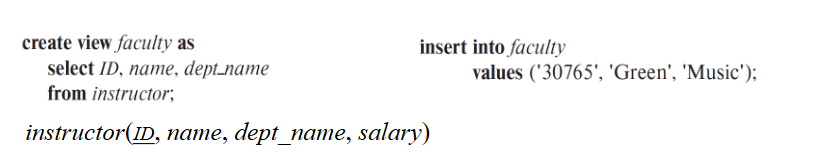

大多数 SQL 实现仅允许对简单视图进行更新

- from子句中只包含一个数据库关系。
- select子句中仅包含该关系的属性名，且没有任何表达式、聚集函数或distinct关键字。
- 任何未在select 子句中列出的属性都可以设置为 null。
- 查询没有group by或having子句。

## SQL数据类型

### 固有数据类型
SQL有很多固有数据类型：如varchar,int,float(p)等等。

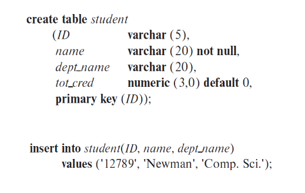

### 大对象类型

大型对象（照片、视频、CAD 文件等）以大对象类型的形式存储：

- blob：二进制大型对象。该对象是未经解释的二进制数据的大集合（其解释由数据库系统外部的应用程序负责）
- clob：字符大型对象。该对象是字符数据的大集合

当查询返回一个大型对象时，返回的是一个指针，而不是大型对象本身。

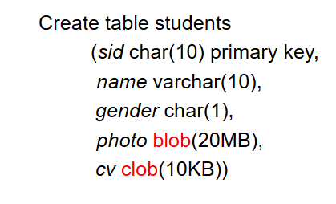


### 用户自定义类型

用户自定义类型（UDT）是一种自定义的数据类型，主要分为两种。

- 结构化数据类型：用于创建复合类型，类似于编程语言中的结构体（struct）或对象。它允许将多个字段组合成一个新的类型。
```sql
CREATE TYPE Address AS (
    street VARCHAR(50),
    city VARCHAR(20),
    zip_code VARCHAR(10)
);
```

- 独特类型:基于已有的内置类型创建语义上独立的新类型，主要用于类型安全。

```sql
CREATE TYPE PersonName AS VARCHAR(30) FINAL;
```

### 域
SQL-92 中用 `create domain` 构造用于创建用户定义的域类型
 
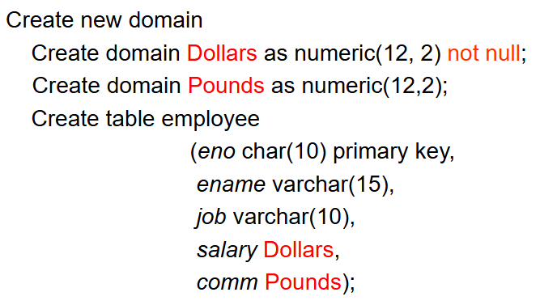

域是一个非强数据类型，即是域（domain）不会创建一个与基础类型隔离的新类型，域是基于某个固有数据类型（如 numeric(12,2)）定义的，可以附加约束（如 NOT NULL、CHECK 等），但它本质上仍然是底层数据类型的别名。这与强数据类型（如 CREATE TYPE 创建的独特类型）不同。

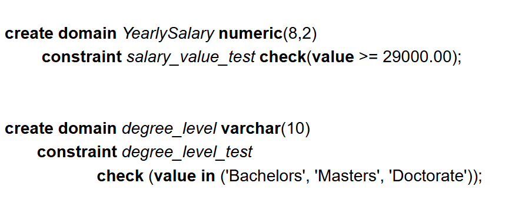

### 目录、模式和环境
通过这三个层次，我们可以表示图表存储的位置信息。

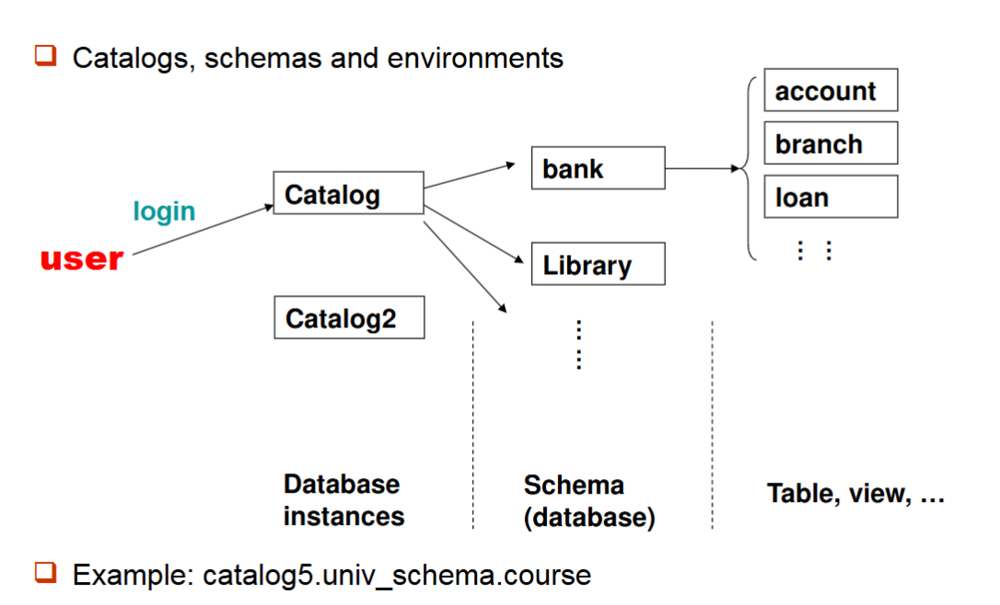

## 完整性约束
数据库完整性约束是用于确保数据库中数据的准确性、一致性和可靠性的一系列规则或条件。  
数据完整性约束指的是为了防止不符合规范的数据进入数据库，在用户对数据进行插入、修改、删除等操作时，DBMS自动按照一定的约束条件对数据进行监测，使不符合规范的数据不能进入数据库，以确保数据库中存储的数据正确、有效、相容。  
完整性约束包括：实体完整性、参照完整性和用户定义的完整性约束。  
完整性约束是数据库实例(Instance)必须遵循的，由DBMS维护。

### 针对关系的约束

在之前的学习中，我们学了很多关于关系的约束。如：

- 针对单个关系的约束
    - Not null（非空）
    - Primary key（主键）
    - Unique（唯一）
    - Check（$P$），其中 $P$ 是一个谓词

- unique ($A_1, A_2, \dots, A_m$)
    - unique 约束表明属性 $A_1, A_2, \dots, A_m$构成一个超键。

- check ($P$)
    - check ($P$) 子句指定了一个谓词 $P$，该关系中的每个元组都必须满足该谓词。

### 引用完整性约束

  设  $r_1(R_1)$ 和 $r_2(R_2)$ 为两个关系，其主键分别为 $K_1$ 和 $K_2$。

若对于 $r_2$ 中的每个元组 $t_2$，在 $r_1$ 中均存在一个元组 $t_1$，使得 $t_1[K_1] = t_2[\alpha]$，则称 $R_2$ 的子集 $\alpha$ 是引用 $r_1$ 中 $K_1$ 的外键。

引用完整性约束也称为子集依赖，因为它可以写为：
$$
\Pi_{\alpha}(r_2) \subseteq \Pi_{K_1}(r_1)
$$

外键可以在 SQL 的 `create table` 语句中指定

```sql
foreign key (A) references r
```

默认情况下，外键引用被参照表的主键属性。

在对$r_2$进行操作时，必须进行检查，以保持引用完整性约束。

- 插入：如果将元组 $t_2$ 插入到 $r_2$ 中，系统必须确保 $r_1$ 中存在元组 $t_1$，使得 $t_1[K] = t_2[\alpha]$，即：

$$
t_2[\alpha] \in \Pi_K(r_1)
$$

- 删除：如果从 $r_1$ 中删除一个元组 $t_1$ ，系统必须计算 $r_2$ 中引用 $t_1$ 的元组集合：$\sigma_{\alpha=t_1[k]}(r_2)$。
    - 如果该集合非空，则：
        - 要么拒绝该删除命令并报错，
        - 要么删除那些引用 $t_1$ 的 $t_2$ 元组（级联删除）。

- 更新：如果关系 $r_2$  中的一个元组 $t_2$被更新，并且该更新修改了外键 $\alpha$ 的值，那么需要进行与插入情况类似的检查：
  - 令 $t_2'$ 表示元组 $t_2$ 的新值。系统必须确保$t_2'[\alpha] \in \Pi_k(r_1)$。


主键、候选键和外键可以作为 SQL `create table` 语句的一部分来指定：

- `primary key` 子句列出构成主键的属性。
- `unique key` 子句列出构成一个超键的属性。
- `foreign key` 子句列出构成外键的属性，以及该外键所引用的关系名。

默认情况下，外键引用被引用表的主键属性：  
例如：`foreign key (account-number) references account`

指定单个列为外键时可以简写：  
例如：`account-number char (10) references account`

可以显式指定被引用表中的引用列，但这些列必须被声明为主键或候选键（外码的名字和被参照属性的名字可以不同）：  
`... foreign key (account-number) references account (account-number)`

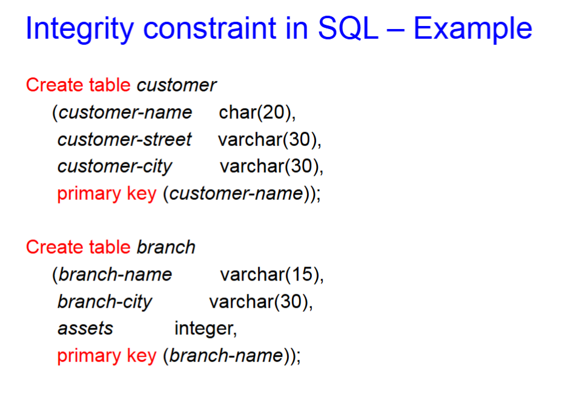

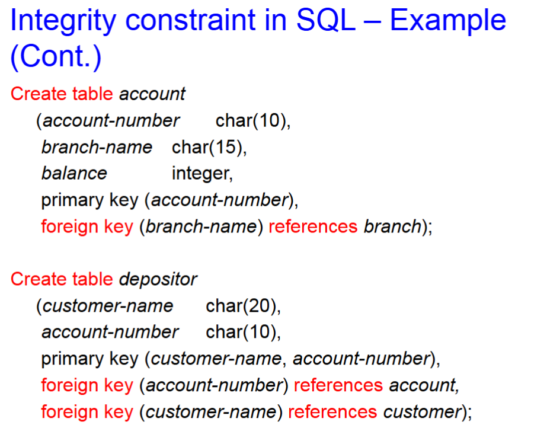

我们可以指定引用和被引用关系之间的级联操作来保证引用完整性约束。

```sql
Create table account (
    ...
foreign key (branch-name) references branch
[ on delete cascade ]
[ on update cascade ]
... );
```

由于使用了 `on delete cascade` 子句，如果在 branch 中删除某个元组会导致违反参照完整性约束，那么该删除操作会“级联”到 account 关系，删除 account 中引用那个已被删除支行的元组。级联更新类似。

如果多个关系之间存在一条外键依赖链，并且为每个依赖关系指定了 `on delete cascade`，那么链一端的删除或更新操作可以沿着整个链传播。

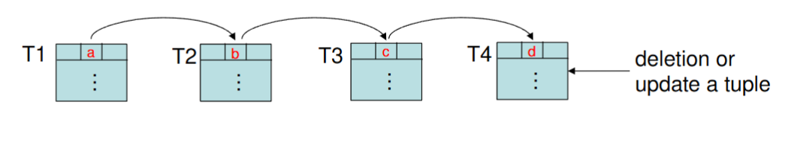

但是，如果某个级联更新或删除操作导致了无法通过进一步的级联操作处理的约束违反，系统将中止该事务。

其结果是，该事务及其级联操作所引起的所有更改都将被撤销。

级联操作的替代方案：

- `on delete set null`
- `on delete set default`

外键属性中的空值会使 SQL 的参照完整性语义变得复杂，最好使用 `not null` 来避免。  
如果外键的任意属性为空，则该元组被视为满足外键约束！（这是 SQL 的规定）

注意：参照完整性仅在事务结束时才进行检查！也就是说：中间步骤允许违反参照完整性，只要后续步骤在事务结束前消除该违反即可。


### check约束

我们可以用check语句来检查数据的完整性。

```sql
check (time_slot_id in (select time_slot_id from time_slot))
```

该 check 条件表明：`section` 关系中每个元组的 `time_slot_id` 必须是 `time_slot` 关系中某个时隙的标识符。

该条件不仅需要在向 `section` 插入或修改元组时进行检查，还需要在 `time_slot` 关系发生变化时进行检查。

我们也可以通过check语句对域进行限制。

- 例如，使用 `check` 子句确保一个“小时工资”域只允许大于指定值的数值。

  ```sql
  Create domain hourly-wage numeric(5, 2)
  Constraint value-test check(value >= 4.00)
  ```

- `constraint value-test` 子句是可选的；它有助于指明某次更新违反了哪个约束。

- 如果我们决定不再需要这个约束：

  ```sql
  alter table instructor drop constraint minsalary
  ```

### 断言

断言是一个谓词，表达了我们希望数据库始终满足的条件。

SQL 中断言的形式为：

```sql
CREATE ASSERTION <断言名称>
CHECK <谓词>;
```

当一个断言被创建后，系统会在每个可能违反该断言的更新操作时测试其有效性（当谓词为真时，一切正常；否则报错）。

这种测试可能会带来相当大的开销；因此，断言应谨慎使用。


例如：要求“每个支行的所有贷款金额总和必须小于该支行所有账户余额的总和”。

由于 SQL 并未提供直接表达$\forall X, P(X)$形式的构造，因此需要通过迂回的方式实现，即使用：`not exists X, such that not P(X)`（$\forall x, P(x) = \neg (\exists x), \neg P(x)$）。

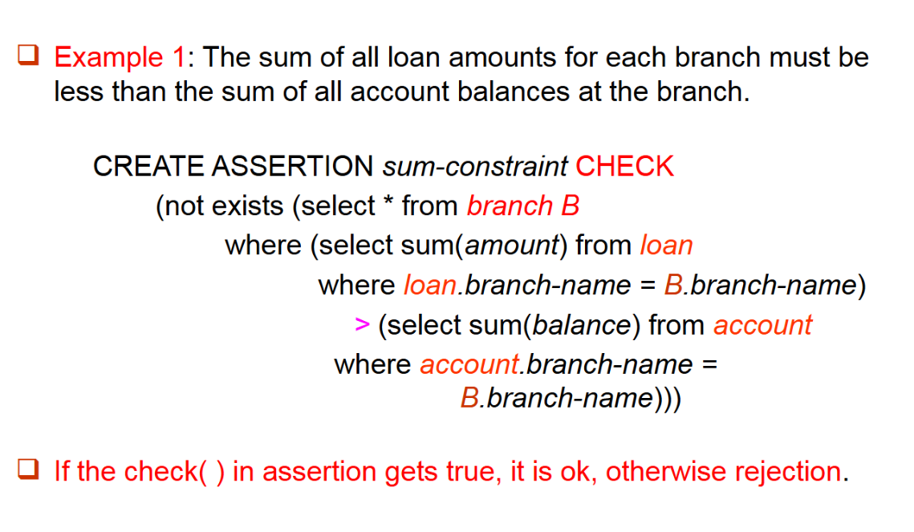

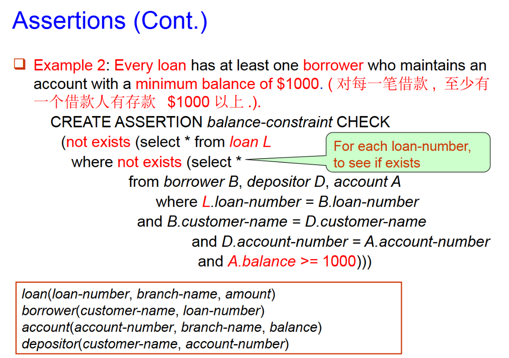

## 触发器
触发器是一种由系统在数据库发生修改时自动执行的语句。它本质是一种存储过程。

要设计触发器机制，我们必须：

- 指定触发器在何种条件下被执行。
- 指定触发器执行时要采取的动作。


示例：假设银行不直接允许负的账户余额，而是通过以下操作处理透支：

- 将账户余额设为零
- 按透支金额创建一笔贷款，并将该贷款的贷款号设为透支账户的账号

触发器的执行条件是对 account 关系进行更新，且导致余额为负值。

以下是针对这个触发器的sql实现：

```sql
CREATE TRIGGER overdraft-trigger after update on account 
    referencing new row as nrow for each row  

when nrow.balance < 0
    begin atomic  
        insert into borrower  
            (select customer_name, account-number from depositor  
            where nrow.account-number = depositor.account-number)  
        insert into loan values  
            (nrow.account-number, nrow.branch-name, -nrow.balance)  
        update account set balance = 0  
            where account.account-number = nrow.account-number  
    end
```

触发器的触发事件可以是 insert、delete 或 update。

针对 update 的触发器可以限定在特定属性上：  
例如：`Create trigger overdraft-trigger after update of balance on account …`

可以引用更新前和更新后的属性值：

- `referencing old row as`：用于 delete 和 update
- `referencing new row as`：用于 insert 和 update

触发器可以在事件（insert、delete 或 update）之前激活，而不是在事件之后。（`before` 关键字）

触发器可作为额外的约束，用于防止无效的更新、插入或删除。或通过修正问题，使更新、插入或删除操作变为有效。

```sql
create trigger setnull before update of takes referencing new row as nrow for each row
when (nrow.grade = '')
begin atomic
set nrow.grade = null;
end;
```

不必为每个受影响的行分别执行一个动作，而是可以为事务影响的所有行执行单个动作。

- 使用 `for each statement` 代替 `for each row`
- 使用 `referencing old table` 或 `referencing new table` 来引用包含受影响行的临时表（称为“过渡表”）

在处理更新大量行的 SQL 语句时，这种方式效率更高。

触发器可以被禁用或启用；默认情况下，触发器在创建时是启用的。

- `alter trigger trigger_name disable`
- `alter trigger trigger_name enable`
- `disable trigger trigger_name`
- `enable trigger trigger_name`

触发器也可以被永久删除：`drop trigger trigger_name`


触发器可以发挥非常有用的作用，但在有替代方案时最好避免使用。它有一系列问题，例如：复杂性和维护难度、调试困难、性能影响……

## 授权
授权是指控制用户对数据库对象的访问权限。

授权的目的在于确保用户只能访问他们有权访问的对象，防止未经授权的访问。是防止恶意试图窃取或篡改数据的保护措施。

对数据库的数据的授权形式：

- 读授权：允许读取数据，但不允许修改数据。
- 插入授权：允许插入新数据，但不允许修改已有数据。
- 更新授权：允许修改数据，但不允许删除数据。
- 删除授权：允许删除数据。

修改数据库模式的授权形式：

- 索引授权：允许创建和删除索引。
- 资源授权：允许创建新的关系。
- 修改授权：允许在关系中添加或修改属性。
- 删除授权：允许删除关系。

`GRANT` 语句用于授予授权

```sql
GRANT <权限列表> ON <表 | 视图>
TO <用户列表>
```

其中，`<用户列表>` 可以是：

- 用户ID
- `public`，表示允许所有有效用户获得所授予的权限
- `role`（更多细节将在后面介绍）

授予他人权限的授权者必须已经持有对该指定项（或者是数据库管理员）的相应权限。


常见的权限有以下几种：

- Select（选择）：允许读取、访问关系，或使用视图进行查询  
- Insert（插入）：允许插入元组的能力。  
- Update（更新）：允许使用 SQL update 语句进行更新的能力。
- Delete（删除）：允许删除元组的能力。  
- References（引用）：允许在创建关系时声明外键的能力。  
- All privileges（所有权限）：作为所有允许权限的简写形式使用。

默认情况下，被授予某个权限的用户/角色并不被授权将该权限授予另一个用户/角色。

使用 `with grant option`：允许被授予权限的用户将该权限传递给其他用户。  

示例：
```sql
grant select on branch to U1 with grant option
```

授予 U1 对 branch 的 select 权限，并允许 U1 将该权限授予其他用户。


SQL 授权机制通常不允许对关系中特定的元组进行授权。不过，某些系统支持此类功能，例如 Oracle 虚拟专用数据库。

`REVOKE` 语句用于撤销授权。

```sql
REVOKE <权限列表> ON <表 | 视图>
FROM <用户列表> [restrict | cascade]
```


某个用户撤销权限可能会导致其他用户也失去该权限，这称为权限撤销的级联。

我们可以通过指定 `restrict` 来防止级联：

```sql
Revoke select on branch from U1, U3 restrict;
```

使用 `restrict` 时，如果需要级联撤销，则 `REVOKE` 命令将失败。

`<权限列表>` 可以是 ALL，用于撤销授权者可能持有的所有权限。

如果 `<用户列表>` 包含 PUBLIC，则除显式被授予该权限的用户外，所有用户都将失去该权限。

如果同一权限由不同的授权者两次授予同一用户，则该用户可能在撤销后仍然保留该权限。

所有依赖于被撤销权限的权限也将被一并撤销。


>用户通过视图访问数据时，通常不需要直接对基础表拥有权限，只需要对视图拥有权限。这是因为视图提供了一种**权限隔离机制**，允许数据库管理员限制用户对底层表的直接访问，同时仍然可以通过视图向用户提供经过筛选或加工的数据。  
但在创建视图时，虽然不会生成一个物理关系，但**确实需要获得对视图查询中所引用的底层资源（表或视图）的访问授权**。

### 授权图

授权从一个用户传递给另一个用户的过程可以用授权图来表示。

- 该图的节点是用户。
- 图的根节点是数据库管理员。
- 一条边 $U_i \to U_j$  表示用户 $U_i$ 已将其权限授予了用户$U_j$。

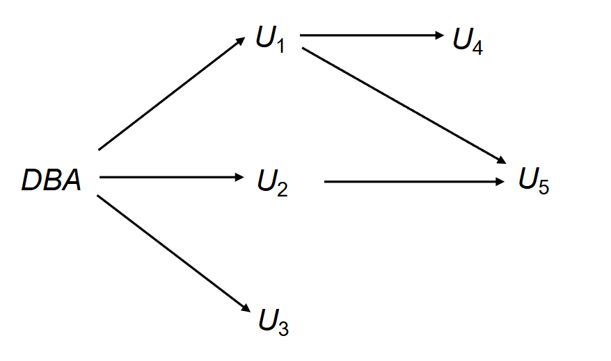

要求：授权图中的所有边必须是某条起始于数据库管理员的路径的一部分。且必须防止没有从根节点出发的路径的授权循环。


### 角色

角色允许为一类用户指定公共权限，只需创建相应的“角色”一次即可。

可以像对用户一样，将权限授予角色或从角色撤销；角色可以分配给用户，甚至可以分配给其他角色。

创建角色的语法：

```sql
create a role <角色名>
```


创建角色后，可以使用以下语句将“用户”分配给该角色：  

```sql
grant <角色名> to <用户>
```

将权限授予角色：

```sql
grant <权限列表> on <表 | 视图> to <角色>
```

### SQL授权的局限性

SQL 不支持元组级别的授权。例如，我们无法通过授权来限制学生只能看到（存储）他们自己成绩的元组。

随着 Web 访问数据库的增长，数据库访问主要来自应用服务器。但由于终端用户没有数据库用户 ID，他们都被映射到同一个数据库用户 ID。这会导致一个应用程序（如 Web 应用程序）的所有终端用户可能都被映射到同一个数据库用户。在这种情况下，授权的任务落在了应用程序身上，SQL 无法提供支持。

- 优点：应用程序可以实现细粒度的授权，例如针对单个元组的授权。
- 缺点：授权必须在应用程序代码中完成，并且可能分散在整个应用程序中。由于需要阅读大量应用程序代码，检查是否存在授权漏洞变得非常困难。

## 审计跟踪
审计追踪是一个记录数据库所有变更（插入/删除/更新）的日志，同时还包含哪个用户执行了变更以及变更执行时间等信息。可以用于追踪错误或欺诈性的更新操作。

审计跟踪可以通过触发器实现，但许多数据库系统也提供直接支持。

## 嵌入式SQL

由于SQL 的功能不完备性（计算，资源...），我们需要将其嵌入到其他编程语言中。

SQL 标准定义了将 SQL 嵌入多种编程语言（如 C、C++、Java）中的方式。

嵌入 SQL 查询的语言称为宿主语言，宿主语言中允许使用的 SQL 结构构成了嵌入式 SQL。

嵌入式 SQL 通常在编译期间就已知，并且会通过特殊的预处理器转换为宿主语言的函数调用。

在宿主语言中使用**EXEC SQL 语句**来标识需要由预处理器处理的嵌入式 SQL 请求： `EXEC SQL <嵌入式 SQL 语句>;`

注意：不同语言的语法有所差异：

- 在某些语言（如 COBOL）中，分号会被替换为 `END-EXEC`
- 在 Java 嵌入中使用 `# SQL { ... };`

以下是使用嵌入式sql进行单行和多行查询的示例：

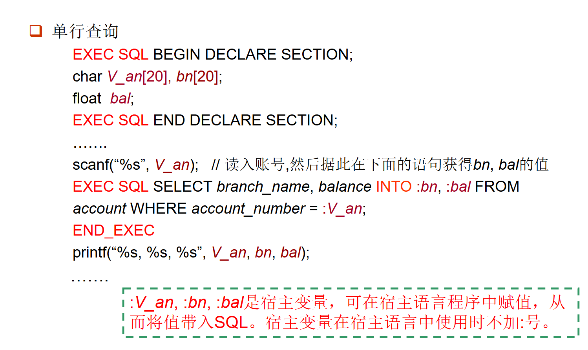

在进行多行查询时，需要用到游标来遍历结果集。

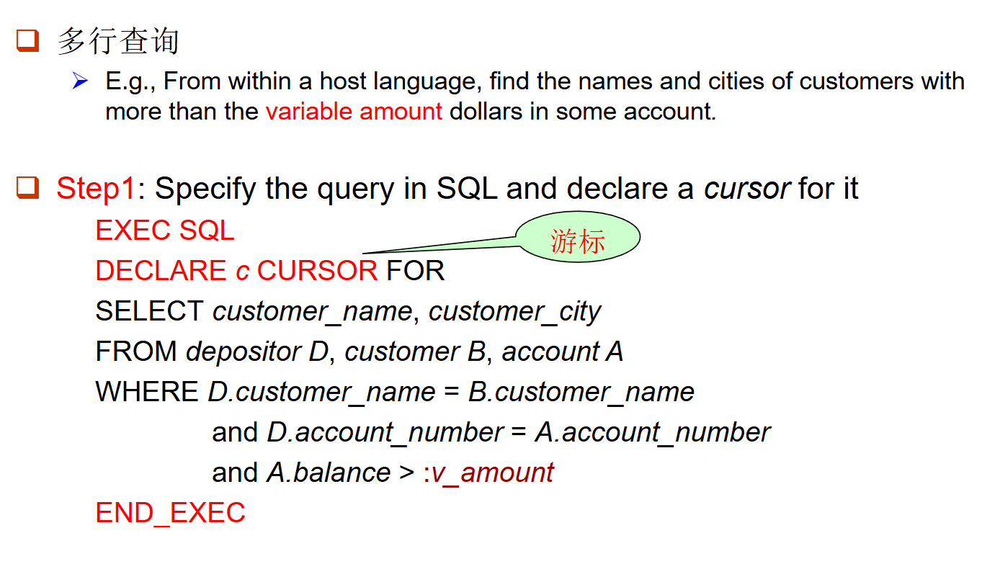

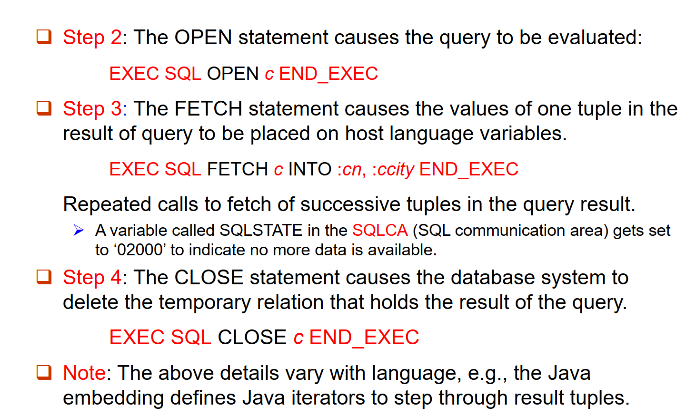

同样也可以进行单行和多行的修改：

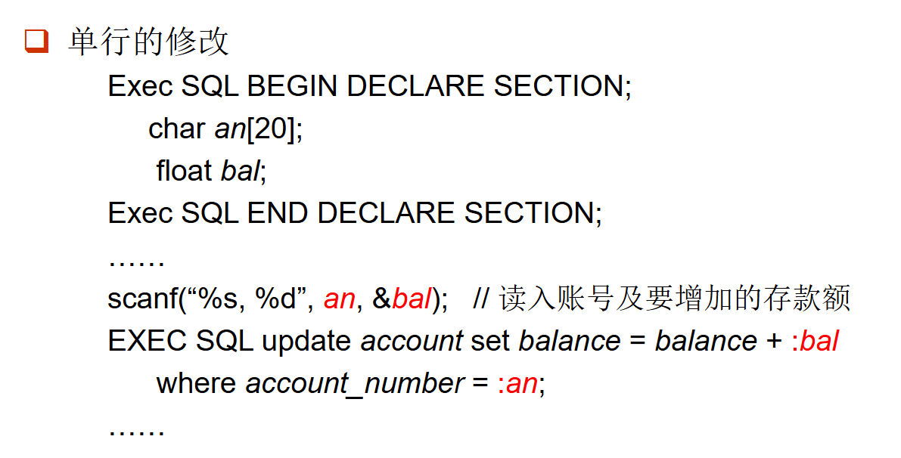

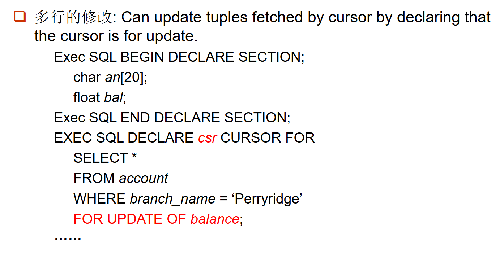

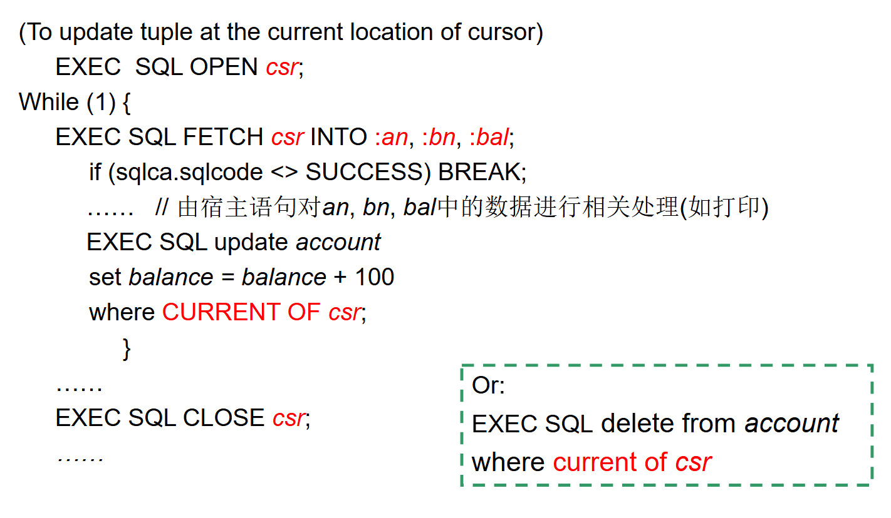


## 动态SQL

动态 SQL 允许在运行时构造 SQL 语句，从而可以根据用户输入或其他条件动态生成 SQL 语句。

示例：在 C 程序中使用动态 SQL。

```c
char *sqlprog = "update account
    set balance = balance * 1.05
    where account_number = ?"

EXEC SQL PREPARE dynprog FROM :sqlprog;
char v_account[10] = "A_101";
......

EXEC SQL EXECUTE dynprog USING :v_account;
```

动态 SQL 程序中包含一个 `?`，它是一个占位符，用于在执行 SQL 程序时通过 `using` 变量提供的值来替换。


## ODBC

ODBC提供了一个公共的、与具体数据库无关的应用程序设计接口API 。它为开发者提供单一的编程接口，这样同一个应用程序就可以访问不同的数据库服务器。它与嵌入式sql不同的是，它不依赖于特定 DBMS，且无需预编译。

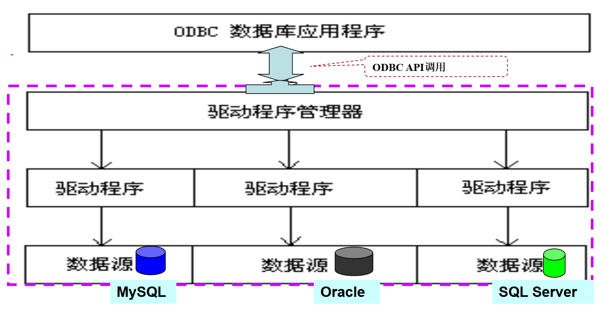

以下是ODBC的使用示例：

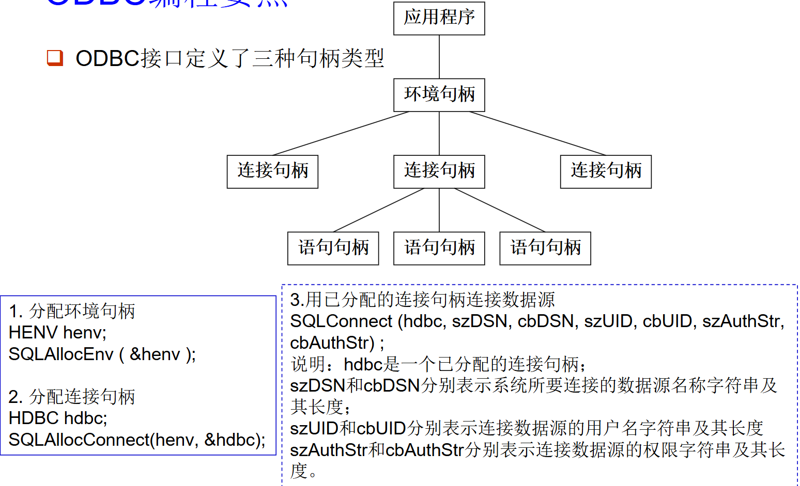

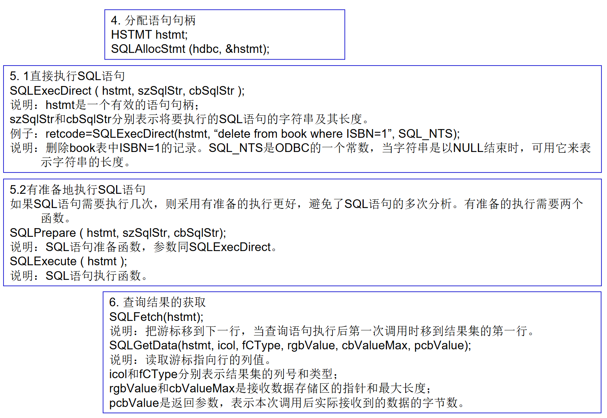

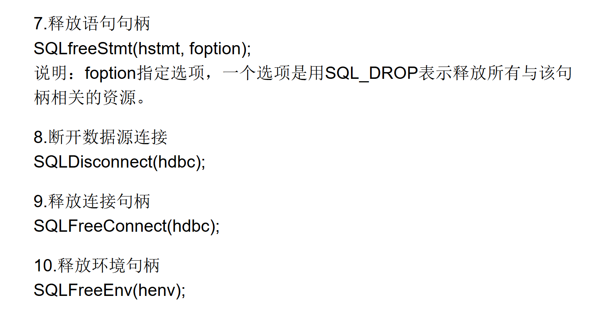

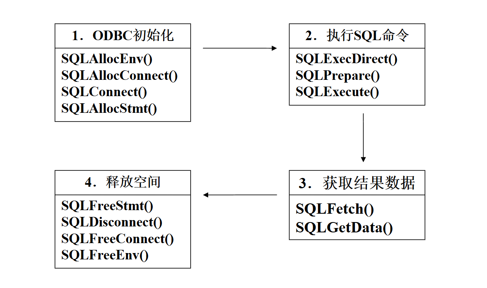

对于Java开发者，可以使用JDBC驱动程序来访问数据库。JDBC 是一个用于与支持 SQL 的数据库系统进行通信的Java API。

## 补充

在SQL中，可以支持函数的定义，来对一些常见的操作进行封装，提高代码的可读性和可维护性。

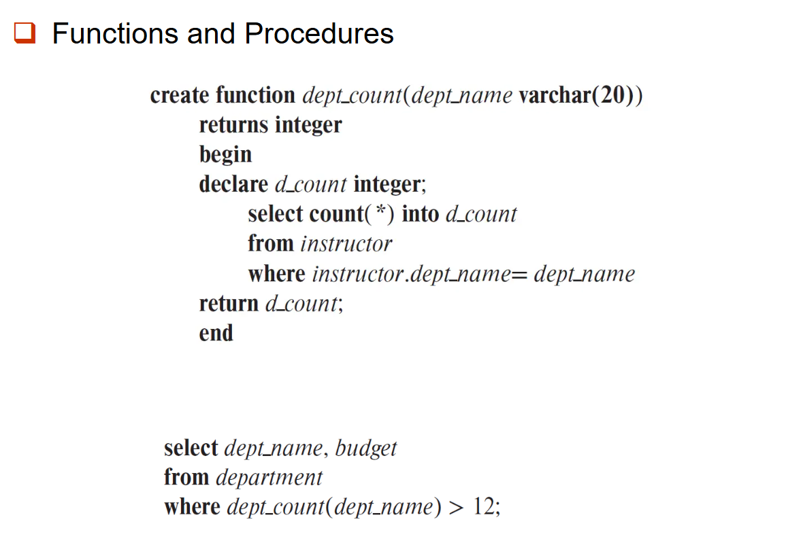

同时，SQL还支持递归查询，可以实现对树形结构数据的查询。

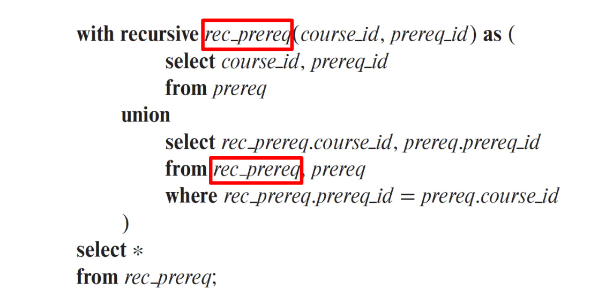

除此之外还有一些其他的特性，如下:

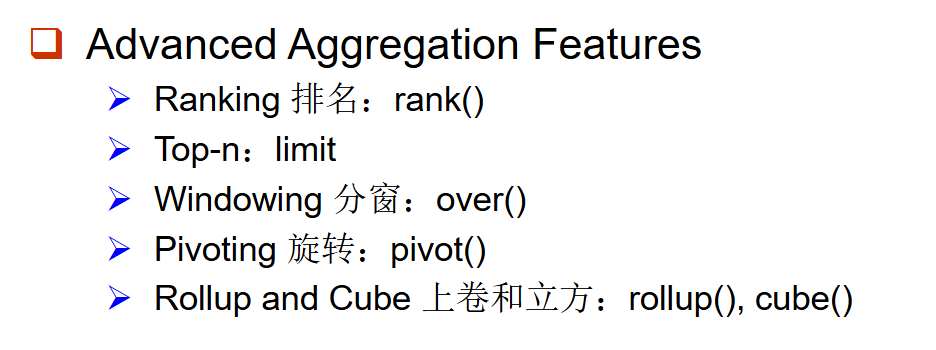